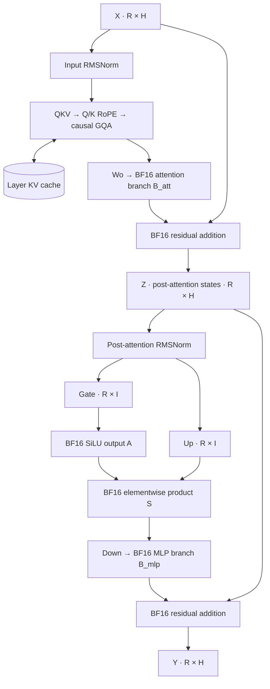

# Decoder-layer numerical contract and fixture specification

Status: v1 upstream reference package qualified and frozen, based on merged
source `7f16d6f`. The 43 synthetic development and three checkpoint cases pass
the declared upstream full/chunk gates. The Mojo composition passes development,
behavior and seven reserved cases at frozen candidate `d67fd94`. The completed
[layer study](../studies/decoder_layer/README.md) retains 960 latency observations
and 2,400 measured profile dispatches. Recipes and
initial acceptance targets were declared before the new layer outputs.
The [execution plan](decoder-layer-plan.md) defines the local work scope,
ordered evidence gates, measurement budget, and stop conditions. The subsequent
[configuration selection](../studies/decoder_layer/selection.md) is also complete;
it confirms cached-prefill improvements and retains the baseline for full/short
prefill and decode.

## Scope

Compose one Qwen2.5-0.5B-Instruct decoder layer from the accepted
[attention](attention-sublayer.md) and [MLP](mlp-sublayer.md) sublayers. Preserve
the pinned model identity and arithmetic in [model.md](model.md). The target is
batch one, BF16 storage, H=896, I=4864, Nq=14, Nkv=2, D=64, RMSNorm epsilon
`1e-6`, and RoPE theta `1000000`. Capacity C is at most 4096 positions.

For R new rows and P cached rows, T=P+R, with `1 <= R` and `T <= C`.
The input is X[R,H]; the output is Y[R,H]. The caller supplies hidden states
for the new rows and absolute positions are P through T-1. MLP has no separate
position or cache state. Both residuals belong inside this layer.

This milestone covers one layer's numerical composition and execution
ownership. Model weight loading across 24 layers, embeddings as an engine
operation, final normalization, logits, generation, and session token history
remain the following milestones. Checkpoint fixtures may use upstream
embeddings to construct layer-0 inputs without implementing those engine parts.

## Data flow and rounding



Let B denote round-to-nearest, ties-to-even BF16 storage and F denote FP32
promotion. Let RMS denote the existing RMSNorm operation, including its BF16
rounding before multiplication by the norm weight. The composition is:

```text
N_att = RMS(X, input_norm)
Q_raw, K_raw, V_raw = B(F(N_att) @ F(Wqkv).T + F(bqkv))
Q, K_rot = existing BF16 RoPE(Q_raw, K_raw, positions, cosine, sine)
K_cache[P:T] = K_rot; V_cache[P:T] = V_raw
O = B(FP32_causal_GQA(Q, K_cache[0:T], V_cache[0:T]))
B_att = B(F(O.reshape(R,H)) @ F(Wo).T)
Z = B(F(X) + F(B_att))
N_mlp = RMS(Z, post_attention_norm)
G = B(F(N_mlp) @ F(Wgate).T)
U = B(F(N_mlp) @ F(Wup).T)
A = B(SiLU_FP32(G))
S = B(F(A) * F(U))
B_mlp = B(F(S) @ F(Wdown).T)
Y = B(F(Z) + F(B_mlp))
```

The concatenated QKV formula denotes three affine projections; packing must
preserve upstream Q/K/V order and distinct biases. FP32 accumulation does not
prescribe one reduction association. GQA uses FP32 scores, probabilities, and
accumulation, then BF16 output before Wo. Rotated K and unrotated V are cached.
The head merge is a contiguous view, not a numerical operation.
All engine tensors are contiguous row-major. Q has shape [R,Nq,D], new K/V
have [R,Nkv,D], and each persistent cache allocation has [C,Nkv,D]. Only
[0:T) is visible. Rotary tables have [C,D]; projection weights retain upstream
[output_features,input_features] orientation.

Use the existing pinned SiLU behavior, including its negative tail and
zero/subnormal rules. There is no additional BF16 sigmoid intermediate.
Materialize Z, A, S, and both projected branches in the first implementation.
Compiler contraction must not erase their rounding. Existing primitive boundary
regressions remain mandatory; approximate layer agreement cannot waive them.

## Ownership and call lifecycle

The caller owns `AttentionWeights`, `MLPWeights`, one `AttentionCache`, both
workspaces, input storage, and the device context. Reuse these existing types
before introducing further abstractions. Cosine/sine tables are explicit
upstream-derived BF16 inputs initialized outside enqueue.

Attention workspace output is Z and is the read-only input to MLP. Keep the
two workspaces disjoint. In particular, MLP writable storage cannot overlap Z,
and X cannot overlap either workspace, cache, or mutable output. Immutable
weights and rotary tables cannot overlap writable storage. Y lives in MLP
workspace output; there is no extra inter-sublayer copy or host readback.

The layer must preflight the entire call before its first dispatch: backend,
dimensions, row capacity, cache length/capacity, input layout, supported mapping
combination, scratch availability, and prohibited buffer overlap. An invalid
MLP call must not enqueue attention or advance its cache. Factor existing
validation as needed during implementation so these rules do not drift between
the standalone and composed APIs.

Enqueue submits ordered work on one stream, allocates nothing, and performs no
synchronization. On successful submission, cache length is T and denotes
enqueued positions, not proof of device completion. A submission or asynchronous
device failure after work begins invalidates this cache/workspace execution;
do not promise rollback. Wait for outstanding work before reset or reuse after
failure, and rebuild the cache before continuing.

All buffers must live until dependent work completes. Successive calls may
reuse workspace on the same stream once prior consumers have been enqueued
ahead of overwrites. To inspect multiple outputs, enqueue copies to distinct
test-owned buffers before reuse and synchronize only after the sequence.
No Python runs in the inference enqueue.

## Upstream authority and observations

Execute the actual `transformers.models.qwen2.modeling_qwen2.Qwen2DecoderLayer`
from Transformers 4.43.1, with Torch 2.4.0, NumPy 1.26.4, Python 3.12, one CPU
Torch thread, evaluation mode, and gradients disabled. Use the existing locked
script environment in `tests/fixtures/generate.py`; do not upgrade it.

Select `Qwen2SdpaAttention` explicitly and assert that instantiated class. Apply
the existing attention policy wrapper: FP32 Q/K/V and floating mask at the
actual Torch SDPA boundary, force `SDPBackend.MATH`, and round its result to
BF16 before Wo. Assert the wrapper was called. The remaining decoder forward,
norms, MLP, and residuals execute upstream unchanged. This is the agreed
inference policy, not unmodified BF16 eager or training-kernel equivalence.

Use a fresh `DynamicCache` for each independent execution schedule. Supply an
explicit causal mask and contiguous positions; record P, R, T and cache updates
for every call. Execute full and cached schedules independently.
The mask has shape [1,1,R,T], zero for key index `k <= P+r` and negative
infinity otherwise. Do not rely on an implicit square causal mask for a cached
suffix. Convert upstream cache layout [1,Nkv,T,D] to logical [T,Nkv,D] for
comparison without changing stored bits.

Capture X, N_att, raw Q/K/V, rotated Q/K, BF16 attention output O, B_att, Z,
N_mlp, G, U, A, S, B_mlp, Y, rotary tables, and active K/V. Hooks on the
post-attention norm input expose Z; a down-projection pre-hook exposes S.
Use the existing observing rotary wrapper, which calls upstream arithmetic.
Compare observed and unobserved decoder executions from separate equivalent
caches: Y and final cache must be bitwise unchanged by observation. Assert
shape, dtype, finite ordinary outputs, and hook/call counts.

Check both residual reconstructions and `S = B(F(A)*F(U))` from captured
operands exactly. These checks validate capture plumbing; they do not replace
executing the decoder. Comparing two assembled copies of our formula is not an
independent upstream oracle. FP64 diagnostics remain explanatory and cannot
replace this authority.

## Deterministic fixture specification

Tiny geometries are `(H,Nq,Nkv,D,I)=(8,2,1,4,12)` and `(16,4,2,4,37)`.
They exercise grouped heads, both residuals, and a ragged MLP intermediate
width. Use materialized FP32 attention route 3 and rowwise MLP for these cases;
the integrated attention implementation is Qwen-shaped only.

For synthetic inputs, use NumPy 1.26.4
`Generator(PCG64(SeedSequence([seed,H,I,Nq,Nkv,D,tag])))`. Each tag draws FP64
standard normals in row-major order, applies the transformation below, then
converts through Torch FP32 to BF16. A shape's row count is not part of the
seed; longer inputs extend the same row prefix. Do not regenerate inputs or
weights when slicing chunks.

| Tag | Value | Shape | Transformation of normal sample z |
| ---: | --- | --- | --- |
| 0 | X | [T,H] | z |
| 1 | input_norm | [H] | 1+z/64 |
| 2 | Wqkv | [H+2*Nkv*D,H] | z/sqrt(H) |
| 3 | bqkv | [H+2*Nkv*D] | z/64 |
| 4 | Wo | [H,H] | z/sqrt(H) |
| 5 | post_attention_norm | [H] | 1+z/64 |
| 6 | Wgate | [I,H] | z/sqrt(H) |
| 7 | Wup | [I,H] | z/sqrt(H) |
| 8 | Wdown | [H,I] | z/sqrt(I) |

Generate rotary tables with the pinned upstream implementation, with original
BF16 rounding; do not substitute NumPy trigonometry. Keep independent norm and
projection streams so mistaken weight reuse is detectable.

| Family | Cases | Purpose |
| --- | --- | --- |
| Tiny development | Both tiny geometries; T=1,7,17; seed 4001 | Inspectable intermediates and ragged extents |
| Qwen development | T=1,7,15,16,17,33,65,257,1024,4096; seed 4001 | Decode, tile boundaries, full context |
| Qwen second seed | T=1,17,4096; seed 4013 | Different weights and activations |
| Structured development | Tiny geometries and Qwen T=17; seed 4001; mutations below | Discriminating branch and wiring checks |
| Checkpoint development | Layer 0; the three existing checkpoint prompts and frozen token IDs | Actual weight and activation distributions |
| Reserved synthetic holdout | Qwen T=1,17,4096; seeds 5003 and 5011 | Six unobserved layer cases |
| Reserved checkpoint holdout | Layer 0; prompt below | One new checkpoint input |

Structured mutations are separate copies of the base fixture: zero X, zero Wo,
zero Wdown, zero both Wo/Wdown, swapped gate/up weights, swapped norm weights,
and X scaled by 1/64 or 16 followed by BF16 storage. Zero both output weights
must return X exactly for the ordinary finite fixtures. Swaps must change the
upstream result in at least one fixture; otherwise they are not discriminating
controls. Reuse the existing exact A/branch-rounding counterexamples.

For T<=17, compare full execution with T one-row calls. For T>17, compare full
execution with `[T-17,16,1]`; this includes a cached chunk and final decode.
At T=33 also use `[16,1,15,1]` to cross the attention projection threshold.
At T=65 also use `[53]` followed by twelve one-row calls for asynchronous reuse.
Every chunk receives the matching slice of original layer input X, never this
same layer's previous output Y. Cached decode here is a layer-state test, not
autoregressive model generation.

Checkpoint inputs are the pinned embedding rows for the retained token IDs.
Load both norms and all attention/MLP weights from `model.layers.0.*`. Verify
tensor names, BF16 shapes, byte ranges and hashes using the existing checkpoint
loader. A verified historical prefix is acceptable only when every required
tensor is fully present; preserve `full_file_sha256_verified=false` for that
source. Do not assume prefix completeness from its filename. Missing assets
are an explicit incomplete checkpoint gate, never a silent synthetic fallback.
This documentation step does not download assets.

Reserve the system message `You are a helpful assistant.` and user prompt
`A box contains three red balls and two blue balls. Explain how the probability
of drawing a red ball changes after one blue ball is removed.` as a single-line
string (replace the displayed newline with one space). Use the pinned chat
template with `add_generation_prompt=true`. Tokenize and record the complete
IDs and their little-endian int64 SHA-256 before any held-out model execution.
The frozen declaration now contains 47 token IDs with SHA-256
`d138a27a32b7b16083527d7a290be942549c4bb5711561d4d2ac749a065e6cef`.
Tokenization has run; held-out decoder outputs remain unobserved.

## Numerical acceptance

Approximate comparisons require every element to satisfy
`abs(actual-reference) <= atol + rtol*abs(reference)`. Require matching shapes
and finite ordinary outputs first. Report maximum absolute error, maximum
`abs(error)/(1+abs(reference))`, failing-element count, and worst index/operands.
Exact tests compare BF16 bits, including signed zero where required.

Keep three separate levels of numerical evidence:

| Level | Input and required gates |
| --- | --- |
| Operation | Feed each operation the identical stored operands consumed upstream. Preserve existing attention/MLP operation gates, exact RoPE/elementwise tests, and SiLU special rules. |
| Sublayer | Feed attention original X and MLP captured upstream Z independently. Attention B_att/Z retain atol=rtol=2^-5; MLP B_mlp/Y retain 2^-6/2^-5 respectively. |
| Whole layer | Feed original X through both Mojo sublayers. Gate B_att, Z, B_mlp and Y individually with the initial targets below; report all intermediate discrepancies. |

The initial whole-layer targets are `atol=rtol=2^-5` for each of B_att, Z,
B_mlp and Y. B_att/Z retain their existing composition gate. For the new
end-to-end B_mlp/Y gates, 2^-5 is a deliberately bounded acceptance hypothesis:
we ask whether composition can retain the existing final-output accuracy
scale. It is neither an observed bound nor a sum of sublayer tolerances. The
MLP-only branch gate on upstream Z remains the stricter 2^-6.

For full-versus-chunked execution, apply those same four boundary targets to
both upstream and Mojo independently. Also compare each Mojo schedule to its
matching upstream schedule; comparing only two Mojo paths is insufficient.
Do not require bitwise full/chunk agreement from different GEMM/GQA reduction
orders. Keep intermediate discrepancies and BF16-step diagnostics visible.

Cache shape, length, append destination, prefix preservation, and inactive
capacity guards are exact. Newly appended K/V must exactly equal that execution's
rotated K/raw V. Cross-backend or cross-schedule cache values can differ due to
projection/RoPE inputs; record them numerically using the existing composed
raw-key/value and rotated-key comparison target 2^-7, as a diagnostic. The
identical-operand operation tests and four output-boundary gates remain binding.
Never weaken exact cache-copy tests to accommodate upstream numerical drift.

First qualify the oracle on development cases, verify observations and
upstream chunk consistency, then freeze recipes, executable gates, source
hashes and development arrays before running the Mojo decoder candidate.
If development qualification fails, retain the failure and investigate the
policy or fixture; any changed target needs a documented contract revision
before proceeding. A failing Mojo or holdout result does not authorize a
tolerance increase, fixture exclusion, or precision-policy change.

Freeze the candidate source and binary receipt before generating holdout
outputs. Generate each reserved case once into a new directory and evaluate
that exact binary. Capture completion is not numerical acceptance. Previously
observed fixtures remain regressions; any later adjustment consumes their
holdout status and requires a new declaration for independent acceptance.

## Behavioral acceptance and negative controls

- Snapshot input, immutable weights/tables, cache prefix, inactive capacity and
  workspace guards. Require exact preservation of all regions outside the
  declared writes after a successful call.
- Reject zero rows, overflow, inconsistent geometry/capacity, unsupported
  mappings, forbidden overlaps and a non-Metal backend before any dispatch or
  cache-length change. Include a valid attention configuration paired with an
  invalid MLP configuration to test whole-call preflight.
- Check reset after completion, then replay from position zero. Include exactly
  full capacity and an attempted extra row. Instrument submitted rows/positions
  so a numerically correct implementation cannot pass by recomputing prefixes.
- Poison writable outputs, reuse workspace over the twelve-decode schedule,
  retain each result before overwrite, and compare with separate-workspace
  runs. Run this test with debug synchronization disabled.
- Verify the tests reject using X instead of Z for the second norm/residual,
  omitting either residual, using the wrong absolute RoPE position, changing
  the causal mask to expose future rows, swapping the two norm weights, and
  mutating the cache prefix. Each negative control needs a declared fixture
  that actually distinguishes it; broad final-output tolerance is insufficient.

## Qualified reference package

The pinned CPU reference passed ten contract/capture/evidence tests and all
46 development cases. Maximum observed full/chunk scaled errors are 0.002387
for B_att, 0.003846 for Z, 0.004902 for B_mlp and 0.006780 for Y, below the
unchanged 0.03125 targets. These describe upstream schedule sensitivity;
they are not Mojo accuracy bounds. Observation leaves Y and cache bits exact.

`tests/fixtures/decoder_layer/checksums.json` hashes compact, lossless
`development.json.gz`; the latter retains every case, schedule, diagnostic and
array hash. Source identities and the 13 checkpoint tensor identities are
included. Initial freezing refused existing anchors. Ordinary generation checks
existing arrays; a new `--output` directory independently regenerates them.
Checkpoint checks require `--checkpoint-assets` with an existing local directory.
No checkpoint download is performed.

The first reproduction attempt exposed tuple/list checkpoint-shape metadata
drift after JSON serialization. Canonical list shapes fixed the comparison.
All 46 case records and array hashes remained identical after a complete fresh
generation; no numerical gate, input recipe or reference arithmetic changed.
The initial capture and its failure note remain in ignored
`build/oracle_data/decoder_layer_attempt1/`.

The first complete-validator attempt also caught the existing MLP oracle
hashing `tests/fixtures/generate.py`. The dispatcher was restored byte-for-byte;
`decoder_reference.py` now shares its lock through a symlink, as the existing
MLP acceptance tool does. All historical MLP source hashes match unchanged.

```sh
uv run --locked --script tests/fixtures/decoder_reference.py --self-test
uv run --locked --script tests/fixtures/decoder_reference.py
```

## Original implementation handoff

This section preserves the reference-package handoff before Mojo composition.
The completed implementation and configuration study are recorded below.

Keep the new contract beside existing docs. When implementing the fixture
package, add `tests/fixtures/decoder_layer/{contract,reference,generate}.py`
and its reference tests, using the established package pattern. Use `tests/fixtures/decoder_reference.py` with a symlink to the existing
script lock; the shared dispatcher is itself a frozen MLP source. Reuse or
extract common upstream capture helpers without changing old oracle outputs.
Do not create a benchmark runner or experiment hierarchy for this contract.

The ordered reference-package tasks are:

- [x] Encode these recipes, schedules, capture names and gates in the executable
  contract; keep holdout execution outside the default development command.
- [x] Implement actual decoder observation and tests for transparent hooks,
  policy-wrapper execution, residual/gating reconstruction, and chunk slicing.
- [x] Tokenize the reserved prompt without evaluating it. Qualify development
  captures and preserve all diagnostics, including failed attempts.
- [x] Freeze compact manifest/checksum records containing reference versions,
  source/lock hashes, model/tensor identities, dtypes, shapes/layouts, schedules,
  gates, per-array hashes, and the holdout declaration. Generated arrays remain
  under ignored `build/oracle_data/decoder_layer/`.
- [x] Review the qualified reference package before implementing Mojo layer
  composition. Keep source/binary/fixture receipts separate from acceptance.

The handoff required the Mojo implementation to extend the existing
test/validation workflow and run `uv run --locked llm-mojo-validate`, explicit
local checkpoint checks, and normal-mode asynchronous tests. At that checkpoint,
the reference generator and its self-tests were integrated in ordinary
validation; Mojo composition followed under the execution plan.

After layer acceptance, use the bounded six-workload profiling proposal:
`(R,T)=(256,256),(4096,4096),(16,256),(64,4096),(1,256),(1,4096)`.
Freeze explicit mappings before that study, starting correctness with integrated
attention mappings `(0,0)` and MLP 0; validate MLP 7 for multi-row composition
before measuring it. Additional attention mappings need the same layer gates.
Allocation/uploads stay outside timing; latency and diagnostic profiles remain
separate. Close the milestone once the layer is correct and its measured costs
are explained, following [experiments.md](experiments.md).

The existing repository validation also passed: 79 Python tests, every existing
Mojo suite, and all benchmark route smoke checks. This was the reference-package
checkpoint; it does not yet qualify the newly added Mojo decoder wrapper.

## Decoder implementation checkpoint

`src/llm_mojo/decoder_layer.mojo` composes the existing attention and MLP
entrypoints. A shared, side-effect-free attention preflight plus MLP preflight
runs before the first dispatch. The wrapper rejects invalid geometry, layout,
capacity, mapping, short buffers and overlapping writable storage. Attention's
arithmetic and launch order are unchanged. The MLP reads Z directly from the
attention workspace; Y remains in the MLP workspace.

Development checks passed for all 43 synthetic and three checkpoint cases on
Apple M4 Pro / Metal. Both MLP mappings are explicit, with mapping 0 for one
row. Tests distinguish operation-local error, isolated MLP error and composed
error, then check the declared full/chunk schedules. The twelve-decode test
retains all four boundaries before overwrite and compares with a separate
workspace/cache execution. Eight negative controls establish sensitivity to
wrong residuals, norm inputs/weights, absolute position, mask and cache prefix.
Reserved acceptance subsequently passed all seven declared cases with the exact
frozen binary: 2,468 core checks plus preservation and behavior records. Its
largest whole-layer Y scaled error is 0.015504 against the 0.03125 gate. See the
[numerical evidence](../studies/decoder_layer/numerics.json) for complete coverage,
candidate/fixture identity and original checks.

The registered `decoder_layer` benchmark uses one fixed policy (ID 0), the
six declared shapes and control self-pairs. Prefix preparation executes the
Mojo layer outside timing. Its shared workspaces have max_rows=T so they also
serve prefix preparation; only R rows are written in measured calls. Ring24
uses distinct allocations with identical timed contents. The untimed
adversarial check changes 24 hidden-coordinate sign patterns, absorbing each
sign into the corresponding input/weight axes so upstream expected outputs
transform by the same sign. This preserves arithmetic while detecting wrong
allocation selection. It does not represent 24 learned model layers.

## Completed baseline and next step

The [study](../studies/decoder_layer/README.md) reports the full six-workload grid
on Apple M4 Pro / Metal. At full R=T=256, MLP contributes 78.8% of captured
active GPU time; for R=64,T=4096, attention contributes 66.8%. Decode has 16.1%
gaps in the enclosing diagnostic window and substantial latency self-pair noise.
These gaps do not isolate host overhead. No kernel optimization was selected.

The one malformed decode capture was preserved and retried once after fixing
the capture parser's rejection of valid MLP mapping 0 (`05e1def`). The retry
used the same `d67fd94` binary; no engine or numerical policy changed. Full
traces remain external, with compact samples and receipts retained in Git.

A later milestone is full-model forward parity: compose embeddings, all 24
layers, final normalization and LM head under a separately declared logits
contract. This baseline does not yet establish model logits or generation.

## Configuration selection study

The completed [configuration selection study](../studies/decoder_layer/selection.md)
confirms cached-prefill gains up to 52.9% on the declared grid. Full/short
prefill and decode retain decoder ID 0 under the frozen promotion rule. The
[plan](../studies/decoder_layer/selection-plan.md) records its scope and gates.
`enqueue_decoder_layer_configuration(..., variant)` exposes IDs 0, 1, 2, 3,
4, 8, 12 and 14 by reusing implemented attention and MLP kernels. Its registry
is explicit; it does not infer a performance winner from shape. The table in
the plan defines each ID, including prefix preparation and single-row fallback.
Split8 configurations require `AttentionWorkspace(..., prefill_splits=8)`;
preflight rejects missing or undersized partial storage before enqueue.

Screen and confirmation runs use independent hot and ring24 cells. Each arm
prepares its own KV prefix outside timing. Both arms have identical allocation
geometry, with scratch sized for either configuration; shared scratch remains
live until all queued consumers complete. Profiles derive their 15/16/17
launch counts from the actual configuration and row count. A fixed hot batch
of 16 calls is a separately labeled calibration diagnostic and cannot select
a raw-hot winner. Existing BF16 rounding boundaries and acceptance gates apply
to every configuration. Fresh reserved outputs require a clean candidate bound
to the separately declared seeds and checkpoint token IDs.
