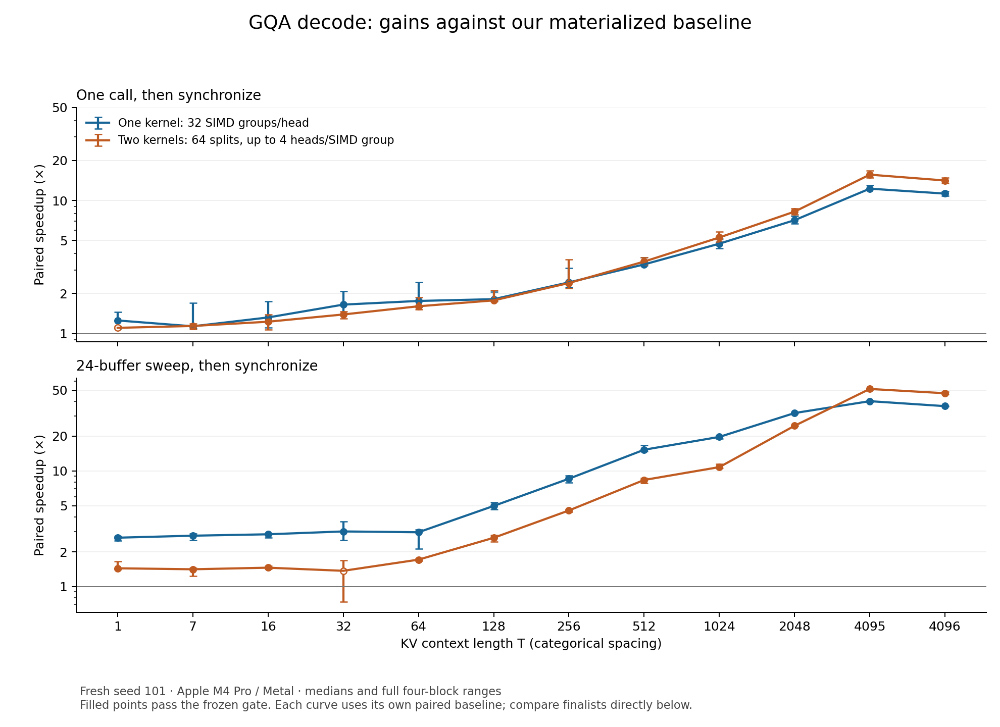
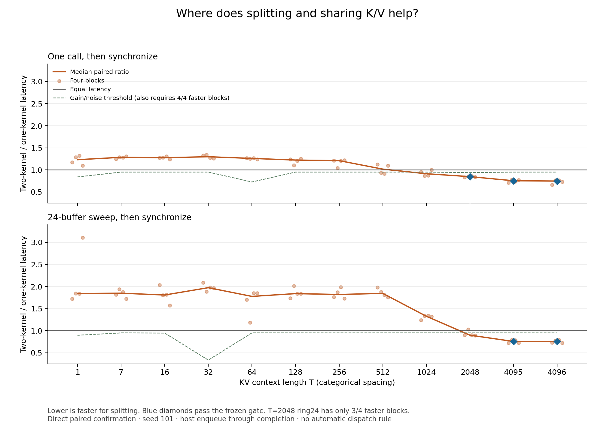

# EXP-0014: bounded GQA decode optimization

Complete, 2026-09-05. Evidence level: **operation**. All 12 candidate
configurations were tested; tuning stopped at the frozen budget. The final
measured source is `6902c949c6717f359ed5cb55ee45c850fa82b06d`, on local branch
`codex/gqa-decode-campaign`.

Two designs earned further use: a single kernel with 32 SIMD groups per query
head for shorter contexts, and a two-kernel design with 64 context splits and
up to four related query heads per SIMD group at long contexts. At T=4096,
the latter reduced synchronized hot-call time from 2391.50 to 168.50 microseconds
and ring24 time from 2560.56 to 54.50 microseconds per attention. Those are
approximately **14.1x and 47.0x paired speedups against this repository's
materialized baseline**. The direct comparison with the stronger single-kernel
candidate shows a further 25.3% hot and 24.6% ring24 reduction.

The two-kernel advantage is confirmed at T=4095 and 4096 in both modes.
T=2048 remains inconclusive for ring24. Both designs remain explicit
experimental choices; this experiment does not introduce an automatic selector.

## Contract and correctness

The new [Mojo entrypoint](../../src/llm_mojo/attention_decode.mojo) accepts
contiguous, non-overlapping BF16 Q/O `[1,14,64]` and K/V `[T,2,64]`, with
`1 <= T <= 4096`. Head `h` reads KV head `h // 7`; all T entries are visible,
including the current token. The caller owns projection, RoPE, KV-cache update,
buffer allocation and lifetime, and synchronization. The entrypoint only
enqueues attention and returns output; the materialized API still exposes its
probability buffer.

Dot products accumulate in FP32, scale by 1/8, and round their scores to BF16
in registers to preserve the baseline's score convention. Online maximum,
normalizer and output accumulation use FP32; output rounds to BF16. The
candidate does not round a materialized probability tensor. Numerical
compatibility, rather than bitwise identity, is therefore the acceptance rule.

All 12 candidates and the materialized control passed 24 generated cases plus
the existing pinned Transformers Qwen decode fixture, with two repetitions
using poisoned output and workspace buffers. The independent
[NumPy FP64 oracle](../../tests/fixtures/attention/generate_decode.py)
materializes dot products, softmax and weighted values, and supplies both
BF16-probability and FP64-probability expected outputs. Every implementation
must match both under the frozen `atol=rtol=0.015625`.

Coverage includes nonuniform heads, seeds 17/37, large finite and tied scores,
V cancellation across time, T=1, SIMD/split boundaries and neighboring lengths,
T=4095/4096, neutral empty splits, a NaN row beyond the logical KV prefix,
buffer reuse, and invalid shape rejection. The cancellation recipe was
strengthened before the final two trials, and all candidates were revalidated.
The benchmark additionally checks every layer's output before each timing pair.

Validation passed **68 Mojo tests and 99 Python tests**, including existing
attention prefill tests. The full suite ran at `6f5855f`; `6902c94` only
explicitly discards unused route IDs at timed call sites and passed the route
smoke again. [Validation logs and provenance](manifest.json) are retained.
This does not establish decoder-block composition correctness or prefill
performance for the new decode entrypoint.

## What the GPU owns

In both finalists, a 32-lane SIMD group reduces each Q·K score. Lane `l` owns
output dimensions `l` and `l+32`. It retains those Q values and unnormalized
output accumulators; the group shares a uniform maximum `m` and denominator
`z`. Each KV position updates `(m,z,u)` without writing scores or probabilities
to a device buffer. Partial states combine with a stable rescaling:

```text
M = max_j(m_j)
Z = sum_j(exp(m_j - M) * z_j)
U = sum_j(exp(m_j - M) * u_j)
O = U / Z
```

| Finalist | Work partition | Reduction and memory |
| --- | --- | --- |
| 4: `g32-h1-s1` | 14 threadgroups, each with 32 SIMD groups / 1024 threads; SIMD groups visit disjoint, strided KV positions for one query head | 8448 bytes of threadgroup partial state; one barrier, then group 0 merges; one dispatch; no required device workspace |
| 9: `g1-h4-s64` | 256 threadgroups, each one SIMD group; 64 contiguous KV splits and two head groups per KV head, with ragged handling for the seventh head | Each K/V load serves up to four query heads; FP32 workspace `[14,64,66]`; a second dispatch merges splits |

Four heads require 24 FP32 source state values per lane before temporaries:
two Q values, two output values, maximum and denominator for each head. This
is source accounting, not a measured physical register count. The program
requests two K/V passes per KV head instead of seven, or **3.5x fewer K/V
loads** than the one-head mapping. Actual DRAM traffic need not follow that ratio.

Splitting writes 236544 bytes (231 KiB) of partial state per call. At T=4096,
the baseline's BF16 score/probability scratch is 114688 bytes (112 KiB), so
the winning split workspace is larger than that scratch. The useful trade is
parallel work plus K/V reuse against extra partial-state traffic and a merge
dispatch. Minimizing launch count alone would miss the long-context winner.
The kernel still reads K/V from the memory hierarchy; Apple unified memory
does not make those reads free.

This applies online softmax and work-partitioning principles from
[FlashAttention-2](https://tridao.me/publications/flash2/flash2.pdf), with the
KV-sequence parallelism and final reduction described by
[Flash-Decoding](https://crfm.stanford.edu/2023/10/12/flashdecoding.html).
The [MLX Metal vector-attention implementation](https://github.com/ml-explore/mlx/blob/main/mlx/backend/metal/kernels/sdpa_vector.h)
also provides concrete SIMD-lane, partial-state and grouped-head ownership
examples. These are algorithm references, not performance controls; this
experiment does not compare against MLX or an NVIDIA FlashAttention kernel.

## Measurement conditions

Runtime identity was Apple M4 Pro, Metal (`metal:4-metal4`), on a Mac16,7 with
24 GiB unified memory. Recorded software: macOS 26.6.2 / 25G83, Xcode 26.6 /
17F113, Metal 32023.883, uv 0.12.5, Mojo 1.0.0, MAX 26.5.0. `uv.lock` was
unchanged. Timing blocks recorded AC power, low-power mode 0, no reported
thermal/performance warning, available memory, and an LG HDR 4K display.
These snapshots do not establish fixed GPU clocks or absence of background work.

The [frozen protocol](protocol.md) uses four blocks, with pair order
control/candidate, candidate/control, candidate/control, control/candidate.
Length order is ascending/descending/descending/ascending. Each arm has ten
warmup samples and ten measured samples per block. Training uses seed 17 and
T=1,16,64,256,1024,4096. Finalists 4 and 9 were chosen before fresh-seed 101
confirmation, which also includes T=7,32,128,512,2048,4095.

Hot times one enqueue path through explicit synchronization. Ring24 times a
sequential sweep over 24 different Q/K/V buffer sets through synchronization,
then divides by 24. Compilation, allocation, initialization, correctness gates,
warmup, readback and profiling are excluded. Both arms use the same allocations
and inputs. At T=4096, unique K+V total 2 MiB per layer and 48 MiB across the
ring. Ring24 is not guaranteed cold DRAM, and it amortizes synchronization
differently from hot. Neither mode measures a full decoder layer.

For each block, compute the ratio of candidate and control medians. A gain
passes only if its median reduction is at least 5%, meets the workload's
baseline-self-pair noise floor, and all four block ratios are below one.
The noise floor is the maximum absolute self-pair deviation. No observations
were discarded for being slow. Fresh confirmation noise reached 66.6% at
T=32/ring24 and 27.4% at T=64/hot; those conservative floors remain applied.
The summary's regression flag denotes a median slowdown above 5%; it is not
the symmetric equivalent of the full gain gate.

## Bounded optimization stages

The table shows **paired reduction in time at T=4096**, in percent; negative
values mean slower. “Inconclusive” denotes a failure of the gain gate. Full
short-context results, raw observations and spread are in
[statistics.csv](statistics.csv) and the [run records](manifest.json).

| ID | Configuration / hypothesis | Paired control | Hot | Ring24 | Decision |
| --- | --- | --- | ---: | ---: | --- |
| 1 | One SIMD group/head; fuse online attention | Materialized | 43.3% | 37.0% | Fusion alone leaves substantial opportunity |
| 2 | Two SIMD groups/head | Materialized | 70.7% | 71.4% | Continue increasing context parallelism |
| 3 | Eight SIMD groups/head | Materialized | 88.6% | 92.6% | Continue to the frozen 32-group candidate |
| 4 | 32 SIMD groups/head | Materialized | 91.1% | 97.2% | Single-kernel finalist |
| 5 | Four context splits | 4 | -97.1% | -417.4% | Reject against stronger control |
| 6 | 16 context splits | 4 | 2.8%, inconclusive | -51.5% | Reject against stronger control |
| 7 | 64 context splits | 4 | 11.8% | 8.2% | Advance to head-reuse trials |
| 8 | Two query heads/SIMD group, 64 splits | 7 | 4.2%, inconclusive | 17.5% | Ring-only evidence; four heads selected for confirmation |
| 9 | Four query heads/SIMD group, 64 splits | 7 | 13.8% | 17.8% | Split-and-reuse finalist |
| 10 | Seven query heads/SIMD group, 64 splits | 7 | 8.9% | 15.2% | Valid improvement, lower median gain than 9 in these trials |
| 11 | Conditional rescaling, 32 groups | 4 | 2.9%, inconclusive | -11.7% | Reject instruction change |
| 12 | Conditional rescaling, 64 splits / one head | 7 | -6.0% | -4.2% | Reject instruction change |

The final two configurations compute only one exponential per visited KV
position and rescale accumulated state only when the running maximum grows.
They did not improve the strong controls consistently. Fewer source operations
did not guarantee lower latency on this mapping and compiler.

The first head-reuse timing runs were **invalidated**. An overly broad
`variant >= 7` harness branch executed variant 7 under labels 8–10. A
configuration-11 workspace failure exposed the mistake before its timing.
Direct numerical tests had called the correct kernels, so they did not detect
the benchmark's routing error. The repair uses `variant == 7`, returns a
constant route ID from every launch branch, and checks that ID before timing.
An executable regression test traverses all 13 routes; temporarily restoring
the old condition made it fail with actual 7 versus expected 8.

Only `verified-*` runs support IDs 8–12 here. The two misrouted runs and the
failed configuration-11 run are listed with exclusion reasons and hashes in
the manifest. Initial IDs 0–7 and their profiles were correctly routed.
Corrected reruns did not add candidate configurations. The
[decision record](decisions.md) documents this correction explicitly.

## Fresh-input confirmation

Matched baseline-to-candidate medians are microseconds per attention. Each row
below passes the full gain gate in both modes. “4” is retained through T=2048
in this presentation because the direct ring24 crossover is inconclusive.
This is a bounded reporting choice, not a production dispatch rule.

| T | Candidate | Hot: baseline → candidate | Ring24: baseline → candidate |
| ---: | ---: | ---: | ---: |
| 1 | 4 | 167.50 → 130.50 | 46.18 → 17.43 |
| 16 | 4 | 145.25 → 109.25 | 49.45 → 17.91 |
| 64 | 4 | 190.00 → 114.75 | 59.56 → 20.30 |
| 256 | 4 | 267.00 → 120.25 | 163.92 → 19.15 |
| 1024 | 4 | 687.25 → 145.00 | 580.70 → 29.51 |
| 2048 | 4 | 1294.50 → 182.00 | 1296.26 → 40.90 |
| 4095 | 9 | 2666.75 → 170.75 | 2828.41 → 55.49 |
| 4096 | 9 | 2391.50 → 168.50 | 2560.56 → 54.50 |

Latency entries are medians of four block medians. Reported percent gains and
speedups derive from within-block ratios, so dividing the displayed medians
does not necessarily reproduce them exactly.



The direct finalist comparison supports candidate 4 at short lengths and
candidate 9 at T=4095/4096. At T=2048, candidate 9 improves hot by 15.3%, but
ring24 ratios are `0.9005, 1.0321, 0.8969, 0.8934`: a 10.1% median reduction
with only three faster blocks. At T=1024, its 8.7% hot median reduction also
fails the all-four direction rule, while ring24 regresses 32.6%.



Absolute finalist latency varies across different comparison runs. For
example, candidate 9 at T=2048/ring24 is about 36.3 microseconds when paired
with candidate 4 and 52.7 when paired with the materialized baseline. The
direct paired comparison governs the crossover decision; ranking absolute
times from separate runs would obscure this execution-context sensitivity.

## What profiling established

Eleven receipt-bound captures completed: materialized and both finalists at
T=16,256,4096, plus the earlier one-head split and 32-group diagnostics at
T=4096. Each capture has 100 warmup calls, 500 profile calls, a final sync and
250 ms host idle. The analyzer verified runtime Apple M4 Pro/Metal, binary and
source identity, the declared sequence, and 500/1000/1500 profile dispatches
as appropriate. All captures include 85 named device-wide counters.

The following are **instrumented diagnostic GPU stage medians**, in
microseconds. Stage attribution follows the source-bound enqueue order in the
validated chronological sequence; it is not an independent named-shader label.
Stage medians are not summed into headline benchmark latency.

| T | Materialized QK / softmax / PV | Finalist 4: decode | Finalist 9: decode / merge |
| ---: | ---: | ---: | ---: |
| 16 | 14.375 / 11.000 / 12.084 | 20.959 | 7.834 / 15.834 |
| 256 | 10.833 / 68.417 / 70.770 | 37.250 | 11.417 / 16.105 |
| 4096 | 50.084 / 1038.292 / 1052.604 | 70.000 | 29.750 / 10.375 |

The long materialized profile is dominated by softmax and PV intervals. The
split profile exposes the separate merge cost, which matters particularly at
short lengths. Earlier split-one-head counters showed median instruction
throughput and integer/complex limiter values of 58.7% and 53.0%; these
motivated the conditional-rescaling trials, which failed the timing gate.

These are single diagnostic captures, not counterbalanced causal comparisons.
Counters describe the device during the selected window and can include
unrelated work; they do not prove kernel-exclusive occupancy, a particular
DRAM-traffic reduction, or an exclusive bottleneck. No target spill event was
reported in these captures; this is not proof that every execution is
spill-free. The initial baseline captures have provenance but no separate
before/after condition files. Finalist captures retain those snapshots.

## Reproduction and resulting decision

The [manifest](manifest.json) binds 12 valid runs, **27840 raw observations**,
97 compact artifacts, invalidation records and validation. Samples are retained
as lossless gzip JSONL with decompressed hashes. Compact profile summaries
include exported-table hashes and capture receipts. Raw binaries, logs and
Instruments bundles remain under `/private/tmp/llm-mojo-gqa-exp0014` on the
measurement host; that temporary location is not durable storage.

Offline verification and CSV regeneration require no GPU:

```bash
python3 experiments/EXP-0014-gqa-decode/analyze.py --write-derived
uv run --no-project --with matplotlib==3.10.8 python \
  experiments/EXP-0014-gqa-decode/analyze.py --plots
```

To repeat confirmation, first run the documented
[validation commands](../../docs/development.md#tests) and use a clean local
commit. Build and run into fresh external paths; the runner binds the new
commit and binary. For exact historical source, use `6902c94` in a separate
clean checkout. Both modes and all four blocks run by default:

```bash
uv run --locked python benchmarks/run_attention_decode.py \
  --build-binary /absolute/external/path/decode
uv run --locked python benchmarks/run_attention_decode.py \
  --binary /absolute/external/path/decode --recorded --candidates 0 \
  --seed 101 --lengths 1,7,16,32,64,128,256,512,1024,2048,4095,4096 \
  --output-dir /absolute/external/path/noise
uv run --locked python benchmarks/run_attention_decode.py \
  --binary /absolute/external/path/decode --recorded --candidates 9 --control 4 \
  --seed 101 --lengths 1,7,16,32,64,128,256,512,1024,2048,4095,4096 \
  --noise /absolute/external/path/noise/summary.json \
  --output-dir /absolute/external/path/crossover
uv run --locked python benchmarks/run_attention_decode.py \
  --binary /absolute/external/path/decode --recorded --candidates 4,9 --control 0 \
  --seed 101 --lengths 1,7,16,32,64,128,256,512,1024,2048,4095,4096 \
  --noise /absolute/external/path/noise/summary.json \
  --output-dir /absolute/external/path/baseline
```

For training-stage reproduction use seed 17, lengths
`1,16,64,256,1024,4096`, and the candidate/control pairs in the stage table.
The [benchmark guide](../../benchmarks/README.md#output-only-gqa-decode-campaign)
documents profile binary construction, capture and export. These captures
used the installed `LLM_Mojo_Metal_Limiters` template with a five-second limit.
Equivalent named-counter collection must be configured on another host.

Call the explicit candidates with caller-owned views:

```mojo
enqueue_grouped_query_attention_decode_apple_gpu[32, 1, 1](
    context, query, key, value, output, unused_workspace
)
enqueue_grouped_query_attention_decode_apple_gpu[1, 4, 64](
    context, query, key, value, output, split_workspace
)
```

The first call permits an unused `[1,1,1]` FP32 workspace view; the second
requires `[14,64,66]`. The calls allocate and synchronize nothing. Failed
configurations remain explicit for reproduction, with conditional rescaling
off by default. No public API routing, model weights, toolchain versions,
remote branches or PRs were changed.

The next separately scoped milestone is to exercise these output-only choices
inside a correct decoder block and measure the complete caller. Prefill
optimization and a production crossover rule require their own evidence.
