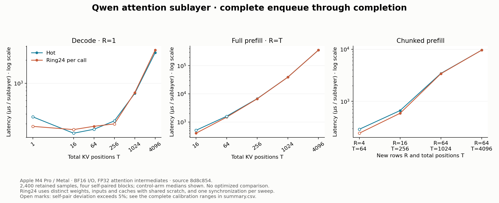
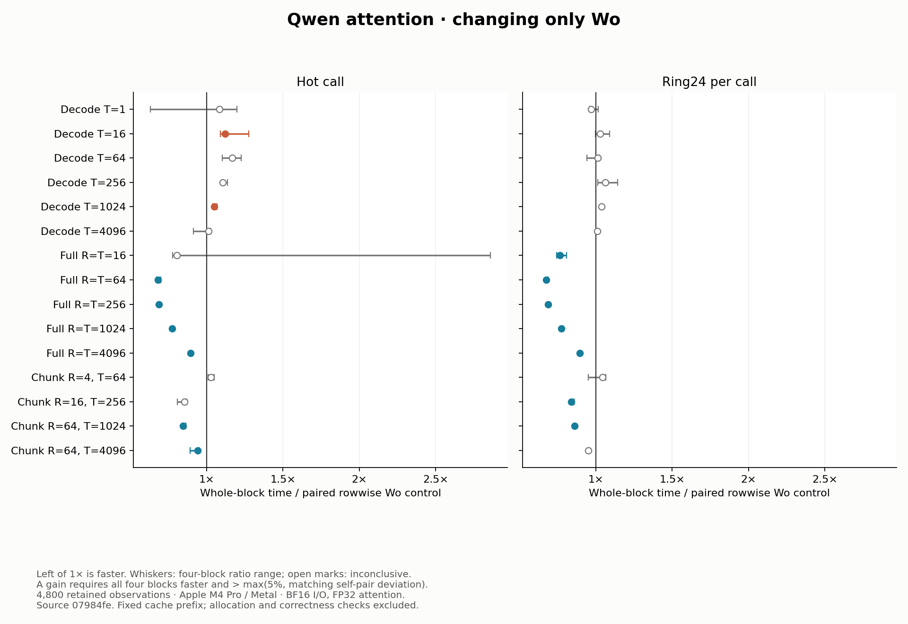
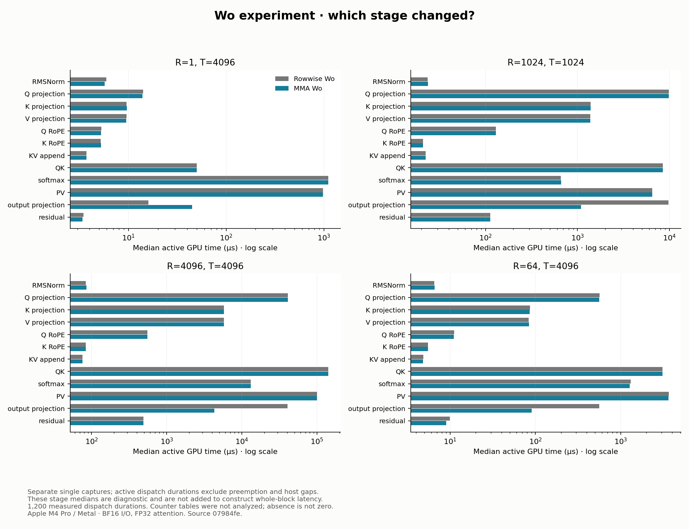

# Qwen attention sublayer

Changing only the output projection to the existing Apple MMA mapping reduces
whole-attention latency by about 31% at 256-token full prefill and 10% at 4096
tokens, on Apple M4 Pro / Metal. Decode has no demonstrated gain and two hot
cases regress. The mapping remains an explicit option, with rowwise Wo as the
default. This study retains the original FP32 baseline and the completed
[contained Wo comparison](#contained-wo-results), including negative results.

The measured unit is
`X → RMSNorm → Q/K/V → RoPE → KV append → GQA → Wo → residual X+branch`.
It ends before the decoder MLP. Batch is one, H=896, Nq=14, Nkv=2 and D=64.
The attention output `[R,14,64]` is viewed as `[R,896]` for Wo without a copy.
For R new rows and T visible positions, the cache prefix has length T-R.

## Accuracy comes first

The primary reference is pinned Transformers 4.43.1 `Qwen2SdpaAttention` on
Torch 2.4.0 CPU, with explicitly FP32 Q/K/V and mask at the SDPA boundary,
and BF16 attention output before Wo. Weights, activations, cache and final
output remain BF16. This is our agreed inference precision policy; it does
not identify Qwen's original training kernels.

The default Mojo route retains FP32 scores, probabilities and accumulation.
Validation passed 81 Mojo tests and 38 Python tests, all 510 frozen synthetic
arrays, three checkpoint attention cases and repeated asynchronous cache
reuse. The instrument additionally passed full 4096-token ring24 checks
with a poisoned cache suffix. It checks the projected branch separately so
the residual cannot conceal an attention error.

Historical BF16 eager compatibility failures remain reproducible. The
[contract and numerical investigation](../../docs/attention-sublayer.md),
[validation](validation.json), [original numerical record](numerics.json)
and [FP32 comparison](precision_numerics.json) retain the precision decision,
independent gates and provenance. The measured engine and fixtures match the
validation hashes; only the runner's per-process timeout changed afterward.

## Baseline whole-block latency

These are control-arm medians of four block medians, in milliseconds per
sublayer. Both timing arms run the same implementation, providing noise
calibration rather than an optimized comparison.

| Workload | R | T | Hot | Ring24 per call |
| --- | ---: | ---: | ---: | ---: |
| Decode | 1 | 4096 | 2.494 | 2.689 |
| Full prefill | 1024 | 1024 | 39.127 | 39.037 |
| Full prefill | 4096 | 4096 | 355.793 | 355.288 |
| Cached chunk | 64 | 4096 | 9.590 | 9.597 |



The complete 15-shape matrix and calibration ranges are in [summary.csv](summary.csv).
Keep the short cases in perspective: the largest self-pair deviations were
177.3% for hot `(1,64)`, 171.4% for hot `(4,64)` and 54.4% for hot `(16,16)`.
All samples are retained. These points cannot support small optimization
claims under this run's decision rule. Open plot marks identify self-pair
variation above 5%. The four workloads in the table retained the 5% minimum
decision threshold in both modes. Future comparisons need fresh matching
calibration; this run's calibration must not be imported into another run.

## Where the baseline GPU time goes

The following percentages divide a stage's total recorded active duration
by the total active duration in that same capture. They are not percentages
of the separate host-to-completion latency measurement.

| Workload | Main active GPU work | Median stage durations |
| --- | --- | --- |
| Decode `(1,4096)` | Softmax 48.1%, PV 46.5% | 1.110 ms, 1.009 ms |
| Full `(1024,1024)` | All four projections 58.3%; Q 25.6%, Wo 25.4% | Q 9.813 ms, Wo 9.725 ms |
| Full `(4096,4096)` | QK 40.5%, PV 28.6% | 143.409 ms, 101.088 ms |
| Chunk `(64,4096)` | PV 39.9%, QK 31.8%, softmax 14.8% | 3.833 ms, 3.088 ms, 1.429 ms |


The [stage table](profile_summary.csv) retains medians and ranges. Each
shape has one separate instrumented capture, with 100, 25, 10 and 25 measured
iterations respectively. Stage names follow verified enqueue order. Instruments
fragmented 54 full-context and 17 chunked dispatches; their execution segments
were joined before assigning stages. Durations exclude preemption and host gaps.
Adding these stage medians would not reconstruct whole-block latency.

The source explains why one optimization will not solve every workload:

- QK assigns one score to a thread; PV assigns one output component to a
  thread. Their serial reduction work grows with the visible key count.
- Softmax assigns an entire row to one thread. Decode has only fourteen
  active softmax threads, each scanning up to 4096 scores. More query rows
  provide more independent softmax work, changing its relative importance.
- Each baseline projection uses one SIMD group per output dot product.
  It does not yet use the existing prefill mapping that reuses an input tile
  across several output columns and rows.

Device-wide counter medians reinforce this as a hypothesis rather than a
per-kernel diagnosis: decode's Kernel Occupancy was 1.46%, while full-1024
prefill was 58.61%. The corresponding Last Level Cache Limiter medians were
2.25% and 100%. These samples cover the enclosing target window, include
other GPU activity and are not measured DRAM bandwidth. No target compiler
spill event was reported in these four captures; this is a capture-bounded observation.

Full-4096 optional counter analysis is explicitly unavailable. Its XML export
was stopped after growing beyond 4 GiB, because the existing analyzer loads a
whole table into memory. The original trace and complete stage-timing exports
are preserved externally. No partial counter XML contributes to the report,
and the absent counter summaries are not recorded as zero.

## Work and storage

The number of visible query-key pairs per head is
`C = R(T-R) + R(R+1)/2`. The reference allocates `4*14*R*T` bytes for FP32
scores, overwritten in place by probabilities. QK plus PV performs roughly
`4*64*14*C` floating-point operations; the four projections perform
`2*R*896*(1152+896)`. Softmax, masking and elementwise operations are additional.

| R | T | FP32 scratch | Projection GFLOPs | QK+PV GFLOPs |
| ---: | ---: | ---: | ---: | ---: |
| 1 | 4096 | 224 KiB | 0.00367 | 0.01468 |
| 1024 | 1024 | 56 MiB | 3.758 | 1.881 |
| 4096 | 4096 | 896 MiB | 15.032 | 30.072 |
| 64 | 4096 | 14 MiB | 0.235 | 0.932 |

Weights, norm and biases occupy 3,674,112 bytes per ring entry; both KV caches
together occupy `512*T` bytes. These are source-derived counts and allocated
storage, not measured memory traffic. The materialized FP32 path is an
inspectable accuracy baseline with a substantial memory cost.

## Contained Wo results

Wo is the learned, bias-free matrix that mixes the fourteen heads' outputs
back into the hidden state: `A[R,896] @ Wo[896,896].T`. The candidate changes
only how that matrix multiplication is assigned to the GPU. Both versions
accumulate in FP32 and round to BF16 before the existing residual addition.
The attention precision policy, other projections, cache, buffers and twelve
dispatches remain fixed. `wo_mma=True` selects the candidate; benchmark IDs
3 and 4 distinguish rowwise and MMA Wo while both execute GQA route 3.

The rowwise mapping assigns one output dot product to a 32-lane SIMD group,
with one FP32 accumulator per lane and a final group reduction. The MMA
mapping assigns an 8×16 output tile to that group, using two distributed 8×8
matrix fragments per K=8 phase and four FP32 accumulators per lane. It reuses
operands across rows and output columns without shared operand storage or
block barriers. At R=1024 this changes 917,504 rowwise groups into 7,168 tile
groups. These counts describe work ownership, not measured memory traffic.

### Accuracy and screening

All existing numerical gates passed: GQA `atol=rtol=0.0078125`, Wo/projected
branch/final output `atol=rtol=0.03125`, and exact BF16 cache bits. No tolerance
changed. Each isolated Wo comparison consumes the exact upstream BF16
attention tensor; full and chunked comparisons start from the original X.
The [validation record](wo_validation.json) retains the commands, source
hashes and individual comparisons.

| Dataset | Maximum isolated Wo scaled error | Maximum composed branch error | Maximum residual output error |
| --- | ---: | ---: | ---: |
| 17 synthetic cases | 0.00390625 | 0.00516796 | 0.00781250 |
| 3 checkpoint cases | 0.00023524 | 0.00141243 | 0.00137931 |

Scaled error is `abs(got-want)/(1+abs(want))`. The complete workflow passed
81 Mojo tests and 38 Python tests and verified all 510 frozen synthetic arrays.
The existing checkpoint prefix reproduced its 63 arrays. Normal asynchronous
execution passed twelve 65-token sequences on each of five configurations,
including the new mapping. Both benchmark arms additionally poison the actual
cache suffix and attention/projected/output buffers, then check the projected
branch, final output and exact cache prefix/suffix for every distinct layer
allocation before timing.

The five-shape [screen](wo_screen_summary.csv) retained 1,600 observations.
Its six prefill workload/mode gains met the predeclared advancement rule, so
the candidate proceeded to the full matrix with fresh self-pair calibration.
The screen is selection evidence; the following results come from that full run.

### Whole-block comparison

Across thirty workload/mode comparisons, **13 are faster, 15 inconclusive and
2 slower** under the existing four-block rule. A gain requires all four paired
blocks to be faster and their median reduction to exceed the larger of 5%
and matching self-pair variation. The [complete table](wo_summary.csv) includes
both arms, all ratios, calibration thresholds and decisions.

| Full prefill R=T | Hot latency reduction | Ring24 per-call reduction |
| ---: | ---: | ---: |
| 16 | Inconclusive | 23.66% |
| 64 | 31.99% | 32.44% |
| 256 | 31.17% | 31.24% |
| 1024 | 22.49% | 22.56% |
| 4096 | 10.43% | 10.43% |

For full 1024, paired-control and candidate medians are 38.409 → 29.774 ms
hot and 38.267 → 29.627 ms ring24. For full 4096 they are 348.731 → 312.373 ms
hot and 354.276 → 317.393 ms ring24. These are medians of block medians;
reported reductions use the paired block ratios, not the ratio of those
displayed medians.

Decode establishes no gain. Hot T=16 is 11.91% slower and hot T=1024 is
5.03% slower; the other ten decode comparisons are inconclusive. Some short
hot self-pairs vary substantially, reaching about 190%. All observations are
retained, including hot full-16's inconclusive result despite its lower median.

For chunked prefill, `(16,256)` improves 15.98% in ring24; `(64,1024)` improves
15.37% hot and 13.94% ring24. At `(64,4096)` hot improves 6.02%, but ring24's
4.97% reduction is inconclusive under the fixed 5% floor. That last cell had
barely qualified in the screen, illustrating why screening does not replace
confirmation. Both `(4,64)` modes and hot `(16,256)` are inconclusive.



### What changed inside the block

The eight separate stage captures compare both mappings at four workloads.
These are median active GPU durations in microseconds, useful for diagnosing
the change. They are not paired latency measurements.

| R | T | Rowwise Wo µs | MMA Wo µs |
| ---: | ---: | ---: | ---: |
| 1 | 4096 | 15.958 | 44.917 |
| 1024 | 1024 | 9724.230 | 1088.854 |
| 4096 | 4096 | 40667.333 | 4303.666 |
| 64 | 4096 | 559.417 | 89.938 |



Wo becomes roughly nine times faster in the two full-prefill captures, while
the surrounding stage medians remain similar. Its work grows with R; QK/PV
work grows with R and the visible context. This explains why the whole-block
benefit decreases at long context even though Wo improves substantially.
The 896 MiB FP32 scratch allocation at full 4096 is unchanged.

At R=1, Wo itself takes about 2.8 times longer. Only one of the MMA tile's
eight rows is useful, and it exposes 56 groups versus 896 rowwise groups.
The unused row capacity and smaller pool of independent groups are consistent
with the slowdown; this experiment does not isolate their individual costs.
The result argues against an unconditional MMA default. It does not establish
a general dispatch threshold.

In the MMA-Wo captures, stage shares of **total recorded active GPU time** are:

| Workload | Remaining main stages | Wo share |
| --- | --- | ---: |
| Decode `(1,4096)` | Softmax 48.7%, PV 44.6% | 2.0% |
| Full `(1024,1024)` | Q projection 33.1%, QK 28.6%, PV 21.9% | 3.7% |
| Full `(4096,4096)` | QK 45.2%, PV 32.0% | 1.4% |
| Chunk `(64,4096)` | PV 41.2%, QK 34.8%, softmax 14.3% | 1.0% |

These shares use summed raw durations within each capture. They do not divide
by host-to-completion latency, and stage medians are not added to reconstruct
whole-block time. The [profile table](wo_profile_summary.csv) retains ranges.
No target compiler spill event was reported in these captures; that does not
prove every invocation is spill-free. Optional counter tables were not exported
or analyzed for this comparison; missing values are not zero.

## What the earlier experiments teach us

The [linear prefill study](../linear_prefill/README.md) already established
that sharing operands across token rows can make Apple MMA effective, while
tiny row counts can lose. This Wo experiment tests that mechanism at N=896,
without bias, and inside the full attention block. It does not inherit the
packed-QKV study's N=1152 crossover or compare its old absolute times with
this run. The block's remaining stages limit how much a faster projection can
improve the whole call.

The [decode study](../gqa_decode/README.md) showed that online softmax alone
was not the end of the optimization: distributing the KV sequence and reusing
K/V across related heads helped further. It also found that reducing
exponential calls did not improve the stronger controls. The next FP32 decode
comparison should reuse those ownership designs and the existing tests while
keeping scores FP32 and checking against the selected FP32 reference. The old
timings establish results for those older
paths, not speed claims for an FP32 adaptation.

The [prefill study](../gqa_prefill/README.md) showed the value of query tiling
and matrix execution. Its follow-up found that rolling the QK reduction
reduced reported compiler spills and improved a subset of workloads; removing
barriers, changing accumulator representation and adding head reuse did not
produce general gains. Future FP32 prefill candidates should retain those
lessons about live state and query ownership. They also need to preserve
FP32 scores and softmax weights through PV: copying the old MMA path's BF16
tile-weight cast would change the numerical policy again.

Keep the next milestones separate. First compare FP32 versions of the existing
G32 and split64-H4 decode designs against the materialized control. Then study
FP32 prefill tiling and PV arithmetic, including the compiler's resource
behavior. Q projection is another contained candidate, particularly at 1024
tokens, but its rounding changes feed attention scores; rerun operation and
full-block gates. Broader fusion should follow measured remaining stage costs.

## Reproduction and evidence

The baseline latency run used clean source `8d8c8540c5f9de2d7d7cf16fc00f502702a3a941`
on 2026-09-06, 16:22:57–16:53:05 UTC. All four profile binaries use that same
source. Hardware was Apple M4 Pro / Metal, Mac16,7 with 24 GiB memory;
Mojo 1.0.0, MAX 26.5.0, macOS 26.6.2 and Xcode 26.6. Every latency block and
capture recorded AC power, Low Power Mode off and no thermal/performance warning.
These checks do not pin GPU clocks or exclude background activity. The Wo
comparison uses the same hardware/software configuration, with independent
source, binary and condition records below.

The workload uses frozen synthetic seed 53 with a CPU-derived cache prefix.
Ring24 owns 24 distinct weights, inputs and caches with two sign patterns;
it shares scratch/output and is not a decoder stack. Timing includes the host
length rewind, twelve enqueues, cache append and completion. Allocation,
fixture reads, uploads, prefix setup and correctness checks are excluded.
Each call overwrites the same suffix, keeping R and T fixed. There are ten
warmups and ten samples per arm in four blocks; blocks two and three reverse
workload and arm order.

[run.json](run.json) and [samples.csv.gz](samples.csv.gz) retain all 2,400
latency observations and their provenance. [profiles.json](profiles.json)
and [profile_samples.csv.gz](profile_samples.csv.gz) retain all 1,920 measured
dispatch durations, capture identities, selected counters and the explicit
counter-analysis omission. The source of the curator is hashed in that record.
The post-measurement curation/plot changes handle absent optional counters and
mark elevated calibration variation; they change no measured engine code.
All 38 Python checks pass with the retained evidence, including duplicate and
missing-dispatch rejection for both attention profile grids.

The Wo screen and full run use clean source
`07984fedafcbe1c1260c37c86ff708c5098cfa18`. They ran on 2026-09-06 at
17:55:02–18:03:41 and 18:04:43–19:04:24 UTC respectively, retaining 1,600 and
4,800 observations in [wo_screen_run.json](wo_screen_run.json),
[wo_screen_samples.csv.gz](wo_screen_samples.csv.gz), [wo_run.json](wo_run.json)
and [wo_samples.csv.gz](wo_samples.csv.gz). All eight profile binaries use that
same clean source. [wo_profiles.json](wo_profiles.json) and
[wo_profile_samples.csv.gz](wo_profile_samples.csv.gz) retain 1,200 measured
dispatch durations: 25, 10, 5 and 10 iterations per variant across the four
workloads, after ten warmups each. All eight captures passed provenance and
dispatch-sequence validation. The default Metal System Trace was used without
optional counter-table export; full traces remain external. Every timing block
and capture recorded AC power, Low Power Mode off and no reported warning.

The same fixed-prefix, hot/ring24 and paired-block protocol applies to Wo.
The experiment retains the original baseline figures separately and uses fresh
controls for its comparisons. Post-measurement changes curate evidence, update
reporting and check retained records; they do not change the measured Mojo
engine or its numerical tests. All five tables and five figures regenerate
byte-for-byte from the retained files.

Rebuild tables and figures without a GPU:

```sh
uv run --locked --with matplotlib==3.10.8 python -m llm_mojo.benchmarks.plot studies/attention_sublayer
```

For fresh measurements, use a clean checkout, regenerate and validate fixtures,
then use the [package-owned build/run and trace commands](../../src/llm_mojo/benchmarks/README.md).
Use the recorded commit to reproduce the exact measured source. Raw traces,
XML, binaries, checkpoint assets and oracle arrays stay outside Git.
