# Attention experiment results

Detailed measurements, including regressions and inconclusive comparisons.
Start with the [overview](README.md); see [historical plans](plans.md) for each
comparison budget and [numerics](numerics.md) for the precision investigation.

## Split8 with both projection tiles: integration closure

The previously separate winners now compose through
`enqueue_attention_sublayer_integrated(..., gqa_mapping=4, projection_mapping=5)`,
benchmark variant **19**. Its controls are **13** (split8 with 8x16 QKV/Wo)
and **18** (unsplit GQA with 16x16 QKV/Wo). This is an explicit study option;
no automatic selector or default changes. Projection mappings 1–4 remain
restricted to unsplit control GQA; only the studied 5/4 combination is added.

For R>=16, both projections use their existing 16x16 mappings. R<16 keeps
rowwise projections, and R=1 keeps G32 decode. Multi-row split8 requires
caller-owned `AttentionWorkspace(..., fp32_materialized=False, prefill_splits=8)`
with sufficient row/context capacity and initialized RoPE tables. Missing
partial storage fails before any enqueue or cache/output change. The complete
call includes ten GPU dispatches, including the split-state merge, ending at
the residual addition; decode uses nine. It allocates and synchronizes nothing.

### Correctness and measurement boundary

At measured source **963d112**, the full workflow passed **93 Mojo and 48
Python tests**, the frozen 17-case synthetic suite, three checkpoint cases,
and actual benchmark routes in both modes. Normal-mode stress passed twenty
configurations with twelve consecutive sequences each. The new combination
crosses the 15/16/17-row boundary and finishes with decode, with poisoned
scratch/output checks and unchanged exact cache gates.

For each of variants 13/18/19, the maximum scaled projected/final errors were
**0.005181347 / 0.011627907** on synthetic data (113 checks per field) and
**0.0014124294 / 0.0013793104** on checkpoint data (49 checks per field).
All pass the unchanged 0.03125 gate, `abs(got-want)/(1+abs(want))`; cache
checks compare exact BF16 bits. Equal maxima do not imply bitwise-identical
outputs. [split_combined_validation.json](data/split_combined_validation.json)
retains commands, source hashes and numerical summaries.

Both comparisons ran once on the same compiled source on Apple M4 Pro /
Metal, retaining **4,480 observations**. Each includes its own control self-pairs,
four paired blocks, ten warmups and ten samples per arm, hot and ring24.
The workloads are the six prior split-domain chunks plus (16,256), the
previously observed short projection regression. Positive percentages below
mean lower whole-attention latency; negative percentages mean higher latency.
The decision uses all four block ratios and the larger of 5% or matching
self-pair variation. Ratios come from within-block pairs; do not multiply
results across comparisons or rank controls from separate runs by raw medians.

### Do the projection gains survive with split8 fixed?

Compare **13 versus 19**, changing both projection tiles while holding split8
fixed. The result is **five faster, three slower, six inconclusive cells**.

| Chunk R, context T | Hot reduction | Ring24 reduction |
|---|---:|---:|
| 16, 256 | -13.60%, inconclusive | -10.64%, inconclusive |
| 16, 1024 | -8.28%, slower | -3.72%, inconclusive |
| 16, 4096 | -5.57%, slower | -5.30%, slower |
| 64, 1024 | 7.50%, faster | 9.49%, faster |
| 64, 4096 | 4.47%, inconclusive | 4.21%, inconclusive |
| 256, 1024 | 11.27%, faster | 11.77%, faster |
| 256, 4096 | 4.83%, inconclusive | 5.08%, faster |

At (64,1024) and (256,1024), the combined tiles qualify in both modes. At
(64,4096), all four projection ratios improve, but their 4.2–4.5% median
reductions are below the predeclared 5% floor. At (256,4096), only ring24
qualifies, narrowly at 5.08%. These limits remain in the report.

The R=16 cases caution against blindly composing winners: old 8x16 projections
are faster at T=4096 in both modes and at T=1024 in hot mode. The short
(16,256) comparison is inconclusive because control self-pair deviations reach
53.35% hot and 20.70% ring24. That does not erase its previous regression or
establish a fresh one. No samples were discarded or selectively rerun.

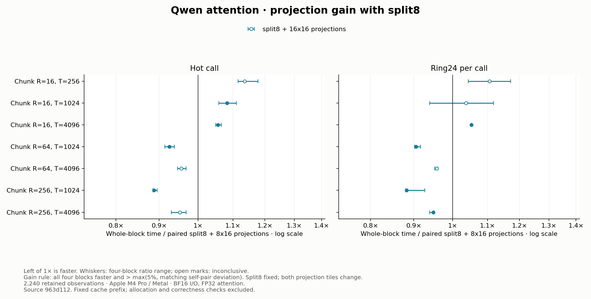

### Does split8 still help with both new projections fixed?

Compare **18 versus 19**, holding both 16x16 projections fixed and adding
split8 with its merge. **All fourteen cells qualify as faster.**

| Chunk R, context T | Hot reduction | Ring24 reduction |
|---|---:|---:|
| 16, 256 | 17.24%, faster | 14.74%, faster |
| 16, 1024 | 40.41%, faster | 49.45%, faster |
| 16, 4096 | 61.87%, faster | 66.88%, faster |
| 64, 1024 | 24.73%, faster | 30.82%, faster |
| 64, 4096 | 41.16%, faster | 47.84%, faster |
| 256, 1024 | 7.03%, faster | 7.69%, faster |
| 256, 4096 | 14.44%, faster | 14.31%, faster |

For the long (64,4096) chunk, split8 lowers complete attention time by
41.16% hot and 47.84% ring24, consistent with the earlier split8 lesson.
The new projection tiles add little at this workload; splitting remains
the larger contribution. At (256,1024), both contributions qualify separately:
7.03–7.69% from split8 with new projections fixed, and 11.27–11.77% from the
projection change with split8 fixed. These are distinct paired comparisons,
not additive components of a single speedup.

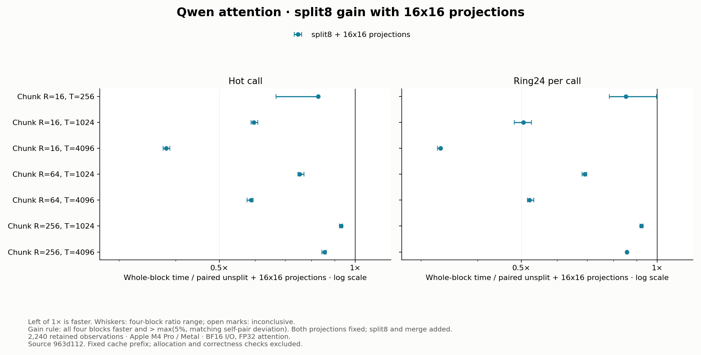

### What closes this milestone

The combination is correct and measured end to end. For the measured cached
chunks (64,1024) and (256,1024), variant 19 beats both component configurations
in both modes. For R=16 at T=1024/4096, retain the old projection tiles with
split8 where the new tiles regress; (64,4096) has no qualifying extra projection
gain, and (256,4096) establishes that extra gain only in ring24. The earlier
unsplit 16x16 full-prefill results remain a separate supported option; this
closure measured cached chunks and does not establish a new full-prefill rule.

This is enough to close the bounded attention integration study and move to
the next decoder component. Further attention optimization should be motivated
by a specific workload or later decoder measurements. We have not demonstrated
a hardware ceiling. There are no new profiler captures or hardware counters
in this closure; the prior unsplit stage shares must not be presented as a
profile of variant 19. Source reuse and accumulator counts do not establish
physical bandwidth or occupancy, nor explain the short-row regressions alone.

The projection run spans **2026-09-07 11:27:51–11:29:43 UTC**; the GQA run spans
**11:29:44–11:31:58 UTC**. Both use the same frozen case-7 suffixes, source,
binary, and software: macOS 26.6.2, Xcode 26.6, Mojo 1.0.0 and MAX 26.5.0.
Conditions were checked before and after each block: AC power, Low Power Mode
off, and no reported thermal/performance warnings. Clocks were not pinned and
background activity was not excluded. Ring24 owns distinct weights, inputs
and caches but shares scratch/output; it amortizes synchronization and is not
a 24-layer model or guaranteed cold-memory measurement.

Reproduce from measured source 963d112 using the build/run workflow in
[the benchmark guide](../../src/llm_mojo/benchmarks/README.md), selecting
`attention_sublayer_split_combined_projections attention_sublayer_split_combined_gqa`.
The two prefixed `run.json` and `samples.csv.gz` pairs bind each observation to
its frozen matrix and provenance. The ordinary plotter regenerates both
summary tables and figures without GPU execution. After retention, all 49
Python tooling/evidence checks passed. All 78 retained tables and figures
reproduce byte for byte, including the 74 unchanged historical artifacts.

## Combined QKV and Wo: complete attention timing and profiling

This experiment enables the two previously validated 16x16 projections
together through `enqueue_attention_sublayer_integrated(...,
projection_mapping=5)`, benchmark variant 18. The fresh control is variant 9,
with both projections at 8x16. GQA remains the integrated FP32 unsplit mapping.
Calls with fewer than sixteen rows use the same rowwise projections in both
arms. This is an explicit study option, without automatic workload selection.

The measured block is still
`RMSNorm → packed QKV → unpack → Q/K RoPE → KV append → FP32 GQA → Wo → residual`.
It contains nine GPU dispatches, with no allocation or synchronization between
stages inside the enqueue. The latency sample ends at device completion; the
separate profile captures assign active GPU time to each stage. The scope ends
before the decoder MLP.

The implementation reuses both existing 16x16 kernels and adds only their
composition choice. At full 1024, the QKV/Wo matrices have K=896 and N=1152/896.
Together the old tiles launch 16,384 SIMD groups and request 672 MiB of input
and weight operands; the new tiles launch 8,192 groups and request 448 MiB.
Each lane owns eight FP32 accumulator values instead of four. These source
counts exclude caching, output stores and other stages. They describe operand
reuse, not measured DRAM traffic or physical register allocation. BF16 storage
and rounding boundaries, FP32 GQA, bias, packing and cache behavior stay fixed.

### Correctness before performance

The complete workflow passed **93 Mojo and 46 Python tests**, all frozen
synthetic fixtures, three checkpoint cases and actual benchmark routes in hot
and ring24 modes. The combined route is included in full/chunked precision
checks and in nineteen asynchronous configurations, with twelve sequences each.
The latter cross 15/16/17-row calls and finish with decode; exact cache checks
and projected-branch checks prevent the residual from hiding an error.

For control and combined mapping, the maximum scaled projected/final errors
are respectively 0.005181347 / 0.011627907 on synthetic data and
0.0014124294 / 0.0013793104 on checkpoint data. Each field has 113 synthetic
and 49 checkpoint comparisons per mapping. All satisfy the unchanged 0.03125
gate, `abs(got-want)/(1+abs(want))`, and cache checks remain exact BF16 bits.
Equal recorded maxima do not establish bitwise equality between mappings.
[combined_validation.json](data/combined_validation.json) retains the commands,
source identity, successful returns and numerical summaries.

### Fresh paired whole-block measurement

The existing fifteen-workload matrix retains 4,800 observations: control
self-pairs plus 9/18 comparisons, hot and ring24, four blocks, ten warmups and
ten measured samples per arm. Blocks two and three reverse workload and arm
order. The primary workloads are full 256 and full 1024; all small and long
cases remain in the result under the existing 5%/matching-calibration rule.
These are fresh combined measurements, not sums or products of earlier gains.

The result is **eight faster, one slower and twenty-one inconclusive cells**.
Positive entries below are latency reductions; negative entries are increases.
Percentages are medians of paired block ratios, which need not equal the ratio
of separately aggregated control/candidate medians.

| Workload R, T | Hot reduction | Ring24 reduction |
|---|---:|---:|
| Full 16, 16 | -18.00%, inconclusive | -4.88%, inconclusive |
| Full 64, 64 | 11.83%, inconclusive | 13.64%, faster |
| Full 256, 256 | 16.51%, faster | 18.82%, faster |
| Full 1024, 1024 | 15.45%, faster | 16.10%, faster |
| Full 4096, 4096 | 9.19%, faster | 9.11%, faster |
| Chunk 16, 256 | -6.65%, inconclusive | -13.91%, slower |
| Chunk 64, 1024 | 6.19%, faster | 6.67%, inconclusive |
| Chunk 64, 4096 | 1.57%, inconclusive | 2.27%, inconclusive |

The combined projections therefore improve the primary full-prefill cases
and establish a qualifying full-4096 gain. At full 1024, aggregate medians are
4,707.5 → 3,992.5 microseconds hot and 4,576.1 → 3,841.0 microseconds ring24.
The long cached chunk remains dominated by other work: the observed 1.57% /
2.27% reductions do not exceed the 5% floor.

The small-row warning from the isolated study survives composition. Ring24
at `(16,256)` regresses 13.91%, beyond its 10.56% calibration floor, in all
four paired blocks. This rules out treating the combined mapping as a universal
replacement at R>=16. Full 16 and the four-row chunk remain inconclusive;
decode cells also remain inconclusive. Full-64 hot and `(64,1024)` ring24
illustrate the conservative rule: a positive median is insufficient when a
block reverses or matching self-pair variation exceeds the improvement.
All observations, including noisy and slow ones, are retained.

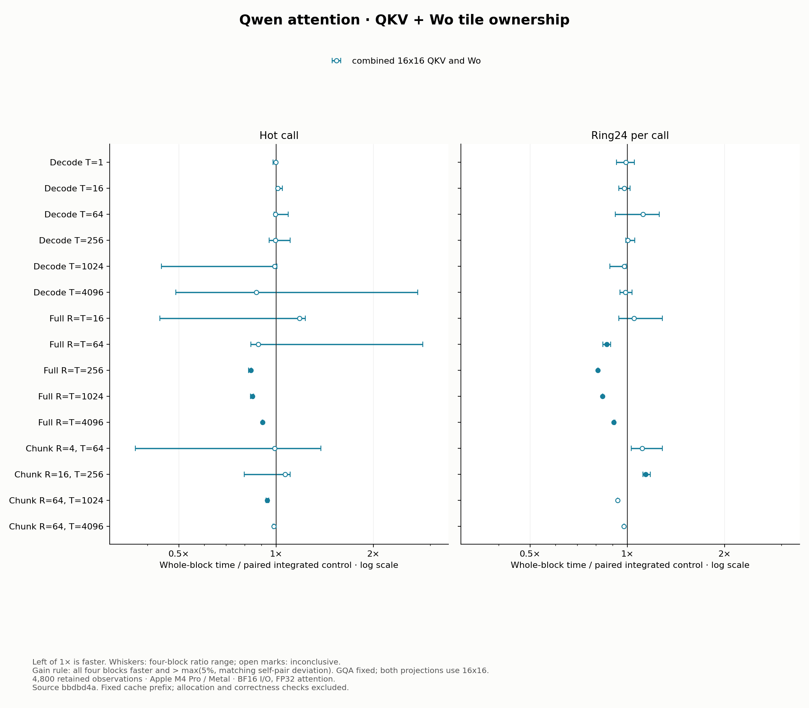

### Stage profiles after combining the projections

Eight separate Metal captures compare 9/18 at full 256, full 1024, full 4096
and chunk (64,4096). Each has ten warmups, followed by 25/25/10/25 measured
iterations respectively. All 1,530 measured dispatch durations are retained.
The analyzer validates the nine-stage order and joins any fragmented dispatch
intervals, excluding preemption and host gaps from active time. These single
captures diagnose stage cost; the paired unprofiled trials establish speed.

The combined variant's shares of **summed recorded active GPU time** are:

| Workload R, T | QKV + Wo | FP32 GQA | Other six stages |
|---|---:|---:|---:|
| Full 256, 256 | 62.65% | 22.06% | 15.29% |
| Full 1024, 1024 | 45.56% | 42.84% | 11.60% |
| Full 4096, 4096 | 22.88% | 70.78% | 6.34% |
| Chunk 64, 4096 | 8.54% | 88.82% | 2.64% |

These shares use all retained active durations within each capture, rather
than sums of stage medians. At full 1024, median QKV time changes from
1,388.542 to 978.583 microseconds and Wo from 1,089.125 to 761.917 microseconds.
GQA is 1,617.459 versus 1,637.084 microseconds. This is consistent with the
projection change and explains why the remaining cost is now more balanced.
At full 4096 and the long chunk, GQA is the dominant remaining stage; faster
projections have less influence on the full call.

Unchanged stages can vary between captures: full-256 GQA is 169.000 versus
181.666 microseconds despite identical GQA code. Do not interpret that as a
new GQA regression or subtract separately captured stage medians to reconstruct
whole-block latency. Instrumentation, execution conditions and scheduling can
vary; no optional occupancy, throughput or cache counters were analyzed.

Every capture reports a maximum target compiler-spill event size of 48 bytes.
There are 35 target events at full 256/1024 and the chunk, and 20 at full 4096,
for both variants. These are event counts and sizes across the target capture,
not measured spill traffic or a per-stage attribution. They neither prove
that the new projections are spill-free nor identify why the small-row
latency regresses.

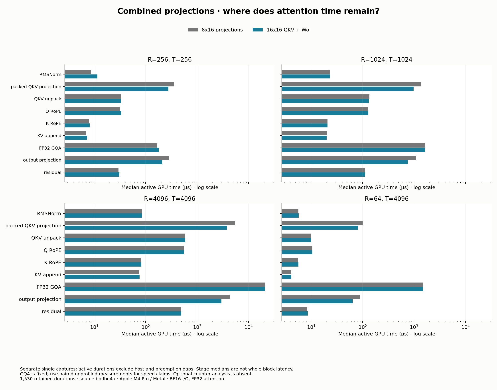

### What this establishes and where to focus next

The whole attention block has now been **validated, timed and profiled with
both winning projections enabled together**. It is a useful full-prefill
configuration on this hardware, with an explicit small-chunk regression that
prevents a universal replacement policy. Its default GQA and numerical policy
remain the same as the comparison control.

For full 256, projections still account for almost two thirds of active time.
At full 1024, projection work and GQA are comparable. Full 4096 and long cached
chunks make GQA the clearer next target. This is why another kernel experiment
should name its workload rather than assume one global attention bottleneck.

The earlier split8 study remains directly relevant to cached chunks: it already
showed large gains where these projection changes barely affect latency.
The [subsequent integration closure](#split8-with-both-projection-tiles-integration-closure)
now measures the combined projection policy with split8 against each component
configuration. Full-4096 GQA would still need its own bounded question, because
the earlier split8 comparison did not qualify there. These unsplit captures
remain historical evidence; neither experiment establishes a hardware ceiling.

## Projection tile ownership

The earlier integration profiles put QKV and Wo together at about 55% of
active time for full 1024. This experiment keeps the integrated FP32 GQA
control and changes one projection at a time. It compares the existing 8x16
Apple MMA mapping with 16x16 and 8x32 output tiles, then transfers only the
qualifying Wo tile to packed QKV. Every reported reduction is against a fresh
integrated control from this experiment.

One 32-lane SIMD group computes each tile. The original kernel uses two 8x8
MMA fragments; each new candidate uses four. All keep the same K-step of eight,
BF16 inputs/output, FP32 accumulators, and bias-before-output-rounding policy.
The new mappings add no shared staging, barriers or reduction split.

| Wo tile at R=1024, K=N=896 | SIMD groups | FP32 accumulator values/lane | Requested operand bytes/group/K-step | Total requested operands |
|---|---:|---:|---:|---:|
| 8x16 control | 7,168 | 4 | 384 B | 294 MiB |
| 16x16 | 3,584 | 8 | 512 B | 196 MiB |
| 8x32 | 3,584 | 8 | 640 B | 245 MiB |

The 16x16 tile shares each weight fragment across twice as many token rows;
8x32 shares each input fragment across twice as many output features. Thus
16x16 reduces requested operands per output by one third, and 8x32 by one sixth.
These counts exclude output/bias and describe source loads before caching;
they are not measured DRAM traffic. Accumulator counts do not identify physical
register allocation. No new profiler captures or hardware counters were collected.

### Two measurement boundaries select the tile

Each screen retains 1,920 observations at full 16/64/1024 and chunk (64,4096).
The isolated instrument supplies exactly the frozen BF16 attention tensor that
the selected upstream implementation passed to Wo, uses the same engine helper,
and times only Wo enqueue through completion. The whole-block instrument starts
at input normalization and ends after residual addition. Both include control
self-pairs, four paired blocks, ten warmups and ten samples per arm in hot and
ring24 modes. Ring24 Wo uses distinct weights and one shared frozen input.

The predeclared full-1024 result is:

| Candidate | Isolated Wo hot | Isolated Wo ring24 | Whole attention hot | Whole attention ring24 |
|---|---:|---:|---:|---:|
| 16x16 | 25.20% faster | 29.45% faster | 6.95% faster | 7.11% faster |
| 8x32 | 16.22% reduction, inconclusive | 18.48% faster | 4.22% reduction, inconclusive | 4.54% reduction, inconclusive |

Only 16x16 qualifies at both boundaries in both modes. The 8x32 hot isolated
result includes a reversed block; its whole-block reductions are below 5%.
The screen does not justify advancing it. Isolated and composed timings are
separate paired experiments, so their absolute times need not add up.

Smaller workloads give a useful counterexample: at full 16, isolated ring24 Wo
is **33.42% slower with 16x16 and 51.25% slower with 8x32**. At chunk (64,4096),
16x16 improves isolated ring24 Wo by 25.54%, but whole attention by only 1.16%,
an inconclusive change. Reuse alone does not establish a useful whole-block
mapping; parallel work and the cost of surrounding stages still matter.

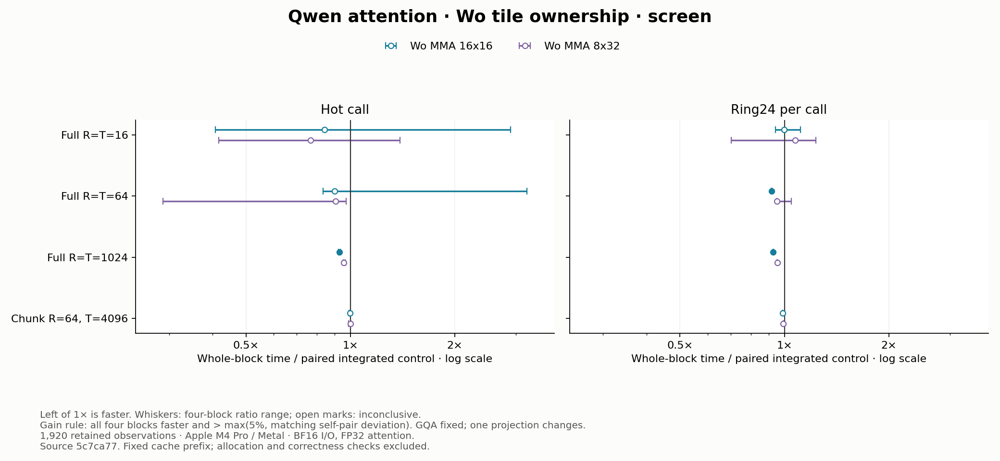
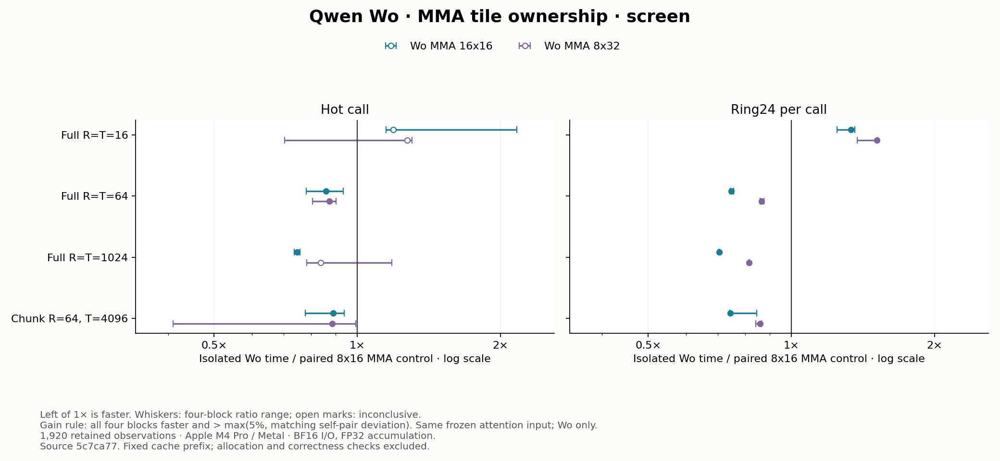

### The selected Wo tile across the full matrix

The conditional 4,800-observation comparison uses 16x16 Wo and retains 8x16
QKV. It finds **five faster and twenty-five inconclusive cells**, with no
qualifying whole-block regression. Full 256 improves by 7.12% hot / 7.89%
ring24, and full 1024 by 6.93% / 7.08%. Full 64 gains 7.88% in ring24; its
hot result is inconclusive. Full 4096 reductions of 3.94% / 4.04% remain below
the rule's 5% minimum. Neither cached chunk qualifies. Calls below sixteen
rows retain the same rowwise projection implementation in both arms.

This independently repeats the screen's full-1024 gain. It does not erase
the isolated small-row regression or justify a universal dispatch threshold.
Hot short-call calibration deviations reach 168% in this run; all such
observations remain in the evidence.

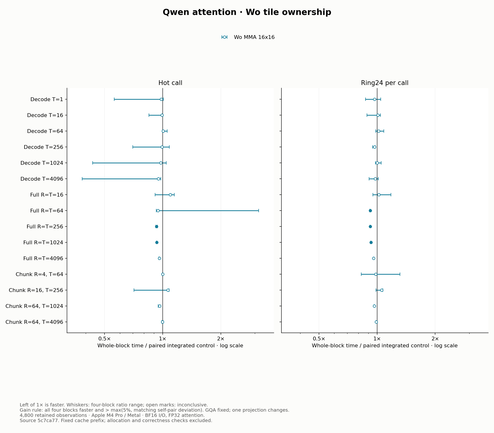

### Transfer to packed QKV

The same selected 16x16 tile then changes only QKV; Wo remains 8x16. This tests
reuse at N=1152 with bias and the existing packed-output copy/consumer handoff.
The 1,920 observations give seven faster and five inconclusive cells:

| New rows R | Visible positions T | Whole-attention hot reduction | Whole-attention ring24 reduction |
|---:|---:|---:|---:|
| 16 | 16 | -7.70%, inconclusive | -4.15%, inconclusive |
| 64 | 64 | -104.81%, inconclusive | 7.96%, faster |
| 256 | 256 | 10.37%, faster | 10.79%, faster |
| 1024 | 1024 | 7.83%, faster | 8.99%, faster |
| 4096 | 4096 | 5.15%, faster | 5.12%, faster |
| 64 | 4096 | 1.18%, inconclusive | 1.15%, inconclusive |

Positive values are reductions; negative values are increases. The large
full-64 hot increase is not a qualifying regression: its matching self-pair
deviation reaches 228.47%, and the result does not satisfy the four-block rule.
The full-4096 gains qualify but are only just above the 5% floor. All raw
observations and ranges are retained.

The projection lesson transfers for medium/long prefill. It is not a claim
that Wo and QKV gains add or multiply: this experiment never enables both new
tiles together. The explicit integrated options are `projection_mapping=1`
for Wo 16x16 and `projection_mapping=3` for QKV 16x16, each with control GQA.
Mappings 2/4 retain the 8x32 implementations for study; 8x32 QKV passed numerical
validation but did not advance to a performance comparison. Mapping zero is
the existing integrated control. None is an automatic workload selector.

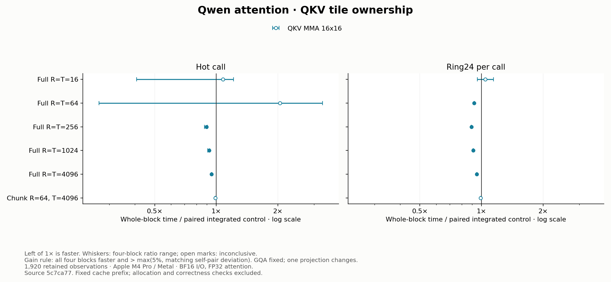

## Short-call timing and the split8 domain

### Deferring sample printing does not resolve the variation

Two separate control-only runs retain 480 observations each at full 16,
full 64 and chunk (64,1024). One prints after each sample; the other appends
elapsed values outside the timed region and prints after both arms. Both keep
the same enqueue-through-completion boundary and synchronizations. The table
shows the largest absolute deviation of a paired identical-kernel ratio from
one across four blocks, before applying the 5% decision floor:

| R, T | Original hot | Deferred hot | Original ring24 | Deferred ring24 |
|---|---:|---:|---:|---:|
| 16, 16 | 1.79% | 62.06% | 9.74% | 5.25% |
| 64, 64 | 71.56% | 259.10% | 0.33% | 0.37% |
| 64, 1024 | 2.02% | 44.77% | 0.09% | 0.17% |

Removing per-sample printing did not eliminate short hot-call variation in
this diagnostic. The two methods ran separately, so these deviations do not
prove that deferred output caused a regression, or identify the cause of the
historical variation. They do reject treating output buffering as an established
fix. Ring24 is steadier here except for the smallest workload. The split-domain
comparison therefore retains the original protocol and its own calibration;
no observations are discarded and no noisy cells are rerun.

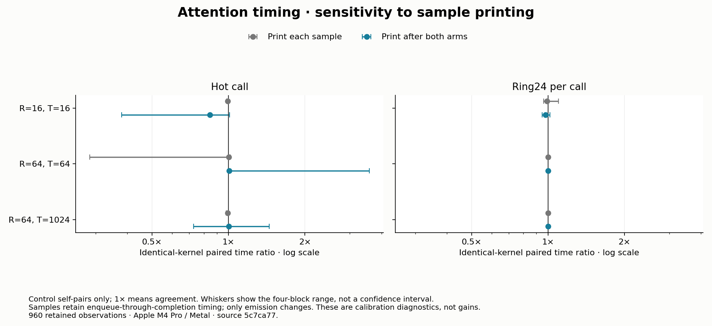

### Existing split8 across query size and context

This 1,920-observation comparison adds no GQA algorithm. It compares existing
unsplit BQ32 with existing split8, keeps both projections at the integrated
control, and includes the merge in whole-attention latency.

| New rows R | Visible positions T | Hot reduction | Ring24 reduction |
|---:|---:|---:|---:|
| 16 | 1024 | 43.45%, inconclusive | 54.55%, faster |
| 16 | 4096 | 62.79%, faster | 68.86%, faster |
| 64 | 1024 | 23.06%, faster | 31.65%, faster |
| 64 | 4096 | 39.72%, faster | 47.92%, faster |
| 256 | 1024 | 6.62%, faster | 7.69%, faster |
| 256 | 4096 | 14.66%, faster | 16.27%, faster |

Eleven cells qualify; the hot `(16,1024)` cell remains inconclusive with a
52.91% calibration floor. At `(64,4096)`, the fresh result closely reproduces
the earlier 39.69% / 47.96% reductions. The earlier hot `(64,1024)` result was
inconclusive; this run qualifies at 23.06% with its own lower calibration
floor. Both records remain valid observations of their respective sessions.

For R=16/64/256, unsplit BQ32 launches 14/28/112 primary query groups; split8
launches 112/224/896 primary groups plus a merge. At a fixed R, longer contexts
leave more scanning work for each unsplit group. At a fixed T, more query rows
already provide more groups without splitting. The measured pattern is
consistent with the parallelism hypothesis: gain is greatest at small R and
large T, and shrinks as R increases. These are source ownership counts and
whole-block observations, not measured occupancy or a proof of the limiting
hardware resource.

The grid supports split8 for the tested long cached chunks. It does not locate
an exact crossover between these points, cover arbitrary heads/batches, or
reverse the earlier full-64 regression and inconclusive full-1024/4096 results.
There is no automatic selector. The existing option remains `gqa_mapping=4`
with caller-owned `prefill_splits=8` workspace and control projections.

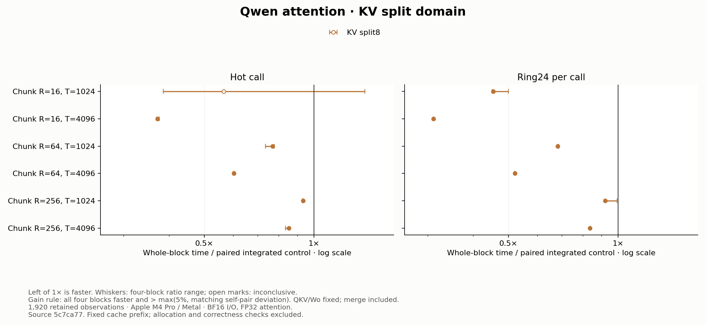

### Numerical validation and what to try next

The measured implementation passed **93 Mojo and 45 Python tests**, benchmark
route smoke checks, all seventeen frozen synthetic cases and three checkpoint
cases, and twelve asynchronous sequences for each of eighteen configurations.
Ragged/exact matrix tiles, bias-free output guards, packed QKV bias/layout,
full/chunked composition, poisoned scratch and 15/16/17-row transitions are
covered. Frozen arrays and all numerical limits are unchanged; cache checks
remain exact BF16 comparisons.

The [compact validation record](data/tiles_validation.json) binds the measured
source and preserves check counts and maximum scaled errors
`abs(got-want)/(1+abs(want))`. Across all three Wo mappings, isolated maxima
are 0.00390625 synthetic and 0.000235239 checkpoint. Across all five composed
projection choices, maxima are 0.005181347 / 0.001412429 for the projected
branch and 0.011627907 / 0.001379310 for the final output, respectively.
All are below the unchanged 0.03125 gate. Isolated QKV maxima are 0.00625
synthetic and 0.003225807 checkpoint, below 0.0078125. Equal recorded maxima
across mappings do not establish bitwise equality. The primary reference
remains the pinned upstream CPU inference policy described above.

Those results motivated the combined 16x16 QKV/Wo comparison completed above.
At the end of this separate-tile study, the combination was unmeasured; the
subsequent experiment retained small-row controls and full 4096 rather than
assuming that individual gains would combine. The combined report supplies
the fresh result and stage profiles.

For cached attention, the split-domain result makes split8 a useful additional
control for subsequent GQA optimization. Earlier smaller-query-tile losses and
mixed head-reuse/barrier results still apply; another candidate needs a specific
change to work ownership or live state and must beat the stronger split control
in its useful domain. More splitting is not implied by this result.

Before using short hot-call measurements to set a dispatch threshold, a bounded
follow-up should distinguish changes between arms from variation within an arm.
At full 64, the original diagnostic's arm medians span 376–1322 microseconds
while its worst within-arm relative median absolute deviation is only 2.99%;
with deferred output these are 365.5–1312.5 microseconds and 1.09%. More samples
within one stable arm alone may not resolve this. A predeclared interleaved-arm
and host-versus-device timing diagnostic would address that question. The
current data does not identify clock, scheduling or host overhead as the cause.

These were the proposed follow-ups at the end of the separate-tile study.
That study introduced no combined mapping or dispatch rule; the subsequent
combined comparison above completes the first integration question.

## GQA parallelism on the integrated block

This experiment changes how the existing fused FP32 GQA assigns work. Its
control already has FlashAttention-style query tiling, online softmax, a
rolled QK reduction, and FP32 PV. Packed QKV and the studied Wo mapping run in
both arms. Benchmark 9 is that integrated control; 10/11 use query tiles of
16/8, and 12/13 keep the 32-query tile with four/eight KV splits. The measured
unit still ends at the residual addition, including the split merge.

### Work ownership and storage

At `(R,T)=(64,4096)`, fourteen query heads and two 32-row query tiles expose
only 28 primary threadgroups. Each group streams the KV sequence. The two
candidate families create more independently schedulable groups in different
ways:

| Mapping | Primary threadgroups | Total primary SIMD groups | Shared storage per group |
| --- | ---: | ---: | ---: |
| BQ32 control | 28 | 112 | 16 KiB |
| BQ16 | 56 | 112 | 12 KiB |
| BQ8 | 112 | 112 | 10 KiB |
| BQ32, split4 | 112 | 448 | 16 KiB |
| BQ32, split8 | 224 | 896 | 16 KiB |

Smaller query tiles keep the aggregate SIMD-group count constant here. They
also share each K/V tile across fewer queries and load it in more threadgroups.
Splitting instead partitions whole 32-position KV tiles along a third grid
dimension while retaining the 32-query reuse. These are source-level ownership
and storage facts; group counts do not measure occupancy or memory bandwidth.

Each split writes an FP32 weighted numerator, maximum and denominator.
A second dispatch rescales the nonempty partials to a common maximum before
combining them. Empty causal pieces contribute zero mass. Only the final
attention output rounds to BF16, at the existing boundary before Wo.
The integrated block therefore has ten dispatches for split prefill, versus
nine for the control. Decode uses the same existing G32 route in every mapping.

Caller-owned scratch is contiguous `[R,14,S,66]` FP32. Eight splits allocate
**1.805 MiB at R=64, 28.875 MiB at R=1024, and 115.5 MiB at R=4096**; four
splits need half as much. These are allocation sizes, not measured DRAM traffic.
Allocation is outside enqueue and timing, and both arms share the same scratch
allocation. Select the measured eight-split path with
`AttentionWorkspace(..., fp32_materialized=False, prefill_splits=8)` and
`enqueue_attention_sublayer_integrated(..., gqa_mapping=4)`.
The default mapping remains the integrated BQ32 control; this bounded study
does not establish an automatic crossover across unmeasured shapes.

### Accuracy before timing

All five mappings passed the frozen upstream-input GQA comparisons and
full/chunked attention composition on 17 synthetic and three checkpoint cases.
The selected reference and every gate above remain fixed. Across the five
mappings, the largest observed scaled errors were:

| Boundary | Synthetic maximum | Checkpoint maximum | Fixed limit |
| --- | ---: | ---: | ---: |
| Isolated GQA | 0.00625000 | 0.00045683 | 0.0078125 |
| Projected branch | 0.00518135 | 0.00141243 | 0.03125 |
| Final residual output | 0.01162791 | 0.00137931 | 0.03125 |

Each mapping reached these same maxima; this does not assert bitwise equality
between mappings. The [validation record](data/parallelism_validation.json) retains
per-mapping counts, commands and source identities. All 510 frozen synthetic
arrays and 63 checkpoint arrays matched their hashes. The full workflow passed
**90 Mojo and 43 Python tests**, plus the maintained IR inspector, checkpoint
validation and twelve asynchronous 65-token sequences per configuration.

The standalone suite applies all mappings to 29 FP32 structural fixtures.
Coverage includes ragged tiles, future-token perturbations, exact cache/prefix
checks, poisoned partials, output guards, entirely empty causal pieces, and
a stable merge with maxima 1000/999. Missing split scratch rejects before
enqueue or cache mutation. Asynchronous calls cross the 15/16/17-row projection
boundary and finish with decode; every benchmark route also passes its actual
hot and ring24 correctness checks before timing.

### Screen and full workload matrix

The predeclared screen tests all four candidates at `(64,1024)`, `(64,4096)`
and full 1024, in both modes and four paired blocks. A gain requires every
block faster and median reduction above both 5% and the largest matching
control self-pair deviation. At the target `(64,4096)`:

| Candidate | Hot time / paired control | Ring24 time / paired control | Decision in both modes |
| --- | ---: | ---: | --- |
| BQ16 | 1.542x | 1.622x | Slower |
| BQ8 | 2.555x | 2.777x | Slower |
| Split4 | 0.650x | 0.567x | Faster |
| Split8 | 0.604x | 0.520x | Faster |

Across all 24 candidate/mode/workload cells, six qualify as faster, eleven
as slower and seven are inconclusive. Eight splits is the sole finalist:
both split candidates qualify at the target, and eight splits has the lower
worse-mode median ratio under the declared selection rule. There was no
direct paired split4-versus-split8 experiment. The smaller-query family did
not advance. All 2,400 observations remain in the
[screen record](data/parallelism_screen_run.json), [samples](data/parallelism_screen_samples.csv.gz)
and [derived table](data/parallelism_screen_summary.csv).

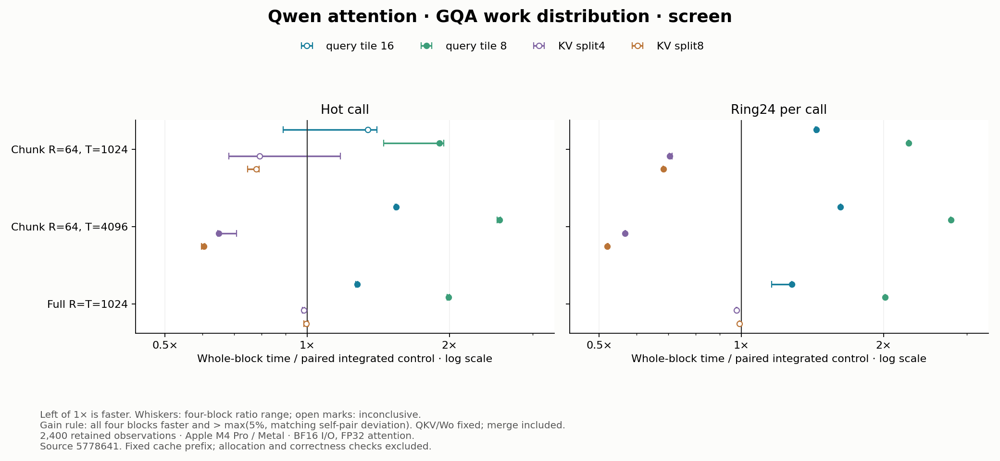

The independent full matrix compares eight splits with the integrated control
across all fifteen existing workloads, retaining 4,800 observations. Of thirty
workload/mode cells, **three qualify as faster, one as slower and twenty-six
are inconclusive**:

| Workload R,T | Hot latency reduction | Ring24 per-call reduction |
| --- | ---: | ---: |
| Decode T=1,16,64,256,1024,4096 | All inconclusive | All inconclusive |
| Full 16,16 | Inconclusive | Inconclusive |
| Full 64,64 | Inconclusive | **5.64% slower** |
| Full 256,256 | Inconclusive | Inconclusive |
| Full 1024,1024 | Inconclusive | Inconclusive |
| Full 4096,4096 | Inconclusive | Inconclusive |
| Chunk 4,64 | Inconclusive | Inconclusive |
| Chunk 16,256 | Inconclusive | Inconclusive |
| Chunk 64,1024 | Inconclusive | **31.63%** |
| Chunk 64,4096 | **39.69%** | **47.96%** |

For the target chunk, hot latency is **1.917 to 1.155 ms** and ring24 per-call
latency **1.949 to 1.014 ms**. Reductions use the median of within-block ratios;
the displayed absolute times are medians of block medians. These summaries
need not divide to exactly the same ratio.

Fifteen of thirty matching self-pair noise floors exceed 5%. Hot `(64,1024)`
shows a 23.16% point reduction but its 47.14% calibration floor leaves it
inconclusive. Several short hot cells have much larger variation; the maximum
floor is 255.70% at full 64. Those measurements cannot determine a crossover.
Decode executes the same G32 implementation in both arms and serves as a
control diagnostic. Full 1024 has only 1.29%/0.79% point reductions, while full
4096 has 1.27%/1.22% point slowdowns, all below their 5% decision floors.
No noisy cell was rerun to obtain a preferred outcome.

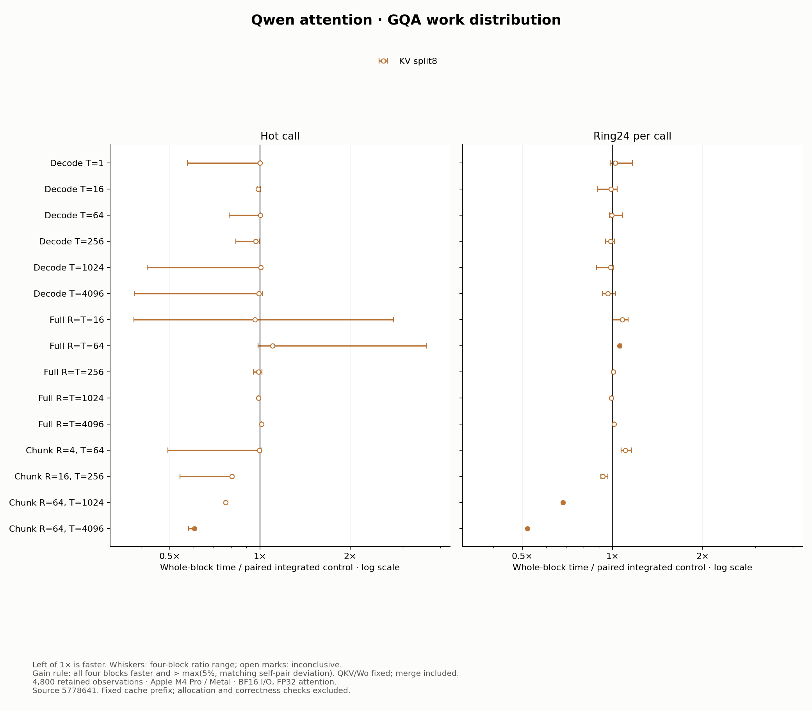

The [full record](data/parallelism_run.json), [samples](data/parallelism_samples.csv.gz)
and [derived table](data/parallelism_summary.csv) preserve every classification.
The run also binds the completed screen's hashes and selected finalist.

### What the split and merge cost

Four separate Metal captures compare control and split8 at the target chunk
and full 1024, with 25 measured iterations after ten warmups each. All 950
measured dispatch durations are retained and validated against the actual
enqueue sequence. Median active GPU durations are:

| R,T | Control GQA µs | Split kernel µs | Merge µs | Split plus merge µs |
| --- | ---: | ---: | ---: | ---: |
| 64,4096 | 1503.791 | 739.667 | 12.334 | 752.791 |
| 1024,1024 | 1612.125 | 1461.042 | 132.625 | 1589.376 |

The last column sums both stages within each iteration before taking the
median; it is not the sum of the two displayed medians. At the long chunk,
GQA including merge takes roughly half the control GQA duration. The merge
is 1.29% of total candidate active time, and GQA's combined share falls from
86.42% to 75.92%. At full 1024, merge consumes most of the split kernel's
saving. QKV and Wo together remain about 55% of active time in both captures.


The [capture record](data/parallelism_profiles.json), [raw dispatch durations](data/parallelism_profile_samples.csv.gz)
and [derived stage table](data/parallelism_profile_summary.csv) preserve the
instrumented evidence. Compiler spill events report maximum event sizes of
48 bytes for control and 64 for split8 in both workloads, with 35 target events
per capture including warmup. This increase coexists with the chunk latency
gain; compiler event sizes alone do not measure spill traffic or its cost.
Optional hardware counters were not exported or analyzed.

These profiles diagnose where time moves. They are separate instrumented
captures, so paired unprofiled latency establishes the performance claims.
Do not subtract active durations from unprofiled latency to infer host overhead.
The results support sequence parallelism for the measured long cached chunk;
they do not establish measured occupancy, a universal dispatch policy, or a
hardware ceiling.

## Integrating QKV and Wo with FP32 attention

The existing projection work now runs through one public Mojo entrypoint,
`enqueue_attention_sublayer_integrated`. It combines packed QKV, the studied
Wo mapping, and the validated FP32 GQA paths through the residual addition.
This addresses a composition gap: the earlier attention experiments kept
Q/K/V as three separate rowwise projections even though faster projection
kernels were already available.

| New rows R | QKV | GQA | Wo |
| --- | --- | --- | --- |
| 1 | Packed rowwise | FP32 G32 decode | Rowwise |
| 2–15 | Packed rowwise | FP32 rolled MMA prefill | Rowwise |
| 16–4096 | Packed 8×16 MMA | FP32 rolled MMA prefill | Bias-free 8×16 MMA |

Sixteen rows is a conservative policy fixed before measurement, not a proven
optimal crossover across unmeasured sizes. The previous split64-H4 decode
mapping remains explicit; the earlier study did not establish a direct
G32/split crossover. The original enqueue and separate mappings remain useful
controls.

Packed projection produces `[R,1152]` with per-token `[Q | K | V]` ordering.
The new copy dispatch preserves BF16 bits while producing contiguous Q, K,
and V for the existing RoPE and cache consumers. Both its enqueue and execution
are included in timing. The block now has nine dispatches: RMSNorm, packed
QKV, unpack, Q RoPE, K RoPE, cache append, GQA, Wo, residual. GQA output still
rounds to BF16 before Wo; Wo output rounds to BF16 before the residual.

The copy requests 4×R×1152 bytes including reads and writes: 18 MiB at R=4096.
This is source-requested traffic, not measured DRAM traffic. Packed and
contiguous diagnostic buffers remain allocated. The integrated entrypoint can
use `AttentionWorkspace(..., fp32_materialized=False)`, avoiding the original
896 MiB probability allocation at full 4096, apart from a four-byte sentinel.
All allocation remains outside enqueue and timing. The combined 9-versus-3
comparison retains the baseline scratch allocation for both timing arms; the
storage saving is available when the integrated entrypoint is used alone.

### The additional value of the projection work

The first fresh paired comparison fixes GQA and Wo to the policy above in both
arms. Control 8 keeps separate rowwise Q/K/V; candidate 9 calls the integrated
entrypoint. Thus it measures QKV packing/tiling and the layout copy together,
with the previously optimized surrounding block as its control.

All 4,800 observations are retained from clean source `dc77016`. Across thirty
workload/mode comparisons, **19 qualify as faster, 11 are inconclusive, and
none qualify as slower**. All five full-prefill sizes qualify in both modes.
The `(16,256)`, `(64,1024)`, and `(64,4096)` chunks also qualify in both modes;
`(4,64)` is inconclusive.

| Workload | Hot reduction | Ring24 reduction |
| --- | ---: | ---: |
| Full R=T=16 | 37.03% | 25.68% |
| Full R=T=64 | 60.73% | 68.57% |
| Full R=T=256 | 70.98% | 73.59% |
| Full R=T=1024 | 70.20% | 70.67% |
| Full R=T=4096 | 58.54% | 58.53% |
| Chunk R=64, T=4096 | 24.19% | 23.97% |

The full-1024 hot paired control/candidate medians are 15.800 → 4.711 ms;
full-4096 hot is 79.796 → 33.080 ms. Reductions use the median of within-block
ratios; displayed times are medians of block medians. Their ratio need not
match the paired reduction, particularly in noisy short calls.

Decode qualifies only at hot T=1 (11.61%), hot T=256 (12.71%), and ring24 T=64
(10.26%). The remaining nine decode cells are inconclusive. The full-context
decode point estimates improve by 8.67% hot and 9.27% ring24, but their matching
noise floors are 35.63% and 33.05%. They do not support speed claims. This is
consistent with keeping the earlier packing result scoped to its measured
operation, rather than assuming it transfers equally to every complete call.

At fixed R=64, the median of the four paired ring24 latency savings is
619.72 µs at T=64, 623.81 µs at T=1024, and 617.89 µs at T=4096. The nearly
constant absolute saving, despite the shrinking percentage, fits the intended
mechanism: projection dimensions depend on new rows R, while attention also
grows with cached context T.

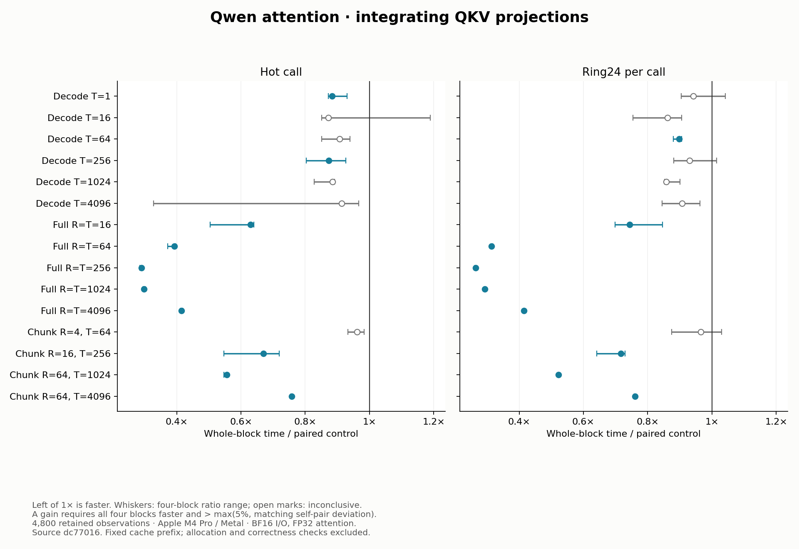

[Complete paired table](data/projections_summary.csv), [run](data/projections_run.json),
and [all raw samples](data/projections_samples.csv.gz) retain calibration, ratios,
absolute timings, runtime identity, and block conditions.

### Combined gain over the original attention baseline

The second fresh comparison pairs integrated entrypoint 9 with original
variant 3: materialized FP32 GQA and separate rowwise Q/K/V and Wo. It measures
all selected mappings together through the residual addition. It retains
4,800 observations from the same clean source and finds **26 faster, four
inconclusive, and zero slower** workload/mode decisions.

| Workload | Original → integrated hot latency | Hot reduction | Ring24 reduction |
| --- | ---: | ---: | ---: |
| Decode R=1, T=4096 | 2.482 → 0.262 ms | 89.43% | 91.57% |
| Full R=T=1024 | 38.505 → 4.736 ms | 87.70% | 88.06% |
| Full R=T=4096 | 349.351 → 33.022 ms | 90.55% | 90.58% |
| Chunk R=64, T=4096 | 9.757 → 1.921 ms | 80.34% | 79.73% |

All full-prefill cases qualify in both modes. The four inconclusive cells are
hot decode T=1 and T=16, plus both `(4,64)` chunk modes. Hot T=16 has a favorable
median ratio but one block reverses direction, so it fails the rule. Short-call
variation is retained rather than hidden. [The complete table](data/integrated_summary.csv)
contains every ratio, matching calibration threshold and absolute time.

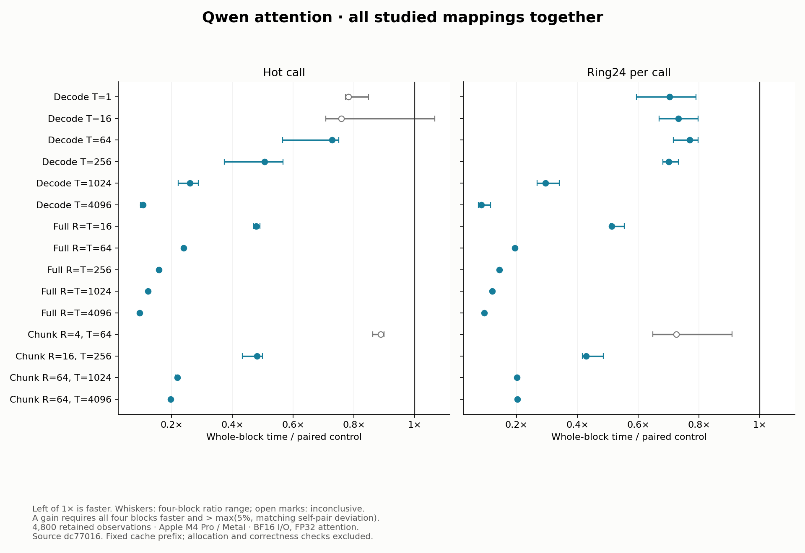

The [run](data/integrated_run.json) and [raw observations](data/integrated_samples.csv.gz)
record hardware/software, source/binary/input hashes, both arm orders, runtime
Metal identity, and conditions before/after each block. Both timing runs use
four blocks, ten warmups and ten samples per arm; AC power, power mode 0 and
no reported thermal warning. The environment is macOS 26.6.2, Xcode 26.6,
Mojo 1.0.0 and MAX 26.5.0. The fixed prefix and ring24 meaning remain as
described in the baseline: two sign patterns across 24 distinct allocations,
not a 24-layer model. Checkpoint inputs establish correctness separately.

### Numerical and data-flow checks

The integrated implementation passed **87 Mojo tests and 41 Python tests**,
all 510 frozen synthetic arrays, and 63 frozen arrays for three existing
checkpoint-derived first-layer cases. Both packed kernels consume exactly
the upstream normalized tensor in isolated tests. Composition then starts
from original X, including candidate-generated cache prefixes, full/chunked
prefill, final decode and reset. All tolerances remain unchanged.

| Check | Maximum synthetic scaled error | Maximum checkpoint scaled error | Fixed limit |
| --- | ---: | ---: | ---: |
| Isolated packed QKV, both mappings | 0.006250 | 0.003226 | 0.0078125 |
| Integrated projected branch | 0.005181 | 0.001412 | 0.03125 |
| Integrated final output | 0.011628 | 0.001379 | 0.03125 |

Scaled error is `abs(got-want)/(1+abs(want))`. The existing isolated GQA gate
remains 0.0078125. The branch is checked separately so the residual cannot
conceal its error. Cache prefix, appended source bits and unused capacity
are exact checks. The new multi-row handoff regression checks signed zeros,
subnormals, extreme BF16 patterns and guard elements. Projection intermediates
are poisoned in composition tests. The actual benchmark routes pass hot and
ring24 checks, including both sides of the 15/16-row boundary.

Twelve asynchronous 65-token sequences pass for each of ten configurations.
The new control and integrated configurations exercise 15,16,17,16,1-row calls
on the same stream with reusable buffers and no materialized probability
storage. [integrated_validation.json](data/integrated_validation.json) retains the
commands, source hashes, counts and numerical maxima. No kernel, precision
policy or threshold was retuned after the paired measurements started.

### Where time goes after integration

Eight separate captures compare control 8 and integrated entrypoint 9 at four
workloads. All 2,090 measured dispatch durations are retained; 37 segmented
dispatches were coalesced using validated command identities, excluding
preemption gaps before stage assignment. The table reports median active GPU
time in microseconds. QKV totals are summed within each measured iteration
before taking the median, so the layout copy is included correctly.

| R,T | Separate QKV total µs | Packed QKV + unpack µs | Unpack alone µs | Integrated GQA share of active time |
| --- | ---: | ---: | ---: | ---: |
| 1,4096 | 133.52 | 81.04 | 12.69 | 55.85% |
| 1024,1024 | 12576.79 | 1523.92 | 133.83 | 35.63% |
| 4096,4096 | 52539.86 | 6103.48 | 591.50 | 64.21% |
| 64,4096 | 733.79 | 113.88 | 10.13 | 86.39% |


Unpack accounts for 2.47%, 2.96%, 1.81% and 0.56% of recorded active time in
those four integrated captures respectively. Its cost is visible but small.
At full 1024, packed QKV itself is 30.59% and Wo is 23.97%; projections together
still account for about 55% of active time. At full 4096 their combined share
falls to about 30%, while GQA is 64%. The long cached chunk is much more
strongly dominated by GQA.

These are instrumented diagnostics, not additional paired speed claims.
In particular, decode's instrumented active durations are larger than its
unprofiled whole-call timing; they cannot be subtracted from that timing to
estimate CPU overhead. The unchanged GQA/Wo stages are similar in these
control/candidate captures, but profiling and clock effects remain possible.
Use the latency experiments for the gains and the profiles for work ownership
and remaining stage costs.

Both prefill variants report a maximum compiler spill event of 48 bytes,
with 35,20,35 target events for full 1024, full 4096 and the long chunk. Neither
decode capture reports a target spill event. These event sizes/counts are
compiler evidence, not measured spill traffic or proof of a bottleneck.
Optional counter analysis is absent. [The profile table](data/integrated_profile_summary.csv),
[record](data/integrated_profiles.json), and [all dispatch samples](data/integrated_profile_samples.csv.gz)
retain the evidence and capture conditions.

## Baseline whole-block latency

These are control-arm medians of four block medians, in milliseconds per
sublayer. Both timing arms run the same implementation, providing noise
calibration rather than an optimized comparison.

| Workload | R | T | Hot | Ring24 per call |
| --- | ---: | ---: | ---: | ---: |
| Decode | 1 | 4096 | 2.494 | 2.689 |
| Full prefill | 1024 | 1024 | 39.127 | 39.037 |
| Full prefill | 4096 | 4096 | 355.793 | 355.288 |
| Cached chunk | 64 | 4096 | 9.590 | 9.597 |


The complete 15-shape matrix and calibration ranges are in [summary.csv](data/summary.csv).
Keep the short cases in perspective: the largest self-pair deviations were
177.3% for hot `(1,64)`, 171.4% for hot `(4,64)` and 54.4% for hot `(16,16)`.
All samples are retained. These points cannot support small optimization
claims under this run's decision rule. Open plot marks identify self-pair
variation above 5%. The four workloads in the table retained the 5% minimum
decision threshold in both modes. Future comparisons need fresh matching
calibration; this run's calibration must not be imported into another run.

## Where the baseline GPU time goes

The following percentages divide a stage's total recorded active duration
by the total active duration in that same capture. They are not percentages
of the separate host-to-completion latency measurement.

| Workload | Main active GPU work | Median stage durations |
| --- | --- | --- |
| Decode `(1,4096)` | Softmax 48.1%, PV 46.5% | 1.110 ms, 1.009 ms |
| Full `(1024,1024)` | All four projections 58.3%; Q 25.6%, Wo 25.4% | Q 9.813 ms, Wo 9.725 ms |
| Full `(4096,4096)` | QK 40.5%, PV 28.6% | 143.409 ms, 101.088 ms |
| Chunk `(64,4096)` | PV 39.9%, QK 31.8%, softmax 14.8% | 3.833 ms, 3.088 ms, 1.429 ms |

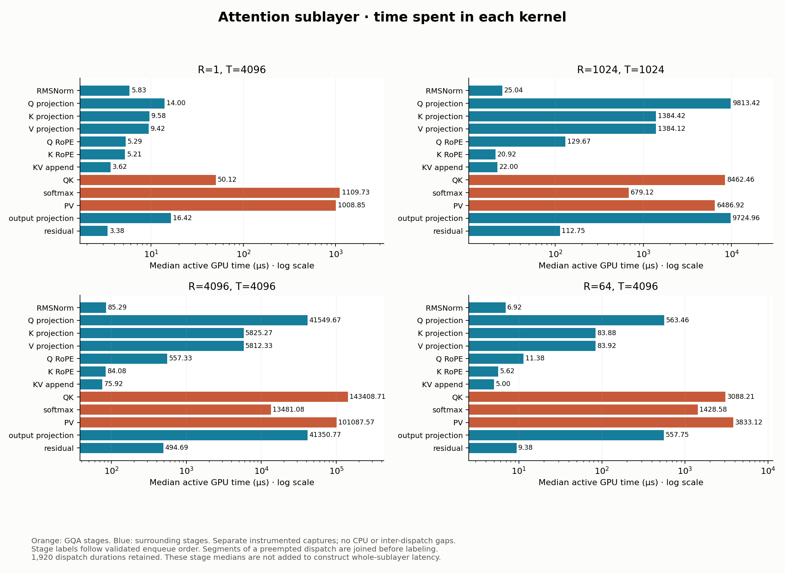

The [stage table](data/profile_summary.csv) retains medians and ranges. Each
shape has one separate instrumented capture, with 100, 25, 10 and 25 measured
iterations respectively. Stage names follow verified enqueue order. Instruments
fragmented 54 full-context and 17 chunked dispatches; their execution segments
were joined before assigning stages. Durations exclude preemption and host gaps.
Adding these stage medians would not reconstruct whole-block latency.

The source explains why one optimization will not solve every workload:

- QK assigns one score to a thread; PV assigns one output component to a
  thread. Their serial reduction work grows with the visible key count.
- Softmax assigns an entire row to one thread. Decode has only fourteen
  active softmax threads, each scanning up to 4096 scores. More query rows
  provide more independent softmax work, changing its relative importance.
- Each baseline projection uses one SIMD group per output dot product.
  It does not yet use the existing prefill mapping that reuses an input tile
  across several output columns and rows.

Device-wide counter medians reinforce this as a hypothesis rather than a
per-kernel diagnosis: decode's Kernel Occupancy was 1.46%, while full-1024
prefill was 58.61%. The corresponding Last Level Cache Limiter medians were
2.25% and 100%. These samples cover the enclosing target window, include
other GPU activity and are not measured DRAM bandwidth. No target compiler
spill event was reported in these four captures; this is a capture-bounded observation.

Full-4096 optional counter analysis is explicitly unavailable. Its XML export
was stopped after growing beyond 4 GiB, because the existing analyzer loads a
whole table into memory. The original trace and complete stage-timing exports
are preserved externally. No partial counter XML contributes to the report,
and the absent counter summaries are not recorded as zero.

## Work and storage

The number of visible query-key pairs per head is
`C = R(T-R) + R(R+1)/2`. The reference allocates `4*14*R*T` bytes for FP32
scores, overwritten in place by probabilities. QK plus PV performs roughly
`4*64*14*C` floating-point operations; the four projections perform
`2*R*896*(1152+896)`. Softmax, masking and elementwise operations are additional.

| R | T | FP32 scratch | Projection GFLOPs | QK+PV GFLOPs |
| ---: | ---: | ---: | ---: | ---: |
| 1 | 4096 | 224 KiB | 0.00367 | 0.01468 |
| 1024 | 1024 | 56 MiB | 3.758 | 1.881 |
| 4096 | 4096 | 896 MiB | 15.032 | 30.072 |
| 64 | 4096 | 14 MiB | 0.235 | 0.932 |

Weights, norm and biases occupy 3,674,112 bytes per ring entry; both KV caches
together occupy `512*T` bytes. These are source-derived counts and allocated
storage, not measured memory traffic. The materialized FP32 path is an
inspectable accuracy baseline with a substantial memory cost.

## Contained Wo results

Wo is the learned, bias-free matrix that mixes the fourteen heads' outputs
back into the hidden state: `A[R,896] @ Wo[896,896].T`. The candidate changes
only how that matrix multiplication is assigned to the GPU. Both versions
accumulate in FP32 and round to BF16 before the existing residual addition.
The attention precision policy, other projections, cache, buffers and twelve
dispatches remain fixed. `wo_mma=True` selects the candidate; benchmark IDs
3 and 4 distinguish rowwise and MMA Wo while both execute GQA route 3.

The rowwise mapping assigns one output dot product to a 32-lane SIMD group,
with one FP32 accumulator per lane and a final group reduction. The MMA
mapping assigns an 8×16 output tile to that group, using two distributed 8×8
matrix fragments per K=8 phase and four FP32 accumulators per lane. It reuses
operands across rows and output columns without shared operand storage or
block barriers. At R=1024 this changes 917,504 rowwise groups into 7,168 tile
groups. These counts describe work ownership, not measured memory traffic.

### Accuracy and screening

All existing numerical gates passed: GQA `atol=rtol=0.0078125`, Wo/projected
branch/final output `atol=rtol=0.03125`, and exact BF16 cache bits. No tolerance
changed. Each isolated Wo comparison consumes the exact upstream BF16
attention tensor; full and chunked comparisons start from the original X.
The [validation record](data/wo_validation.json) retains the commands, source
hashes and individual comparisons.

| Dataset | Maximum isolated Wo scaled error | Maximum composed branch error | Maximum residual output error |
| --- | ---: | ---: | ---: |
| 17 synthetic cases | 0.00390625 | 0.00516796 | 0.00781250 |
| 3 checkpoint cases | 0.00023524 | 0.00141243 | 0.00137931 |

Scaled error is `abs(got-want)/(1+abs(want))`. The complete workflow passed
81 Mojo tests and 38 Python tests and verified all 510 frozen synthetic arrays.
The existing checkpoint prefix reproduced its 63 arrays. Normal asynchronous
execution passed twelve 65-token sequences on each of five configurations,
including the new mapping. Both benchmark arms additionally poison the actual
cache suffix and attention/projected/output buffers, then check the projected
branch, final output and exact cache prefix/suffix for every distinct layer
allocation before timing.

The five-shape [screen](data/wo_screen_summary.csv) retained 1,600 observations.
Its six prefill workload/mode gains met the predeclared advancement rule, so
the candidate proceeded to the full matrix with fresh self-pair calibration.
The screen is selection evidence; the following results come from that full run.

### Whole-block comparison

Across thirty workload/mode comparisons, **13 are faster, 15 inconclusive and
2 slower** under the existing four-block rule. A gain requires all four paired
blocks to be faster and their median reduction to exceed the larger of 5%
and matching self-pair variation. The [complete table](data/wo_summary.csv) includes
both arms, all ratios, calibration thresholds and decisions.

| Full prefill R=T | Hot latency reduction | Ring24 per-call reduction |
| ---: | ---: | ---: |
| 16 | Inconclusive | 23.66% |
| 64 | 31.99% | 32.44% |
| 256 | 31.17% | 31.24% |
| 1024 | 22.49% | 22.56% |
| 4096 | 10.43% | 10.43% |

For full 1024, paired-control and candidate medians are 38.409 → 29.774 ms
hot and 38.267 → 29.627 ms ring24. For full 4096 they are 348.731 → 312.373 ms
hot and 354.276 → 317.393 ms ring24. These are medians of block medians;
reported reductions use the paired block ratios, not the ratio of those
displayed medians.

Decode establishes no gain. Hot T=16 is 11.91% slower and hot T=1024 is
5.03% slower; the other ten decode comparisons are inconclusive. Some short
hot self-pairs vary substantially, reaching about 190%. All observations are
retained, including hot full-16's inconclusive result despite its lower median.

For chunked prefill, `(16,256)` improves 15.98% in ring24; `(64,1024)` improves
15.37% hot and 13.94% ring24. At `(64,4096)` hot improves 6.02%, but ring24's
4.97% reduction is inconclusive under the fixed 5% floor. That last cell had
barely qualified in the screen, illustrating why screening does not replace
confirmation. Both `(4,64)` modes and hot `(16,256)` are inconclusive.


### What changed inside the block

The eight separate stage captures compare both mappings at four workloads.
These are median active GPU durations in microseconds, useful for diagnosing
the change. They are not paired latency measurements.

| R | T | Rowwise Wo µs | MMA Wo µs |
| ---: | ---: | ---: | ---: |
| 1 | 4096 | 15.958 | 44.917 |
| 1024 | 1024 | 9724.230 | 1088.854 |
| 4096 | 4096 | 40667.333 | 4303.666 |
| 64 | 4096 | 559.417 | 89.938 |


Wo becomes roughly nine times faster in the two full-prefill captures, while
the surrounding stage medians remain similar. Its work grows with R; QK/PV
work grows with R and the visible context. This explains why the whole-block
benefit decreases at long context even though Wo improves substantially.
The 896 MiB FP32 scratch allocation at full 4096 is unchanged.

At R=1, Wo itself takes about 2.8 times longer. Only one of the MMA tile's
eight rows is useful, and it exposes 56 groups versus 896 rowwise groups.
The unused row capacity and smaller pool of independent groups are consistent
with the slowdown; this experiment does not isolate their individual costs.
The result argues against an unconditional MMA default. It does not establish
a general dispatch threshold.

In the MMA-Wo captures, stage shares of **total recorded active GPU time** are:

| Workload | Remaining main stages | Wo share |
| --- | --- | ---: |
| Decode `(1,4096)` | Softmax 48.7%, PV 44.6% | 2.0% |
| Full `(1024,1024)` | Q projection 33.1%, QK 28.6%, PV 21.9% | 3.7% |
| Full `(4096,4096)` | QK 45.2%, PV 32.0% | 1.4% |
| Chunk `(64,4096)` | PV 41.2%, QK 34.8%, softmax 14.3% | 1.0% |

These shares use summed raw durations within each capture. They do not divide
by host-to-completion latency, and stage medians are not added to reconstruct
whole-block time. The [profile table](data/wo_profile_summary.csv) retains ranges.
No target compiler spill event was reported in these captures; that does not
prove every invocation is spill-free. Optional counter tables were not exported
or analyzed for this comparison; missing values are not zero.

## Contained FP32 decode results

The two candidates change GQA ownership while retaining FP32 scaled scores,
online softmax state, weights and accumulation. BF16 Q/K/V, cache and output,
rowwise Wo and all surrounding stages remain fixed. G32 divides a head's
sequence among 32 SIMD groups and merges inside one threadgroup; split64-H4
uses 64 sequence pieces and shares K/V across up to four related query heads,
then launches a separate merge. See the [predeclared design and gates](plans.md#contained-fp32-decode-comparison).

### Accuracy and discrimination

The full workflow passed **83 Mojo tests and 39 Python tests**, verified all
510 frozen synthetic arrays and reproduced 63 checkpoint arrays. Twelve
asynchronous 65-token sequences passed on each of seven configurations,
including both candidates without materialized scratch. All numerical gates
and exact cache requirements remain unchanged.

There are 408 strict comparisons against the pinned upstream FP32 attention
outputs using exact upstream Q/K/V at predefined cache prefixes. The largest
scaled error is 0.003649635 for synthetic inputs and 0.00012019231 for checkpoint
inputs, within the 0.0078125 GQA gate. Existing standalone edge fixtures add
NaN guards, tied and extreme scores, ragged/empty splits, cancellation and head
mapping checks against materialized FP32 Mojo. Those supplement the primary
upstream comparison. [decode_validation.json](data/decode_validation.json) retains
all commands, hashes and numerical results.

A diagnostic probe on existing hard seed 887 changes only the isolated decode
comparison back to the older BF16 score boundary. It fails 24 of 30 strict
prefix checks, with maximum scaled error 0.1813063; the FP32 version passes all
30, maximum 0.002020202. This shows the checks distinguish the agreed precision
policy. It does not make the historical BF16 policy invalid for every backend.
Composition gates also pass for all synthetic/checkpoint cases and R>1 fallback.

### Whole-block comparison

Seven of eight candidate screening comparisons qualified, advancing the fixed
three-way matrix. The full run uses fresh self-pair calibration and retains
**13 faster, 11 inconclusive and zero slower** decisions across 24 comparisons.
G32 accounts for eight gains and split64-H4 for five. The candidates are each
paired against materialized FP32; they are not paired directly with one another.
No G32/split crossover or default selector follows from this experiment.

| T | G32 hot reduction | G32 ring24 reduction | Split64-H4 hot reduction | Split64-H4 ring24 reduction |
| ---: | ---: | ---: | ---: | ---: |
| 1 | 13.62% | 14.27% | 17.40% | Inconclusive |
| 16 | Inconclusive | Inconclusive | Inconclusive | Inconclusive |
| 64 | Inconclusive | 16.73% | Inconclusive | Inconclusive |
| 256 | Inconclusive | 24.16% | Inconclusive | Inconclusive |
| 1024 | 66.74% | 65.40% | 68.65% | 61.42% |
| 4096 | 88.79% | 90.67% | 88.97% | 89.47% |

At T=4096, G32 paired-control/candidate medians are 2473.250 → 274.750 µs hot
and 2680.635 → 250.479 µs ring24 per call. Split64-H4 has separate paired
controls: 2492.000 → 274.500 µs hot and 2693.865 → 283.875 µs ring24.
Reported reductions use paired block ratios; the displayed times are medians
of block medians. Their ratio need not equal the paired result. The complete
[table](data/decode_summary.csv) includes all four ratios, absolute times and rules.

Short hot cases remain noisy: matching self-pair thresholds reach 105.2% at
T=16, 163.8% at T=64 and 46.2% at T=256. All samples are retained. For example,
G32 hot T=256 has a 42.56% median paired reduction but is inconclusive because
it does not exceed its matching calibration threshold.


### What the profiles establish

At T=4096 the materialized control spends 94.5% of its total recorded active
GPU time in serial softmax/PV. Their stage medians are 1108.959 and 1002.812 µs.
The fused candidates distribute that sequence work and retain online FP32
state instead of scanning a materialized score/probability array. Their whole
block executes 10 dispatches (G32) or 11 (split64), versus 12 for the control.
A production single-row call needs no quadratic scratch for these routes;
the comparison instrument still allocates its common control scratch outside
timing, so it does not measure an allocation benefit.

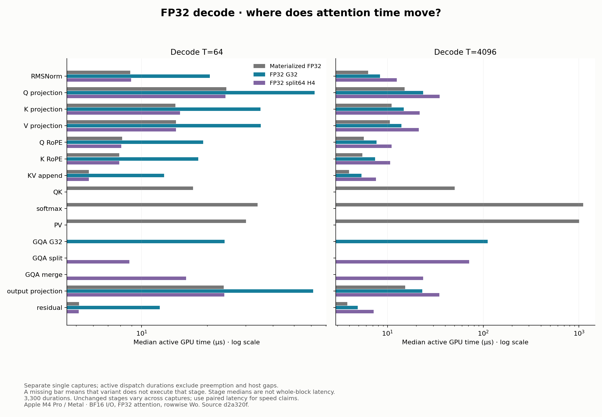

These separate captures have significant variation in unchanged stages:
Q projection at T=4096 has medians 15.146, 23.604 and 35.145 µs for control,
G32 and split64 respectively. A few large durations also distort summed stage
shares: G32 T=64 K projection has a 35.126 µs median but a 2113.541 µs maximum.
The [profile table](data/decode_profile_summary.csv) retains every range. All
captures passed provenance and exact dispatch-sequence checks; eight measured
control T=4096 dispatches had segmented execution and were coalesced before
stage assignment. No target spill event was reported; optional counters were
not analyzed. Power/thermal checks passed but do not pin clocks or identify
the cause of cross-capture variation.

Consequently the profiles support a qualitative change in remaining work:
projections and other stages become material once the long serial attention
passes disappear. They do not support a precise cross-capture kernel speedup,
a direct candidate ranking, or summing medians to reconstruct block latency.
The paired measurements establish the speed claims.

## Contained FP32 prefill results

This comparison changes only GQA, with the earlier MMA Wo mapping fixed in
both arms. Benchmark 4 uses materialized FP32 attention; benchmark 7 uses the
FP32 adaptation of the earlier 32×32 rolled-QK MMA design. The measurements
are whole attention calls from RMSNorm through residual, not isolated GQA.
They do not multiply or inherit the separate Wo experiment's speedups.

### What the tile changes

A threadgroup owns one query head and 32 query rows. Its four SIMD groups
each own eight rows, with sixteen FP32 output accumulator variables per lane. It
streams 32 keys/values at a time, reusing the shared K/V tile across its
query rows. Matrix operations calculate QK and PV; online maximum,
denominator and numerator state carry information between KV tiles.
For R=4096 there are 14×128=1,792 threadgroups. That is a work-ownership
count, not measured occupancy.

The candidate preserves the prior rolled QK loop and four barriers per KV
tile. Q/K operands remain BF16 with FP32 accumulation, and the scaled score
stays FP32. Tile weights also remain FP32 through PV. Stored BF16 V is widened
losslessly for the FP32 PV matrix operation; only final attention output
rounds to BF16. This preserves the agreed precision policy while changing
reduction order and online normalization.

Shared K/V storage totals 8 KiB and FP32 scores/weights another 8 KiB, for
16 KiB per block versus the older BF16-weight mapping's 14 KiB. The new path
needs no global score/probability matrix: at full R=T=4096 this removes the
requirement for 896 MiB of attention scratch. The comparison instrument still
owns the common control scratch outside timing; it does not measure allocation
savings. Avoiding that matrix also does not mean every input is read only once.

Sublayer route 6 is explicit: R>1 launches tiled FP32 prefill and R=1 launches
FP32 G32, returning actual route 6 or 4 respectively. Both work without
materialized scratch. Wo is selected independently; the prefill benchmark
requires R>1 and fixes MMA Wo in both arms. Public defaults remain route 3 and
rowwise Wo; no automatic crossover is introduced.

### Numerical results

The full workflow passed **86 Mojo tests and 40 Python tests**, verified all
510 frozen synthetic arrays, and reproduced all 63 checkpoint arrays. The
new isolated operation passed 42 synthetic and nine checkpoint comparisons
on exact upstream Q/K/V, including full and suffix attention. Compositions
from original X pass with both Wo mappings and exact cache checks.

| Dataset | Maximum GQA scaled error | Maximum composed branch error | Maximum residual output error |
| --- | ---: | ---: | ---: |
| Synthetic | 0.00625000 | 0.00516796 | 0.00781250 |
| Checkpoint | 0.00045683 | 0.00141243 | 0.00137931 |

The attention gate remains 0.0078125; branch/final gates remain 0.03125.
Scaled error is `abs(got-want)/(1+abs(want))`. Existing standalone prefill
fixtures add 29 edge cases checked against materialized FP32 Mojo, supplementing
the pinned upstream authority. All pass twelve poisoned-output repetitions in
normal execution, along with causal future perturbation and full/suffix tests.
An 8×8 FP32 identity product with non-BF16-representable operands returns zero
maximum error, guarding against silently narrowing matrix operands.

Twelve asynchronous 65-token sequences pass on eight composed configurations.
The new route uses 33,31,1-row calls without intermediate synchronization or
materialized scratch; the previous seven configurations keep their decode
coverage. [prefill_validation.json](data/prefill_validation.json) retains commands,
source hashes and individual numerical comparisons. No tolerance or frozen
oracle array changed.

### Screen and full matrix

All six screening cells qualify: about 20% lower whole-attention time at full
256, 47–48% at full 1024 and 72–73% for chunk (64,4096), across hot/ring24.
The screen retains 960 observations and is selection evidence. The full run
uses fresh calibration; it supplies the following final decisions.

The full comparison retains **16 faster, two inconclusive and zero slower**
decisions across eighteen workload/mode cells. A gain requires every paired
block to be faster and the median reduction to exceed the larger of 5% and
matching self-pair variation.

| Workload R,T | Hot latency reduction | Ring24 per-call reduction |
| --- | ---: | ---: |
| Full 16,16 | Inconclusive | 7.84% |
| Full 64,64 | 7.42% | 8.46% |
| Full 256,256 | 20.18% | 21.11% |
| Full 1024,1024 | 47.10% | 47.30% |
| Full 4096,4096 | 74.59% | 74.33% |
| Chunk 4,64 | 9.60% | 21.14% |
| Chunk 16,256 | Inconclusive | 23.30% |
| Chunk 64,1024 | 55.80% | 55.37% |
| Chunk 64,4096 | 72.70% | 72.04% |

At full 1024, paired-control/candidate medians are 30.875 → 16.333 ms hot
and 30.339 → 15.985 ms ring24 per call. At full 4096 they are
323.407 → 82.183 ms hot and 324.106 → 82.921 ms ring24. Chunk (64,4096)
changes from 9.570 → 2.644 ms hot and 9.374 → 2.622 ms ring24.
Displayed times are medians of block medians; percentage reductions use
paired block ratios. [prefill_summary.csv](data/prefill_summary.csv) retains the
complete times, ratio ranges, calibration thresholds and decisions.

Hot full-16 has a 3.68% median paired reduction and a 60.67% calibration
threshold, so it is inconclusive. Hot chunk (16,256) has a 17.85% median
reduction but one block is 4.59% slower, failing the all-four-block rule.
These observations are retained. A lower absolute median alone does not
establish a gain under this protocol.

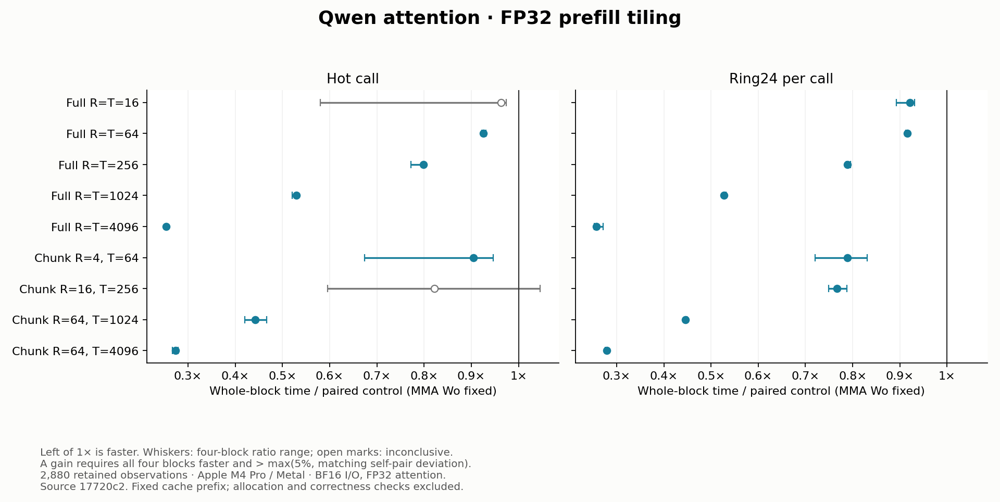

### Remaining active GPU work

The six separate stage captures validate 12 dispatches per materialized call
and 10 per tiled call. The table below describes only the candidate captures.
Shares divide each stage's summed recorded active duration by the total active
duration in that same capture; they are not percentages of whole-call latency.

| R,T | Q projection median µs | Fused GQA median µs | Q active share | GQA active share |
| --- | ---: | ---: | ---: | ---: |
| 1024,1024 | 10789.917 | 1721.750 | 63.1% | 10.0% |
| 4096,4096 | 46004.938 | 22529.146 | 52.6% | 25.7% |
| 64,4096 | 645.917 | 1785.500 | 22.6% | 65.3% |

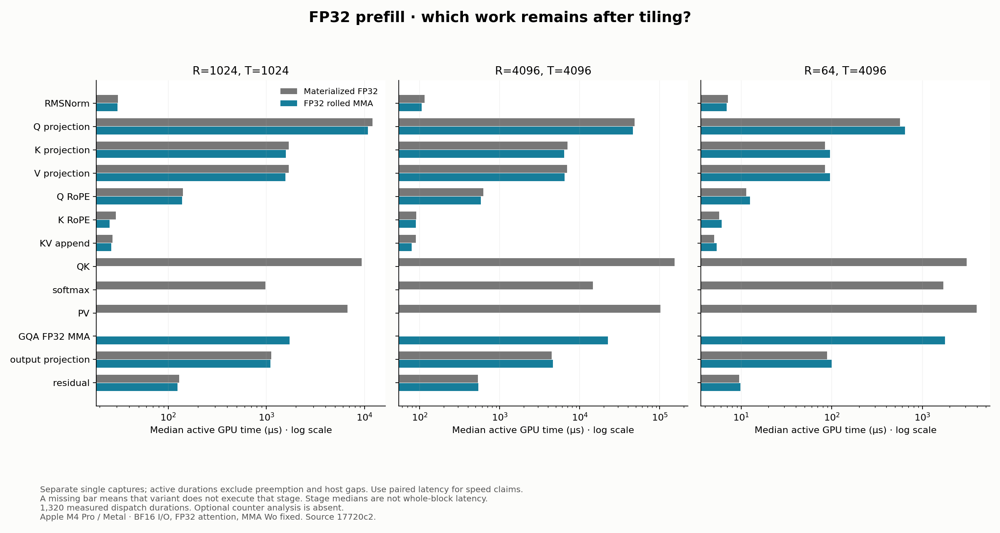

In the full-4096 control, QK/PV account for 75.6% of recorded active time.
With tiling, Q projection becomes the largest stage in both full-prefill
captures. Long cached chunks still spend most active time inside GQA. This
is why one optimization target need not serve every workload.

Unchanged stages still vary between separate captures. For example, Q at
full 1024 has a 11987.915 µs control median and 10789.917 µs candidate median;
chunk Q changes from 565.708 to 645.917 µs. Consequently these profiles explain
remaining work but do not supply precise causal kernel-speedup estimates.
The paired latency experiment establishes the gains. The
[profile table](data/prefill_profile_summary.csv) retains all stage medians/ranges.
There are 352 measured dispatches with segmented execution across these
captures; all segments were coalesced using validated command identities,
excluding preemption gaps before stage assignment.

Each tiled capture reports a maximum compiler spill size of **48 bytes per
event**, with 35,20,35 target events respectively. The materialized captures
report no target spill event. Event sizes/counts are compiler evidence, not
measured spill traffic, and absence of an event does not prove spill-free
execution. The 48-byte maximum is also what the earlier BF16 rolled-QK study
reported, but it does not establish identical spilled values or their cost.
No optional counter tables were exported or analyzed for this comparison.

## What the earlier experiments teach us

The [linear prefill study](../linear_prefill/README.md) already established
that sharing operands across token rows can make Apple MMA effective, while
tiny row counts can lose. This Wo experiment tests that mechanism at N=896,
without bias, and inside the full attention block. It does not inherit the
packed-QKV study's N=1152 crossover or compare its old absolute times with
this run. The block's remaining stages limit how much a faster projection can
improve the whole call.

The [decode study](../gqa_decode/README.md) showed that online softmax alone
was not the end of the optimization: distributing the KV sequence and reusing
K/V across related heads helped further. It also found that reducing
exponential calls did not improve the stronger controls. The completed FP32 decode
comparison reuses those ownership designs and the existing tests while
keeping scores FP32 and checking against the selected FP32 reference. The old
timings establish results for those older
paths, not speed claims for an FP32 adaptation.

The [prefill study](../gqa_prefill/README.md) showed the value of query tiling
and matrix execution. Its follow-up found that rolling the QK reduction
reduced reported compiler spills and improved a subset of workloads; removing
barriers, changing accumulator representation and adding head reuse did not
produce general gains. The completed FP32 prefill comparison retains those
lessons about live state and query ownership. It also preserves FP32 scores
and softmax weights through PV: copying the old MMA path's BF16 tile-weight
cast would change the numerical policy again.

The projection integration completes the next step those profiles identified.
The kernel already existed; the missing work was wiring packed output into
RoPE/cache consumers, retaining the numerical boundaries, and measuring the
result with Wo and FP32 GQA already present. The large incremental gains above
show why composition should precede another round of isolated kernel tuning.

The completed parallelism experiment follows the cost exposed by integration:
GQA occupied 86% of active time for `(64,4096)` but exposed only 28 primary
threadgroups. The two tested ways of creating more groups behaved differently.
Smaller query tiles lost, consistent with reduced reuse and more K/V tile
loads in the source; no hardware counter identifies that as the physical
bottleneck. KV splitting retained the larger tile and improved this chunk
even after partial writes and merge. The earlier decode work supplied a useful
ownership idea, while the new whole-block measurements established its scope.

Those profiles motivated the completed projection-tile and split-domain follow-up above. For full 1024,
QKV and Wo together still consume about 55% of active time. Their shared 8x16
linear MMA mapping supplied the operand-reuse and tile-ownership target.
For the long cached chunk, split GQA plus merge still consumes about 76% of
active time; a later GQA study should use split8 as an additional control and
explain which live state or data movement it reduces. Full 4096 already has
many query tiles, and the split8 comparison showed no qualifying gain there.

This study does not justify widening the split count or combining candidates
without a new bounded question. Repeating the older head-reuse or barrier
ablations also needs a fresh reason after their mixed results. Preserve FP32
scores/weights, the existing gates, exact upstream-input checks, and the
integrated whole-attention measurement in any follow-up.

These results show that the original materialized paths were far from the
best mappings tested here. They do not establish a hardware ceiling, a universal
dispatch policy, or full-decoder/token-generation performance.

## Reproduction and evidence

The baseline latency run used clean source `8d8c8540c5f9de2d7d7cf16fc00f502702a3a941`
on 2026-09-06, 16:22:57–16:53:05 UTC. All four profile binaries use that same
source. Hardware was Apple M4 Pro / Metal, Mac16,7 with 24 GiB memory;
Mojo 1.0.0, MAX 26.5.0, macOS 26.6.2 and Xcode 26.6. Every latency block and
capture recorded AC power, Low Power Mode off and no thermal/performance warning.
These checks do not pin GPU clocks or exclude background activity. The Wo
comparison uses the same hardware/software configuration, with independent
source, binary and condition records below.

The workload uses frozen synthetic seed 53 with a CPU-derived cache prefix.
Ring24 owns 24 distinct weights, inputs and caches with two sign patterns;
it shares scratch/output and is not a decoder stack. Baseline timing includes the host
length rewind, twelve enqueues, cache append and completion. Allocation,
fixture reads, uploads, prefix setup and correctness checks are excluded.
Each call overwrites the same suffix, keeping R and T fixed. There are ten
warmups and ten samples per arm in four blocks; blocks two and three reverse
workload and arm order.

[run.json](data/run.json) and [samples.csv.gz](data/samples.csv.gz) retain all 2,400
latency observations and their provenance. [profiles.json](data/profiles.json)
and [profile_samples.csv.gz](data/profile_samples.csv.gz) retain all 1,920 measured
dispatch durations, capture identities, selected counters and the explicit
counter-analysis omission. The source of the curator is hashed in that record.
The post-measurement curation/plot changes handle absent optional counters and
mark elevated calibration variation; they change no measured engine code.
All 38 Python checks pass with the retained evidence, including duplicate and
missing-dispatch rejection for both attention profile grids.

The Wo screen and full run use clean source
`07984fedafcbe1c1260c37c86ff708c5098cfa18`. They ran on 2026-09-06 at
17:55:02–18:03:41 and 18:04:43–19:04:24 UTC respectively, retaining 1,600 and
4,800 observations in [wo_screen_run.json](data/wo_screen_run.json),
[wo_screen_samples.csv.gz](data/wo_screen_samples.csv.gz), [wo_run.json](data/wo_run.json)
and [wo_samples.csv.gz](data/wo_samples.csv.gz). All eight profile binaries use that
same clean source. [wo_profiles.json](data/wo_profiles.json) and
[wo_profile_samples.csv.gz](data/wo_profile_samples.csv.gz) retain 1,200 measured
dispatch durations: 25, 10, 5 and 10 iterations per variant across the four
workloads, after ten warmups each. All eight captures passed provenance and
dispatch-sequence validation. The default Metal System Trace was used without
optional counter-table export; full traces remain external. Every timing block
and capture recorded AC power, Low Power Mode off and no reported warning.

The same fixed-prefix, hot/ring24 and paired-block protocol applies to Wo.
The experiment retains the original baseline figures separately and uses fresh
controls for its comparisons. Post-measurement changes curate evidence, update
reporting and check retained records; they do not change the measured Mojo
engine or its numerical tests. All five tables and five figures regenerate
byte-for-byte from the retained files.

The decode screen and full run use clean source
`d2a320f0705e0459fd1e8c3c8c50b76a745f1b47`, on 2026-09-06 at
20:22:52–20:23:38 and 20:23:39–20:25:13 UTC. They retain 960 and 2,880
observations in [decode_screen_run.json](data/decode_screen_run.json),
[decode_screen_samples.csv.gz](data/decode_screen_samples.csv.gz),
[decode_run.json](data/decode_run.json) and [decode_samples.csv.gz](data/decode_samples.csv.gz).
The six captures use that same clean source and retain 3,300 durations in
[decode_profiles.json](data/decode_profiles.json) and
[decode_profile_samples.csv.gz](data/decode_profile_samples.csv.gz), with 50 measured
iterations and 20 warmups per capture. Both timing modes and each candidate's
actual route are validated before timing. All conditions checks passed.
Post-measurement reporting changes do not alter the measured engine or gates.
All eight tables and eight figures regenerate from retained raw evidence;
39 Python checks validate the retained records, including missing/duplicate
dispatch rejection for each profile grid.

The prefill screen and full run use clean source
`17720c294ec98a5ba38da004e38ec72eeed6372f`, on 2026-09-06 at
20:56:23–21:02:22 and 21:02:22–21:47:00 UTC. They retain 960 and 2,880
observations in [prefill_screen_run.json](data/prefill_screen_run.json),
[prefill_screen_samples.csv.gz](data/prefill_screen_samples.csv.gz),
[prefill_run.json](data/prefill_run.json) and [prefill_samples.csv.gz](data/prefill_samples.csv.gz).
The six profile binaries use the same clean source. [prefill_profiles.json](data/prefill_profiles.json)
and [prefill_profile_samples.csv.gz](data/prefill_profile_samples.csv.gz) retain
1,320 active durations: 25,10,25 measured iterations per variant at full 1024,
full 4096 and chunk (64,4096), with ten warmups each. Every block/capture
recorded AC power, Low Power Mode off and no reported thermal/performance
warning. Those checks do not pin clocks or exclude background activity.

All 40 Python checks pass against the retained evidence, including duplicate,
missing-dispatch and source-identity checks for the added profile grid. All
11 tables and 11 figures regenerate byte-for-byte. Post-measurement changes
curate evidence and reporting; the measured engine and numerical gates remain
unchanged. Full traces/XML, binaries and oracle arrays remain outside Git.

The projection-only and combined integration comparisons use clean source
`dc77016af29ef0087807b22ed42a0aeca7cde14f`, on 2026-09-06 at
22:32:05–22:46:33 and 22:46:33–23:33:27 UTC respectively. Each retains 4,800
observations in its `projections_` or `integrated_` run/sample files above.
The eight integration captures use that same source and retain 2,090 active
dispatch durations: 50,25,10,25 measured iterations per variant at decode
4096, full 1024, full 4096 and chunk (64,4096), after ten warmups each.
Capture provenance, dispatch identities, and optional-counter absence are
validated. Source hashes match the numerical validation record.

All 41 Python checks passed with the retained integration evidence. At that
stage, the attention study reproduced **14 tables and 14 figures byte-for-byte**
offline, including every prior figure. The final report/evidence changes do
not alter the measured kernels, benchmark or numerical gates. Full traces,
XML, binaries and generated fixtures remain outside Git.

The GQA parallelism screen and full matrix use clean source
`5778641918e256604e093f007cebcc1aa3606523`, on 2026-09-07 at
01:00:15–01:04:03 and 01:04:04–01:11:48 UTC respectively. They retain 2,400
and 4,800 observations in the `parallelism_screen_` and `parallelism_` files
linked above. The full run uses the sole screen finalist and binds both
screen hashes. All four profile binaries use that same clean source and
retain 950 dispatch durations. Capture, build and numerical validation source
hashes agree. Every block and capture recorded AC power, Low Power Mode off,
and no reported thermal/performance warning; the observed calibration variation
still applies. Optional counter analysis is explicitly absent.

The complete workflow passed 90 Mojo and 43 Python tests before measurement.
Post-measurement checks bind the retained screen, selection, full run,
validation and profiles, and reject missing or duplicate dispatches. Reporting
changes do not alter the measured kernels or numerical gates. All **17 tables
and 17 figures** regenerate offline from compact evidence, preserving every
previous table and figure byte-for-byte. Full traces/XML, binaries, checkpoint
assets and generated arrays remain outside Git.

The projection-tile and split-domain follow-up uses clean source
`5c7ca774c68910934e54624e3194e1fa4a734a7e`, with a single validated build on the
same Apple M4 Pro / Metal and software versions listed above. All seven runs
were completed on **2026-09-07 UTC**:

| Comparison | UTC interval | Observations | Retained evidence |
|---|---|---:|---|
| Whole-attention Wo screen | 03:33:42–03:35:51 | 1,920 | [record](data/tiles_screen_run.json), [samples](data/tiles_screen_samples.csv.gz), [table](data/tiles_screen_summary.csv) |
| Isolated Wo screen | 03:35:51–03:36:59 | 1,920 | [record](data/tiles_kernel_screen_run.json), [samples](data/tiles_kernel_screen_samples.csv.gz), [table](data/tiles_kernel_screen_summary.csv) |
| Selected Wo full matrix | 03:37:00–03:44:42 | 4,800 | [record](data/tiles_run.json), [samples](data/tiles_samples.csv.gz), [table](data/tiles_summary.csv) |
| Selected tile in QKV | 03:44:42–03:51:18 | 1,920 | [record](data/tiles_qkv_run.json), [samples](data/tiles_qkv_samples.csv.gz), [table](data/tiles_qkv_summary.csv) |
| Original control-only timing | 03:51:19–03:51:34 | 480 | [record](data/timing_run.json), [samples](data/timing_samples.csv.gz), [table](data/timing_summary.csv) |
| Deferred control-only timing | 03:51:34–03:51:49 | 480 | [record](data/timing_buffered_run.json), [samples](data/timing_buffered_samples.csv.gz), [table](data/timing_buffered_summary.csv) |
| Existing split8 domain | 03:51:50–03:53:53 | 1,920 | [record](data/split_domain_run.json), [samples](data/split_domain_samples.csv.gz), [table](data/split_domain_summary.csv) |

Both conditional projection runs bind the hashes of both complete screens and
record the sole finalist, Wo 16x16. Every runtime identifies Metal and the
expected measurement boundary. The same fixed seed, immutable prefix,
hot/ring24 definitions and four-block pairing apply; the isolated Wo and
sample-emission differences are declared in their specifications. All blocks
recorded AC power, Low Power Mode off and no reported thermal/performance
warning. Short-call variation remains despite these condition checks.

[tiles_validation.json](data/tiles_validation.json) records the complete 93-Mojo /
45-Python validation, unchanged frozen synthetic/checkpoint arrays, asynchronous
stress checks and source hashes. Post-measurement Python checks validate all
**77,920 retained latency observations across the repository**, including the
13,440 new observations, both screen hashes, conditional selection, measurement
boundaries and validation/build identity. No new profile durations are claimed.

All **24 tables and 23 figures** in this attention study regenerate byte-for-byte
offline, including the prior seventeen tables and seventeen figures. Reporting
changes after measurement update explanations, evidence checks and timing-plot
tick labels; they do not alter the measured kernels, benchmark or numerical
gates. Full logs, binaries, checkpoint assets and generated arrays stay outside
Git. The approved candidate budget is complete; commits remain local.

The combined-projection comparison uses clean source
`bbdbd4a99f71837f542d2847ec9b7a96c732b66e`. The 4,800-observation latency run
completed on 2026-09-07 at **10:28:34–10:36:10 UTC**. The eight validated captures
span condition checks at **10:36:17–10:41:22 UTC**. Both use the same measured
source, frozen inputs and hardware/software configuration. Every block/capture
recorded AC power, Low Power Mode off and no reported thermal/performance
warning; this does not pin clocks or eliminate the observed calibration noise.

[combined_run.json](data/combined_run.json), [raw latency samples](data/combined_samples.csv.gz)
and [latency table](data/combined_summary.csv) retain the complete paired grid.
[combined_profiles.json](data/combined_profiles.json), [raw stage durations](data/combined_profile_samples.csv.gz)
and [stage table](data/combined_profile_summary.csv) retain all 1,530 measured
dispatch durations, capture identities, coalescing, conditions, compiler-spill
summaries and explicit counter-analysis absence. Numerical validation is bound
to the same source in [combined_validation.json](data/combined_validation.json).

One tooling defect was encountered after the first valid control capture:
the profiling CLI's choice list omitted attention variants above 15, although
its package builder already validated and supported variant 18. The remaining
captures called that unchanged `build_profile` API directly, preserving the
measured commit and the first completed capture. The latency run was not
repeated. After all measurements, the CLI list was fixed and a regression test
added. At the exact measured commit, the corresponding builder invocation is:

```python
from argparse import Namespace
from pathlib import Path
from llm_mojo.benchmarks.profile import build_profile
build_profile(Namespace(
    operation="attention_sublayer", profile_variant=18,
    build_profile_binary=Path("/private/tmp/combined-profile-reproduction"),
    profile_query_rows=1024, profile_rows=1024,
    profile_iterations=25, profile_warmup=10,
))
```

Run it through the locked Python environment; change shape, iteration count
and variant according to the declared eight-capture grid. The current CLI
accepts the same arguments directly. Both routes preserve the builder's clean
source, device, binary, input and workload checks.

Before measurement, all 93 Mojo and 46 Python tests passed, together with
checkpoint and asynchronous stress validation. Post-measurement **47 Python
checks** include the CLI regression and bind the new profiles, numerical
validation and **82,720 retained latency observations across the repository**;
missing/duplicate dispatches are rejected. All **26 tables and 25 figures** in
this attention study regenerate byte-for-byte, including the preceding 24
tables and 23 figures. The post-measurement changes affect the CLI argument
list, evidence checks and reporting; the measured kernels, benchmark and
numerical gates are unchanged. Raw traces/XML, binaries, full logs and generated
fixtures remain outside Git. The implementation and evidence commits are local.

Rebuild tables and figures without a GPU:

```sh
uv run --locked --with matplotlib==3.10.8 python -m llm_mojo.benchmarks.plot studies/attention_sublayer
```

For fresh measurements, use a clean checkout, regenerate and validate fixtures,
then use the [package-owned build/run and trace commands](../../src/llm_mojo/benchmarks/README.md).
Use the recorded commit to reproduce the exact measured source. Raw traces,
XML, binaries, checkpoint assets and oracle arrays stay outside Git.
