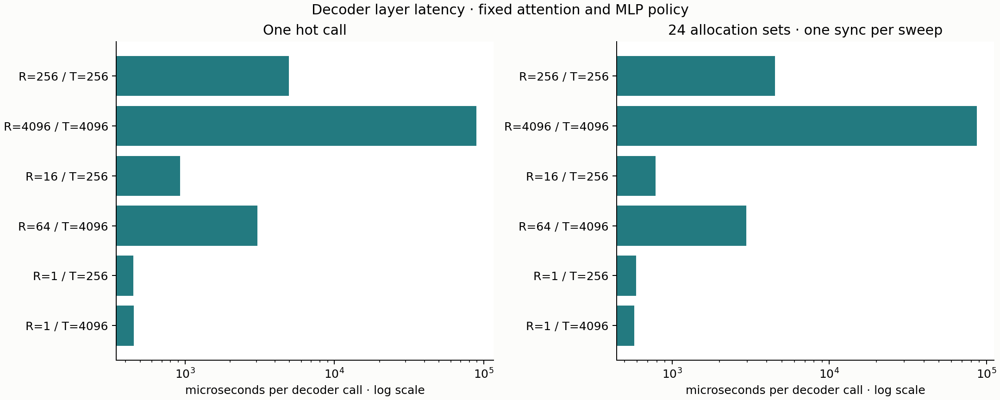
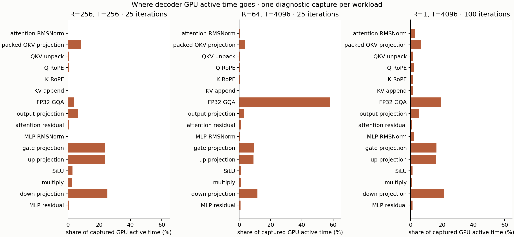

# One Qwen decoder layer

The decoder composition passes its independent reserved acceptance. Profiling
the whole layer adds useful context: **MLP occupies 79% of active GPU time at
full R=T=256; attention occupies 67% for a cached R=64, T=4096 chunk.** At
one-token decode, MLP occupies 59%, and gaps between active dispatch intervals
occupy 16% of the enclosing captured window. Those gaps do not identify a
particular CPU bottleneck.

Proceed to **full-model forward parity** next: embeddings, 24 decoder layers,
final normalization and the LM head, with an independently declared logits
gate. This study establishes a correct layer and phase-dependent costs. It
does not establish a new integration overhead that justifies another kernel
search before that model-level correctness milestone.

## What was composed

The [contract and layout graph](../../docs/decoder-layer.md#data-flow-and-rounding)
define both residuals and every materialized rounding boundary:

```text
X ── RMSNorm ── QKV / RoPE / cached causal GQA / Wo ── +X ── Z
Z ── RMSNorm ── gate / up / SiLU / multiply / down ── +Z ── Y
```

Geometry is H=896, I=4864, 14 query heads, two KV heads and head dimension 64.
X/Y are contiguous BF16 [R,H], weights are BF16 [out,in], and each layer's
cache is BF16 [T,2,64]. Reductions and SDPA inputs/accumulation use the declared
FP32 policy; O, norms, SiLU, products and residual operands retain their BF16
materialization boundaries. The reference executes the actual pinned upstream
Qwen decoder with the qualified FP32 SDPA adapter.

`enqueue_decoder_layer` validates both sublayers before submitting work,
then passes attention's Z directly into the MLP. It adds no GPU allocation,
copy, kernel or synchronization. The attention arithmetic/dispatch body and
the entire MLP engine are unchanged. The wrapper checks writable overlap and
actual buffer extents; the caller owns raw input-view validity and lifetimes.

The measured caller policy is fixed: attention mappings `(0,0)`, MLP mapping 7
for R>1 and mapping 0 for R=1. It issues 16 dispatches per layer call. No
attention-mapping comparison or automatic model-wide selector is part of this
baseline.

## Numerical acceptance

[Numerical evidence](numerics.json) retains the complete checks, frozen
reference identity, candidate build receipt, reserved manifest and validation
output in a lossless compressed record. There are 43 synthetic development
cases, three checkpoint development cases and seven reserved cases: seeds
5003/5011 at T=1,17,4096 plus a previously unexecuted 47-token checkpoint prompt.
All use declared full/chunk schedules and explicit supported MLP mappings.

Development has 20,924 required core checks, checkpoint development 636, and
reserved acceptance 2,468. Additional records cover exact protected storage,
invalid preflight, asynchronous execution, inactive guards and eight deliberate
negative controls. The async test saves each output and compares with a
separate cache/workspace replay. Cache prefix, append and inactive regions are
checked exactly. Preflight non-submission is supported by pure control-flow
inspection plus unchanged sentinels, including the first normalization output;
no runtime dispatch counter was introduced.

For the whole-layer boundaries, every element must satisfy
`abs(actual-reference)/(1+abs(reference)) <= 0.03125`. Operation-local and
isolated-sublayer checks retain their separate, tighter or exact gates.

| Reserved whole-layer boundary | Largest scaled error |
| --- | ---: |
| Attention branch B_att | 0.003585 |
| First residual Z | 0.005587 |
| MLP branch B_mlp | 0.007368 |
| Final output Y | 0.015504 |

The checkpoint uses verified local tensors from Qwen2.5-0.5B-Instruct revision
`7ae557604adf67be50417f59c2c2f167def9a775`. The retained prefix and individual
tensors are verified; the unavailable full safetensors file is explicitly not
claimed to have been hashed. No weights or oracle arrays are stored here.

## Layer latency

The fixed six-workload grid has **960 observations**: four paired blocks,
ten warmups and ten samples per arm, hot and ring24. Both arms run the same
configuration. Values below are medians of the four control-arm block medians;
the complete arm values and within-block ratios are in [summary.csv](summary.csv).

| Phase | R | T | Hot, ms/call | Ring24, ms/call | Largest self-pair deviation: hot / ring |
| --- | ---: | ---: | ---: | ---: | ---: |
| Full prefill | 256 | 256 | 4.952 | 4.531 | 16.9% / 0.7% |
| Full prefill | 4096 | 4096 | 88.852 | 86.769 | 2.2% / 3.5% |
| Cached chunk | 16 | 256 | 0.925 | 0.784 | 3.1% / 1.3% |
| Cached chunk | 64 | 4096 | 3.056 | 2.962 | 0.5% / 0.2% |
| Decode | 1 | 256 | 0.452 | 0.589 | 9.8% / 12.1% |
| Decode | 1 | 4096 | 0.453 | 0.573 | 6.3% / 19.3% |



Retain the noisy observations. In particular, decode differences of a few
percent are unresolved, and similar hot decode medians at the two contexts
do not prove that cache length is free. The two identical arms provide a noise
check, not a speedup result. No valid timing was discarded or repeated.

Hot measures host enqueue through completion of one call. Ring24 submits
24 distinct input/weight/cache allocations with shared workspace, synchronizes
once per sweep and divides by 24. It changes both reuse distance and
synchronization amortization. It is not guaranteed cold DRAM, a chain of 24
learned layers, growing-context generation or model token throughput.

Every timed allocation uses the same frozen seed-4001 contents. Prefix caches
are produced by the Mojo decoder outside timing. Repeated calls start at
P=T-R and overwrite the same suffix after the prior sample completes. A
separate untimed adversarial ring uses 24 distinct hidden-coordinate sign
patterns to expose incorrect allocation selection. Allocation, fixture loads,
prefix preparation and correctness checks are excluded from latency.

## Where active time goes

Three independent diagnostic captures contain 25, 25 and 100 measured calls,
after ten warmups each: **2,400 measured dispatches**. Each capture has a
verified launch receipt, actual Metal identity and complete trailing dispatch
coverage. Preempted segments are joined before stage labels are assigned.



| Captured workload | Attention share | MLP share | Gaps in enclosing window |
| --- | ---: | ---: | ---: |
| Full R=256, T=256 | 21.2% | 78.8% | 0.17% |
| Cached R=64, T=4096 | 66.8% | 33.2% | 0.62% |
| Decode R=1, T=4096 | 40.9% | 59.1% | 16.13% |

Shares sum actual active durations within each capture. MLP gate/up/down
projections alone occupy 72.4% of the full-prefill capture. FP32 GQA occupies
58.0% of the cached-chunk capture. At decode, the five dense projections
together occupy 65.4%, while GQA occupies 19.1%. The small elementwise stages
and two RMSNorms are individually smaller contributors in all three captures.

Dense projection work scales with R: these dimensions request about 29.82
million multiply/add FLOPs per new row across QKV, Wo, gate, up and down.
GQA also traverses the available KV context; a long prefix changes its work
relative to the projections. These dimensions explain why the layer's active
time shifts between the two sublayers.

[profile_summary.csv](profile_summary.csv) retains stage statistics.
[profile_windows.csv](profile_windows.csv) uses the first measured start through
the last measured end, including gaps between iterations. It subtracts the
sum of target active intervals from that window. The resulting gap includes
scheduling, preemption and submission effects; it is not measured CPU enqueue
time. No host-overhead ablation was run. These instrumented windows also use
queued calls and do not replace the separate hot latency boundary. We do not
sum medians from separate captures to manufacture layer latency.

The captures join zero, two and one fragmented measured dispatches,
respectively. The first two target captures report 35 compiler spill events,
with a maximum event size of 48 bytes; decode reports none. These are
capture-scoped observations, not allocated-register counts or proof that all
decode executions are spill-free. Named occupancy and limiter summaries in
[profiles.json](profiles.json) are device-wide samples inside each target
window. They do not isolate a kernel or establish achieved DRAM bandwidth.

## Ownership and allocation

The caller owns separate attention/MLP workspaces and one cache per allocation
set. Z resides in attention workspace; Y resides in MLP workspace. They stay
live on one stream until consumers finish. The two workspaces are shared
across ring entries, with each output checked before overwrite during setup.

For this benchmark, workspace max_rows=T supports prefix preparation as well
as the measured call. The following are source-derived payload sizes, excluding
allocator alignment, runtime/compiler allocations and host fixture storage:

| Allocation | Payload bytes |
| --- | ---: |
| Weights per set, including norms and QKV bias | 29,824,768 |
| K/V cache per set | 512 × T |
| Input X per set | 1,792 × T |
| Retained verification output per set | 1,792 × T |
| Shared attention + MLP workspace, including rotary tables | 58,368 × T + 236,554 |

Thus total declared payload is
`58,368*T + 236,554 + layers*(29,824,768 + 4,096*T)` bytes, where layers is
1 or 24. At T=4096, shared workspace is 239,311,882 bytes; total hot/ring24
payload is approximately 286 MB / 1.358 GB. The verification outputs remain
allocated during measurement. These are allocated footprints, not measured
memory traffic. A future runtime may provision separate prefill/decode workspace
capacities, but this study did not evaluate that change.

## Provenance, repair and reproduction

Numerical and measurement binaries were frozen at clean commit
`d67fd94fa05f65b7d754d210cb38ba6eeb535549`, after reference freeze `59a92da`.
The numerical binary SHA-256 is
`b52eda84787e35f3c11c87ea0770c32dbfefd877c81673a3ae6b1e57fa52c93d`.
Hardware is Apple M4 Pro, 24 GiB, backend Metal (`metal:4-metal4`); software is
Mojo 1.0.0 / MAX 26.5.0, macOS 26.6.2 and Xcode 26.6. The upstream oracle
uses Torch 2.4.0 / Transformers 4.43.1 / NumPy 1.26.4, CPU one thread.
Before/after conditions record AC power, power mode 0 and no thermal warning.
They do not exclude all background activity or fix GPU clocks.

The first decode trace completed but its receipt was invalid: the capture
parser rejected valid MLP mapping 0 as non-positive. Commit `05e1def` repaired
only that parser and its test. The single permitted retry reused the identical
frozen binary. Its conditions record verifies every other source and fixture
hash against the build. The original failed receipt, output and repair are
retained in [capture_attempt.json](capture_attempt.json); its full trace remains
at the external path recorded there. No numerical candidate or tolerance
changed. No other capture was retried. Later edits only curate evidence and
derive report windows.

The complete documented validation passed 15 Mojo suites / 107 tests, upstream
reference checks and all benchmark route smoke tests. A final checkpoint replay
passed all five decoder tests. All 92 final Python checks pass, including the retained
acceptance-to-measurement identity binding and complete sample/dispatch census.

Regenerate tables and both figures from this directory, without GPU execution:

```sh
uv run --locked python -m unittest discover -s tests -p 'test_*.py'
uv run --locked --with matplotlib==3.10.8 python -m llm_mojo.benchmarks.plot studies/decoder_layer
```

The [execution plan](../../docs/decoder-layer-plan.md) records the numerical
build, reserved capture/evaluation and six-workload timing commands. Original
artifacts live under `/private/tmp/llm-mojo-decoder-20260908`; timings are in
`timing/decoder_layer`, numerical receipts in `acceptance`, and profiles in
`profiles/rR-tT-v0`. These external files are local working evidence, not a
durability guarantee. Compact data here is sufficient to regenerate the report;
full traces/XML are needed to redo trace analysis.

For fresh profiles on a clean source, use fresh external output paths and the
existing builder for `(R,T,N)=(256,256,25),(64,4096,25),(1,4096,100)`:

```sh
uv run --locked python -m llm_mojo.benchmarks.profile --operation decoder_layer --profile-variant 0 --profile-query-rows "$R" --profile-rows "$T" --profile-warmup 10 --profile-iterations "$N" --build-profile-binary "$PROFILE_DIR/profile"
uv run --locked python -m llm_mojo.benchmarks.capture_trace --profile-binary "$PROFILE_DIR/profile" --output-trace "$PROFILE_DIR/capture.trace" --receipt "$PROFILE_DIR/capture.json" --template LLM_Mojo_Metal_Limiters --time-limit 30s
```

As in the recorded run, save `checked_conditions()` before/after and verify
source/environment/fixture identity against each build. Export TOC with
`xcrun xctrace export --input TRACE --toc --output toc.xml`. For run 1, export
`/trace-toc/run[@number="1"]/data/table[@schema="SCHEMA"]` with `--xpath`.
The observed schemas, in file order, were:

| XML file | Schema |
| --- | --- |
| submissions.xml | metal-application-command-buffer-submissions |
| gpu-intervals.xml | metal-gpu-intervals |
| performance-state.xml | gpu-performance-state-intervals |
| spill.xml | graphics-compiler-spill-events |
| counter-info.xml | gpu-counter-info |
| counter-values.xml | gpu-counter-value |

Pass those files to `python -m llm_mojo.benchmarks.analyze_trace` using its
corresponding `--*-xml` flags, plus `--capture-receipt capture.json` and
`--output summary.json`. Curate the complete three-folder set with
`python -m llm_mojo.benchmarks.profile_summary SOURCE OUTPUT --decoder-layer`.
All commands run through `uv run --locked`. Fresh execution creates new
evidence; the retained receipts identify the actual measured source above.
