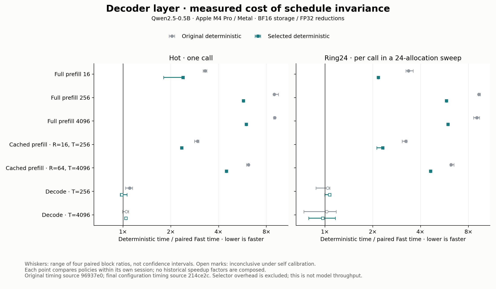

# Fast and deterministic Qwen decoder policies

This study separates numerical validity, schedule invariance and performance
for one Qwen2.5-0.5B-Instruct decoder layer. Fast selects the fastest demonstrated
valid configuration at each measured workload and reuse mode. Deterministic
adds byte identity across different ways of dividing the same causal sequence
into calls. Exact agreement with Hugging Face is a separate question.

The [frozen plan](policies-plan.md) and [executable declaration](../../tests/fixtures/decoder_policies.json)
set the contracts, numerical gates, seven workloads and bounded search before
candidate measurements. The campaign uses Apple M4 Pro / Metal, Qwen dimensions
H=896, I=4864, 14 query heads, two KV heads and head dimension 64. Stored
activations, weights and cache use BF16; reductions and attention use FP32.

## What the policies guarantee

Both policies retain the existing Qwen equations, causal visibility including
the current token, absolute RoPE positions, BF16 materialization boundaries,
isolated-operation tests and composed-layer numerical gates. Tolerances and
the pinned HF-derived reference arrays were unchanged.

Deterministic requires all 16 stored stages, including Y, and both active KV
prefixes to be byte-identical to the same implementation's full-call result.
Tests cover repeated execution, one token per call through 4096 tokens,
irregular chunks, a 256-row prefix and a schedule reaching every measured
lookup cell. Hot and ring24 policy lookups must also agree. Compatible
configurations can be selected between calls only after cross-configuration
stage/cache checks pass.

The guarantee is scoped to the tested model geometry, one sequence, hardware,
compiler/runtime and build. This campaign does not establish invariance across
devices, compiler releases, multiple requests, all possible inputs or the full
24-layer model. It does not resolve the older full-model numerical acceptance
failure. Greedy generation and sampling are outside this layer milestone.

## Why four-row reuse helps

Six baseline profiles passed their dispatch census: 4,975 measured dispatches.
For the original deterministic configuration 20, MLP consumes 85.225% of captured
GPU active time at full (256,256), and 68.538% at cached (64,4096). Those profiles
justify examining projections first; GPU active shares are not layer latency.

Configuration 22 reuses each loaded weight across four independent row dot
products. Each row retains the original lane-strided FP32 accumulation,
SIMD-group reduction and BF16 cast. Packed QKV is unpacked without arithmetic;
the one-row path uses the original rowwise kernel. This changes weight reuse
while preserving the arithmetic family of configuration 20.

In the first screen, four-row reuse reduced deterministic multirow latency by
24–37%. The second round tried eight and sixteen rows. Both passed numerical,
schedule and family checks, but eight rows was 11–16% slower than four and
sixteen rows was 37–61% slower across the screened cells/modes. More reuse did
not improve whole-layer latency. We did not collect register-spill or DRAM
counters that identify the resource responsible for these regressions.

Configuration 21 uses the same matrix-instruction tile shapes for every call size. It passed
its own schedule-invariance tests and lowered prefill latency by 68–88% versus
configuration 20 on the four screened cells in both reuse modes. Full 256-row
prefill took about 12% of the old deterministic time. Hot one-token decode,
however, was 46–58% slower. The frozen global-family rule therefore kept the
compatible rowwise family as default. Configuration 21 remains a validated
experimental option with a useful prefill/decode tradeoff; it cannot be mixed
with the rowwise family under the deterministic contract. The default
policy's cost is not a lower bound on the cost of deterministic inference.

## Independent confirmation and measured cost

The changed Fast cell, hot cached `(16,256)`, independently confirmed
configuration 21: paired time ratio 0.940258, four-block range 0.931243–0.946018,
noise floor 5%. This is about 6% lower latency than its original Fast control.
All five multirow deterministic proposals qualified in both reuse modes,
including the previously unmeasured 4096-row full prefill. The actual lookup
selects configuration 22 there and keeps configuration 20 for one-row decode.
Independent gains over configuration 20 range from 24% to 37%; full 4096-row
prefill is 34% faster in both reuse modes.

Direct final comparisons put the selected deterministic prefill policy at
2.2–6.0 times Fast latency, depending on workload and reuse mode. All four
decode comparisons are inconclusive. Decode self calibration reaches 23%, so
an inconclusive result does not establish equal cost. These are paired
whole-layer measurements, separate from the gains over the old deterministic
baseline.



<!-- policies-cost:start -->

| Workload R / T | Mode | Fast ID | Det ID | Fast µs | Det µs | Paired Det / Fast | Four-block range | Decision |
| --- | --- | ---: | ---: | ---: | ---: | ---: | --- | --- |
| 16 / 16 | hot | 0 | 22 | 814.5 | 1958.0 | 2.389× | 1.804–2.428× | slower |
| 16 / 16 | ring24 | 0 | 22 | 816.1 | 1770.3 | 2.168× | 2.164–2.178× | slower |
| 256 / 256 | hot | 0 | 22 | 4568.2 | 26208.8 | 5.737× | 5.714–5.770× | slower |
| 256 / 256 | ring24 | 0 | 22 | 4396.4 | 25623.8 | 5.827× | 5.822–5.832× | slower |
| 4096 / 4096 | hot | 0 | 22 | 85664.0 | 512050.2 | 5.979× | 5.973–5.983× | slower |
| 4096 / 4096 | ring24 | 0 | 22 | 85405.7 | 507787.7 | 5.945× | 5.944–5.948× | slower |
| 16 / 256 | hot | 21 | 22 | 878.5 | 2057.5 | 2.342× | 2.324–2.385× | slower |
| 16 / 256 | ring24 | 0 | 22 | 782.0 | 1807.4 | 2.314× | 2.120–2.341× | slower |
| 64 / 4096 | hot | 3 | 22 | 2089.8 | 9350.8 | 4.477× | 4.463–4.480× | slower |
| 64 / 4096 | ring24 | 3 | 22 | 1952.5 | 9035.8 | 4.629× | 4.623–4.632× | slower |
| 1 / 256 | hot | 0 | 20 | 469.2 | 468.8 | 0.981× | 0.960–1.059× | inconclusive |
| 1 / 256 | ring24 | 0 | 20 | 436.8 | 464.0 | 1.068× | 0.998–1.089× | inconclusive |
| 1 / 4096 | hot | 0 | 20 | 462.5 | 481.5 | 1.043× | 1.023–1.053× | inconclusive |
| 1 / 4096 | ring24 | 0 | 20 | 453.9 | 452.6 | 0.970× | 0.789–1.162× | inconclusive |

<!-- policies-cost:end -->

R is query rows in this call; T is total KV rows after append, with future
positions still causally masked. Times are microseconds per layer call.
A ratio above one means Deterministic took
longer. The ratio is the median of four within-block ratios; it need not equal
the quotient of the separately displayed latency medians.

Each comparison has four paired blocks, ten warmups and ten samples per arm,
balanced workload/arm order and same-run control self-pairs. A gain requires
all four ratios below one and a median improvement beyond both 5% and observed
self-pair deviation. Regression uses the symmetric rule; other outcomes are
inconclusive. Ranges are not confidence intervals, and noisy observations
were retained.

Hot uses one allocation set and synchronizes each call. Ring24 sweeps 24
distinct weight/input/cache sets with shared scratch, then synchronizes once;
reported time is divided by 24. Ring24 changes reuse distance and synchronization
amortization. It is neither guaranteed cold DRAM nor a 24-layer model. Timings
exclude compilation, allocation, prefix preparation, checks and the policy
selector itself. Context does not grow between timed samples.

## Using the layer API

`DecoderCache[False]` selects Fast; `DecoderCache[True]` selects Deterministic.
Set the reuse mode to 1 or 24 when constructing it. Allocate attention workspace
with `cache.prefill_splits()`, then call `enqueue_decoder_layer_policy` with
the existing attention/MLP weights and workspaces. The function inspects the
incoming row count and current cache length and routes through the accepted
lookup. The result is in the MLP workspace output.

The cache policy is fixed in its type. Rebuilding a prefix under a different
policy starts a new cache. Existing raw configuration/storage functions remain
available for experiments; callers using them own their arithmetic-family
and cache-consistency obligations. Unmeasured workloads use Fast 0 and
Deterministic 20; no neighborhood is silently promoted from a measured shape.

## Evidence and reproduction

The final clean candidate `f08e5a9` passed all 11 reserved cases: seeds
7141/7151 at lengths 1, 17, 65, 257 and 4096, plus the pinned 46-token
checkpoint prompt. Actual policy IDs 100/102 execute Fast with hot/ring24
lookup settings; 101/103 execute Deterministic. The run passed 1,937,598 core
numerical checks. These are stage/cache assertions, not independent cases.
Each deterministic setting passed 164,358 schedule comparisons with zero
mismatches; all 198 full-stage/cache comparisons between the two settings
matched. Fast recorded 102,148/102,088 schedule differences, permitted by its
contract, while passing the unchanged numerical gates.

The complete campaign contains 9,583,121 accepted core numerical checks. The
[final repository validation](policies_validation.json) passed 128 Python
tests, 119 native test functions across 18 suites, both tokenizer parity runs
and all benchmark routes on Metal. The timing executable was built at
`214ce2c`; the final numerical executable at `f08e5a9`. The
[build comparison](policies_build_bridge.json) binds both binaries, all native
source hashes and the unchanged hardware/software environment. Only the
policy selector changed in native source between them; explicit-configuration
timing excludes that selector. Mojo 1.0.0 / MAX 26.5.0, macOS 26.6.2 and the
Apple M4 Pro with 24 GiB were retained throughout the final confirmation.

The campaign retains 17,280 observations across 19 timing studies, including
4,320 in the independent final session. Every accepted and rejected timing
observation is retained, along with every numerical check in lossless column
archives and the six profile traces'
compact dispatch samples. Original source/binary identities are preserved.
Private build paths and native-log prefixes are normalized explicitly;
original receipt/output hashes remain separate from normalized bytes.
The earliest baseline receipts predate individual-array hashes and summary
fields, so replay derives their schedule counts from complete raw checks.

The [storage receipt](policies_storage.json) records the conversion of eight
verbose JSONL gzip files from 138,271,990 to 32,910,840 bytes (76.2% smaller).
All 9,752,424 records remain, including the interrupted run and expected
negative controls; this storage census is distinct from the 9,583,121 accepted
core numerical assertions above. Each XZ archive holds blocks of at most 8,192
records as ordered field layouts, value columns and record order. The reader
reconstructs the original JSONL bytes and verifies their unchanged SHA-256,
record count and byte count before numerical replay. Floating-point values,
field order, repeated checks and signed zeros are preserved.

Four large JSON metadata files, including the 47,431-line holdout manifest,
use the repository's existing lossless gzip wrapper with readable summaries.
Their complete payloads and original identities remain available to replay.
This changes storage only: the timing samples, numerical gates, reference
arrays, selected policies and measured source/binary identities are unchanged.
Full replay remains local and does not require external artifact downloads.

To recover an original JSONL stream into a new external file:

```sh
uv run --locked python -m llm_mojo.decoder_validation expand-checks --input studies/decoder_layer/policies_holdout_checks.columns.jsonl.xz --output "$POLICY_CHECKS"
```

Its SHA-256 must match the corresponding `uncompressed_sha256` in the storage
receipt. `compact-checks --input "$POLICY_CHECKS" --output "$POLICY_ARCHIVE"`
performs the reverse conversion; the new output must end in `.columns.jsonl.xz`.
The encoder refuses noncanonical JSONL and verifies reconstructed bytes before
returning. Expanded JSONL and the former verbose gzip files stay outside the
current Git tree. Earlier branch commits still contain those blobs; squash
merging the final tree avoids introducing them into the history of `main`.

The retained collection-failure ledger records the interrupted early baseline,
the profile collector's tuple/list metadata error, stale invalid-call test IDs
that became valid routes, and a native smoke launcher missing its uv environment.
Those failures were resolved without loosening numerical gates or deleting
unfavorable timing observations.

The first final regression also stopped at the retained-study observation
census, which omitted this newly archived campaign. The repaired test requires
all 19 policy studies and 17,280 observations. Its failed receipt is retained
in [the final validation failure record](policies_final_validation_failure.json).

Regenerate every policy table and the figure, including complete recorded-check and
decision replay, without GPU execution (tensor operations are not rerun):

```sh
uv run --locked --with matplotlib==3.10.8 python -m llm_mojo.benchmarks.plot --policies studies/decoder_layer
```

The ordinary repository regression is `uv run --locked llm-mojo-validate`.
To rerun the actual policy schedules on a clean checkout, choose new external
paths for `POLICY_BINARY`, `POLICY_FIXTURES` and `POLICY_RESULTS`, and point
`POLICY_ASSETS` at the prepared pinned checkpoint directory:

```sh
uv run --locked python -m llm_mojo.decoder_validation build --selection --binary "$POLICY_BINARY"
uv run --locked --script tests/fixtures/decoder_acceptance.py --policies --candidate-binary "$POLICY_BINARY" --checkpoint-assets "$POLICY_ASSETS" --output "$POLICY_FIXTURES"
uv run --locked python -m llm_mojo.decoder_validation evaluate-policies --binary "$POLICY_BINARY" --fixtures "$POLICY_FIXTURES" --output "$POLICY_RESULTS" --variants 100 101 102 103 --invariant-variants 101 103 --comparison-family 101 103 --split holdout
```

The evaluation receipt must report `status: passed` and
`family_compatible: true`. Repeating these now-known inputs is regression
evidence, not a new independent holdout. The declaration's statements about
unobserved outputs record its original freeze time and are preserved.

The [evidence index](policies-evidence.json) binds the retained inputs. The
[numerical table](policies_numerical.csv), [cost table](policies_cost.csv),
[accepted lookup](policies_accepted.json) and per-screen summaries expose the
complete result. Generated oracle arrays, weights, executables and full
Instruments traces remain outside Git.

## Relation to Thinking Machines

Thinking Machines distinguishes repeatability for one fixed execution from
invariance to batching and slicing, and explains how stable reduction
structure is needed in normalization, matrix multiplication and attention.
Our row-reuse optimization applies that principle: preserve each output's
arithmetic while changing parallel work and weight reuse. The fixed-MMA
candidate's decode penalty also illustrates the cost of using one matrix
instruction shape at small row counts. This is our Mojo/Metal experiment;
the article does not supply a drop-in Apple implementation or establish our
full-model correctness. [Defeating Nondeterminism in LLM Inference](https://thinkingmachines.ai/blog/defeating-nondeterminism-in-llm-inference/)
