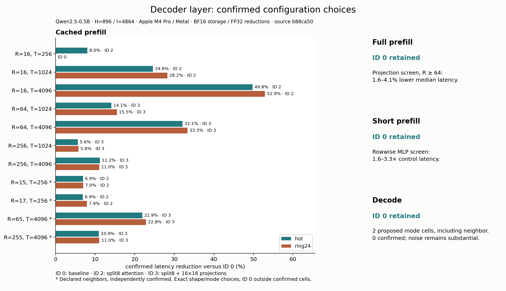

# Decoder configuration selection

**Cached prefill is the clear optimization opportunity in this pass.** Confirmed
whole-decoder latency reductions range from **5.6% to 52.9%** on the primary
cached-prefill grid. Full prefill and decode retain decoder ID 0 under the frozen
promotion rule. ID 0 already includes the optimized multi-row MLP mapping 7.

Measured on **Apple M4 Pro / Metal, 24 GiB**, Mojo 1.0.0 / MAX 26.5.0, macOS
26.6.2. Candidate and measurement source: `b88ca50`. All **16,800 latency
observations** from ten complete studies are retained, followed by four diagnostic
profiles. No valid trial was discarded or rerun because of its outcome.

- **Full prefill:** larger attention projections showed about 3–4% improvement
  in several cells, below the 5% minimum effect rule. No full-prefill challenger
  qualified for promotion.
- **Short prefill:** the rowwise MLP challenger was 1.6–3.3× slower across the
  tested cells. Keep MLP mapping 7 even at seven rows.
- **Cached prefill:** ID 2 uses split8 attention with baseline projections;
  ID 3 adds the larger 16x16 projections. Use the exact confirmed cells below.
- **Decode:** keep ID 0. Configuration 12 qualified in the hot T=256 screen,
  but failed independent confirmation there and at T=257. No ring24 decode
  challenger qualified in screening; the combined configuration 14 did not
  establish a decoder gain.



## Confirmed cached-prefill choices

Percentages are reductions from the paired ID 0 control in independent
confirmation. “ID 0” records a fallback. R is the number of new rows; T includes
the existing cached prefix. These decoder IDs are different from standalone
attention/MLP variant IDs.

| R | T | Hot choice / gain | Ring24 choice / gain | Shared choice |
|---:|---:|---|---|---|
| 16 | 256 | ID 2 / 8.0% | ID 0 | ID 0 |
| 16 | 1024 | ID 2 / 24.6% | ID 2 / 28.2% | ID 2 |
| 16 | 4096 | ID 2 / 49.8% | ID 2 / 52.9% | ID 2 |
| 64 | 1024 | ID 3 / 14.1% | ID 3 / 15.5% | ID 3 |
| 64 | 4096 | ID 3 / 32.1% | ID 3 / 33.3% | ID 3 |
| 256 | 1024 | ID 3 / 5.6% | ID 3 / 5.8% | ID 3 |
| 256 | 4096 | ID 3 / 11.2% | ID 3 / 11.0% | ID 3 |

Declared neighbors, confirmed independently:

| R | T | Hot choice / gain | Ring24 choice / gain | Shared choice |
|---:|---:|---|---|---|
| 15 | 256 | ID 2 / 6.9% | ID 2 / 7.0% | ID 2 |
| 17 | 256 | ID 2 / 6.9% | ID 2 / 7.9% | ID 2 |
| 65 | 4096 | ID 3 / 21.9% | ID 3 / 22.8% | ID 3 |
| 255 | 4096 | ID 3 / 10.9% | ID 3 / 11.0% | ID 3 |

At R=16/T=256 in ring24, ID 2 had a 7.65% lower confirmation median, but one
block was 13.61% slower. It failed the all-four-blocks rule. The resulting
single-cell fallback records uncertainty; it does not establish a physical
crossover at exactly 16 rows. The R=65 neighbor also shows why the measured
benefit should not be assumed constant around a tile boundary.

The [exact lookup CSV](selection_lookup.csv) includes full/short prefill, decode
and neighbors. The [confirmed selection](selection-confirmed.json) retains
mode-specific and shared choices, rejected proposals, and all supporting
confirmation statistics. Outside tested cells, use ID 0. The public
`enqueue_decoder_layer_configuration` entrypoint accepts an explicit ID;
IDs 2/3 require caller-owned split8 partial storage.

## What the profiles explain

Four successful captures retain all **2,825 measured dispatches**: full
256/256 ID 0, cached 64/4096 IDs 0 and 3, and decode 1/4096 ID 0. No capture was
retried. The table below reports instrumented active time and shares within each
capture; it is diagnostic evidence, not an additional latency comparison.

| R/T | ID | Active µs/call | GQA active share | MLP active share | Enclosing gap share |
|---|---:|---:|---:|---:|---:|
| 256/256 | 0 | 4367.6 | 3.8% | 78.8% | 0.2% |
| 64/4096 | 0 | 2901.0 | 58.3% | 33.4% | 0.2% |
| 64/4096 | 3 | 1938.4 | 39.6% | 50.0% | 1.7% |
| 1/4096 | 0 | 314.7 | 19.7% | 58.9% | 16.5% |

At full 256/256, MLP still accounts for 78.8% of active GPU time. At cached
64/4096, the selected path reduces GQA share from 58.3% to 39.6%, while MLP
becomes 50.0%. The bottleneck shifts after the attention improvement. Decode
still has a 16.5% enclosing gap share; the capture does not isolate its cause.

[Stage statistics](selection_profile_summary.csv), [capture windows](selection_profile_windows.csv)
and [profile receipts/counters](selection_profiles.json) retain the underlying
breakdown. Split attention adds a merge launch, so the accepted cached path has
17 launches versus 16 for the control. The extra launch is worthwhile at these
confirmed cached workloads. Compiler spill observations, where present, cover
the capture and do not identify per-kernel allocated registers or spill traffic.

## Decode calibration

The fixed pilot compared raw hot, ring24, and a separately labeled batch of
16 hot calls with one synchronization. Batching reduced the per-call median,
but cannot promote a raw-hot candidate. Noise remains workload/run-specific:
for example, the T=257 hot confirmation self-pair deviation reached 48.8%.

| T | Boundary | Control median µs/call | Calibrated effect floor |
|---:|---|---:|---:|
| 256 | hot | 434.75 | 30.2% |
| 256 | ring24 | 538.82 | 21.6% |
| 4096 | hot | 457.50 | 5.0% |
| 4096 | ring24 | 494.74 | 17.9% |
| 256 | hot batch16 (diagnostic) | 286.95 | 12.8% |
| 4096 | hot batch16 (diagnostic) | 329.25 | 5.0% |

The raw decode measurements support retaining the baseline. Improving timing
stability and separating synchronization effects is a useful next measurement
question before another small-effect decode mapping search.

## What this measures

One Qwen2.5-0.5B decoder layer, H=896, I=4864, 14 query heads, two KV heads,
head dimension 64, BF16 stored boundaries and FP32 reductions/SDPA. Every
configuration reuses existing attention and MLP kernels. Timings use the frozen
seed-4001 synthetic fixture; checkpoint cases provide additional numerical
validation. ID 0 remains the
integrated attention baseline with MLP mapping 7 for multiple rows and mapping
0 for one row. Configuration IDs are listed in [the frozen plan](selection-plan.md).

Hot and ring24 are independent execution boundaries. Ring24 has 24 distinct
input, weight and cache allocation sets with identical timed contents; it is
not a forward pass through 24 learned layers. Both modes overwrite the same
suffix at P=T-R after the previous sample completes. They measure a fixed
context, not a growing generation sequence. Prefix preparation, allocation,
fixture transport, correctness checks and printing are excluded from timing.
Each comparison arm constructs its own prefix using its own configuration.

Each screen and confirmation uses four paired blocks, ten warmups and ten
samples per arm, with control self-pairs and balanced order. A challenger must
have all four block ratios below one and a median reduction greater than the
larger of 5% and the maximum control self-pair deviation in that workload/mode.
The screen proposes the qualifying candidate with the lowest median ratio,
then lower ID. Independent confirmation either accepts that proposal or falls
back to ID 0; it does not reopen selection. The declared neighbors are checked
independently. These are descriptive paired comparisons, not confidence intervals.

The explicit lookup applies only to confirmed exact shape/mode cells. A shared
choice requires the same nonzero configuration to confirm in both modes.
Outside the table, or where modes disagree, the shared fallback is ID 0. The
separate full/short R=16 studies retain both mechanism comparisons; a confirmed
short-row MLP choice has the declared precedence there, not a head-to-head
claim against a projection winner. The public Mojo entrypoint takes an explicit
configuration ID; there is no unmeasured continuous shape selector.

## Numerical acceptance

Candidate source `b88ca50` passed the full documented validation: 111 Mojo tests
in 16 suites, all reference checks and benchmark smoke routes. The Python suite
initially ran 98 tests with one retained-selection check awaiting evidence
curation. After curation, all 98 Python tests passed with no skips. All eight configurations passed 51,296 synthetic, 2,544 checkpoint
and 10,352 previously opened holdout core checks, with additional exact storage,
negative-control and asynchronous schedule checks.

The frozen candidate then passed all nine fresh reserved cases: seeds 6011 and
6029 at lengths 1, 17, 257 and 4096, plus a 46-token checkpoint prompt declared
before its outputs were executed. Acceptance verified 12,048 core checks,
complete route/stage coverage, exact KV prefix/append/inactive storage, protected
inputs/weights, and the asynchronous mixed prefill/decode schedule for every ID.
The largest reserved final-output scaled error was 0.015625 against the unchanged
0.03125 gate. No tolerance, upstream arithmetic or kernel changed in response to
reserved outputs. [Lossless numerical evidence](selection_numerics.json) binds
these checks to the candidate binary, source, fixture identities and gate results.

The tokenizer here is the existing pinned fixture-generation tool. This study
adds no native tokenizer, embeddings, model logits or generation runtime.

## Storage and profiling boundaries

Both comparison arms have identical workspace capacity, sized for either
configuration. With this benchmark's max_rows=T, split8 allocates an additional
`29,568*T - 4` bytes relative to
the baseline partial-storage placeholder: about 115.5 MiB at T=4096. That scratch
is shared across the ring, not replicated 24 times. The benchmark uses max_rows=T
so the same workspaces can prepare the prefix; a smaller caller-declared maximum
query size needs proportionally less partial storage. The baseline allocation formula
and ownership explanation remain in [the original report](README.md#ownership-and-allocation).

Selected profiles are single-allocation diagnostic captures at R=T=256,
R=64/T=4096 and R=1/T=4096, with the control and any confirmed mode winners.
Actual routes contain 15, 16 or 17 launches. The reader joins preempted segments
and requires complete dispatch coverage. GPU active durations and enclosing gaps
explain work distribution; they cannot be added to or subtracted from independent
host timings to manufacture a latency decomposition. Device-wide counter summaries
within each target window are not per-kernel counters. Paired latency determines
selection; profiles do not promote a candidate.

## Following this baseline

The next model milestone is full-model forward parity using explicit decoder
configurations, including cache transitions if configurations change between
calls. This study validates complete per-configuration schedules and constructs
each timing arm's prefix with that configuration; it does not establish a
model/session dispatcher or a mixed-policy generation trajectory. An actual
24-layer forward will also test how well ring24 predicts the full stack.

## Reproduction and retained evidence

Post-measurement changes extend the analysis reader to reproduce selected
profile-window tables and refine the graph layout. Production kernels and
measured binaries remain those bound to `b88ca50`; the run index records the
post-processing source hashes separately.

Recompute all tables, decisions and plots without GPU execution:

```sh
uv run --locked --with matplotlib==3.10.8 python -m llm_mojo.benchmarks.plot studies/decoder_layer
uv run --locked python -m unittest discover -s tests -p 'test_*.py'
```

[Run index](selection_run_index.json) lists every trial and timestamp. Each
`decoder_selection_*run.json` is paired with a lossless raw `*samples.csv.gz`.
[The frozen screen selection](selection-screen.json) precedes confirmation;
[the declaration](selection-declaration.json) predates reserved execution.
Array hashes, binary hashes, numerical receipts and complete timing/profile source
identities are retained. Arrays, binaries, full traces and XML exports remain
outside Git at `/private/tmp/llm-mojo-decoder-selection-20260908`.

The existing `benchmarks.run` commands `select-decoder` and `confirm-decoder`
reconstruct decisions from complete runs. Its `--decoder-screen` argument binds
confirmation to the frozen screen selection; the `profile_summary` tool uses
`--decoder-layer --decoder-selection FILE --prefix selection_`. Fresh execution
requires new output paths and clean recorded builds. The published seeds are
now regression cases; another optimization study must declare its own fresh
reserved acceptance before inspecting those outputs.
