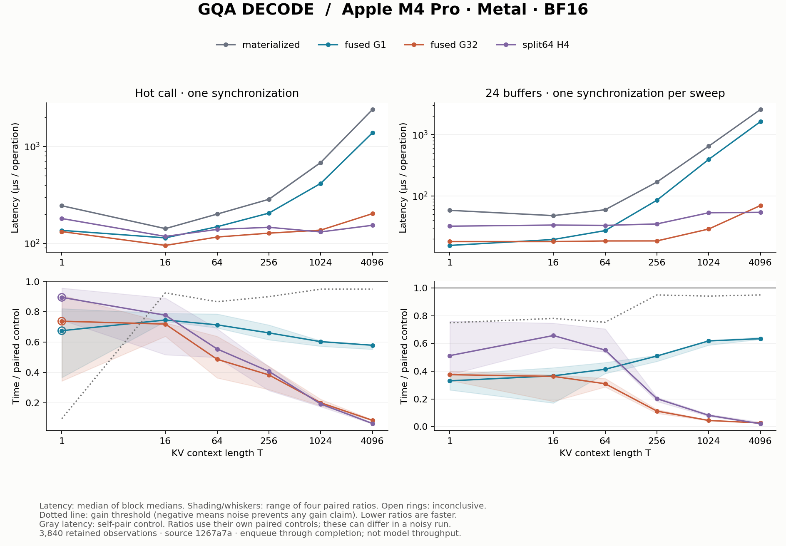

# GQA decode: fusion, parallelism and KV reuse

## Fresh result

At T=4096, split64 H4 passes the gain rule with **93.7% lower paired hot
latency and 97.9% lower ring24 latency** versus the materialized control:
2441.50 → 153.75 µs hot and 2585.49 → 53.99 µs per ring attention. That is
about 15.9× and 47.5× paired speedup against this repository's baseline.

Simple fusion helps, but parallel fusion delivers a much larger improvement.
G32 has lower observed latency than split64 H4 at short contexts, while H4
has lower observed latency at T=4096. Each is paired with the materialized
control here; this refreshed matrix does **not** establish a new direct
G32-versus-H4 crossover. The prior campaign's direct comparison remains a
historical result. The three optimized hot comparisons at T=1 are inconclusive;
all other optimized comparisons in this matrix pass the gain rule.

Measured on Apple M4 Pro / Metal from clean source `1267a7a`,
with 3,840 retained timing observations, four blocks, ten samples per
arm and ten warmups. AC power, power mode 0 and no reported thermal/performance
warnings were recorded. Software and block conditions are in [run.json](run.json).
All observations, including calibration, are in [samples.csv.gz](samples.csv.gz);
[summary.csv](summary.csv) contains the derived decisions.

Gray absolute latency is the control's self-pair measurement; each colored
ratio uses its own paired control. In a noisy run these need not agree with a
ratio formed from the absolute curves. Shading/whiskers show the range of four
block ratios, not confidence intervals. See the [method](../../docs/experiments.md).

## Operation and ownership

One query token has 14 heads of 64 BF16 values. K and V each hold T×2×64
values: seven query heads share one KV head. Query head h uses KV head h//7,
attends to all T visible tokens, and scales its dot product by 1/8. The caller
owns projections, RoPE, KV-cache updates, allocation and synchronization.
The [materialized path](../../src/llm_mojo/attention.mojo) exposes probability
scratch; the [decode alternatives](../../src/llm_mojo/attention_decode.mojo)
return only O[1,14,64].

Online softmax keeps a running maximum m, normalizer z, and unnormalized
weighted output u. Scores round to BF16 in registers; m/z/u stay FP32. Final
output rounds to BF16. Scores and probabilities need not be written to a
device buffer, but K/V still traverse the memory hierarchy. Independent tests
compare the distinct probability-rounding paths at frozen tolerances.

| Mapping | Work ownership | What is traded |
| --- | --- | --- |
| Materialized | Separate QK, softmax and probability×V stages | Three dispatches and BF16 scratch; inspectable correctness control |
| Simple fusion G1 | One 32-lane SIMD group per query head; each lane owns dimensions l and l+32 | One dispatch, register-resident state, only 14 groups |
| Parallel fusion G32 | 32 SIMD groups per query head partition the KV sequence | 14 threadgroups of 1024 threads; 8,448 shared bytes, one barrier and an internal merge |
| Split64 H4 | 64 sequence splits, up to four related heads per group | 256 threadgroups; more independent work and KV reuse; second dispatch merges partial states |

To combine partial states, compute M=max(m_j), then
Z=sum(exp(m_j−M) z_j), U=sum(exp(m_j−M) u_j), and O=U/Z.
This is why splitting can remain numerically stable without materializing
attention probabilities.

At T=4096, unique K+V occupy 2 MiB. One-head ownership requests those values
seven times per KV group. Four-head reuse needs two passes, reducing requested
K/V loads by 3.5×. It also needs 24 FP32 source state values per lane before
temporaries. Those counts are neither measured DRAM traffic nor a physical
register allocation. Split workspace is 231 KiB, larger than the baseline's
112 KiB score/probability scratch at this length. More workspace can still win
by exposing parallel work and reuse.

The maintained matrix compares these four existing designs at
T=1,16,64,256,1024,4096 in hot and ring24 modes. It keeps a materialized self-pair
inside the same run. All twelve original optimized configurations remain in
numerical tests, including ragged/empty splits, large/tied scores, cancellation,
head mapping, output poisoning and T=4095/4096. Conditional exponential
rescaling and every intermediate tuning choice are documented in the
[historical campaign](https://github.com/attilio-castano/llm-mojo/blob/a86f4dbadb4b8c9255aacb004ad30fdfefeaa8fd/experiments/EXP-0014-gqa-decode/report.md).

The historical campaign found that fusion alone helped, additional parallelism
helped much more, and long-context split/reuse improved further. Reducing the
number of exponential calls did not improve its strong controls. A routing
bug also taught us to validate the branch actually launched: numerical parity
alone cannot detect a benchmark accidentally timing another correct kernel.
Those lessons motivate the retained route and calibration checks.

The algorithm draws on online softmax and work partitioning in
[FlashAttention-2](https://tridao.me/publications/flash2/flash2.pdf) and sequence
splitting in [Flash-Decoding](https://crfm.stanford.edu/2023/10/12/flashdecoding.html).
They are algorithm references, not performance controls. These results compare
with this repository's materialized baseline. They do not establish MLX parity,
a universal crossover, decoder-block correctness or prefill performance. The
new measurements leave both optimized finalists as explicit choices.

## Focused profile: where the time went

Three separate T=4096 captures each contain 100 warmup iterations and 500
measured iterations. Receipt and trace validation identify the source binary,
Metal device, workload and trailing dispatch sequence. Stage labels follow
that verified source enqueue order. All 3,000 measured dispatch durations are
retained in [profile_samples.csv.gz](profile_samples.csv.gz); the plotting
command regenerates [profile_summary.csv](profile_summary.csv).

| Design | Stage | Median instrumented GPU interval (µs) |
| --- | --- | ---: |
| Materialized | QK | 50.00 |
| Materialized | softmax | 1038.12 |
| Materialized | PV | 1052.08 |
| G32 | fused | 70.25 |
| Split64 H4 | decode | 29.75 |
| Split64 H4 | merge | 10.42 |

The merge is visible work: about 10.4 µs beside 29.8 µs for the split decode
stage in this capture. These are instrumented GPU intervals, not the hot/ring
latency boundary; summing medians is not an exact end-to-end decomposition.

All captures exposed 85 named counters. The compact [profile record](profiles.json)
keeps three complementary diagnostics, with units, descriptions, sample counts
and spread.
Median Kernel Occupancy was 1.46% for the materialized path, 21.58% for G32 and
7.80% for H4. Last Level Cache Limiter was 2.20%, 100.00% and 75.17%, respectively.
Instruction Throughput Limiter was 1.28%, 43.48% and 28.27%.
These device-wide samples cover each enclosing target window, not exclusive
per-kernel activity. They do not measure achieved DRAM bandwidth or prove a
causal bottleneck. The faster H4 design has lower reported occupancy than G32,
which illustrates why maximizing an occupancy number is not the objective.

No target compiler spill event was reported in these captures. That observation
is bounded to the captures, not proof that every shape or execution is spill-free.
Full traces/XML and binaries remain external; compact timing observations and
selected counter summaries are the retained profile evidence.
