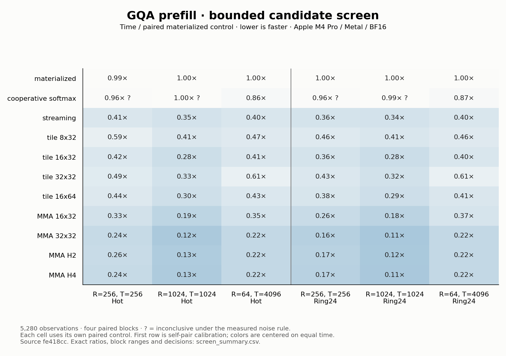
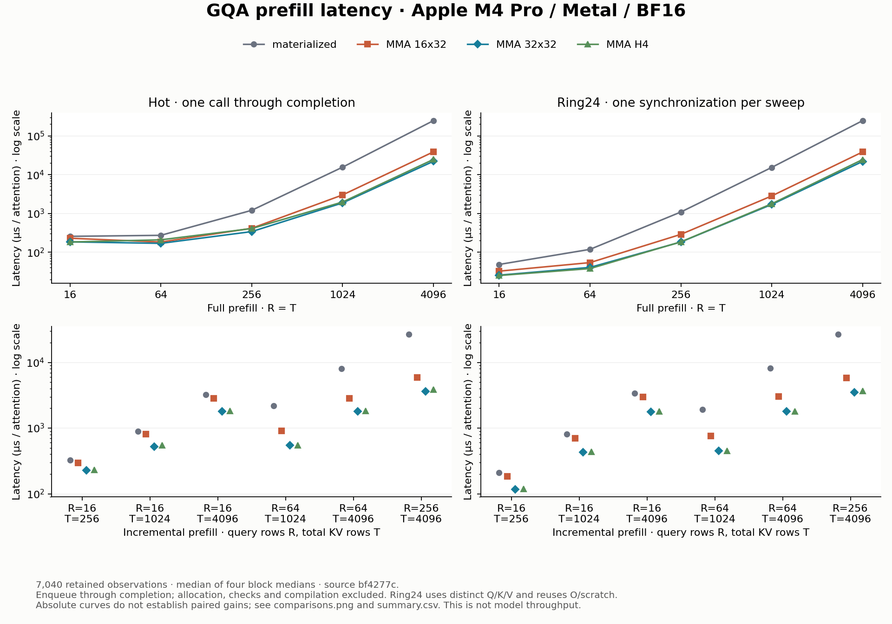
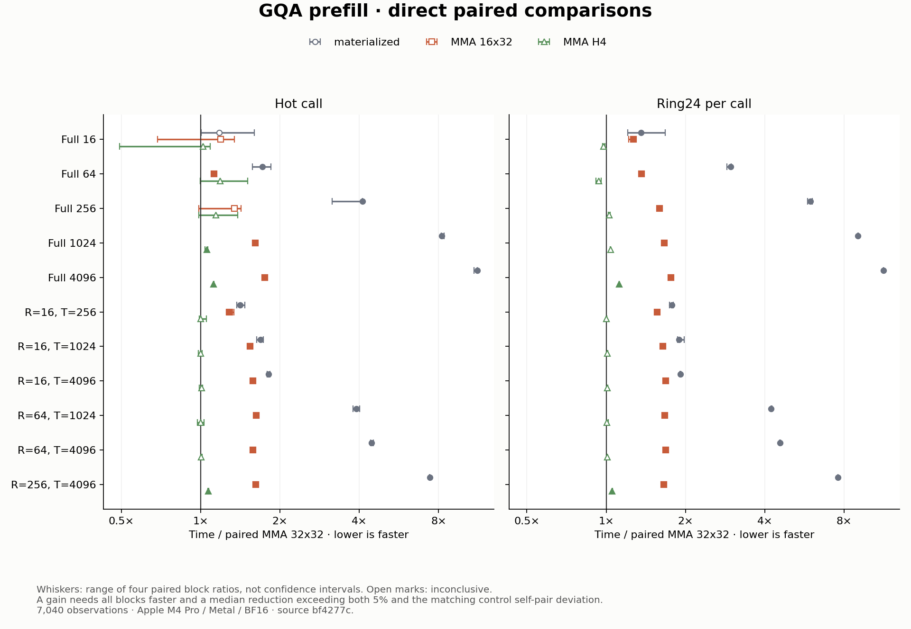
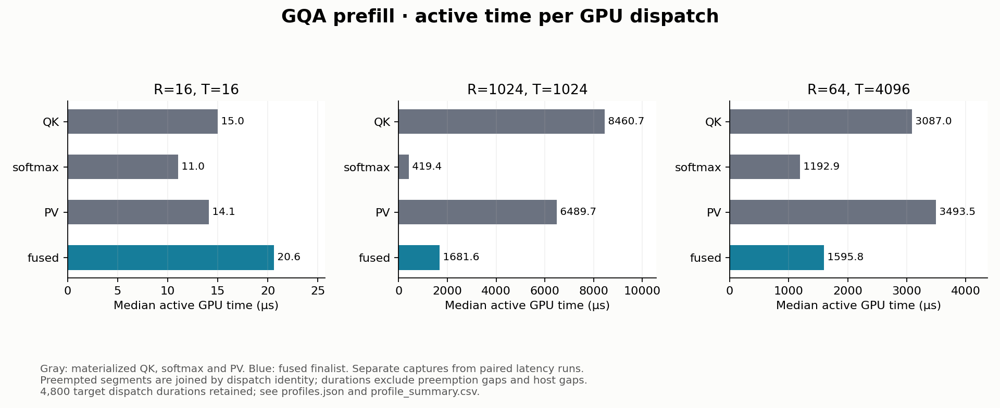
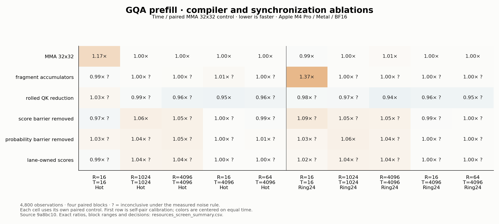
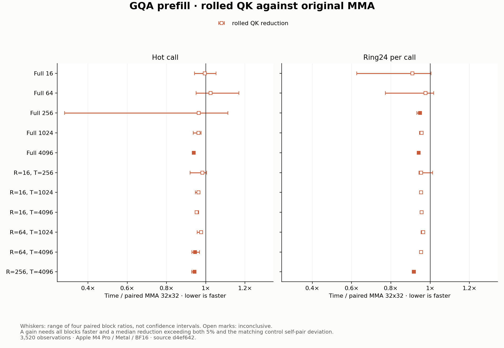

# GQA prefill: query ownership and KV reuse

**The 32x32 MMA family is the strongest design in this study.** At 4,096-token
full prefill, materialized attention takes 247.16 ms versus 22.08 ms for its
paired MMA control: **11.20× hot speedup**. Ring24 gives 246.99 → 21.88 ms per
attention, or **11.29× paired speedup**.

Materialized is slower in 21 of 22 workload/mode comparisons. The smallest
hot workload, R=T=16, remains inconclusive with a 29.2% noise floor. MMA 16x32
is slower than 32x32 in 20 comparisons and inconclusive in two. H4 demonstrates
no gain: 17 comparisons are inconclusive and five are slower, including about
12% higher time at full R=T=4096. All observations remain in the report.

A [resource follow-up](#compiler-resources-and-synchronization) below tests
five compiler and synchronization changes. Rolled QK reduces reported spills
and demonstrates six further gains against the original MMA control.

The study compares this repository's implementations on Apple M4 Pro / Metal.
It does not measure a complete decoder block or model. The result remains an
explicit kernel choice; it introduces no automatic shape crossover.

## What the operation owns

Q and O are `[R,14,64]`; K and V are `[T,2,64]`. Every seven query heads share
one KV head. Full prefill has `R=T`; incremental prefill has `R<T`. Query row
`r` is at absolute position `T-R+r` and may attend only through that position.
This distinction is part of both the numerical tests and measurement identity.

The caller provides contiguous, non-overlapping BF16 views, with
`1 <= R <= T <= 4096`, and owns allocation, projections, RoPE, KV-cache updates
and synchronization. The [original operation](../../src/llm_mojo/attention.mojo)
still exposes its probability scratch. The
[new fused operation](../../src/llm_mojo/attention_prefill.mojo) exposes only O.

At `R=T=4096`, the materialized `[R,14,T]` BF16 scratch is **448 MiB**.
Unique K+V occupy 2 MiB; Q and O each occupy 7 MiB. Fused prefill removes that
explicit quadratic scratch allocation and its producer/consumer traffic.
Inputs and output still traverse the memory hierarchy, and the compiler can
spill temporary state. Neither fusion nor a zero-scratch API means zero DRAM
traffic. This Mac uses unified memory; HBM is not its memory technology.

## From decode to prefill

Decode has one query row, so splitting the KV sequence helps expose parallel
work. Prefill already has many independent query rows. A block can own a tile
of complete outputs and stream visible K/V tiles through it, avoiding an
inter-block output reduction.

For each query row, retain maximum `m`, denominator `z`, and an unnormalized
64-dimensional output `u`. Given a tile of scaled scores S:

```text
m_new = max(m, rowmax(S))
alpha = exp(m - m_new)
P     = exp(S - m_new), with future positions set to zero
z_new = alpha * z + rowsum(P)
u_new = alpha * u + P @ V
O     = BF16(u / z), after the final tile
```

The scalar streaming family updates this state one key at a time. The MMA
family updates it once per 32-key tile and uses Apple's 8x8 matrix primitive
for QK and PV. Its gain combines matrix execution, different score ownership,
and fewer output rescalings; this comparison does not isolate an instruction
speedup while holding all other arithmetic identical.

| Design | Ownership | Working storage in the source |
| --- | --- | ---: |
| Materialized / cooperative softmax | Separate QK, softmax and PV dispatches | Global probability scratch |
| Streaming | Four SIMD groups own four query rows; each lane owns dimensions d and d+32 | No staged KV tile |
| Scalar query tiling | Four groups own 8, 16 or 32 rows and share a KV tile | 8 KiB at BK32; 16 KiB at BK64 |
| MMA 16x32 | Two groups, each owning eight query rows | 11 KiB |
| MMA 32x32 | Four groups, each owning eight query rows | 14 KiB |
| MMA H2 / H4 | Four groups own 16 rows × two heads or eight rows × four heads | 14 KiB |

An MMA lane owns two columns of an 8x8 fragment. Four lanes cooperate on each
row; XOR shuffles over lanes 1 and 8 reduce its maximum and denominator. Each
lane holds 16 FP32 output values in the source. K/V, scores and tile weights
use shared storage with four barriers per tile. These are ownership and
allocation counts, not measured physical register allocations.

H4 trades query-row reuse for head reuse while keeping 32 query/head rows per
block. Seven query heads do not divide evenly into groups of four, so the
last group has an inactive head. At a fixed query tile H4 shares K/V across
heads, but it does not automatically improve upon a larger one-head query
tile. The full matrix tests that comparison directly.

The data-flow ideas follow
[FlashAttention-2](https://crfm.stanford.edu/2023/07/17/flash2.html). Its CUDA
results are not performance controls for this Mac. The matrix primitive is
the same pinned Mojo/Apple primitive already used by this project's linear
prefill implementation. No MLX or vendor-library parity is claimed.

## Numerical gate

All paths use BF16 inputs and output with FP32 accumulation. Scaled scores
round to BF16. The materialized paths also round normalized probabilities to
BF16. Scalar fusion retains FP32 online state; MMA rounds unnormalized tile
weights to BF16 before PV while retaining the FP32 denominator. These are
separate rounding paths, checked against independent materialized FP64 NumPy
oracles at the unchanged `atol=rtol=0.015625` output tolerance.

The 29 oracle cases cover small/ragged tiles, full prefill through 4096,
incremental queries through T=4096, multiple seeds, tied/large scores,
cancellation, and extreme negative finite scores. Every one of the original eleven
routes is tested; the resource follow-up adds five ablations under the same gate. Additional tests verify exact causal independence from
future K/V perturbations, full-versus-suffix agreement, probability scratch,
output overwrites, unsupported shapes and invalid route IDs. Every benchmark
process also checks its actual control and candidate before timing, for each
distinct input buffer.

The extreme-negative test found a real defect after screening: a finite
`-1e30` initial maximum caused NaNs for smaller valid scores. It failed before
the fix and passes with negative-infinity initialization and masking. The
screen retains its original source `fe418cc`; the final matrix and profiles
use corrected source `bf4277c`. Screening inputs were unchanged. Generated
arrays remain in `build/`, bound by a frozen manifest and individual hashes.

## Bounded screen and direct comparison

The screen tested eleven routes at `(R,T)=(256,256),(1024,1024),(64,4096)`.
It retained **5,280 observations**. Cooperative softmax was inconclusive for
both square shapes and faster for the incremental shape. Fusion helped
throughout; larger scalar tiles were not uniformly better. The 32x32 MMA
route was the leading simple design, with head-sharing routes close to it.
These screening ratios each use the materialized control; differences
between optimized candidates are only selection evidence at this stage.



The final matrix pairs materialized, MMA 16x32, MMA 32x32 and MMA H4 with
**MMA 32x32 as control**. It includes five full shapes (`16,64,256,1024,4096`)
and six incremental shapes (`16→256,16→1024,16→4096,64→1024,64→4096,256→4096`),
where the arrow means query rows R followed by total KV rows T. It retains
**7,040 observations** and directly tests both the tile-size change and H4
against a strong control.

| R, T | Mode | Materialized (ms) | Paired MMA 32x32 (ms) | Paired speedup |
| --- | --- | ---: | ---: | ---: |
| 1024, 1024 | Hot | 15.59 | 1.89 | 8.23× |
| 1024, 1024 | Ring24 | 15.38 | 1.71 | 9.02× |
| 4096, 4096 | Hot | 247.16 | 22.08 | 11.20× |
| 4096, 4096 | Ring24 | 246.99 | 21.88 | 11.29× |
| 16, 4096 | Hot | 3.26 | 1.81 | 1.81× |
| 16, 4096 | Ring24 | 3.40 | 1.78 | 1.91× |
| 64, 4096 | Hot | 8.02 | 1.80 | 4.45× |
| 64, 4096 | Ring24 | 8.15 | 1.79 | 4.56× |

Each row uses that comparison's own paired control. A ratio of displayed
medians need not equal the median of block ratios or a ratio of the absolute
curves. Exact observations and decisions are in [summary.csv](summary.csv).

Geometry matters even at similar arithmetic work. `(16,4096)` and `(64,1024)`
have 65,416 and 63,520 visible query/key pairs per head, respectively. Their
paired MMA hot times are 1.81 ms and 0.56 ms. The work layout offers a plausible
explanation: more query rows expose more independent blocks, while a shorter
KV scan reduces the dependent work within each block. T alone does not
describe a prefill workload.




Four blocks reverse workload and arm order in blocks 2 and 3. Each arm has
ten warmups and ten samples. A gain requires every block faster and a median
reduction greater than both 5% and the largest matching self-pair deviation.
Whiskers are the range of block ratios, not confidence intervals. No samples
were discarded. See [the method](../../docs/experiments.md).

Hot timing covers one enqueue through completion. Ring24 uses 24 distinct
Q/K/V buffer sets, reuses output/scratch, synchronizes once and divides by 24.
It changes both reuse distance and synchronization amortization. It is neither
guaranteed cold memory nor a 24-layer model. Compilation, allocation, input
initialization and numerical gates are outside timing. Each block records AC
power, power mode, thermal/performance warnings, memory and display state.

## Focused profiles

Six separate captures compare materialized and MMA 32x32 at `(16,16)`,
`(1024,1024)` and `(64,4096)`. Short prefill uses 1,000 measured iterations;
the larger workloads use 100. Each capture has ten warmups and a 250 ms idle
tail. Verified launch receipts bind the compiled source/binary, Metal device,
rectangular shape, tile parameters and trailing dispatch sequence. The
curated record retains **4,800 measured dispatch durations**.



At R=T=1024 the median active dispatch times are 8.461 ms QK, 0.419 ms
softmax and 6.490 ms PV, versus 1.682 ms for fused MMA. QK and PV dominate
this materialized workload, consistent with the cooperative-softmax screen
being inconclusive there. At `(64,4096)`, softmax is a larger portion:
3.087 ms QK, 1.193 ms softmax and 3.494 ms PV, versus 1.596 ms fused.

Instruments split one measured square-prefill dispatch into two active
intervals. The original row-count segmentation shifted stage labels. The
corrected analyzer joins non-overlapping segments by command buffer, encoder
and GPU submission, then requires complete trailing submission coverage.
Active durations exclude preemption gaps; counter windows retain the true
last-segment end. Tests cover split segments, missing dispatches, overlapping
segments and ambiguous encoders. These original exports were reanalyzed;
no additional GPU capture or latency resampling was needed. The same repair
also corrected the retained decode profile samples.

| R, T | Design | Kernel Occupancy | Instruction Throughput Limiter | Last Level Cache Limiter |
| --- | --- | ---: | ---: | ---: |
| 16, 16 | Materialized | 3.47% | 12.44% | 1.70% |
| 16, 16 | MMA 32x32 | 2.41% | 6.21% | 1.56% |
| 1024, 1024 | Materialized | 92.55% | 88.42% | 52.58% |
| 1024, 1024 | MMA 32x32 | 20.82% | 76.48% | 100.00% |
| 64, 4096 | Materialized | 32.50% | 86.11% | 84.97% |
| 64, 4096 | MMA 32x32 | 5.83% | 21.94% | 10.75% |

These are medians of named counter samples. Units, sample counts, descriptions
and spread are retained in [profiles.json](profiles.json).

Named counters are device-wide samples within each target window. They do not
measure exclusive per-kernel activity or prove a DRAM bottleneck. Instrumented
active GPU durations exclude preemption and host gaps and use a different
boundary from paired latency; stage medians are not an exact end-to-end
decomposition.

All three MMA captures report **144 bytes as the maximum spill size per
event**, with 1,010 events in the short capture and 110 in each larger capture
across the selected warmup/profile submissions. This is a compiler-event
quantity, not measured spill traffic or total workspace. The materialized
captures report no target spill event. The MMA source's FP32 state therefore
must not be described as proven entirely register-resident. Removing explicit
attention scratch and eliminating compiler spills are different optimizations.
The lower reported occupancy of the faster MMA path also shows why occupancy
alone is not the objective.

## Compiler resources and synchronization

The follow-up holds the original 32x32/BK32/H1 MMA kernel (route 8) fixed and
changes one implementation detail at a time. All five new routes pass the
same 29 independent oracle cases and unchanged tolerance. Normal execution
also repeats each new route twelve times per oracle case, poisoning output
before every launch: 1740 additional candidate/oracle checks. The original
`_mma` body remains unchanged; the ablations use `_mma_tuned`.

| Route | Isolated change | IR lines | IR alloca sites | Barriers/tile | Shared allocation |
| --- | --- | ---: | ---: | ---: | ---: |
| 8 | Original control | 4239 | 30 | 4 | 14 KiB |
| 11 | Eight two-value output fragments | 4006 | 6 | 4 | 14 KiB |
| 12 | Rolled inner QK reduction | 2967 | 30 | 4 | 14 KiB |
| 13 | Remove score barrier | 4238 | 30 | 3 | 14 KiB |
| 14 | Remove probability barrier | 4238 | 30 | 3 | 14 KiB |
| 15 | Keep scores in lane-owned registers | 4102 | 30 | 4 | 10 KiB |

These are counts from the pinned compiler's intermediate Metal LLVM output
at R=T=1024, not physical register allocation or measured memory traffic.
The control carries sixteen FP32 output values per lane. Route 11 expresses
them as eight two-value fragments, while route 15 adds eight live FP32 scores
per lane to eliminate the shared score tile. Route 12 rolls only QK's
head-dimension reduction; its key-fragment loop and the PV loops remain
unrolled. [resources_ir.json](resources_ir.json) binds the source and IR hashes.

Each barrier ablation differs from normalized control IR by exactly one
removed barrier instruction. The ownership argument is stronger than a
passing numerical test: each lane reads the same score and probability
addresses that it wrote. Row exchanges are explicit register shuffles;
MMA exchanges already-loaded fragments. There is no cross-thread handoff
through these two shared arrays. K/V staging crosses SIMD groups, so its
publication barrier and final reuse barrier remain in every candidate.

The screen retains all 4800 observations across five workloads and both
modes. Rolled QK has two faster and eight inconclusive comparisons. Fragmented
accumulators and each barrier removal have one slower and nine inconclusive
comparisons; lane-owned scores are inconclusive throughout. Small R=T=16 is
noisy: its self-pair floors are 69.96% hot and 30.40% ring24. The reported
short-ring regression for fragments therefore comes from a noisy setting;
it still crosses the predeclared decision rule. No observations were discarded.



Only route 12 qualified for the full matrix. No second demonstrated
improvement justified a combination. The finalist was frozen before its
3520-observation comparison against route 8 across all eleven workloads.

The final matrix demonstrates six faster comparisons, sixteen inconclusive
comparisons, and no regressions under the decision rule. Full 4096 prefill
improves by about 6%; the largest confirmed reduction is 8.31% for the
256-query suffix over 4096 KV rows in ring24. The 16-query suffix over 4096
KV rows, which barely qualified in hot screening, is inconclusive in the
final run. Selection evidence does not replace the final comparison.

| R, T | Mode | Paired control (ms) | Rolled QK (ms) | Paired time reduction |
| --- | --- | ---: | ---: | ---: |
| 256, 256 | Ring24 | 0.183 | 0.173 | 5.12% |
| 4096, 4096 | Hot | 23.993 | 22.542 | 6.15% |
| 4096, 4096 | Ring24 | 23.799 | 22.395 | 5.84% |
| 64, 4096 | Hot | 1.765 | 1.681 | 5.40% |
| 256, 4096 | Hot | 3.665 | 3.457 | 5.74% |
| 256, 4096 | Ring24 | 3.654 | 3.356 | 8.31% |

Only confirmed gains appear in this compact table; every comparison and every
block range remains in [resources_summary.csv](resources_summary.csv) and the
figure. Displayed times are medians of block medians; reductions use the median
of paired block ratios. They need not equal a ratio of the displayed times.
Absolute times from the earlier campaign are not controls for this new run.

Route 12 is available as explicit `SCHEDULE=2` with `MMA=True, BQ=BK=32,
HEADS=1`. It is supported by the sampled gains and absence of demonstrated
regressions, while sixteen inconclusive cells limit claims of general benefit.
The existing default and original control remain available; no automatic
shape crossover was added.



Six separate captures retain 2400 measured dispatch durations: 1000 each for
control and finalist at R=T=16, and 100 each at (1024,1024) and (64,4096),
all with ten warmups. All three workload pairs report a maximum spill size
per event of **144 bytes for control and 48 bytes for rolled QK**. Each short
capture has 1010 target spill events; each larger capture has 110, including
warmups. Spills are reduced, not eliminated.

| R, T | Control active GPU time (µs) | Rolled QK active GPU time (µs) | Control / rolled spill maximum (bytes/event) |
| --- | ---: | ---: | ---: |
| 16, 16 | 30.584 | 29.792 | 144 / 48 |
| 1024, 1024 | 1703.458 | 1658.480 | 144 / 48 |
| 64, 4096 | 1698.688 | 1527.479 | 144 / 48 |

These are median active dispatch durations from separate single captures,
not paired speed estimates. The retained [profile record](resources_profiles.json)
and [dispatch table](resources_profile_summary.csv) preserve the capture
identities, counters, conditions and exact dispatch counts. Preempted segments
are joined using the same validated analyzer as the original study.

At R=T=1024, median Kernel Occupancy is 20.62% → 20.42%, Instruction Throughput
Limiter is 74.39% → 82.15%, and Last Level Cache Limiter is 100.00% → 49.97%.
These device-wide samples suggest changed resource pressure without an
occupancy increase. They cannot establish exclusive kernel traffic or a DRAM
bandwidth reduction. The spill maximum and the sum of compiler events are
not measurements of bytes transferred at runtime.

The evidence supports shorter QK scheduling as a useful compiler target:
about 30% fewer IR lines, unchanged IR alloca count, unchanged shared storage
and barriers, lower reported spills, and modest paired gains. Exact attribution
of spills to particular source values remains unknown. Fragment accumulators
were not profiled, so their lower alloca count cannot be claimed to change
physical spills.

The smaller intermediate program and any physical spill statistic answer
different questions. The screen already rejects the idea that fewer IR
allocations, fewer barriers, or less shared storage alone guarantee a speedup.

## Reproduce and continue

The original screen/final latency pairs and profiles remain unchanged. The
follow-up adds `resources_screen_` and `resources_` latency pairs, one
`resources_` profile pair, their small CSV summaries, two PNGs and one compact
IR record. The six report PNGs answer different study questions. Full traces,
XML, IR dumps, compiled binaries and oracle arrays remain outside Git.

Use [the package commands](../../src/llm_mojo/benchmarks/README.md) to validate,
build, measure, inspect compiler IR and profile. Regenerate all tables and
figures without GPU work:

```bash
uv run --locked --with matplotlib==3.10.8 python -m llm_mojo.benchmarks.plot
```

Local tags preserve the measured source identities across a future squash merge:

| Stage | Commit | Tag |
| --- | --- | --- |
| Original candidate screen | `fe418cc` | `study/gqa-prefill-screen-v1` |
| Original final matrix / profiles | `bf4277c` | `study/gqa-prefill-v1` |
| Five resource ablations | `9a8bc10` | `study/gqa-prefill-resources-screen-v1` |
| Rolled QK final matrix / profiles | `d4ef642` | `study/gqa-prefill-resources-v1` |

Publish these tags alongside the branch when sharing the study. Original trace
reanalysis uses the dispatch-coalescing fix at `a07a581`; every profile record
binds analysis and curation source hashes independently from captured kernel
source. Use the current analyzer for exports from either measured checkout.

Full numerical validation passed 71 Mojo tests and 36 Python checks. All sixteen
prefill measurement routes passed in hot and ring24 modes. The five new
schedules additionally passed 1740 normal-mode poisoned-output oracle checks.
The finalist changes only the QK loop schedule; the frozen Mojo 1.0.0 / MAX
26.5.0 toolchain, BF16/FP32 contract and numerical tolerances are unchanged.
Both latency runs and all six new captures passed the AC/thermal conditions.

The bounded follow-up stops with five individual ablations, no combination,
one finalist, 8320 latency observations and six of the permitted twelve
captures. The rolled path is an explicit optimized option; sixteen inconclusive
comparisons and remaining reported spills limit the result. Decoder-block
composition remains a separate milestone: projection, positions, cache mutation,
residual paths and the MLP are not proved by an attention-kernel speedup.
