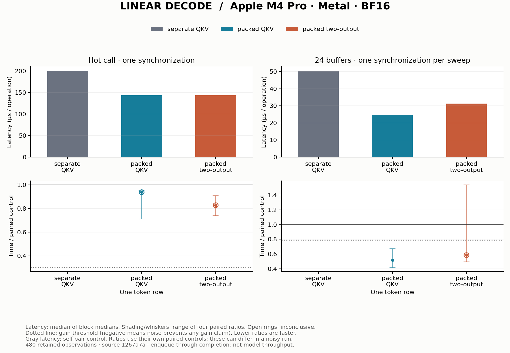

# Linear decode: share input and combine QKV

## Fresh result

Packed QKV passes the gain rule in ring24: **48.3% lower paired latency**
(52.52 → 24.67 µs per QKV operation). Hot packing and both two-output
comparisons are inconclusive. The hot self-pair noise floor is 69.6%; in the
two-output ring comparison, one block reverses direction. A lower aggregate
median alone therefore does not earn a speed claim.

Measured on Apple M4 Pro / Metal from clean source `1267a7a`,
with 480 retained timing observations, four blocks, ten samples per
arm and ten warmups. AC power, power mode 0 and no reported thermal/performance
warnings were recorded. Software and block conditions are in [run.json](run.json).
All observations, including calibration, are in [samples.csv.gz](samples.csv.gz);
[summary.csv](summary.csv) contains the derived decisions.

Gray absolute latency is the control's self-pair measurement; each colored
ratio uses its own paired control. In a noisy run these need not agree with a
ratio formed from the absolute curves. Shading/whiskers show the range of four
block ratios, not confidence intervals. See the [method](../../docs/experiments.md).

## Operation and ownership

One token produces Q[896], K[128] and V[128] from X[896]. The affine operation
uses weights W[N,K] with contiguous K, FP32 accumulation, promoted BF16 bias,
and one final BF16 output cast. Here K=896 and packed N=1152.
[The source](../../src/llm_mojo/linear.mojo) keeps each implementation explicit.

Packed weights contain 1,032,192 BF16 elements: 2,064,384 bytes per layer,
about 47.25 MiB across 24 layers. The input is only 1,792 bytes. Decode has one
token row, so weights have little reuse across tokens within an operation.

| Mapping | Launches per QKV | Lane ownership |
| --- | --- | --- |
| Separate Q, K, V | 3 | A SIMD group reduces one output's K dimension; each lane handles K/32=28 elements |
| Packed QKV | 1 | Same arithmetic ownership over 1152 outputs; Q/K/V are contiguous output slices |
| Packed two-output | 1 | A SIMD group computes two adjacent outputs and reuses each loaded input element |

Packing combines launches; it does not remove the weight dot products. Two
outputs reuse input loads while doubling accumulator state and reducing the
number of independent groups. Both tradeoffs need measurement. The two-output
entrypoint intentionally supports only M=1.

The maintained comparison uses M=1, with one weight buffer and a rotating set
of 24 weight buffers. All arms use the same packed allocation; the separate
control addresses its Q/K/V slices. Every layer's full output is checked before
timing, with NaN poisoning to expose unwritten elements. The independent
numerical suite separately covers varied inputs, weights, bias and ragged K.

Historical EXP-0004 through EXP-0006 explored these steps. The fresh study
compares both alternatives directly with separate QKV under one common
protocol. It does not change the engine's public projection dispatcher or
measure projection plus RoPE, cache updates or attention.
