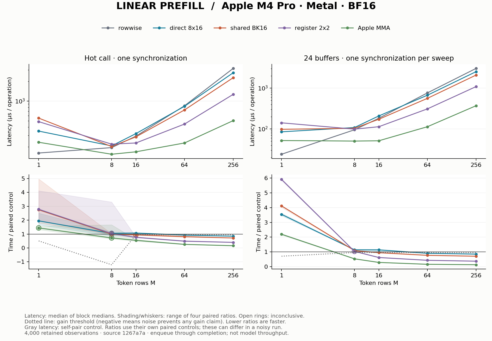

# Linear prefill: reuse weights across rows

## Fresh result

The measured benefit grows with token rows. Apple MMA passes the gain rule
at M=8,16,64,256 in ring24 and M=16,64,256 in hot mode. At M=256 it reduces
paired latency by **84.1% hot and 87.6% ring24** versus rowwise. At M=1,
all four tiled alternatives are slower in ring24. These are sampled sizes,
not proof of an exact crossover between them.

At M=256, direct, shared BK16 and register 2×2 also pass the gain rule versus
rowwise. Register 2×2 reduces paired latency by 60.0% hot and 63.5% ring24.
This is a useful intermediate ownership design even though MMA has the lowest
observed latency among the retained candidates at that size.

Measured on Apple M4 Pro / Metal from clean source `1267a7a`,
with 4,000 retained timing observations, four blocks, ten samples per
arm and ten warmups. AC power, power mode 0 and no reported thermal/performance
warnings were recorded. Software and block conditions are in [run.json](run.json).
All observations, including calibration, are in [samples.csv.gz](samples.csv.gz);
[summary.csv](summary.csv) contains the derived decisions.

Gray absolute latency is the control's self-pair measurement; each colored
ratio uses its own paired control. In a noisy run these need not agree with a
ratio formed from the absolute curves. Shading/whiskers show the range of four
block ratios, not confidence intervals. See the [method](../../docs/experiments.md).

## Operation and ownership

Prefill computes X[M,896] times W[1152,896] transposed, plus bias, yielding
O[M,1152]. All arrays are BF16 and contiguous along their last dimension;
dot products accumulate in FP32. Increasing M supplies more token rows and
creates opportunities to reuse weights. See [the source](../../src/llm_mojo/linear.mojo).

The work is approximately 2 × M × 896 × 1152 floating-point operations.
At M=256 that is about 528 million operations per packed projection. The
weight footprint remains about 1.97 MiB; reuse across rows can therefore
change the limiting resource compared with decode.

| Mapping | Tile / owner | Reuse and cost |
| --- | --- | --- |
| Rowwise | One SIMD group per output | K is partitioned over lanes; one FP32 accumulator per lane and one reduction |
| Direct | 8×16 output tile, 128 threads | Each thread owns one output and streams K; no shared staging or barriers |
| Shared BK16 | Same 8×16 tile | Cooperatively stage 8×16 input and 16×16 weight values per K phase; 768 bytes shared, 56 phases, 112 barriers |
| Register 2×2 | 8×16 output tile, 32 threads | Four FP32 accumulators per lane; reuse loaded operands across four outputs; no shared storage |
| Apple MMA | 8×16 output tile, 32 threads | Two collective 8×8 fragments per K=8 phase; four distributed FP32 accumulators per lane |

The register mapping computes four complete output accumulators per lane;
it is distinct from the rowwise K reduction. MMA distributes fragment
ownership across the same hardware SIMD group. It is one arithmetic option,
not a prerequisite for correct tiling. The shared candidate illustrates why
reducing source loads can still lose when barriers and staging cost too much.

The maintained comparison uses M=1,8,16,64,256 in hot and ring24 modes. Every
candidate is paired directly with rowwise, including a rowwise self-pair.
This gives a readable ownership comparison without replaying every historical
BK sweep. Independent tests retain exact and ragged M/N/K cases, safe shared
barriers, collective zero fill and comparisons with the host reference.

Historical EXP-0007 through EXP-0013 found different crossovers for these
mappings. Those observations are preserved in Git. This study establishes new
measurements with one protocol; it does not inherit an old crossover threshold
or introduce an automatic selector. Packed N=1152 evidence is not proof for
N=128, arbitrary M, other devices, or complete-model throughput.
