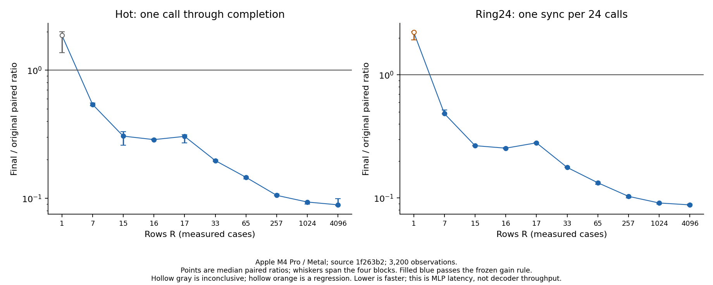
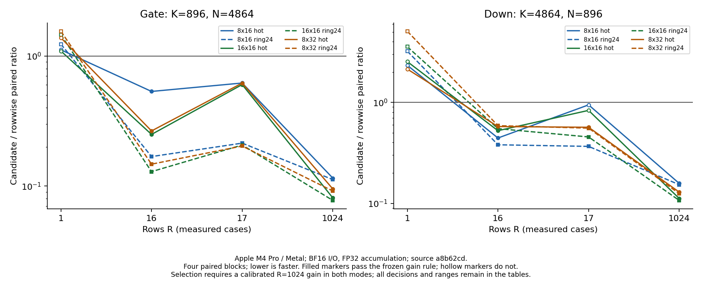
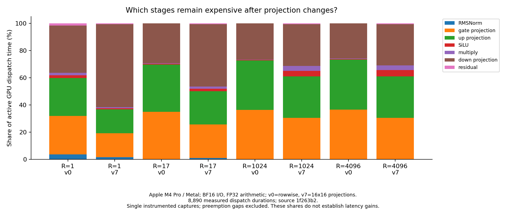

# Qwen MLP on Metal

The completed campaign selects the existing **16x16 Apple MMA mapping for gate,
up and down** as explicit MLP variant 7. Variant 0 preserves the original
rowwise path and remains the default. Both compute the complete post-attention
RMSNorm, SwiGLU MLP and residual, with H=896 and I=4864.

On Apple M4 Pro/Metal, hot MLP latency falls from **146.2 to 13.7 ms at R=1024**
and **603.6 to 54.6 ms at R=4096**. The paired speedups are 10.7x and 11.2x;
ring24 gives 11.0x and 11.4x. All measured R>=7 cases pass the frozen gain rule
in both modes. **One-row ring24 is 2.23x slower**, and one-row hot is
inconclusive. Mapping selection stays explicit.

R counts new rows; there is no KV-cache-length axis in this sublayer. Decoder
composition, cache management and token generation remain separate work.

## Direct original-versus-final latency

| Rows R | Hot original -> final (ms) | Hot ratio / decision | Ring24 original -> final (ms) | Ring24 ratio / decision |
| ---: | ---: | --- | ---: | --- |
| 1 | 0.331 -> 0.561 | 1.8787 / inconclusive | 0.198 -> 0.442 | 2.2277 / slower |
| 7 | 1.035 -> 0.568 | 0.5408 / faster | 0.929 -> 0.450 | 0.4848 / faster |
| 15 | 2.115 -> 0.675 | 0.3058 / faster | 1.950 -> 0.521 | 0.2662 / faster |
| 16 | 2.223 -> 0.641 | 0.2870 / faster | 2.078 -> 0.528 | 0.2539 / faster |
| 17 | 2.383 -> 0.733 | 0.3043 / faster | 2.205 -> 0.623 | 0.2807 / faster |
| 33 | 4.445 -> 0.878 | 0.1970 / faster | 4.282 -> 0.761 | 0.1772 / faster |
| 65 | 8.704 -> 1.271 | 0.1459 / faster | 8.775 -> 1.146 | 0.1329 / faster |
| 257 | 35.462 -> 3.762 | 0.1055 / faster | 35.145 -> 3.625 | 0.1031 / faster |
| 1,024 | 146.206 -> 13.704 | 0.0935 / faster | 150.470 -> 13.553 | 0.0911 / faster |
| 4,096 | 603.572 -> 54.630 | 0.0889 / faster | 602.551 -> 52.967 | 0.0879 / faster |

Latencies are milliseconds per complete MLP call, reported as medians of four
block medians. Ratios are medians of the four paired candidate/control ratios;
dividing the two aggregate latency medians need not reproduce them, especially
for noisy one-row calls. The decision uses the frozen calibration rule below.
All values, ranges and self-pairs remain in the
[complete comparison table](data/optimization_final_summary.csv).

- **Hot:** faster at R=7,15,16,17,33,65,257,1024,4096; inconclusive at R=1.
- **Ring24:** faster at R=7,15,16,17,33,65,257,1024,4096; slower at R=1.

These are decisions at the measured row counts. Mapping remains explicit;
the campaign introduces no automatic crossover rule or default change.



## How the configuration was selected

The [approved bounded plan](optimization-plan.md) began from `ee3b99f`. It
screened existing bias-free rowwise, 8x16, 16x16 and 8x32 mappings independently
for gate and down at R=1,16,17,1024, in hot and ring24 modes. Qualification
required a calibrated R=1024 gain in both modes. Among qualifying mappings,
selection minimized the worse mode's ratio, with a fixed tile-ID tie break.
This chooses one finalist per geometry; it does not prove that it beats every
other tile in a direct comparison.

Both screens selected 16x16 at source `a8b62cd`:

| Projection | Mode | Rowwise (ms) | 16x16 (ms) | Paired ratio |
| --- | --- | ---: | ---: | ---: |
| Gate | Hot | 52.290 | 4.243 | 0.0811 |
| Gate | Ring24 | 52.101 | 4.041 | 0.0776 |
| Down | Hot | 38.399 | 4.284 | 0.1116 |
| Down | Ring24 | 38.212 | 4.082 | 0.1068 |

The screens retain all 5,120 observations. Gate 16x16 regresses by 45.8% at
R=1 in ring24; its hot comparison is inconclusive. Down 16x16 is 2.54x slower
hot and 3.57x slower in ring24 at R=1. Its R=17 hot result is inconclusive.
Those cells remain in the tables and were not repeated selectively.



The follow-ups at `2760400` first confirmed the gate choice on up's distinct
weights, then measured gate/up in the whole MLP, then changed down with
gate/up fixed. Each contains 1,280 observations, including matched self-pairs.
All passed the predeclared R=1024 qualification rule in both modes:

| Comparison at R=1024 | Hot control -> candidate (ms) | Hot ratio | Ring24 control -> candidate (ms) | Ring24 ratio |
| --- | ---: | ---: | ---: | ---: |
| Original -> gate/up 16x16 | 143.685 -> 47.587 | 0.3312 | 143.518 -> 47.421 | 0.3304 |
| Gate/up 16x16 -> all projections 16x16 | 48.323 -> 13.444 | 0.2825 | 47.424 -> 13.308 | 0.2806 |

Up's isolated confirmation ratios were 0.0811 hot and 0.0776 ring24. These
comparisons explain the increments; the headline gain comes from the direct
final measurement, without multiplying ratios from different comparisons.
The [selection record](data/optimization_combination_selection.json) links
every comparison to its complete samples.

Variant IDs keep the experiment explicit:

| Variant | Gate/up mapping | Down mapping |
| ---: | --- | --- |
| 0 | Rowwise | Rowwise |
| 1 / 2 / 3 | 8x16 / 16x16 / 8x32 | Rowwise |
| 4 / 5 / 6 | Rowwise | 8x16 / 16x16 / 8x32 |
| 7 | 16x16 | 16x16 |

## Ownership, reuse and the short-row cost

Gate/up have K=896,N=4864; down has K=4864,N=896. Each projection performs
the same useful `2*R*896*4864` arithmetic count. The rowwise kernel assigns
one 32-lane SIMD group to each output dot product, with one FP32 partial
accumulator per lane and a final group reduction. Gate/up have 28 products
per lane; down has 152. Four groups share a 128-thread block.

The 16x16 mapping assigns one SIMD group to four 8x8 output fragments, with
eight logical FP32 accumulator scalars per lane. It reuses each weight fragment
across two input row fragments, and each input fragment across output fragments.
The existing kernel adds no shared staging, barrier or K split.

At R=1024:

| Geometry | Rowwise groups | 16x16 groups | MMA K steps | Rowwise operand requests (MiB) | 16x16 operand requests (MiB) |
| --- | ---: | ---: | ---: | ---: | ---: |
| Gate/up | 4,980,736 | 19,456 | 112 | 17,024 | 1,064 |
| Down | 917,504 | 3,584 | 608 | 17,024 | 1,064 |

For these unpadded widths, BF16 operand requests excluding output stores are
`4*R*N*K` bytes for rowwise and
`2*(ceil(R/BM)*N*K + R*K*ceil(N/BN))` for a BM-by-BN tile. These count requests
visible in the source, not measured DRAM traffic. Logical accumulator counts
also do not establish physical register allocation or occupancy.

For one gate row, 16x16 requests 8.832 MiB rather than rowwise's 16.625 MiB,
but executes matrix work for sixteen rows and exposes only 304 groups rather
than 4,864. One-row down has just 56 tiled groups, each with 608 K steps,
versus 896 rowwise groups. Fewer requested bytes alone cannot predict runtime.
The adjacent R=15,16,17 cases preserve the evidence around a row-tile boundary.

The seven stages and BF16 boundaries remain materialized:
`X -> N -> G/U -> A -> S -> D -> Y`. RMSNorm uses one 128-thread block per
row; SiLU, multiply and residual each use one element per thread. The caller
owns weights, input and workspace. Enqueue performs seven ordered dispatches
without allocation, upload or synchronization. Inputs and weights cannot
overlap writable workspace, and outputs must be consumed before reuse.

Weights occupy 26,150,656 bytes including norm; workspace occupies `44,288*R`
bytes, and each separate input occupies `1,792*R`. At R=4096, hot engine
buffers total 214,894,336 bytes; ring24 inputs/weights with shared workspace
total 985,180,160 bytes. Both variants have the same allocation footprint.
These counts exclude CPU fixtures, command storage and runtime overhead.

## Numerical acceptance

The [numerical contract](../../docs/mlp-sublayer.md), reference sources,
dependencies, arithmetic boundaries and budgets stayed fixed. Operations are
first checked with identical upstream inputs; composed D/Y are then checked
from original X under their separate budgets. Intermediate composed differences
remain diagnostics. N/G/U/D use local atol=rtol=2^-7; isolated multiply and
residual require exact BF16 bits. SiLU has its frozen relative, subnormal,
one-step and exact-zero rules. Composed D and Y use 2^-6 and 2^-5 respectively.

Final source `1f263b2` passed **102 Mojo tests, 63 Python tooling tests, eleven
pinned-reference tests and all benchmark routes**. All eight configurations
passed the 53 existing cases, including three checkpoint cases and seven
previously observed holdouts in normal asynchronous Metal mode. The latter
are regression cases, not new holdouts.

Fresh holdouts were declared at `417c782`, before candidate outputs: seeds
3037 and 3041 at R=1,17,4096, plus the reserved checkpoint prompt and its frozen
token IDs. After selecting variant 7 and freezing the final source and binary,
the reference captured these seven cases once. Original 0 and final 7 both
passed, with no adjustment to the candidate or numerical rules.

The [final numerical record](data/final_numerics.json) retains **41,210
stage/reuse comparisons**, thirteen primitive-check records, every execution
receipt, and the fresh manifest's source/binary/declaration/array identities.
All observed full-versus-chunk stage outputs were bit-exact for each tested mapping.
Tests cover poisoned outputs, inactive guards, input preservation, invalid-call
preflight and twelve asynchronous calls with varying row counts. Every timed
route also validates both arms before measurement.

The earlier baseline work explains why these gates matter. Metal can flush
BF16 subnormal operands during FP32 promotion: the straightforward SiLU path
failed 506 finite-input checks. Direct bit transport and exact tiny-input
halving made all 65,280 finite BF16 inputs match. The pinned host exponential
also required FP32 `expf` to preserve the upstream overflow boundary. Exact
integer-significand paths protect multiply and residual at tiny values.

The residual counterexample `0x0480 + 0x807f -> 0x047f` exposed 126 failures
in an initial cutoff. Extending its integer path through exponent field 9
passed all 16,711,680 finite-by-signed-subnormal/zero pairs. The
[before/after record](data/residual_boundary.json) retains that failure and
repair. An approximate test could hide its roughly 1.18e-38 absolute error.
Dedicated regressions also reject omitting the BF16 A store before multiply
or the BF16 D store before residual. These primitive implementations were
unchanged by the projection campaign.

## What remains expensive

The final profiles capture both variants at R=1,17,1024,4096 from the same
source as the direct latency campaign. They retain 8,890 measured dispatches:
seven stages per iteration, with respectively 500,100,25,10 iterations after
ten warmups. The [full profile table](data/optimization_final_profile_summary.csv)
retains per-stage means, medians and ranges.

| Rows R | Variant | Projection share | SiLU/multiply share | Down share |
| ---: | --- | ---: | ---: | ---: |
| 1 | 0 rowwise | 91.07% | 3.72% | 34.83% |
| 1 | 7 16x16 | 96.00% | 1.61% | 60.87% |
| 17 | 0 rowwise | 98.56% | 0.96% | 29.15% |
| 17 | 7 16x16 | 94.83% | 3.43% | 45.70% |
| 1,024 | 0 rowwise | 99.21% | 0.71% | 26.63% |
| 1,024 | 7 16x16 | 91.45% | 7.69% | 30.75% |
| 4,096 | 0 rowwise | 99.20% | 0.73% | 25.95% |
| 4,096 | 7 16x16 | 90.99% | 8.20% | 30.25% |



These are shares of summed active GPU dispatch time within individual
instrumented captures. They are separate diagnostics, not enqueue-through-
completion timings. Preempted segments are joined before stage assignment,
and preemption gaps are excluded from active durations. Two measured dispatches
in the R=1024 control capture required joining. Two further fragmented dispatches
at R=4096 occurred outside the measured iterations. No target compiler-spill
event was reported in any final capture; this is a bounded observation.
Optional limiter counters were not analyzed, so no DRAM-bandwidth or occupancy
claim follows.

Before the final campaign,
[two profiles of variant 7](figures/optimization_projection_profile.png) at
`2760400` put projections at 91.44% of R=1024 active time and SiLU/multiply at 7.70%. At
R=1, projections were 94.72%, down alone 59.61%, and SiLU/multiply 1.78%.
The [recorded decision](data/optimization_followup_decision.json) skipped the
two conditional fusion/packing experiments before implementing either.

SiLU/multiply fusion removes A's store/read, `4*R*I` of the two kernels'
`10*R*I` requested bytes, while preserving A's BF16 rounding and the arithmetic.
A traffic-scaled estimate is 40% of 7.70%, or about 3.08% of total active GPU
time, below the 5% decision floor. This is an estimate, not a measured gain or
upper bound. Packing gate/up with the existing tile preserves matrix work,
output stores and operand-request counts; these captures supplied no strong
launch-cost hypothesis. The decision closes this bounded campaign, without
claiming those techniques can never help.

## Measurement, provenance and reproduction

The optimization campaign retains **12,160 latency observations**: 5,120
projection-screen, 3,840 incremental and 3,200 final. Every comparison uses
four paired blocks, ten warmups and ten samples per arm. Blocks two and three
reverse workload and arm order. A gain requires all four ratios below one
and a median reduction exceeding both 5% and the largest matching self-pair
deviation. Regressions use the symmetric rule; all other cells are
inconclusive. These are conservative decisions, not confidence intervals.

Hot covers one host enqueue through completion. Ring24 uses 24 distinct
input/weight allocations containing the same frozen nonuniform seed-1601
prefix data, shares workspace, synchronizes once per sweep and divides by 24.
Isolated projection ring24 shares an exact upstream operand across distinct
weight copies. Ring24 changes reuse distance and synchronization amortization;
it is neither a real 24-layer decoder nor guaranteed cold DRAM. Allocation,
uploads, numerical checks and printing are outside timing. GPU jobs ran
sequentially, with latency and profiling separate.

The final source is `1f263b2`, Apple M4 Pro/Metal, 20 GPU cores, 24 GiB memory,
BF16 storage and FP32 arithmetic. Captured software is macOS 26.6.2 (25G83),
Xcode 26.6 (17F113), Mojo 1.0.0 and MAX 26.5. Records retain source, binary,
fixture and dependency identities; power, thermal, memory and display
conditions; and device/backend proof. AC power, Low Power Mode off and nominal
thermal checks reduce variation but do not fix GPU clocks or exclude all
background activity. All valid observations, including noisy ones, remain.

Checkpoint fixtures use the existing Qwen2.5-0.5B-Instruct revision
`7ae557604adf67be50417f59c2c2f167def9a775`, layer 0 and the frozen FP32-attention
input policy. The pinned CPU oracle uses Torch 2.4.0, Transformers 4.43.1,
NumPy 1.26.4 and Python 3.12.14 with one thread. The available checkpoint
prefix and tensor hashes are verified; this does not attest a full model file
or reproduce training arithmetic.

The first projection screen at `300ba87` stopped when the strict reader
rejected reversed candidate/control IDs in its printed header. Its twenty
parsed self-pair observations and twenty-sample rejected output remain in
[optimization_screen_attempt.json](data/optimization_screen_attempt.json),
excluded from accepted timing. The header repair changed no arithmetic;
expanded real-output smoke checks cover both arm orders and nonzero controls.
Both complete screens restarted from clean `a8b62cd`.

The earlier materialized baseline at `afb54fa` remains independently
reproducible in [data/summary.csv](data/summary.csv),
[data/profile_summary.csv](data/profile_summary.csv) and
[data/numerical.json](data/numerical.json): 3,840 latency observations and
4,445 measured dispatches. It measured control against itself, before these
projection comparisons; its [latency](figures/latency.png) and
[stage-share](figures/profile.png) figures remain available. Its two incomplete
attempts remain in
[measurement_attempt.json](data/measurement_attempt.json). Do not combine
historical baseline timings with a newer candidate to construct a speedup.

Rebuild all tables and figures from retained samples without GPU execution:

```sh
uv run --locked --with matplotlib==3.10.8 python -m llm_mojo.benchmarks.plot studies/mlp_sublayer
```

`load_numerical_record()` in `llm_mojo.benchmarks.study` verifies compressed and
original numerical-record hashes; `load_run()` and `load_profile()` validate
the retained measurement grids and identities. Generated arrays, binaries and
full traces remain outside Git; retained dispatch samples suffice to rebuild
the study figures, while original traces are required to repeat trace analysis.

For a fresh run, use clean source and fresh external output directories:

```sh
uv run --locked llm-mojo-validate
uv run --locked llm-mojo-bench build --build-dir /private/tmp/mlp-build
uv run --locked llm-mojo-bench run --build-dir /private/tmp/mlp-build --output /private/tmp/mlp-run --studies mlp_final
```

Source `1f263b2` reproduces the final measured implementation; a newer source
produces a new record. The screen/increment study names are declared in
`benchmarks.study`. The [benchmark tooling guide](../../src/llm_mojo/benchmarks/README.md)
describes profile capture receipts and exports. For the final profile grid,
use variants 0 and 7, the four declared row/iteration pairs, ten warmups,
before/after `checked_conditions()`, and the verified submission/interval
analysis before `profile_summary SOURCE OUTPUT --mlp --mlp-variants 0 7
--mlp-rows 1 17 1024 4096 --prefix optimization_final_`.

Existing fresh fixtures can subsequently run as regressions with
`MLP_SPLIT=optimization_holdout MLP_VARIANTS=0,7`. A new independent holdout
requires a new declaration before output access. The existing acceptance
generator refuses to overwrite either manifest.
