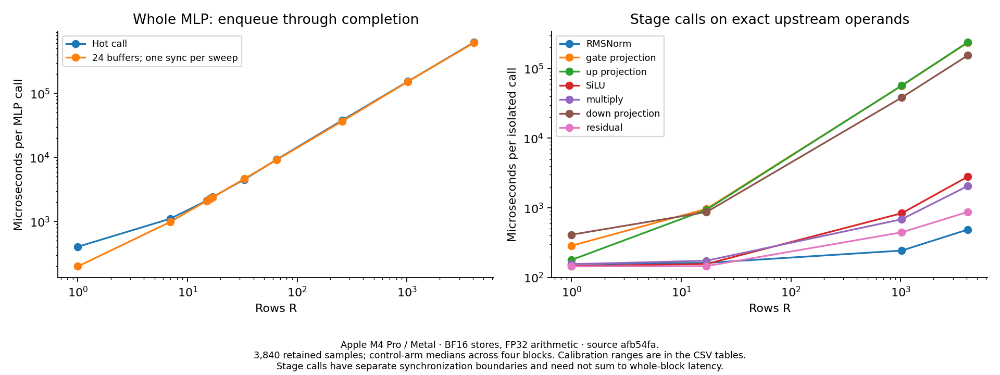
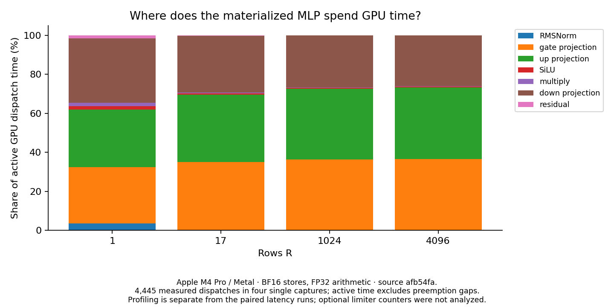

# Materialized Qwen MLP on Metal

The materialized Mojo baseline passes the frozen [numerical contract](../../docs/mlp-sublayer.md) and provides a measured reference for the post-attention MLP: RMSNorm, gate projection, up projection, SiLU, gating multiplication, down projection and residual addition. It uses H=896 and I=4864. R counts new rows; there is no KV-cache-length axis in this sublayer.

The three projections dominate this baseline. At R=4096 they account for **99.2% of active GPU dispatch time**: gate and up each contribute 36.6%, and down contributes 26.0%. Gate/up matrix tiling is the first optimization to test. The SiLU and multiplication kernels are numerically demanding, but together occupy only 0.72% of this large-input capture.

| Rows R | Hot call (ms) | Ring24, per call (ms) |
| ---: | ---: | ---: |
| 1 | 0.405 | 0.200 |
| 17 | 2.421 | 2.395 |
| 1,024 | 153.534 | 152.741 |
| 4,096 | 625.306 | 615.791 |

These are medians of four control-arm block medians on Apple M4 Pro/Metal at source `afb54fa`; [all ten row counts and calibration ranges](data/summary.csv) remain available. The R=1 hot self-pair ratios range from **0.47 to 2.93**, so its headline value is a noisy characterization. R=17 and R=4096 hot ratios stay within about 4.3% of one. Small isolated operations also show substantial variation; their apparent differences cannot select a faster route. No optimized candidate was measured.



The profile decomposition explains why the large-row work is the first target:

| Rows R | Gate share | Up share | Down share | All other stages |
| ---: | ---: | ---: | ---: | ---: |
| 1 | 28.9% | 29.5% | 33.0% | 8.7% |
| 17 | 34.6% | 34.7% | 29.1% | 1.5% |
| 1,024 | 36.3% | 36.3% | 26.6% | 0.8% |
| 4,096 | 36.6% | 36.6% | 26.0% | 0.8% |

Shares use summed active dispatch durations within each single capture. At R=4096, the median active durations are approximately 218.0 ms for each of gate/up and 154.5 ms for down. At R=1 the projection shares are more balanced, and host timing is noisy; this evidence does not establish a decode-specific winner. The [profile table](data/profile_summary.csv) retains per-stage medians, means and ranges.



## What executes

| Stage | Input and output | Work ownership |
| --- | --- | --- |
| RMSNorm | X[R,896] -> N[R,896] | One 128-thread block per row, with SIMD-group reductions and shared partial sums. |
| Gate | N @ Wgate.T -> G[R,4864] | One 32-lane SIMD group per output dot product. |
| Up | N @ Wup.T -> U[R,4864] | The same mapping on distinct weights. |
| SiLU | G -> A[R,4864] | One element per thread. |
| Multiply | A * U -> S[R,4864] | One element per thread. |
| Down | S @ Wdown.T -> D[R,896] | One SIMD group per output dot product. |
| Residual | X + D -> Y[R,896] | One element per thread. |

Each projection uses four SIMD groups in a 128-thread block. A lane accumulates 28 products in gate/up and 152 in down, then the group reduces its FP32 partial sums and lane zero stores BF16. Gate/up have more, shorter dot products; down has fewer, longer ones. Each projection performs 2*R*896*4864 floating-point operations when counting multiply and add separately. Equal operation counts do not imply equal latency.

N/G/U/A/S/D/Y are separate BF16 boundaries. Matrix reductions and SiLU arithmetic use FP32. The caller owns weights, input and workspace; enqueue performs seven ordered dispatches. Allocation, upload and synchronization are outside the engine entrypoint. The input and weights must not overlap writable workspace, and output must be consumed before reuse.

Weights occupy 26,150,656 bytes including norm. Workspace occupies 44,288*R bytes; a separate input occupies 1,792*R bytes per buffer. At R=4096, workspace is 181,403,648 bytes. Hot engine buffers total 214,894,336 bytes; ring24 inputs and weights with shared workspace total 985,180,160 bytes. These counts exclude CPU fixtures, command storage and runtime overhead.

The rowwise projections request their weights again for each row and request the input vector for each output dot product. Source-requested bytes describe this mapping; they are not measured DRAM traffic. Matrix tiles can reuse input and weight fragments explicitly. Whether a particular existing tile helps this shape is the next experiment.

## Numerical acceptance and lessons

The upstream contract and budgets were frozen before Mojo outputs were observed. All 43 synthetic and three checkpoint development cases passed, followed by six synthetic holdouts and one reserved checkpoint prompt. A subsequent primitive audit exposed the residual cutoff defect described below. After repairing it, the complete validation passed 102 Mojo tests, 59 Python tooling tests, eleven pinned reference tests and every benchmark route. The same corrected binary passed the three checkpoint cases and seven previously observed holdout cases in normal mode. The later holdout run is a regression check, not a new independent holdout.

The [numerical record](data/numerical.json) retains all 5,042 stage/reuse comparisons across 53 cases, thirteen primitive-check records, fixture identities and execution receipts. All GPU full-versus-chunked stage comparisons were bit-exact. The test suite also checks identical upstream inputs for isolated operations, poisoned outputs, inactive workspace guards, input preservation, invalid calls and twelve asynchronous calls with varying row counts. The exact residual and multiply gates remain exact; no arithmetic policy, tolerance or supported input domain was changed.

Metal can flush BF16 subnormal operands when they are promoted to FP32. A straightforward SiLU path failed 506 finite-input checks. Direct UInt16 loads/stores plus exact ties-to-even halving for tiny inputs preserve the required BF16 result. The final Metal SiLU sweep matches all 65,280 finite BF16 inputs bit for bit. On the host, the pinned Mojo exponential overflowed at 88.5; FP32 libm expf preserves the upstream overflow boundary. The declared negative-zero behavior for G<=-89 remains unchanged.

Gating multiplication uses ordinary FP32 arithmetic for the normal range and an exact integer-significand path at underflow and subnormal-input boundaries. A BF16 product has at most sixteen significant bits. Tests retain the seven frozen multipliers, 262,144 additional operand pairs, host-reference checks and explicit overflow counts.

Residual addition needs an integer path for tiny operands and cancellation. The initial cutoff missed the spacing change below a power of two: BF16 0x0480 + 0x807f must produce 0x047f, while Metal returned 0x0480 after flushing the second operand. Pairing every finite BF16 value with every signed BF16 subnormal/zero pattern exposed 126 failures. All 16,711,680 pairs pass with the integer path extended through exponent field 9; the [before/after record](data/residual_boundary.json) preserves the failed operands and source identities. The absolute difference was only about 1.18e-38; an approximate comparison could conceal it, while the exact BF16 gate rejects it.

Dedicated regressions also distinguish storing A before gating and D before residual addition from carrying unrounded values across those boundaries. A future fused kernel can remove an allocation or dispatch while preserving the rounding, but needs its own evidence.

## Measurement and provenance

Whole MLP: R=1,7,15,16,17,33,65,257,1024,4096, both hot and ring24. Isolated stages: R=1,17,1024,4096, hot only on exact upstream operands. Each uses four paired blocks with ten warmups and ten samples per arm. Blocks two and three reverse workload and arm order. There are 3,840 retained latency observations; this is control-versus-itself characterization, with no optimized candidate in the campaign.

Hot timing covers host enqueue through completion for one call. Ring24 has distinct input and weight allocations containing the same nonuniform frozen data, shares workspace, synchronizes once after 24 calls and divides by 24. It changes both reuse distance and synchronization amortization. It is not a 24-layer decoder or guaranteed cold DRAM. Isolated stage timings need not sum to whole-block timing.

Profiles are separate captures at R=1,17,1024,4096, with ten warmups and respectively 500,100,25,10 measured iterations. All 4,445 measured dispatch durations are retained. Stage assignment follows the verified seven-dispatch order and validated capture/binary identity. Preempted dispatch segments are joined, with gaps excluded from active time: two measured dispatches at R=1024 and three at R=4096 required joining. No target compiler-spill event was reported in these captures; that is a bounded observation, not proof of universal spill-free execution. Optional limiter counters were not analyzed; no DRAM-bandwidth or occupancy claim follows from their absence.

Measurements use corrected source `afb54fa`, Apple M4 Pro/Metal with 20 GPU cores and 24 GiB memory, BF16 storage and FP32 arithmetic. The captured environment is macOS 26.6.2 (25G83), Xcode 26.6 (17F113), Mojo 1.0.0 and MAX 26.5, with AC power, Low Power Mode off and nominal thermal checks. The records retain binary, source and fixture hashes, software versions, AC/power settings, thermal checks, memory and display conditions. These checks do not lock GPU clocks or remove background activity. Keep all valid observations, including noisy ones; calibration ranges are in the derived CSV tables.

Two incomplete attempts remain in [measurement_attempt.json](data/measurement_attempt.json). The first exceeded the old 300-second timeout before its first complete block. The fixed ring protocol performs 960 whole MLP invocations per largest process, so the cap was raised to 1,200 seconds. The second was stopped for the newly discovered residual counterexample; its 440 completed observations are retained as an interrupted attempt. Neither enters the accepted latency campaign.

Rebuild tables and figures from retained evidence, without GPU execution:

```sh
uv run --locked --with matplotlib==3.10.8 python -m llm_mojo.benchmarks.plot studies/mlp_sublayer
```

`load_numerical_record(Path("studies/mlp_sublayer/data/numerical.json"))` in `llm_mojo.benchmarks.study` verifies both compressed and original numerical-record hashes. The same loader reads `residual_boundary.json`.

For a fresh measurement, use clean source and fresh external output directories. Source `afb54fa` reproduces this implementation; newer source produces a new record.

```sh
uv run --locked llm-mojo-validate
uv run --locked llm-mojo-bench build --build-dir /private/tmp/mlp-build
uv run --locked llm-mojo-bench run --build-dir /private/tmp/mlp-build --output /private/tmp/mlp-run --studies mlp mlp_stage_0 mlp_stage_1 mlp_stage_2 mlp_stage_3 mlp_stage_4 mlp_stage_5 mlp_stage_6
```

Checkpoint regeneration uses `uv run --locked --script tests/fixtures/generate.py mlp -- --checkpoint-dir /absolute/path/to/verified/checkpoint`. Run `tests/test_mlp.mojo` with `MLP_SPLIT=checkpoint` for those cases. On a fresh fixture directory, `tests/fixtures/mlp_acceptance.py --candidate-binary /absolute/path/to/compiled/test_mlp --checkpoint-dir /absolute/path/to/verified/checkpoint` captures the original predeclared holdout inputs using the pinned script environment. It refuses to overwrite an existing holdout manifest. `MLP_SPLIT=holdout` evaluates those observed fixtures as regressions.

For example, the R=17 profile is built and captured with:

```sh
uv run --locked python -m llm_mojo.benchmarks.profile --operation mlp --profile-variant 0 --profile-rows 17 --profile-warmup 10 --profile-iterations 100 --build-profile-binary /private/tmp/mlp-profiles/r17-v0/profile
uv run --locked python -m llm_mojo.benchmarks.capture_trace --profile-binary /private/tmp/mlp-profiles/r17-v0/profile --output-trace /private/tmp/mlp-profiles/r17-v0/profile.trace --receipt /private/tmp/mlp-profiles/r17-v0/capture.json --time-limit 60s
```

Repeat for the other three declared `(R, iterations)` pairs. Record `conditions.json` with `checked_conditions()` from `benchmarks.run` before and after each capture. Export the trace TOC and the `metal-application-command-buffer-submissions`, `metal-gpu-intervals`, `gpu-performance-state-intervals` and `graphics-compiler-spill-events` tables. Pass them and the capture receipt to `benchmarks.analyze_trace`, then curate all four `rR-v0` directories with `benchmarks.profile_summary SOURCE OUTPUT --mlp`. The [benchmark tooling guide](../../src/llm_mojo/benchmarks/README.md) documents the receipt and export contracts. Full traces and binaries remain external; they are required to repeat trace analysis, while retained dispatch samples suffice to regenerate the report.

## Next bounded experiment

1. **Gate/up matrix reuse.** Start with gate as the contained screen, comparing the rowwise control against the existing bias-free BF16/FP32 16x16 and 8x32 MMA helpers in [linear.mojo](../../src/llm_mojo/linear.mojo). They explicitly reuse fragments across rows and outputs. Use the existing row matrix, including 1, 7, 15, 16 and 17 to expose tile-boundary costs. A passing gate mapping must also pass up on its distinct weights, then composed D/Y and asynchronous reuse. Gate and up jointly occupy 73.2% of active time at R=4096, so this has the largest measured opportunity.
2. **Down projection.** After measuring the gate/up change in the whole MLP, study down independently. Its 4,864-element reduction and 896 outputs differ from the gate/up geometry; the same tile need not win. It currently accounts for 26.0% of active time at R=4096.
3. **Packing or pointwise fusion.** Reprofile the resulting block before choosing either. Gate/up packing may share input work and remove a dispatch. SiLU/multiply fusion can remove one dispatch and `4*R*I` bytes of A store/read while preserving the BF16 A rounding. Its present large-row share is small, so an early fusion would address little of the measured GPU cost. Decode needs its own calibrated comparison.

For the first screen, keep the current materialized control, upstream arrays, arithmetic and acceptance gates fixed. Freeze any new held-out inputs before candidate output access; the seven existing holdouts are now regression cases. Require isolated and composed numerical acceptance before timing, preserve complete self-pair calibration, and use the [existing decision rule](../../docs/experiments.md#current-measurement-contract) for a whole-MLP gain. An inconclusive or slower mapping remains unselected. This baseline milestone implements no projection optimization, packing or fusion.
