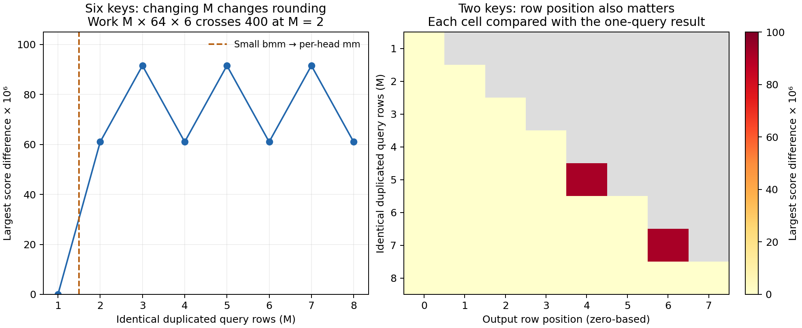

# Pinning down Qwen's attention differences

**The first difference is in the actual PyTorch QK matrix multiplication.
Fixing attention's query shape and causal-prefix layout removes every observed
full/cached difference in the five declared model cases.** Deterministic mode
alone does not. This extends the [rounding investigation](rounding.md) beneath
the HF implementation, without changing the failed acceptance gates.

## Following the actual implementation

The installed Transformers 4.43.1 Qwen source matches the pinned upstream file
byte for byte. Its [SDPA attention class calls PyTorch's attention operation](https://github.com/huggingface/transformers/blob/v4.43.1/src/transformers/models/qwen2/modeling_qwen2.py#L521).
Our existing precision wrapper supplies FP32 Q/K/V and mask, selects math SDPA,
and stores its output as BF16. Qwen's weights and remaining layers still execute
through `Qwen2ForCausalLM`. This describes our explicit reference policy, not
every unmodified HF backend.

The [pinned PyTorch math implementation](https://github.com/pytorch/pytorch/blob/e4ee3be4063b7c430974252fdf7db42273388d86/aten/src/ATen/native/transformers/attention.cpp#L731)
scales Q and K separately before their matrix product, adds the mask, applies
softmax, and multiplies by V. Pass-through `TorchDispatchMode` observation
captures both scalar multiplications, QK `bmm`, softmax and PV `bmm`. Observed,
unobserved and repeated attention results agree; replay also matches the
captured upstream output. The earlier model-level observer checks remain active.

For the second token of the 15-token case, maximum absolute full/cached
differences are:

| Actual intermediate | Maximum difference |
| --- | ---: |
| Scaled Q | 0 |
| Scaled K, active prefix | 0 |
| QK scores, active prefix | 6.103515625e-5 |
| Softmax probabilities, active prefix | 8.650124073e-6 |
| Weighted values, before BF16 | 9.164214134e-7 |

The score difference already exists before masking or softmax. Token zero also
has differing scores in this case, but its single allowed key makes the
probability exactly one, so its attention output remains equal. These results
localize the initial discrepancy more precisely than the earlier BF16 analysis.

## Why identical dot products can differ

This Torch 2.4.0 CPU build uses Apple Accelerate, with MKL and MKLDNN disabled.
Its [CPU bmm dispatch](https://github.com/pytorch/pytorch/blob/e4ee3be4063b7c430974252fdf7db42273388d86/aten/src/ATen/native/LinearAlgebra.cpp#L1789)
uses a small multiplication kernel when `M × K × N < 400`; larger cases on this
build reach per-batch matrix multiplication. Here K is 64, M is query count,
and N is key count. Full prefill and cached execution have different dimensions
and strides even when the contributing values are identical.

We duplicate one captured query 1–8 times, preserving every contributing dot
product, then compare **every output row** against the one-query result:

- With six keys, M=1 has work 384; M=2 has work 768. Crossing the source branch
  changes results by up to 6.1035e-5 in the 15-token case. The larger-path
  results also equal explicit per-head `torch.mm` calls.
- With two keys, crossing the branch at M=4 produces no difference. At M=5 and
  M=7, only the final output row differs, by up to 9.1553e-5. Inspecting only
  the first row would miss this.
- With seven keys, even M=1 already takes the larger path. Duplicating the query
  still changes some rows, by up to 1.2207e-4. The dispatch threshold therefore
  explains only part of the geometry dependence.



Both panels use the 15-token input. Gray cells indicate nonexistent rows;
light cells are measured zeros. These observations establish dependence on
matrix dimensions and row position. They are consistent with different
accumulation arrangements, but do not identify an individual Accelerate
instruction or prove a particular fused-multiply-add mechanism.

Independent downstream probes hold their contributing inputs fixed. Changing
softmax extent produces differences up to 5.9605e-8 and 1.1921e-7 in the two
cases. Changing PV multiplication shape produces zero additional difference
in these probes. Thus QK is the first observed source, while softmax can add a
smaller independent extent effect. Repeats agree, and enabling
`torch.use_deterministic_algorithms(True)` leaves all five recorded operations
unchanged for both full calls and every cached prefix. Repeatability of one
shape does not imply equality between different shapes.

## A stable diagnostic route through Qwen

The diagnostic invokes the original math SDPA separately for each query,
materializing contiguous Q, active-prefix K/V and the corresponding mask.
Consequently, full and cached calls present the same attention geometry for
the same token. No replacement attention formula or Python model supplies the
outputs; the wrapper changes how the original operator is invoked.

| Input length | Seed | Exact boundary comparisons | Full/cached byte equality |
| --- | ---: | ---: | --- |
| 15 | 9148 | 1,125 | All |
| 17 | 9120 | 1,275 | All |
| 65 | 9168 | 4,875 | All |
| 129 | 9262 | 9,675 | All |
| 257 | 9360 | 19,275 | All |

**All 36,225 comparisons pass**, including shape, dtype and raw array bytes.
Each token has 75 checks: 25 embedding/decoder hidden boundaries, final norm,
logits, and active K/V prefixes for 24 layers. Logits use the actual upstream
LM head on each corresponding final-norm row, matching the cached one-row head
invocation. These are not 36,225 independent inputs. Full execution also repeats
exactly for each of the five cases.

For lengths 15 and 17, hashes over all captured cached boundaries match the
original cached route as well. That additional comparison was not run on the
three larger cases. No 4096-token canonical case, reserved input, native model
comparison or performance measurement is included. Byte equality on this
bounded CPU study is not a universal guarantee across prompts or platforms.

This provides a concrete reliability tool: pin execution geometry alongside
weights, versions, backend, dtypes, layouts and thread settings. Keep this
canonical route for diagnosis and compare realistic prefill/decode candidates
against the corresponding upstream mode. A future acceptance contract can
use both views, with explicit logit and prediction checks; the present study
does not automatically adopt that contract or widen any tolerance.

## Evidence and reproduction

The [declaration](../../tests/fixtures/model_backend_contract.json) fixes cases,
probes, source URLs and hashes. The retained `aten-detail.json.gz` contains every
check, geometry, source identity, library hash and Torch build configuration.
`aten-study.json` binds its compressed and original bytes to source `e89d525`.
The refinement from `5f44a4b` adds all duplicate rows and cached-boundary hashes;
every observation shared by both executions matches exactly.

Execution used Apple M4 Pro CPU, macOS 26.6.2, Torch 2.4.0, Transformers 4.43.1,
NumPy 1.26.4, intra-op threads 1 and inter-op threads 14. Checkpoint and prepared
tensor identities are retained in the report. Weights, arrays, downloaded
upstream source and temporary logs stay outside Git.

```sh
uv run --locked --script tests/fixtures/model_reference_diagnosis.py --self-test
uv run --locked --script tests/fixtures/model_reference_diagnosis.py --backend --download-sources --output build/oracle_data/model-qualification/aten-detail-v2.json
uv run --locked python studies/model_generation/summarize.py
uv run --locked --with matplotlib==3.10.8 python studies/model_generation/summarize.py --plot
```

Use a fresh execution output filename: the runner refuses replacement. Source
downloads are hash-checked against the declaration. Five diagnostic self-tests
cover earlier rounding/metric logic, actual operator observation, deterministic
state restoration and canonical causal-prefix behavior. Summary regeneration
verifies evidence identities and complete case/boundary censuses, writes four
ATen tables alongside the earlier tables, and optionally regenerates both figures
without running a model.

Final validation passes all 116 repository Python tests, all five diagnostic
self-tests, evidence verification and table/figure regeneration. Native source
is unchanged by this investigation; these checks do not claim native-model
acceptance.
