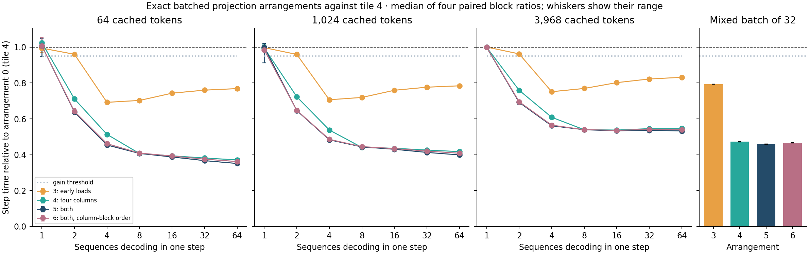
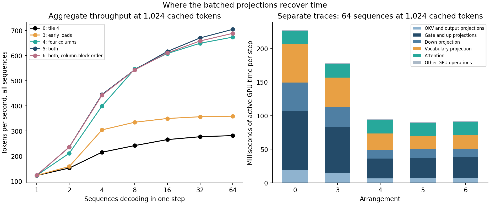

# Batched projections that share each input across four columns

> **Status update, 2026-09-27.** Decode now uses projection arrangement 8, which
> the [reordered batched projections](batch-reordered.md) study selected and
> confirmed: 17–36% shorter batched steps than arrangement 5 from B = 16 and
> about 10% shorter single-sequence steps, in a different summation order. The
> numbers below describe arrangement 5, the route before it.

Arrangement 5 gives each SIMD group four rows and four output columns. It fixes
the reduction width, loads four iterations early and keeps the row guard out of
its loop. Every output is still computed exactly as the one-row kernel computes
it, so batched steps stay bit-identical. In an independent confirmation run it
cut batched step time against tile 4 by **31–65%** in every workload from
B = 2. At 64 sequences and 1,024 cached tokens a step fell from 227.6 ms to
90.8 ms: **705 tokens/s instead of 281**, 5.7 times one sequence. The frozen
rule selected it from four qualifying arrangements, and it becomes the default
for batched decode.

Column blocking does most of the work. In traces of 64 sequences at 1,024
cached tokens, the 121 projections took 206.6 ms of GPU time with tile 4. Four
columns alone took them to 73.3 ms, and early loads on top to 69.1 ms. Early
loads alone saved 24%, as they did for one row. Ordering the grid by column
block, meant to share weight reads through the cache, made no workload faster
than arrangement 5. Per-row input work, not weight traffic, was the cost, as
[1c](batch-size.md) concluded.

This is 1d of the [batched decode plan](../../docs/history/batched-decode-plan.md#1d-exact-batched-projections),
collected on 2026-09-26 from `f47fb8b`, a commit of #29. All 8,800 screen
samples, 3,520 confirmation samples and ten traces are retained. No sample,
block or trace was discarded or repeated.

## Setup

- **Model and matrix.** Qwen2.5-0.5B-Instruct, BF16, on Apple M4 Pro / Metal
  (macOS 26.6.2, Mojo 1.0.0, MAX 26.5.0), in [1c's matrix](batch-size.md#setup):
  B from 1 to 64 at 64, 1,024 and 3,968 cached tokens, plus a mixed batch of
  32. Every step is one configuration-26 call with 245 launches and 4 transfer
  blits for any arrangement.
- **Arrangements.** Every arrangement keeps each output's lane-strided FP32 sum,
  `warp.sum`, FP32 bias and BF16 rounding:

  | ID | Rows × columns per SIMD group | Width and loads | Row guard | Grid order |
  | ---: | --- | --- | --- | --- |
  | 0 | 4 × 1 | runtime, one iteration | in the loop | row tiles outer (tile 4, the control) |
  | 3 | 4 × 1 | fixed, four iterations early | outside | row tiles outer |
  | 4 | 4 × 4 | runtime, one iteration | outside | row tiles outer |
  | 5 | 4 × 4 | fixed, four iterations early | outside | row tiles outer |
  | 6 | 4 × 4 | fixed, four iterations early | outside | column blocks outer |

- **Exactness.** `tests/test_decode_batch.mojo` compares every arrangement with
  one-row launches bit for bit at the five decode shapes, for 1 to 64 rows, with
  signed zeros, subnormals and neighbours of one among the values. Every
  arrangement's batched steps reproduce arrangement 0's tokens, logits, final
  norms and pool bytes for 2 to 32 sequences. Every timing sample reproduced its
  reference tokens with 245 launches. The full suite passed on `f47fb8b` before
  collection.
- **Procedure.** The four-block paired procedure, with ten warmups and ten
  samples per arm. The screen pairs arrangement 0 with itself and with 3, 4, 5
  and 6. The confirmation is a fresh four-block run of the selected arrangement
  against 0, with its own calibration.

## Screen



Median paired ratios of arrangement 5 to tile 4 (lower is faster):

| Cached tokens | B = 2 | 4 | 8 | 16 | 32 | 64 |
| ---: | ---: | ---: | ---: | ---: | ---: | ---: |
| 64 | 0.638 | 0.454 | 0.407 | 0.388 | 0.367 | 0.351 |
| 1,024 | 0.646 | 0.483 | 0.444 | 0.430 | 0.413 | 0.399 |
| 3,968 | 0.692 | 0.561 | 0.539 | 0.533 | 0.536 | 0.533 |
| mixed, 32 sequences | | | | | 0.459 | |

At B = 1 every arrangement runs the one-row kernel, and all those comparisons
were inconclusive, 0.984–1.024. Every calibration deviation in the screen stayed
within 5%, so the 5% floor applied to every workload. Arrangement 3 was
inconclusive at B = 2, 0.959–0.962, which the qualifying rule allows; every
other comparison from B = 2 was a gain.

| Arrangement | Qualifies | Worst median ratio, B ≥ 4 | Mean median ratio, B ≥ 4 |
| ---: | --- | ---: | ---: |
| 5 | yes, selected | 0.561 | 0.456 |
| 6 | yes | 0.565 | 0.461 |
| 4 | yes | 0.609 | 0.473 |
| 3 | yes | 0.832 | 0.761 |

## Confirmation

Tile 4 → arrangement 5, milliseconds per step, and arrangement 5's aggregate
tokens per second:

| B | 64 cached | tokens/s | 1,024 cached | tokens/s | 3,968 cached | tokens/s |
| ---: | ---: | ---: | ---: | ---: | ---: | ---: |
| 1 | 8.33 → 8.07 | 124.0 | 8.16 → 8.10 | 123.4 | 9.18 → 9.16 | 109.2 |
| 2 | 12.45 → 7.89 | 253.5 | 13.16 → 8.50 | 235.2 | 15.30 → 10.58 | 189.0 |
| 4 | 17.59 → 8.04 | 497.6 | 18.66 → 9.02 | 443.4 | 22.03 → 12.42 | 322.1 |
| 8 | 31.24 → 12.66 | 632.1 | 33.24 → 14.71 | 543.9 | 40.07 → 21.60 | 370.3 |
| 16 | 56.03 → 21.66 | 738.8 | 60.30 → 25.96 | 616.4 | 73.39 → 39.18 | 408.4 |
| 32 | 106.96 → 39.19 | 816.6 | 115.64 → 47.69 | 671.0 | 146.56 → 78.69 | 406.6 |
| 64 | 210.03 → 73.72 | 868.1 | 227.62 → 90.82 | 704.7 | 292.18 → 155.49 | 411.6 |

The mixed batch of 32 went from 125.7 to 57.7 ms, 554.5 tokens/s. Every
workload from B = 2 was a gain, so the confirmation passed. Its ratios lie
within 0.009 of the screen's. At B = 1 the calibration deviation reached 23.5%
at 64 cached tokens, as one-sequence steps again fell into a fast and a slow
group; those identical-code comparisons were inconclusive.

From B = 8 to 64, each added sequence now costs 1.09, 1.36 and 2.39 ms at the
three contexts, against 3.19, 3.47 and 4.50 ms with tile 4. Throughput therefore
approaches about 920, 740 and 420 tokens/s. At B = 16 arrangement 5 gives 6.0,
5.0 and 3.7 times one sequence. That meets 1c's recorded prior of 5–7× at 64
cached tokens and reaches its lower end at 1,024. At 3,968 cached tokens
attention, which no arrangement changes, is a larger share of the step, so the
ratio stays near 0.53 from B = 8.

## Where the time went



Separate Metal System Traces of 64 sequences at 1,024 cached tokens, two
repeats per arrangement, give active GPU time per step. Each value is the mean
of the two repeats' medians over eight measured steps, in milliseconds:

| Stage | 0 | 3 | 4 | 5 | 6 |
| --- | ---: | ---: | ---: | ---: | ---: |
| Packed QKV projection | 10.90 | 8.33 | 3.79 | 4.05 | 4.04 |
| Output projection | 8.62 | 6.50 | 2.88 | 3.14 | 3.16 |
| Gate projection | 43.77 | 33.88 | 14.74 | 14.83 | 15.34 |
| Up projection | 43.85 | 33.92 | 14.78 | 14.85 | 15.37 |
| Down projection | 42.12 | 30.14 | 13.28 | 13.22 | 13.10 |
| Vocabulary projection | 57.33 | 43.81 | 23.87 | 19.02 | 20.15 |
| **All projections** | **206.59** | **156.58** | **73.34** | **69.11** | **71.17** |
| Attention | 19.66 | 19.74 | 19.77 | 19.60 | 19.59 |
| Active total | 227.88 | 177.93 | 94.60 | 90.32 | 92.28 |

With tile 4, one pass of four rows over the projection weights took 12.9 ms;
with arrangement 5 it takes 4.3 ms. 1c measured a one-row pass at 6.4 ms, so four
rows now cost about two-thirds of one row alone. Four columns alone take the pass
to 4.6 ms. On top of four columns, early loads helped only the vocabulary
projection, which fell from 23.9 to 19.0 ms. They left gate, up and down
unchanged and made the small QKV and output projections slightly slower.
Attention is unchanged and is now 22% of the active time.

Column-block order made the vocabulary, gate and up projections slightly slower
and the down projection slightly faster. At B = 64 the sixteen passes request
about 16 GB of weight reads per step. Reading all of them from DRAM in 69 ms
would take about 230 GB/s, yet letting a threadgroup's SIMD groups share those
reads did not help. Either the cache already absorbs the repeats or the reads
are not the limit; GPU counters would tell which. This is a byte count, not a
measured bandwidth.

## The recorded hypothesis

- **Column blocking.** Predicted to save 25–50% of the projection time, about
  20–45% of a step from B = 16. It saved 64% of the traced projection time and
  45–63% of a step: per-row input work was a larger share than estimated.
- **Early loads.** Predicted to save about the 22% they saved at one row. They
  saved 24% of the traced projection time and 17–26% of a step from B = 16.
- **Together.** Predicted to take the B = 64 step at 1,024 cached tokens from 234
  to about 110–150 ms, 1.5–2× throughput. Arrangement 5 took it to 90.8 ms,
  2.5×.
- **Column-block order.** Predicted to beat arrangement 5 from B = 16. It never
  did: its ratios sit 0.001–0.011 above 5's from B = 2. That prediction failed.
- **Stop condition.** Column blocking saved far more than the 10% below which
  the plan would have stopped for GPU counters.

## Conditions and limits

AC power, Low Power Mode off and no thermal or performance warning were
required and recorded before and after every block and trace. The machine was
quiet: load snapshots around each phase showed load averages of 1.3–2.4 and no
process above 22% of one core. All ten traces passed the coverage check on the
first attempt.

These results hold for one machine and model, BF16, and the one-block-per-
sequence pool. The arrangements are exact against the one-row kernel's
arithmetic, which is unchanged. Traces cover 64 sequences at 1,024 cached tokens
only. No DRAM bandwidth, occupancy or register claim is made.

## Evidence and reproduction

The lossless [archive](batch-projections.json.gz) is 1,008,982 bytes; its
[manifest](batch-projections.json) holds the compressed and uncompressed hashes.
It retains:

- the frozen build record with source and binary hashes;
- the screen's 8,800 and the confirmation's 3,520 timing samples with block
  conditions;
- the ten traces' command intervals and provenance, 19,920 measured commands.

`batch-size-replay --study projections` verifies the archive, reapplies the
frozen rule and regenerates [batch-projections-summary.json](batch-projections-summary.json).
`batch-size-plot --study projections` redraws both figures. Neither needs weights
or a GPU:

```sh
uv run --locked python -m llm_mojo.benchmarks.model_profile batch-size-replay --study projections --output studies/model_generation
uv run --locked --with matplotlib==3.10.8 python -m llm_mojo.benchmarks.model_profile batch-size-plot --study projections --output studies/model_generation
```

`tests/test_model_profile.py` replays the retained archive. It rejects rehashed
copies that lose a sample, block, trace or measured command, change a binary,
fail the recorded power conditions or carry a confirmation of another
arrangement. Collecting new evidence uses the
[measurement tools](../../src/llm_mojo/benchmarks/README.md#batch-size-study).
