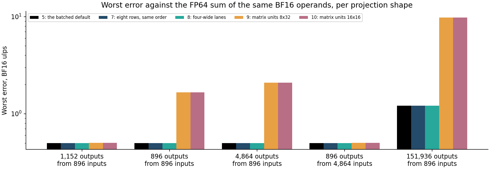
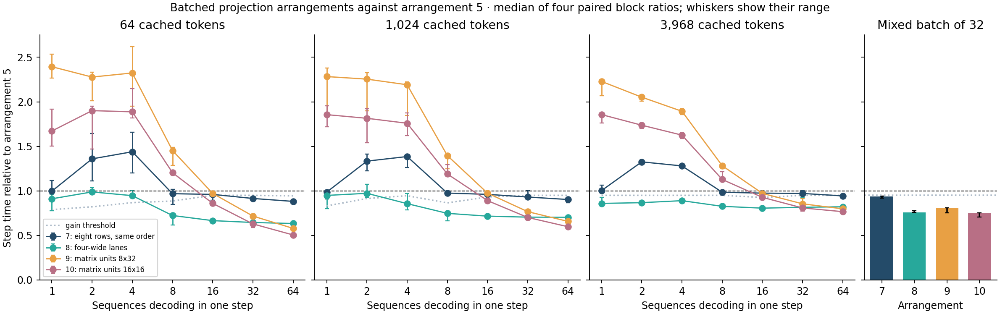
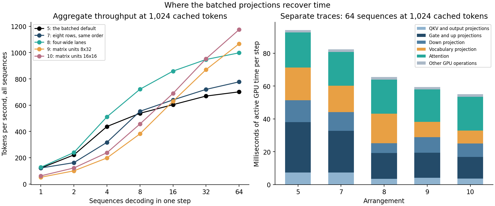

# Batched projections that sum four adjacent products per lane

Arrangement 8 keeps arrangement 5's four rows and four output columns per SIMD
group and its fixed reduction widths. Each lane now loads four adjacent inputs
of each row, and four adjacent weights of each column, with one vector load
apiece, where arrangement 5 loads four values 32 elements apart one at a time.
That changes the order in which every output is summed, for one sequence as
well as for many, so it changes Fast's arithmetic; batched rows still equal the
same arrangement's solo rows bit for bit. In an independent confirmation it cut
step time against arrangement 5 by **17–36%** in every workload from B = 16,
and no workload was slower. On the quiet screen, 64 sequences at 1,024 cached
tokens took 64.1 ms instead of 91.3 ms: **998 tokens/s instead of 701**. Its
worst error against an FP64 sum equals arrangement 5's in all five decode
shapes, and on the model it agrees with HF on 242 of 244 same-history choices,
as arrangement 5 does. The frozen rule selected it as the only qualifying
arrangement. A single-sequence check then found it about 10% faster at one
sequence, and on 2026-09-27 it became the decode arrangement for one sequence
and for many. That changes Fast's arithmetic, as the [decision](#decision)
records.

The other candidates show where the remaining time is. The matrix-unit tiles 9
and 10 read each weight for eight and sixteen rows. At 64 sequences they were
the fastest, and 10 halved arrangement 5's step at 64 cached tokens. But they
ran one sequence 1.7–2.4 times slower, and their worst errors reached 1.7, 2.1
and 9.8 BF16 ulps in shapes where arrangement 5 stays within 0.5, 0.5 and 1.2,
so they failed two gates. Exact arrangement 7, eight rows in arrangement 5's
order, was 28–44% slower at B = 2 and 4, where it pads to eight rows, and at
most 12% faster at B = 64.

Traces of 64 sequences at 1,024 cached tokens explain the split. Arrangement 8
halves the five per-layer projections, whose repeated passes over 1.6–8.7 MB of
weights per layer must be served largely from cache. There, per-lane load
instructions set most of the cost. The vocabulary projection's 272 MB matrix cannot
stay in cache, and arrangement 8 gains only 10% on it. Only fewer passes help
there: the matrix-unit tiles cut it from 19.9 ms to 9.3 and 7.9 ms.

This is 1e of the [batched decode plan](../../docs/batched-decode-plan.md#1e-reordered-batched-projections),
collected on 2026-09-26 and 27 from `3185eea`. All 8,800 screen samples, 3,520
confirmation samples, the accuracy census, ten traces and the model-level
diagnostics are retained, with two capture attempts that were set aside. No
sample or block was discarded or repeated.

## Setup

- **Model and matrix.** Qwen2.5-0.5B-Instruct, BF16, on Apple M4 Pro / Metal
  (macOS 26.6.2, Mojo 1.0.0, MAX 26.5.0), in [1c's matrix](batch-size.md#setup):
  B from 1 to 64 at 64, 1,024 and 3,968 cached tokens, plus a mixed batch of
  32. Every step is one configuration-26 call with 245 launches and 4 transfer
  blits for any arrangement. B = 1 is single-sequence decode through each
  arrangement's one-row path.
- **Arrangements.** Arrangement 5, the batched default, is the control:

  | ID | Rows × columns per SIMD group | Loads per lane per 128 inputs | Summation order | Rows per weight read | One row |
  | ---: | --- | --- | --- | ---: | --- |
  | 5 | 4 × 4 | four scalar loads per row and column, 32 apart | each lane sums every 32nd product, then `warp.sum` | 4 | the one-row kernel |
  | 7 | 8 × 4 | as 5 | as 5 | 8 | the one-row kernel |
  | 8 | 4 × 4 | one four-wide load per row and column | each lane sums four adjacent products in every 128, then `warp.sum` | 4 | the same kernel with one row |
  | 9 | 8 × 32 | matrix-unit fragments | 8×8 fragments along K in steps of 8, FP32 accumulators | 8 | the same kernel, padded to 8 rows |
  | 10 | 16 × 16 | matrix-unit fragments | as 9 | 16 | the same kernel, padded to 16 rows |

- **Numerical checks.** `tests/test_decode_batch.mojo` checks, bit for bit and
  with guard rows poisoned, that every arrangement's batched rows equal its own
  one-row results at the five decode shapes for 1 to 64 rows. For arrangements
  8–10, whole batched steps equal each sequence decoded alone. Arrangement 7
  equals the one-row kernel. The accuracy census measures every arrangement
  against an FP64 sum of the same BF16 operands. Every timing sample reproduced
  its arm's own reference tokens with 245 launches, and the exact arms'
  references equal arrangement 5's. The full suite passed on `3185eea` before
  collection.
- **Procedure.** The four-block paired procedure, with ten warmups and ten
  samples per arm. The screen pairs arrangement 5 with itself and with 7, 8, 9
  and 10. The confirmation is a fresh four-block run of the selected arrangement
  against 5, with its own calibration. An arrangement qualifies if it passes
  the accuracy gate, is slower in no workload and is a gain in every workload
  from B = 16. The rule selects the lowest worst-case median ratio from B = 16.

## Accuracy



Worst error in BF16 ulps against the FP64 sum, with the number of outputs above
half an ulp in parentheses:

| Shape: rows × outputs × inputs | 5 | 7 | 8 | 9 | 10 |
| --- | ---: | ---: | ---: | ---: | ---: |
| 8 × 1,152 × 896, with bias | 0.500 (0) | 0.500 (0) | 0.500 (0) | 0.501 (1) | 0.501 (1) |
| 8 × 896 × 896 | 0.500 (0) | 0.500 (0) | 0.500 (0) | 1.664 (3) | 1.664 (3) |
| 8 × 4,864 × 896 | 0.500 (1) | 0.500 (1) | 0.500 (0) | 2.092 (15) | 2.092 (15) |
| 8 × 896 × 4,864 | 0.500 (0) | 0.500 (0) | 0.500 (0) | 0.500 (1) | 0.500 (1) |
| 2 × 151,936 × 896 | 1.211 (13) | 1.211 (13) | 1.211 (21) | 9.789 (147) | 9.789 (147) |

Rounding the exact sum to BF16 alone costs up to half an ulp; an output above
that is one where FP32 accumulation moved a sum across a rounding boundary.
Arrangement 8's worst error equals arrangement 5's in every shape. It has no
output above half an ulp in the gate and up shape, where 5 has one, and 21
instead of 13 in the vocabulary shape; both have one output above one ulp
there. Arrangement 7 sums in 5's order and matches it exactly. The matrix-unit
tiles, whose accumulation inside a fragment is not documented, err by up to
9.8 ulps on 896-term sums and fail the gate in every shape.

## Screen



Median paired ratios of arrangement 8 to arrangement 5 (lower is faster):

| Cached tokens | B = 1 | 2 | 4 | 8 | 16 | 32 | 64 |
| ---: | ---: | ---: | ---: | ---: | ---: | ---: | ---: |
| 64 | 0.911 | 0.988 | 0.947 | 0.724 | 0.666 | 0.645 | 0.634 |
| 1,024 | 0.949 | 0.973 | 0.857 | 0.748 | 0.717 | 0.705 | 0.704 |
| 3,968 | 0.859 | 0.868 | 0.890 | 0.827 | 0.806 | 0.816 | 0.822 |
| mixed, 32 sequences | | | | | | 0.757 | |

Arrangement 8 was a gain in every workload from B = 8, at every B with 3,968
cached tokens and at B = 4 with 1,024. Its other comparisons were inconclusive,
and none was slower. Steps near 8 ms again fell into a fast and a slow group, as
in [1d](batch-projections.md#confirmation). Calibration deviations exceeded 5%
in eleven workloads, up to 21% at B = 1 with 64 cached tokens, which raised the
noise floor there.

| Arrangement | Accuracy gate | Slower in | Gain in every workload from B = 16 | Qualifies |
| ---: | --- | --- | --- | --- |
| 7 | passes | B = 2 and 4 | no: inconclusive at B = 16, and at 32 with 1,024 and 3,968 cached tokens | no |
| 8 | passes | none | yes: worst median ratio 0.822, mean 0.727 | yes, selected |
| 9 | fails | B = 1 to 8 | no: inconclusive at B = 16 | no |
| 10 | fails | B = 1 to 8 | no: inconclusive at B = 16 with 3,968 cached tokens | no |

The screen also compared each step's next token for every sequence with
arrangement 5's. No exact arrangement changed a token. Arrangement 8 changed 1
of 16, 1 of 32 and 2 of 64 at 64 cached tokens, identically in every block of
both runs, and none at the other contexts. Arrangements 9 and 10 changed one to
three, including one in the mixed batch.

## Confirmation

Median paired ratios of arrangement 8 to arrangement 5 in the confirmation:

| Cached tokens | B = 1 | 2 | 4 | 8 | 16 | 32 | 64 |
| ---: | ---: | ---: | ---: | ---: | ---: | ---: | ---: |
| 64 | 1.021 | 0.979 | 0.997 | 0.763 | 0.663 | 0.641 | 0.636 |
| 1,024 | 0.936 | 0.992 | 1.003 | 0.757 | 0.719 | 0.710 | 0.705 |
| 3,968 | 0.915 | 0.894 | 0.891 | 0.827 | 0.811 | 0.825 | 0.827 |
| mixed, 32 sequences | | | | | | 0.762 | |

Every workload from B = 8 was a gain, within 0.04 of the screen's ratios, and
none was slower, so the confirmation passed. It ran the next morning while the
machine was in use. That slowed the short steps: arrangement 5's one-sequence
step took 10.1 ms at 64 and 1,024 cached tokens instead of the screen's 8.4 and
8.2 ms, and calibration deviations reached 31% at B ≤ 4. From B = 8 arrangement
5's steps stayed within 2.6% of the screen's.

Arrangement 5 → 8 in the screen, milliseconds per step, and arrangement 8's
aggregate tokens per second:

| B | 64 cached | tokens/s | 1,024 cached | tokens/s | 3,968 cached | tokens/s |
| ---: | ---: | ---: | ---: | ---: | ---: | ---: |
| 1 | 8.42 → 7.84 | 127.6 | 8.23 → 7.85 | 127.4 | 9.18 → 7.90 | 126.6 |
| 2 | 8.56 → 7.98 | 250.6 | 9.04 → 8.35 | 239.6 | 10.65 → 9.20 | 217.3 |
| 4 | 8.12 → 7.98 | 500.9 | 9.15 → 7.83 | 511.0 | 12.47 → 11.07 | 361.5 |
| 8 | 12.90 → 9.33 | 857.2 | 14.87 → 11.09 | 721.1 | 21.72 → 17.99 | 444.7 |
| 16 | 22.09 → 14.96 | 1,069.2 | 26.50 → 18.63 | 859.0 | 40.45 → 32.08 | 498.7 |
| 32 | 39.81 → 25.70 | 1,245.4 | 47.82 → 33.78 | 947.4 | 81.31 → 65.68 | 487.2 |
| 64 | 74.43 → 46.97 | 1,362.5 | 91.27 → 64.13 | 998.0 | 159.25 → 132.66 | 482.4 |

The mixed batch of 32 went from 58.2 to 43.8 ms, 730.9 tokens/s. From B = 8 to
64, each added sequence now costs 0.67, 0.95 and 2.05 ms at the three contexts,
against 1.10, 1.36 and 2.46 ms with arrangement 5. At 3,968 cached tokens
attention, which no arrangement changes, holds the ratio near 0.82.

## Where the time went



Separate Metal System Traces of 64 sequences at 1,024 cached tokens, two
repeats per arrangement, give active GPU time per step. Each value is the mean
of the two repeats' medians over eight measured steps, in milliseconds:

| Stage | 5 | 7 | 8 | 9 | 10 |
| --- | ---: | ---: | ---: | ---: | ---: |
| Packed QKV projection | 4.11 | 4.20 | 2.05 | 2.32 | 1.99 |
| Output projection | 3.19 | 3.12 | 1.53 | 1.86 | 1.63 |
| Gate projection | 15.27 | 12.65 | 7.82 | 7.64 | 6.61 |
| Up projection | 15.49 | 12.75 | 7.82 | 7.67 | 6.59 |
| Down projection | 13.40 | 11.52 | 6.04 | 9.37 | 8.18 |
| Vocabulary projection | 19.92 | 16.08 | 18.02 | 9.30 | 7.87 |
| **All projections** | **71.37** | **60.31** | **43.28** | **38.16** | **32.87** |
| Attention | 21.25 | 20.51 | 20.66 | 19.81 | 20.54 |
| Active total | 94.27 | 82.31 | 66.01 | 59.50 | 55.11 |

Per lane and per 128 inputs, arrangement 5 issues 32 scalar loads and
arrangement 8 eight vector loads, for the same 64 multiply-adds. Arrangement 8
halved the QKV, output, gate, up and down projections. At B = 64 their sixteen
four-row passes request 0.6–3.3 GB of weights per step, which arrangement 8
reads at 387–554 GB/s. That is above the chip's nominal 273 GB/s, so caches
must serve much of each layer's 1.6–8.7 MB of weights across its passes. The
vocabulary projection requests 4.4 GB per step from a 272 MB matrix that cannot
stay in cache. Arrangement 8 reads it at 242 GB/s and gains only 10%. Arrangement
9's eight passes and arrangement 10's four took it to 9.3 and 7.9 ms. These are
byte counts, not measured bandwidth; GPU counters would tell how much each read
costs.

Arrangement 7 halves the passes but doubles each lane's accumulators and loads.
It cut projection time by 15%, and its vocabulary projection requested only
135 GB/s, so its lanes' work, not memory, set its cost. The matrix-unit tiles
did best on the vocabulary and gate and up projections, but their down
projection, 896 outputs from 4,864 inputs, was 35–55% slower than arrangement
8's. Attention is unchanged at 19.8–21.3 ms and is now 31% of arrangement 8's
active time.

Repeat 0 of arrangements 7 and 8 ran on the evening of the screen; the other
eight captures ran the next morning while the machine was in use. Active GPU
time differed between repeats by up to 8%, 90.6 and 98.0 ms for arrangement 5,
mostly in attention and the vocabulary projection. The per-stage differences
between arrangements are several times larger.

## Model-level diagnostics

**Teacher-forced comparison.** On decode parity's schedule, 53 prefix tokens and
32 fixed decode tokens, arrangement 8 selected the same token as arrangement 5
in 31 of 32 calls. In some calls 99.5% of the logits differed in their last
bits. The largest
relative RMS distances per call were 0.054 in logits, 0.020 in the final norm,
0.015 in layer outputs and 0.003 in appended K/V.

**HF comparison.** The runtime study's same-history workflow ran for both
arrangements on the specification's twelve decode cases and on each
arrangement's own six generations of 32 tokens:

| | Arrangement 5 | Arrangement 8 |
| --- | ---: | ---: |
| Decode-case choices agreeing with HF | 56 of 57 | 57 of 57 |
| Generation-history choices agreeing with HF | 186 of 187 | 185 of 187 |
| **All** | **242 of 244** | **242 of 244** |
| Largest KL divergence | 0.00708 nats | 0.00774 nats |
| Largest total variation | 0.0561 | 0.0562 |

Every disagreement is at a near-tie in HF's own logits: its top two were equal
in three of the four and 0.125 apart in the fourth. Both arrangements
miss the same choice in the first history. Arrangement 8 agrees where 5 missed
in the 17-token case, and misses one in the only generation whose tokens
differ from arrangement 5's, which diverged at its ninth token. The stop rule
did not trigger: arrangement 8 needed at least 241 agreements and a largest KL
divergence of at most 0.0142 nats.

## The recorded hypothesis

- **Halving the passes, 7 and 9.** Predicted to cut projection time at B = 64
  by 30–45%. Arrangement 9 cut the traced projection time by 47%, and its
  B = 64 step by 20–42%. Arrangement 7 cut them by 15% and 6–12%; the plan
  named registers as its risk, but no register or occupancy measurement was
  made.
- **Quartering them, 10.** Predicted 40–60%. It cut traced projection time by
  54%, and its B = 64 step by 50% and 40% at 64 and 1,024 cached tokens and by
  23% at 3,968.
- **Arrangement 8.** Predicted to gain less than 10% from B = 16, perhaps more
  at B ≤ 4. It gained 18–37% from B = 16 in the screen and up to 14% at B ≤ 4.
  That prediction failed: load instructions, not weight passes, set most of the
  per-layer projections' cost.
- **One row.** Padding one row to 8 or 16 rows was expected to slow
  single-sequence decode with 9 and 10. It did, by 1.7–2.4×.
- **Accuracy.** All reordered arrangements were expected to stay within one BF16
  ulp of the FP64 sum. None did in the vocabulary shape: arrangements 5 and 8
  reach 1.21 ulps there, and 9 and 10 reach 9.8.
- **Stop condition.** Had none of 7, 9 and 10 shortened the B = 64 step by 10%,
  weight passes would not have been the limit. Arrangements 9 and 10 shortened
  it by 20–50%: weight passes matter at B = 64, above all for the vocabulary
  projection.

## Conditions and limits

AC power, Low Power Mode off and no thermal or performance warning were
required and recorded before and after every block and trace. The screen ran
on a quiet machine, with load averages of 1.5–2.5 around it. The confirmation
and eight of the ten traces ran the next morning while the machine was in use:
one-minute load averages were 2.6–6.3, with file syncing, a browser, a
messaging app and a computer-use agent's service active. Their effects are described above.

Two capture attempts were set aside and replaced with the same binaries:
- **Arrangement 5, repeat 0** failed the coverage check. The Compute interval
  in one measured command's slot was labelled as the Codex service's, the label
  swap that [1c](batch-size.md#conditions-and-rejected-traces) recorded with
  WindowServer.
- **Arrangement 9, repeat 0** ran its binary to completion. Then xctrace stopped
  responding while it stopped the recording, and saved no trace; it was stopped
  14.6 hours later.

The archive keeps both attempts' receipts and evidence.

These results hold for one machine and model, BF16, and the
one-block-per-sequence pool. Arrangement 8 is exact against its own one-row
path, not against arrangement 5. The accuracy census uses random and edge
values, not the model's weights. At B ≤ 4 the short steps limit the paired
comparisons to differences of roughly 10–20%; the single-sequence check in the
[decision](#decision) resolves one sequence more finely, at one context and one
prompt. Traces cover 64 sequences
at 1,024 cached tokens only, and no cache, register or occupancy claim is made.

## Decision

Arrangement 8 met every gate the plan set. Before adopting it, a
single-sequence check compared the Fast generator built in arrangements 5 and
8. Sixteen runs each generated 128 tokens after a 1,176-token prompt, in four
blocks ordered 5 8 8 5 and 8 5 5 8. The rule was fixed before measuring. If
arrangement 8 was slower in all four blocks by a median of more than 5%,
adoption would stop; if it was slower in all four by less, the decision would
be asked again. Arrangement 8's median decode step was 7.87 ms against
8.70 ms. The four block ratios were 0.893–0.915, every run of arrangement 8
was faster than every run of 5, and both generated the same text. The
[record](batch-reordered-single-sequence.json) keeps all 2,032 decode steps.

On 2026-09-27 arrangement 8 became the default. Adopting it:
- made it the decode arrangement for batched and single-sequence Fast decode,
  `DECODE_PROJECTION = 8`;
- changed Fast's outputs in their last bits. Against arrangement 5, 31 of 32
  teacher-forced tokens and five of six free generations stayed the same;
- kept the byte comparisons of decode parity and the route test on exact
  arrangement 5, because the baseline route has no arrangement 8 order. There
  they check that the fusions change no bytes. The route test also checks
  that the default takes the fused route with the same launches, and
  `decode-comparison` measures the default against arrangement 5 on the real
  model. The [model contract](../../docs/model.md#decode-projection-order)
  documents the new order.

## Evidence and reproduction

The lossless [archive](batch-reordered.json.gz) is 1,039,797 bytes; its
[manifest](batch-reordered.json) holds the compressed and uncompressed hashes.
It retains:

- the frozen build record with source and binary hashes;
- the accuracy census and the token census;
- the screen's 8,800 and the confirmation's 3,520 timing samples with block
  conditions;
- the ten traces' command intervals and provenance, 19,920 measured commands,
  and the two set-aside attempts;
- the teacher-forced comparison's per-call distances and all 488 HF choice
  records.

The single-sequence check's [record](batch-reordered-single-sequence.json)
keeps each run's 127 decode steps, both binaries' hashes and provenance, the
prompt's hash and the recorded conditions.

`batch-size-replay --study reordered` verifies the archive, reapplies the
accuracy gate, the frozen rule and the stop rule, and regenerates
[batch-reordered-summary.json](batch-reordered-summary.json).
`batch-size-plot --study reordered` redraws the three figures. Neither needs
weights or a GPU:

```sh
uv run --locked python -m llm_mojo.benchmarks.model_profile batch-size-replay --study reordered --output studies/model_generation
uv run --locked --with matplotlib==3.10.8 python -m llm_mojo.benchmarks.model_profile batch-size-plot --study reordered --output studies/model_generation
```

`tests/test_model_profile.py` replays the retained archive. It rejects rehashed
copies that lose a sample, block, trace, measured command, accuracy or token
record, change a binary, fail the recorded power conditions, drop or alter the
diagnostics, or carry a confirmation of another arrangement. It also recomputes
the single-sequence check's verdict from its raw steps. Collecting new
evidence uses the [measurement tools](../../src/llm_mojo/benchmarks/README.md#batch-size-study).
