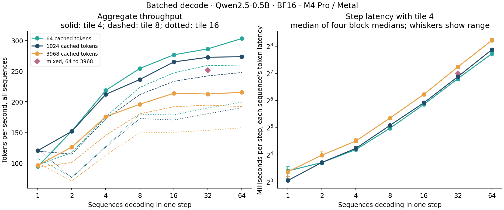
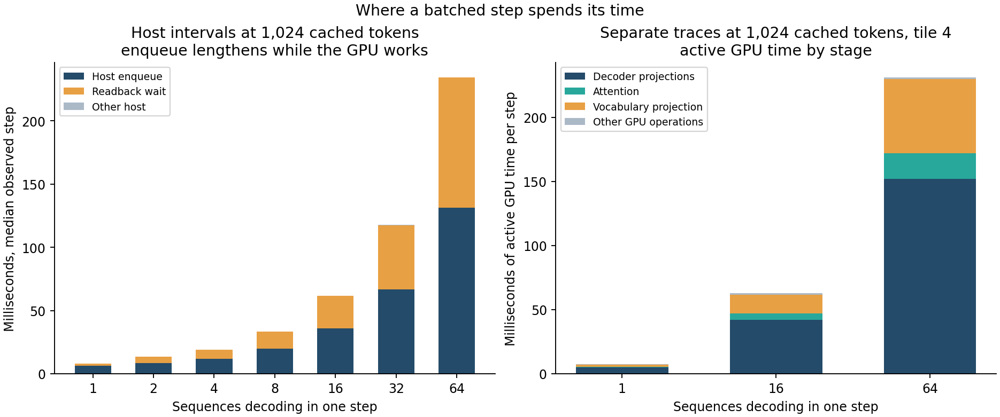

# Why batched decode throughput levels off

Decoding B sequences in one configuration-26 step raises aggregate throughput
from 94–120 tokens/s at B = 1 to 215–303 tokens/s at B = 64, depending on
context, and then levels off. Each added sequence costs **3.2 ms** of step time
at 64 cached tokens, **3.6 ms** at 1,024 and **4.6 ms** at 3,968, so throughput
approaches about 310, 280 and 220 tokens/s. At B = 16 it is 2.9×, 2.2× and 2.2×
B = 1. That is below the 3× at which the plan required a trace investigation
before phase 2. The prior recorded before measurement was 5–7×.

The traces place 90% of a B = 64 step's GPU time in the projections. A tile-4
projection pass shares each weight load across four rows, yet it costs 2.1–2.2
times a one-row pass, so each row keeps about half of its one-row projection
cost. Tiles 8 and 16 were slower than tile 4 in every multi-row workload, even
from B = 16, where they make half and a quarter as many passes over the
weights. Weight traffic is therefore not what limits the batched projections;
their per-row work is. Fast keeps tile 4.

This is phase 1c of the [batched decode plan](../../docs/batched-decode-plan.md#1c-batch-size-study),
collected on 2026-09-26 from `7b3b131`. All 7,040 timing samples are retained.
Four trace attempts were rejected for a trace attribution defect and replaced;
none was rejected or repeated for its timings.

## Setup

- **Model and route.** Qwen2.5-0.5B-Instruct, BF16, on Apple M4 Pro / Metal
  (macOS 26.6.2, Mojo 1.0.0, MAX 26.5.0). Every step is one configuration-26
  call with 245 launches and 4 transfer blits for any B.
- **Pool.** `QwenModel(ctx, prepared, 4096, 256, 64)` with a `KVPool` of 64
  full-context blocks. One history is prefilled into block 0 and copied into the
  other blocks, whose lengths are then set to their sequences' contexts.
  Sequence b decodes a different history token, so rows differ.
- **Correctness.** An untimed tile-4 step records every sequence's token. Every
  sample must reproduce those tokens, with 24 × B submitted layer rows and 245
  launches.
- **Timed interval.** From building the step batch and plan through
  `greedy_tokens` readback. Rewinding each block to its context is outside it.
- **Procedure.** The four-block paired procedure of the
  [experimental method](../../docs/experiments.md). Each workload pairs tile 4
  with itself for calibration, with tiles 8 and 16, and with an observed tile-4
  arm that records host marks. Each arm has ten warmups and ten samples. One
  process per block and context runs all of that context's batch sizes, and
  the second and third blocks reverse every order.
- **Workloads.** B ∈ {1, 2, 4, 8, 16, 32, 64} at 64, 1,024 and 3,968 cached
  tokens, plus a mixed batch of 32 sequences whose contexts spread evenly from
  64 to 3,968.

## Throughput and step latency



The step latency is also each sequence's token latency. Values are medians of
four block medians with tile 4.

| B | 64 cached: ms | tokens/s | 1,024 cached: ms | tokens/s | 3,968 cached: ms | tokens/s |
| ---: | ---: | ---: | ---: | ---: | ---: | ---: |
| 1 | 10.60 | 94.3 | 8.32 | 120.2 | 10.40 | 96.2 |
| 2 | 13.15 | 152.0 | 13.18 | 151.7 | 15.87 | 126.0 |
| 4 | 18.31 | 218.5 | 18.87 | 212.0 | 22.78 | 175.6 |
| 8 | 31.48 | 254.1 | 33.88 | 236.1 | 40.86 | 195.8 |
| 16 | 57.88 | 276.4 | 60.41 | 264.8 | 74.87 | 213.7 |
| 32 | 111.84 | 286.1 | 117.47 | 272.4 | 150.58 | 212.5 |
| 64 | 211.24 | 303.0 | 234.05 | 273.4 | 297.25 | 215.3 |

From B = 8 to 64, step time grows by 3.21, 3.57 and 4.58 ms per sequence at the
three contexts. At that linear cost, throughput approaches the inverse of the
slope, and B = 64 is already within 3% of it. Relative to B = 1, B = 64 gives 3.2×, 2.3× and 2.2×.

Those ratios inherit an unstable denominator. One-sequence samples fall into
two groups, about 8.0–8.2 ms and 10–12 ms, sometimes within one arm. The slower
group set the median in three of the four blocks at 64 cached tokens, which is
why that context's B = 1 median is slower than at 1,024. Calibration deviations
at B = 1 reached 20.7%; in most multi-row workloads they stayed within 5%. The
per-sequence slope does not depend on B = 1 and is the quantity to carry
forward. Against the 8.0–8.2 ms group, B = 16 would give 2.2× at 64 cached
tokens, not 2.9×. Every context stays below 3× either way.

The mixed batch of 32 took 127.3 ms per step, 251 tokens/s. Interpolating the
uniform batches of 32 linearly in context to the mixed batch's mean of 2,016
cached tokens gives 128.6 ms. A batch therefore costs about its average
context, not its longest, consistent with each sequence's attention reading
only its own history.

## Row tiles

Median paired ratios of tile 8 and tile 16 to tile 4, with the range over the
three contexts:

| B | Tile 8 / tile 4 | Tile 16 / tile 4 |
| ---: | ---: | ---: |
| 2 | 1.282–1.315 | 1.844–2.061 |
| 4 | 1.206–1.258 | 1.579–1.687 |
| 8 | 1.095–1.128 | 1.304–1.382 |
| 16 | 1.107–1.125 | 1.429–1.553 |
| 32 | 1.100–1.128 | 1.395–1.536 |
| 64 | 1.090–1.143 | 1.339–1.513 |
| 32, mixed | 1.092 | 1.461 |

Under the method's decision rule both wider tiles are slower than tile 4 in all
19 multi-row workloads. At B = 1 all three tiles run the one-row kernel, so
those comparisons measure identical code; they are inconclusive, as expected.
The penalty is largest at B = 2, where most row slots of a wide tile are empty;
the kernel still evaluates its row guard for every slot at every weight element.
No tile meets the gain rule, so nothing supports changing Fast's tile.

## Where a batched step spends its time



**Host.** The observed arm splits each step into host intervals. At 1,024
cached tokens, in milliseconds:

| B | Step upload | Decoder stack enqueue | Head enqueue | Readback wait | Other |
| ---: | ---: | ---: | ---: | ---: | ---: |
| 1 | 0.21 | 5.96 | 0.08 | 1.75 | 0.16 |
| 16 | 0.30 | 34.33 | 0.99 | 25.87 | 0.24 |
| 64 | 0.31 | 127.15 | 3.62 | 103.16 | 0.27 |

Recording the marks did not change multi-row steps: observed/unobserved block
ratios had medians of 0.987–1.026. The host's own submission work does not grow
with B. Every trace records 8.2–9.9 ms of Metal submission intervals per step
for the same 249 commands. Beyond that, the enqueue interval is time the
enqueue calls wait while the GPU works.

**GPU.** Separate Metal System Traces at 1,024 cached tokens with tile 4, two
repeats per batch size, give active GPU time per step. Each value is the mean of
the two repeats' medians over eight measured steps, in milliseconds:

| Stage | B = 1 | B = 16 | B = 64 | Added per sequence, 1 to 64 |
| --- | ---: | ---: | ---: | ---: |
| Decoder projections (QKV, output, gate, up, down) | 5.08 | 42.24 | 151.95 | 2.33 |
| Vocabulary projection | 1.31 | 14.63 | 57.66 | 0.89 |
| Attention | 0.51 | 4.84 | 20.22 | 0.31 |
| Other GPU operations | 0.92 | 1.48 | 1.76 | 0.01 |
| **Active total** | **7.83** | **63.19** | **231.59** | **3.55** |
| Enclosing GPU span | 12.25 | 65.26 | 233.08 | |
| Metal submission intervals | 8.96 | 8.55 | 9.36 | |

At B = 16 and 64 the GPU is active for 97–99% of its enclosing span, and active
time grows by 3.55 ms per sequence, matching the 3.57 ms step slope. The step is
GPU-bound, and 90% of its GPU time is projections. Tracing lengthens the
one-sequence step to a 12.3 ms span against 8.3 ms untraced, so these traces
attribute time to stages; they do not measure step latency.

Tile 4 makes ⌈B/4⌉ passes over the projection weights. The projections took
6.39 ms in the one-row pass at B = 1, 14.22 ms per pass at B = 16 and 13.10 ms
per pass at B = 64. Four rows sharing a pass therefore cost about half as much
each as one row alone. Attention adds 0.31 ms per sequence at 1,024 cached
tokens, about 60% of the one-sequence cost. Each sequence reads its own cache,
so this cost is expected to grow with B.

## Why the prior was wrong

The prior assumed B decode rows cost about as much as B prompt rows through the
prefill kernels. Its refinement, still before measurement, assumed a tile-4
pass costs about as much as a one-row pass, which predicted about 5× at B = 16
and 64. Measured, a pass costs 2.1–2.2 times as much.

The rows kernel gives one SIMD group each row tile and output column. For every
weight element it loads, each row in the tile loads its own BF16 input, converts
both operands to FP32 and accumulates. The accumulation keeps the one-row
kernel's lane-strided order, so batched rows stay bit-identical to one-row
launches. Sharing the weight load removes one load per row and weight element;
the rest of each row's work remains. From B = 16, tiles 8 and 16 make half and
a quarter as many weight passes and are still slower, so that remaining per-row
work, not weight traffic, sets the cost.
Naming the exhausted hardware resource, whether issue slots, registers or
latency, would need GPU counters, which these traces did not collect.

## What this means for the plan

Batched decode works: sequences share launches and host submission, and a batch
of 64 at 1,024 cached tokens gives 2.3 times one sequence's throughput with
unchanged tokens. The gain the plan expected depends on the projection kernel.
A kernel that shares weights across rows with much less per-row work, such as
one built on SIMD-group matrix operations, would change the order of the K
reduction. Keeping batched rows bit-identical to one-row decode would then mean
changing the one-row kernel too, and with it Fast's arithmetic. The plan
reserves that numerical-contract change for a separate decision; its
[1c record](../../docs/batched-decode-plan.md#validation-record) states
the decision before phase 2.

## Conditions and rejected traces

AC power, Low Power Mode off and no thermal or performance warning were required
and recorded before and after every block and trace. These checks do not fix
clocks or exclude background activity. Collection started at a load average of
5.1, with other applications and Spotlight indexing active. A Docker Desktop
virtual machine started at 09:47 local time (13:47 UTC), about one minute into
the third block. It ran for the rest of the collection and every trace, and
used up to about two CPU cores when sampled between traces. For multi-row
workloads, the mean of the last two block medians was within −5% to +6% of the
first two, and every block shows the same plateau. Tile comparisons are paired
within blocks.

Batch size 16 needed two trace attempts for repeat 0 and four for repeat 1. The
other four accepted traces passed on their first attempt. Each rejected
attempt failed the existing coverage check: one or two of its 4,482 trailing
command buffers had no Compute-channel interval. In all five cases the Compute
interval that exactly fills the missing command's slot is labelled as another
process: WindowServer four times, and once the wallpaper extension. That
interval starts 0.5–0.6 µs after the preceding command ends. The command's own
ID is attached instead to a Vertex-channel interval that ends 6.1–8.6 ms before
the preceding command does, which in-order execution on one queue rules out.
The analyzer does not relabel intervals by position, so these attempts were
rejected and replaced by new captures of the same binary. The rejection depends
only on trace attribution, never on timings. The archive keeps all four
attempts' receipts, conditions, export hashes and the evidence of each swap.
Accepted traces contain at most two Vertex or Fragment intervals carrying the
target's command IDs, each on a command that also has its own Compute interval;
the analysis uses only Compute-channel intervals.

## Limits

These results hold for one machine and model, BF16, the tile-4 rows kernel and
a pool with one full-context block per sequence. There is no paged KV and no
prefill in a decode step. Traces cover 1,024 cached tokens only. No DRAM
bandwidth, occupancy or power claim is made; a byte count divided by these
times is not a measured bandwidth.

## Evidence and reproduction

The lossless [archive](batch-size.json.gz) is 639,318 bytes; its
[manifest](batch-size.json) holds the compressed and uncompressed hashes. It
retains:

- the frozen build record with source and binary hashes;
- the 7,040 timing samples with host marks and block conditions;
- the six accepted traces' command intervals and provenance, 11,952 measured
  commands;
- the four rejected attempts.

`batch-size-replay` verifies the archive and regenerates
[batch-size-summary.json](batch-size-summary.json). `batch-size-plot` redraws
both figures. Neither needs weights or a GPU:

```sh
uv run --locked python -m llm_mojo.benchmarks.model_profile batch-size-replay --output studies/model_generation
uv run --locked --with matplotlib==3.10.8 python -m llm_mojo.benchmarks.model_profile batch-size-plot --output studies/model_generation
```

`tests/test_model_profile.py` replays the retained archive. It rejects rehashed
copies that lose a sample, block, trace or measured command, change a binary,
fail the recorded power conditions or carry a rejected attempt from another
binary. Collecting new evidence uses the
[measurement tools](../../src/llm_mojo/benchmarks/README.md#batch-size-study).
