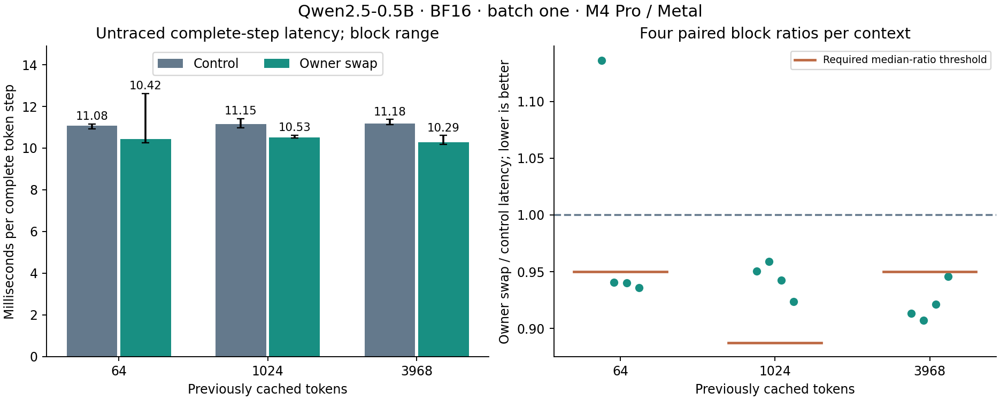

# Swapping hidden-buffer ownership

**Decision: retain the candidate; Fast/auto remain unchanged.** The candidate
preserves exact outputs and removes all 23 inter-layer copies. Median paired
latency reductions are 5.97%, 5.34% and 8.26%, but only the longest context
passes the declared performance gate. A short-context losing pair and larger
control variation at history 1024 prevent promotion. No samples were discarded
and no replacement timing run was taken.

The [frozen plan](buffer-swap-plan.md) compares the current configuration 26
(QKV and activation fusion, CPU greedy) with identical arithmetic and selection
plus removal of the 23 inter-layer copies. The target is Qwen2.5-0.5B-Instruct,
single-row decode on Apple M4 Pro / Metal. GPU argmax remains a separate
[unpromoted candidate](token-selection.md).

## Mechanism and ownership

Previously each layer wrote its final residual into `mlp.output`, then a GPU
kernel copied that row into `model.input` for the next layer. Both buffers have
room for `max_rows * 896` BF16 elements and are independently owned.

The candidate exchanges their DeviceBuffer owners after layers 0 through 22.
The next layer builds its input view from the newly assigned input owner. Both
allocations stay alive, all consumers run on the existing ordered stream, and
each layer's input and output remain disjoint. No alias check is weakened.
Layer 23 does not swap, so final normalization still reads `mlp.output`.
There are 23 swaps per call, so physical buffer roles reverse on consecutive
single-token calls. The next embedding upload uses whichever input owner is
current. Multi-row prefill retains the copy path, even after a swapping call.

No kernels, reductions, dtype boundaries or greedy rules change. No new GPU
allocation or synchronization is introduced. Removing 23 compute commands
reduces 314 to 291; the four token/logit mapping blits remain. The logical
traffic avoided is 23 * 896 * 2 bytes * (one read + one write) = 82,432 bytes
per token. That is source-level accounting, not measured DRAM traffic.
The hypothesis concerns repeated submission overhead, given the earlier
combined copy duration of only about 0.074 ms of active GPU time per token.

## Correctness

A native ownership test submits 47 GPU operations with a buffer swap after
each one and no synchronization between operations. It checks pointer identity
on every swap and exact BF16 contents after completion. This covers odd and
even ownership states while queued GPU views remain live.

Full-model verification compares logits and all 48 complete KV buffers at
histories 64, 1024 and 3968, including untouched prefixes and inactive suffixes.
Outputs and the active cache append row are poisoned before each arm.
At history 64, 123 additional files cover every layer hidden state, final norm,
logits, cache and append captures; all are compared byte for byte.

The lifecycle sequence uses row counts 3, 1, 1, 2, 1, reset, 1, 2, 1. Its eight
forward calls compare every logit and token, and the final full cache storage,
for 57 additional paired files. It asserts the expected physical owner roles,
distinct buffers and submitted-row accounting. Invalid IDs and attempts to use
swapping with two rows must fail before moving buffers or changing valid state.

These extra synchronized diagnostic captures complement the ordinary full-model
verification, which executes each layer stack without internal synchronization.
The 24 streamed replies additionally exercise continuing generation, multiple
prompts and resets using the actual unsynchronized layer path.

## Complete-token results

Measured source: `239497e65459beecf44df23cd543486ef61eefa3`, clean checkout.
Apple M4 Pro / Metal (`Mac16,7`, 24 GiB), macOS 26.6.2, Mojo 1.0.0,
MAX 26.5.0, Xcode 26.6. The executables report the actual device and backend.
Each arm uses batch one, row-major BF16 hidden state `[1,896]`, BF16 logits
`[1,151936]`, and 24 pairs of row-major BF16 caches `[4096,2,64]`.
AC power, normal power mode and no recorded thermal/performance warnings were
checked before and after every block; GPU clocks and background work were not
controlled. Exact software, source, executable and asset hashes are retained.

| Cached tokens | Copy control ms | Owner swap ms | Median paired reduction | Required reduction | Gate |
| ---: | ---: | ---: | ---: | ---: | --- |
| 64 | 11.084 | 10.424 | 5.97% | >5.00% | Fail: one losing pair |
| 1024 | 11.151 | 10.525 | 5.34% | >11.25% | Fail: control variation |
| 3968 | 11.179 | 10.291 | 8.26% | >5.00% | Pass |

Times are medians of four block medians. Reductions use the median of the four
paired ratios, so they need not equal the ratio of the displayed times.
At history 64, the four candidate/control ratios are 1.1363, 0.9404, 0.9401
and 0.9359. At history 1024 all candidate pairs are faster, but control self-pair
ratios range from 0.8875 to 1.0392. The declared rule includes that variation.
The complete sample set is retained; this result does not identify the cause
of the noisy blocks.



## What the traces establish

Both traces cover ten warmups and eight measured steps at history 1024.
All compute commands and mapping blits have unambiguous coverage, including
split active intervals and resubmissions. The copy control has 2,544 retained
command records; the candidate has 2,360.

| Per token in the separate traces | Copy control | Owner swap |
| --- | ---: | ---: |
| Compute commands | 314 | 291 |
| Mapping blits | 4 | 4 |
| Median summed active compute, ms | 7.556 | 7.471 |
| Mean active inter-layer copy time, ms | 0.0742 | 0 |
| Mean active vocabulary projection, ms | 1.3076 | 1.3070 |
| Median first-to-last GPU command span, ms | 16.641 | 15.181 |

This confirms the proposed mechanism: the removed kernels did little GPU
work, but required 23 additional submissions. The other arithmetic stages
remain essentially unchanged in these captures. Reduced submission overhead
is consistent with the larger complete-token median gains. The traces do not
separately identify every source of the gain. Traced spans include profiler
effects and cannot substitute for the untraced latency table.

## Native streaming results

All 24 replies preserve exact emitted bytes, generated token IDs and history.
The three fixed prompts consume 44, 1027 and 3839 tokens; each reply generates
128 tokens. Each arm starts fresh, resets between prompts, and uses the same
multi-row prefill policy. Medians below are over four paired blocks.

| Prompt tokens | Copy control tokens/s | Owner swap tokens/s | Control first-token ms | Swap first-token ms |
| ---: | ---: | ---: | ---: | ---: |
| 44 | 83.96 | 90.05 | 51.48 | 53.50 |
| 1027 | 86.56 | 93.66 | 488.10 | 486.86 |
| 3839 | 87.59 | 92.67 | 2134.80 | 2135.24 |

All twelve streaming arm pairs have higher candidate throughput. First-token
time remains governed largely by prefill, which this experiment does not
change. Streaming timing includes generation bookkeeping and output; it is
supporting application evidence and does not replace the fixed-context gate.

## Measurement and evidence

Four paired blocks at each of three histories; control self-pairs and
candidate/control pairs; ten warmups and ten retained samples per arm.
All 480 samples are kept. Blocks 2 and 3 reverse arm and comparison/workload
order. The complete-token boundary is fixed-token upload through greedy
readback; allocation, model loading, history preparation, rewind and recording
are excluded. Traces are separate, with ten warmups and eight measured steps
for each arm at history 1024. Native streaming uses four paired blocks,
three fixed prompts and 128-token replies.

Promotion requires all four paired ratios below one and median reduction
above max(5%, largest absolute control self-pair deviation), at every history.
These are bounded acceptance rules, not confidence intervals. Raw samples and
power/thermal conditions remain in the archive regardless of the outcome.

The full `uv run --locked llm-mojo-validate` completed successfully, including
all 19 MLP mappings and all benchmark smoke routes. The validated implementation
and 170 Python tests are recorded in [the validation receipt](buffer-swap-validation.json).
The final archive-integrity test brings Python coverage to 171 passing tests.
It rejects missing samples, layer/lifecycle/ownership checks, incomplete traces,
changed provenance or terminal tokens, and invalid retained power conditions,
even when the outer archive hashes are recomputed.

Native study policy `buffer-swap` opts into swapping only for a single row on
Apple M4 Pro. `combined` remains the explicit copy control. Other devices and
multi-row calls retain their existing routes. The low-level `forward` defaults
to copying; explicit multi-row swapping is rejected. GPU argmax remains parked
and was not combined with this experiment. Residual/RMSNorm fusion was not
started. This result adds an exact, promising candidate without changing Fast.

## Reproduction

The compact [archive](buffer-swap.json.gz) is 623,208 bytes, with compressed and
uncompressed hashes in [its manifest](buffer-swap.json). It contains all 480
samples, numerical checks, 4,904 trace-command records with active fragments,
streaming events, build identities and conditions. Expanded arrays, executables
and Instruments traces remain outside Git. Replay and plotting require no GPU
or model weights:

```sh
uv run --locked python -m llm_mojo.benchmarks.model_profile fusion-replay --copy-free --output studies/model_generation
uv run --locked --with matplotlib==3.10.8 python -m llm_mojo.benchmarks.model_profile fusion-plot --copy-free --output studies/model_generation
```

To repeat execution, use a clean checkout of the measured source, verified local
prepared assets and fresh output directories. The following reuses the existing
fusion harness; `--copy-free` fixes the new control and candidate:

```sh
uv run --locked python -m llm_mojo.benchmarks.model_profile build --copy-free --prepared /absolute/path/to/model-prepared-v1 --output /tmp/qwen-buffer-swap-build
uv run --locked python -m llm_mojo.benchmarks.model_profile collect --build /tmp/qwen-buffer-swap-build --output /tmp/qwen-buffer-swap-timings
uv run --locked python -m llm_mojo.benchmarks.model_profile fusion-capture --build /tmp/qwen-buffer-swap-build --output /tmp/qwen-buffer-swap-traces
uv run --locked python -m llm_mojo.benchmarks.model_profile fusion-terminal --build /tmp/qwen-buffer-swap-build --output /tmp/qwen-buffer-swap-terminal
uv run --locked python -m llm_mojo.benchmarks.model_profile fusion-archive --copy-free --timings /tmp/qwen-buffer-swap-timings --traces /tmp/qwen-buffer-swap-traces --terminal /tmp/qwen-buffer-swap-terminal --output /tmp/qwen-buffer-swap-results
```
