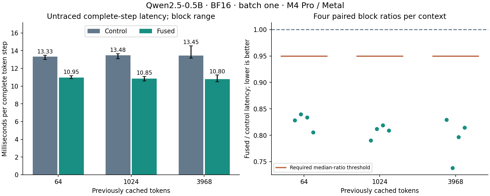

# Combined fusion clears the promotion gate

Combining QKV/RoPE/cache fusion with exact SiLU/multiply fusion reduced measured
whole-token latency by **16.9–19.4%** against the original Fast route. It also
beat QKV fusion alone in every paired block. Native streaming replies reached
**86–90 tokens/s** by prompt-group median, with exact output bytes, token IDs
and histories. **Fast and auto now select configuration 26 for single-row
M4 Pro calls.** Multi-row selection and other-device fallback remain as before.

This completes the [predeclared combined experiment](combined-fusion-plan.md).
All 720 timing samples were retained; no completed measurement was discarded or
repeated to obtain promotion. The earlier [QKV-only gate](qkv-fusion.md) remains
a separate result.

## Whole-token measurements

| Cached tokens | Original, ms/token | Combined, ms/token | Paired median reduction | Required reduction | Gate |
| ---: | ---: | ---: | ---: | ---: | --- |
| 64 | 13.326 | 10.953 | 16.91% | >5.00% | Passed |
| 1024 | 13.480 | 10.850 | 18.96% | >5.00% | Passed |
| 3968 | 13.451 | 10.800 | 19.43% | >5.00% | Passed |

Latency columns are medians of four block medians. Reductions use the median
of the four paired candidate/control ratios, rather than the ratio of the
independently aggregated latency columns. All twelve combined/original ratios
were below one. Control self-pair deviations were at most 3.31%, so the
predeclared minimum 5% threshold applied at every context. This session was
also more stable than the earlier QKV-only session; its timings and noise
calibration must not be mixed with that earlier experiment.



Whiskers show the range of block medians, not confidence intervals. The right
panel retains all paired ratios and each context's required median threshold.

The additional comparison isolated the value of adding activation fusion:

| Cached tokens | Combined versus QKV-only paired median latency reduction | All four pairs faster |
| ---: | ---: | --- |
| 64 | 3.16% | Yes |
| 1024 | 3.81% | Yes |
| 3968 | 6.47% | Yes |

These are separate same-build pairs, not percentages inferred from the earlier
QKV study. They pass the plan's additional direction check. The calibrated
promotion threshold applies to the combined/original comparison; there is no
separate QKV-only self-calibration or claim that each incremental reduction
exceeds a 5% floor.

## What changed and why it helps

QKV fusion replaces unpack, two rotary kernels and cache append with one
kernel per layer. Activation fusion then replaces SiLU and multiply with one
kernel. Each activation thread owns one gate/up/output element, calls the
existing `silu_bits` and then `multiply_bits`, and retains the intermediate
BF16 result as bits in a register. It removes a store and reload without
changing rounding, signed-zero handling or the subnormal policy.

The new activation kernel uses groups of 128 threads over width 4864. There
are no barriers, new allocations, reductions or synchronization points. It
does not touch the allocated activation scratch. Existing disjoint-buffer
preflight remains, and incompatible row/mapping calls fail before cache mutation.
Projections, attention math, residuals and CPU token selection remain identical.

Activation fusion avoids 19 KiB of logical reads/writes per layer, or 456 KiB
per token. Together with QKV fusion, this removes 576 KiB of logical intermediate
traffic and 96 of the original 410 compute launches. Allocated workspace size
is unchanged. These byte counts are source-level accounting, not measured DRAM
traffic; the hypothesis is principally lower repeated submission overhead.

Separate traces at history 1024 confirmed the structure:

| Diagnostic trace measurement per token | Original | Combined |
| --- | ---: | ---: |
| Compute commands | 410 | 314 |
| Buffer-transfer blits | 4 | 4 |
| Active SiLU and multiply time, ms | 0.176 | 0.087 |
| Active QKV unpack/rotary/append time, ms | 0.509 | 0.103 |
| All active command time, ms | 8.103 | 7.541 |
| Sum of host Metal submission intervals, ms | 17.065 | 11.882 |
| Enclosing GPU span, ms | 21.642 | 16.182 |

Each capture used ten warmups and eight measured steps. Both passed on the
first attempt with complete trailing command coverage: **5792 compute commands
and 64 blits**, including every active fragment. Stage rows sum the respective
stage medians over the 24 layers. Host submission, GPU execution and waiting
overlap, and tracing perturbs execution. These differences cannot be added to
or subtracted from ordinary token latency or used to assign an exact fraction
of the gain to CPU versus GPU work. No DRAM-bandwidth or occupancy claim is made.

## Native streaming and correctness

| Prompt tokens | Tokens per reply | Original median tokens/s | Combined median tokens/s |
| ---: | ---: | ---: | ---: |
| 44 | 128 | 69.91 | 86.21 |
| 1027 | 128 | 71.90 | 88.98 |
| 3839 | 128 | 72.02 | 89.50 |

Four paired blocks produced 24 replies using the existing three prompts.
Every paired reply matched emitted bytes, generated IDs and complete history;
all stopped at the 128-token limit. These are regression prompts, not new
holdouts. Token events follow detokenization and flush through native CLI
pipes. Streaming rates exclude model loading and prefill and do not measure
GUI rendering. They corroborate rather than replace the fixed-step gate.

The full-model comparison retained 147 exact, finite comparisons: logits and
all 48 full cache buffers at each of three histories. Output logits, active
cache rows and activation/gating scratch were poisoned before verification;
prefixes and inactive suffixes remained exact. Winner IDs, logical length and
submitted-row accounting matched. The isolated activation test performs
563208 exact bit comparisons over 40 sweeps, including every finite BF16 gate
value, signed zeros, subnormals, varied up inputs, ragged widths and protected
output tails. Independent existing SiLU/multiply oracle tests also passed.

The complete `uv run --locked llm-mojo-validate` passed before freezing source,
including all 19 MLP projection mappings and benchmark smoke routes. Promotion
then passed all 167 Python tests and native model-policy checks. Public chat
and default profiling are checked separately from the study build. The
arithmetic kernels are unchanged from the measured candidate.

## Provenance and reproduction

Measured clean source: `5eb2e85ed1173c4eff6e5e5692f6a0f30d488369`.
Hardware: actual Apple M4 Pro / Metal, Mac16,7, 24 GiB unified memory. Software:
macOS 26.6.2 (25G83), Xcode 26.6 (17F113), Mojo 1.0.0 and MAX 26.5.0 from
`uv.lock`. Qwen2.5-0.5B-Instruct uses BF16 weights, boundaries and KV storage,
24 layers, hidden 896, intermediate 4864, vocabulary 151936, per-layer
row-major K/V [4096,128], and maximum prefill chunks of 256.

All timing arms use ten warmups plus ten retained samples, four blocks and
histories 64/1024/3968. Arm, context and comparison order reverse in the middle
blocks. Timing starts at token upload and ends after forward, greedy readback
and unmap. Loading, allocation, fixed-history preparation, rewind and logging
are outside the boundary. No internal observation clocks, profiler or debug
synchronization run inside timed forwards. AC power, normal power mode and no
reported thermal warning were checked around each block; clocks and background
activity were not fixed.

The [compressed archive](combined-fusion.json.gz) retains samples, exactness
records, trace fragments, terminal events and source/binary/asset/environment
identities. Its [manifest](combined-fusion.json) hashes both compressed and
uncompressed bytes; the [summary](combined-fusion-summary.json) is regenerated
by replay. Raw traces, snapshots and binaries remain outside Git under
`/private/tmp/combined-fusion-*`. The earlier QKV archive is unchanged.

```sh
uv run --locked python -m llm_mojo.benchmarks.model_profile fusion-replay --combined --output studies/model_generation
uv run --locked --with matplotlib==3.10.8 python -m llm_mojo.benchmarks.model_profile fusion-plot --combined --output studies/model_generation
```

The [plan](combined-fusion-plan.md) records collection commands and stopping
rules. Future study builds use explicit `unfused` versus `combined` policies;
normal profiling follows the promoted Fast route, while replay reads historical
geometry from retained provenance. The original QKV-only result is preserved.
