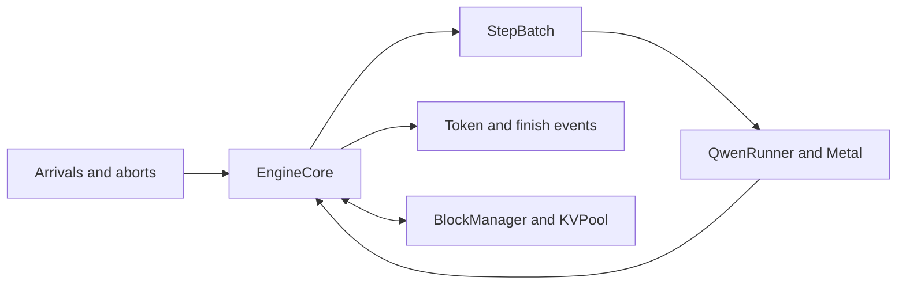

# Engine core: readiness, correctness and load declaration

Implementation authorized on 2026-10-08 from baseline
`cb2416abf3c9fbb19c460fa99709d93eeabba97e` on `codex/engine-core`.
**Status: synchronous core and optional asynchronous stepping validated.** Mixed execution,
request lifecycle, KV-pressure replay, optional fitted budgeting and optional
lifetime-reservation admission are implemented. Optional asynchronous LLM
stepping has separate [retained acceptance and paired results](#asynchronous-stepping-retained-bounded-results).
Its offline speed verdict is inconclusive; it remains opt-in. The original
study binds clean implementation
`b18563b`; its final follow-up added acceptance tests and retained evidence.
The [admission successor](#lifetime-reservation-admission-bounded-successor-study)
binds `b81ea6c` and removes replay on both frozen pressure traces.
The [operating-range comparison](#admission-operating-range-retained-bounded-results)
binds `2af0933` and measures the unused-capacity and queueing cost of larger
declared output limits across 144 runs.
The [fixed-workspace budget results](#fixed-workspace-budget-retained-bounded-results)
and [optional Fast comparison](#optional-fast-engine-retained-bounded-results)
bind clean `01d8be4`: fixed-256 and reference-27 remain the defaults.
The [serving plan](../../docs/serving-plan.md) defines the architecture;
[experimental method](../../docs/experiments.md#serving-measurement-contract)
defines retention and paired comparisons.

The native `EngineCore` accepts arrivals and aborts at step boundaries, schedules
decode rows and one prefill tail, and delivers ordered token/finish events. Its
synchronous Metal runner completes each step before cache ownership changes;
the async runner retains submitted ownership until each ticket is collected.
The trace driver exercises both backends with fixed arrivals. Terminal chat
defaults to its direct Fast session; `chat --engine` uses the synchronous
reference core, and `--async-stepping` opts into the async adapter. Both engine
chat modes use one request at a time and complete-history recomputation.
Prefix caching and multi-request frontend transport remain separate work.



## Readiness receipt

The [retained readiness receipt](engine-core-readiness.json) passes the baseline
and clean candidate gates. Its [lossless validation archive](engine-core-validation.json.gz)
retains the logs, checkpoint reports, commands, build receipts and small asset
manifests. Baseline source is the exact `cb2416a` archive, whose temporary Git
identity is recorded separately. The baseline suite passed 296 Python tests and
28 native test files; the candidate suite passed 302 Python tests and 31 native
files during development, followed by the final 310-test Python suite. These
are separate recorded scopes, not a combined count from one invocation.

The [final acceptance extension](engine-core-acceptance.json) passes 17 native engine tests, including abort
after partial prefill and actual decode. A full-checkpoint numeric-fault driver
passes ordinary and device-sync-mode runs on Apple M4 Pro/Metal. It submits a
mixed step through all 24 layers, detects a deliberately nonfinite tied-head
weight during greedy readback, emits one error finish for each of three live
requests, returns all blocks and rejects subsequent work. Prepared files remain
unchanged. This tests numeric-fault cleanup, without a device-loss recovery claim.
Production Mojo hashes remain identical to the measured `b18563b` implementation.

Before phase 3 evidence collection, retain one `engine-core-readiness-v1` receipt
with `schema_version`, baseline and candidate source identity, toolchain and
asset identity, and a check list. Every check has a name, exact command, status
(`passed`, `failed`, `unavailable` or `not_run`), exit code where applicable and
the retained result's hash. `ready` is true only when all required checks passed.
Missing assets or a stopped suite cannot produce a ready receipt.

Required baseline checks are:

- clean source/build identity and the stable versions resolved through `uv.lock`;
- `uv run --locked llm-mojo validate`, including frozen oracle anchors, all
  Python/native tests, Unicode tokenizer and benchmark smokes;
- clean full-checkpoint `validation.model lifecycle` and `validation.model batch`
  runs in the default 32-slot slot-major layout;
- a generation report accepted by `validate_generation_events`, proving
  `Apple M4 Pro/metal`, route selection, token budget, cache/submission accounting
  and completion;
- prepared model and tokenizer manifests and their hashes.

The full suite uses device-sync-mode. Repeat checkpoint lifecycle in ordinary
and device-sync modes; timing collection removes device-sync-mode. Record the
checks' actual source and binaries, not only the machine's available backend.
Use new output paths. The October 5 adoption and October 6 device-proof repeat
remain historical evidence; they are not a new phase 3 readiness pass.

## Staged correctness gates

The initial Metal runner uses reference configuration 27 for every arm: BF16
stored tensors with FP32 reductions and the same row arithmetic across solo,
batched and mixed shapes. It establishes a common scheduling baseline, rather
than the existing Fast kernel selection. A faster Fast engine route requires
its own numerical diagnosis and paired comparison.

The chunked implementation uses one ordered Metal stream, one prefill sequence per
step, a fixed 256-token total step budget, and no prefix-cache reuse. Full prefill
comparison arms use up to 4,096 rows in a standalone prefill step. Admission
is bounded. Decode runs before prefill; preemption retains delivered history,
releases blocks and recomputes that history. Queue capacity, maximum sequences,
KV pool capacity and watermark are explicit configuration, never inferred from
available machine memory.

The simulated runner returns scripted tokens and advances a virtual clock. It
uses the same scheduler and block manager as Metal, so it establishes lifecycle
and ownership under deterministic arrivals, stops, limits, aborts, rejection and
memory pressure. Check invariants after every step, including allocation across
block boundaries, abort while waiting/prefilling/decoding, and full drain.
It establishes no GPU performance or native numerical agreement.

Exact gates:

- Existing S = 1 and decode-only Fast gates remain required. Configuration 27's
  solo, batched and mixed rows agree byte for byte with equivalent execution
  using that same reference route.
- Mixed steps use correct absolute positions and slot mappings, select only
  requested logits, preserve existing cache prefixes and inactive storage,
  and change only the scheduled sequences' own write slots.
- Token/sequence budgets and allocator invariants hold after each step.
  Once drained, every request has one terminal event and no block is referenced.
- Rejected adds and invalid steps leave histories, blocks and counters unchanged.
  Delivered tokens are ordered, valid, neither omitted nor duplicated, and never
  delivered after a request finishes. Recomputed history is not delivered again.
- A Metal execution failure has an explicit failed result for every in-flight
  request. Automatic restart and frontend replay are phase 5 work.
- Asynchronous and synchronous execution on an identical frozen step schedule
  deliver identical tokens. Stop/limit/abort tests account separately for any
  extra submitted token that is discarded.

Reference-route mixed steps and recomputed histories have exact own-route gates.
Numerical diagnostics compare the reference with existing Fast execution on the
same supplied token histories.
Retain token agreement, first divergence, logit distances, finite-boundary
checks and route identities. Different Fast chunk/batch shapes may select
different arithmetic; these comparisons have no invented closeness threshold.
Finite outputs, storage ownership and accounting remain required gates.

## Workload declaration

Before collection, freeze a versioned trace containing mode, generator version,
seed and one record per request; its hash is its identity:

```text
request_id, arrival_offset_ns, prompt_ids, max_new_tokens, stop_ids,
abort_offset_ns, output_script
```

The trace's SHA-256 binds every field and its ordering. `abort_offset_ns` is null
when absent. `output_script` is absent in the initial driver. Scripted simulation
uses the trace's global `scripted_tokens` oracle: input token plus absolute
position indexes that script, so interleaving and recomputation preserve its
selections. It is not per-request teacher forcing. Every request's
prompt plus output budget fits 4,096 tokens. Arrival offsets are fixed before
an arm runs; the collector does not change them in response to its speed.

Use the existing native tokenizer/conversation fixtures or the existing declared
synthetic token construction, with pinned provenance. Freeze exact token arrays
and lengths rather than requesting an unspecified category of short prompts.
The bounded first matrix includes an offline trace (all arrivals at zero), an
online short/long prompt mix, and a KV-pressure trace. It must exercise prefill
while other requests decode, uneven completion, replenishment and block growth.
An exploratory capacity probe may set online rates; retain it separately, then
freeze the confirmatory rates, seeds and request counts before collecting them.
The initial synthetic generator freezes eight prompts of 32, 128, 64, 512, 96,
1,024, 256 and 64 tokens, each with a 32-token output budget, using the existing
affine token construction with a request-specific offset. The collector defaults
to 128 blocks and eight sequence slots; both are explicit run fields. An online
rate must be supplied and is recorded with its seed and arrival offsets.
No latency target is selected by this declaration.

The separate adaptive mechanism uses a provisional 25 ms predicted-execution
research target. That is a configuration for its calibration/evaluation, not a
target-capacity or client-SLO claim, and does not change the fixed study's null
target. Its full request-level goodput definition remains undeclared.

The first arms add one mechanism at a time:

| Arm | Scheduled work |
| --- | --- |
| Serial | One request at a time; standalone full prefill |
| Static | A cohort prefills, then decodes; the next cohort joins after drain |
| Continuous | Requests join at boundaries; standalone full prefill |
| Chunked | Continuous decode shares steps with one bounded prefill chunk |

Keep source, model, pool capacity, request limits and trace identical across
arms; record each arm's intentional scheduler differences. Fitted budgeting and
asynchronous stepping are later arms with separate declarations and validation.
Natural greedy runs retain their actual trajectories and work counts. Frozen
same-history replays isolate scheduling and numerical differences; they are
explicitly marked and do not stand in for natural request performance.

## Collection and data schema

Extend `benchmarks/model_contract.py` for the frozen declaration and
`benchmarks/model_profile.py` for build, collect, archive and replay. The native
token-trace driver belongs in `benchmarks/`; reuse `serving/` for the engine and
both runners. Keep records in this existing study topic. No separate experiment
tree or Python inference engine is required. The `model_profile` commands are
`engine-specification`, `engine-build`, `engine-collect` and `engine-replay`.
Collection requires a clean build receipt, pinned prepared assets, actual runtime
device identity and frozen trace JSON. Replay needs only the archive and manifest.
The completed bounded results and their replay commands follow below.

A run manifest contains the schema-versioned declaration, build/source hashes,
binary hashes, prepared-model/tokenizer hashes, exact trace document and its
hash, scheduler configuration,
runner/output mode, timing boundary, warmup count, paired block order and
environment/conditions. The card identifies pinned model/tokenizer assets,
vocabulary/stop IDs, BF16/FP32 policy, 4,096-token limit, layout, block size,
pool capacity and actual runtime device/backend. The initial collector retains
build/asset identity rather than claiming the future API's startup model card.
A simulated run identifies a virtual clock and cannot satisfy a Metal claim.

Each run carries its block, arm, calibration role, mode and unchanged trace.
It retains complete native stdout plus validated parsed records in order. The
initial native line grammar is:

```text
device Apple M4 Pro/metal
mode greedy
config arm blocks token_budget max_sequences
arrival request_id scheduled_ns actual_ns
token request_id token_id prompt_tokens generated_tokens arrival_ns emitted_ns
finish request_id reason prompt_tokens generated_tokens arrival_ns emitted_ns
drained request_count step_count free_blocks elapsed_ns
```

Scripted mode instead names `simulated/virtual`. `generated_tokens` counts
delivered tokens, starting at one. One terminal event closes each arrival,
including a zero-output limit.
Arrival and abort offsets are retained in the input trace. The initial
performance matrix contains valid requests; explicit rejection is an acceptance
test, not an invented collector event.

Each completed step contains:

```text
step step_id decode_seqs prefill_seqs prefill_tokens total_tokens
     attended_positions admitted preempted finished aborted waiting blocks_free
     begin_ns schedule_ns build_ns execute_ns postprocess_ns end_ns
     predicted_ns budget_limited
```

The step occupies one line; `ENGINE_STEP_FIELDS` freezes its order. Fixed-budget
runs require `predicted_ns` and `budget_limited` to be zero. An adaptive run has
a separate frozen policy declaration; its `policy` line names target, fixed,
per-row, per-position, per-attention-partition and per-logit-row nanosecond
coefficients. The initial fixed study has no target or fitted gain claim. Define
`attended_positions` as the sum of causal KV lengths seen by all scheduled query
rows, rather than the maximum context multiplied by batch size. Greedy timings
use a monotonic host clock; scripted timings use the virtual clock. `execute_ns`
covers upload, submission, waiting and readback together. `end_ns - begin_ns`
retains overhead between sections. GPU stage attribution requires separate
captures. Asynchronous telemetry needs a separate schema with submitted and
readback step identities.

### Frozen adaptive policy

`benchmarks/engine_budget.py` implements `fit`, `evaluate` and `replay` for a
separate adaptive study. Calibration consumes the complete checked Metal
fixed-budget archive. It fits nonnegative coefficients for fixed cost, token
rows, attended positions, attention partitions and sampled logit rows, then
rounds them upward to integer nanoseconds. The frozen policy binds the exact
build, calibration archive, workload and every calibration sample. Evaluation
requires a different canonical native token trace; changing only an offline
seed label cannot make the same workload independent.

Evaluation has four paired blocks of fixed chunked, chunked/self-calibration
and adaptive execution. Native `predicted_ns` must reproduce the frozen
coefficients for each executed step. The engine chooses the largest prefill
chunk under its predicted target, while mandatory decode or one-token progress
can exceed it. Replay recomputes the fit, calibration residuals, evaluation
predictions and request metrics from retained data. It reports prediction
errors, constrained steps, measured/predicted target overruns and actual work;
it establishes no goodput or asynchronous claim. The held-out results below
measure its latency/throughput tradeoff; it remains optional.

## Pairing, metrics and replay

Run ten representative warmup steps per arm outside timing before each measured cell.
Reset request/block state and drain the stream between runs while keeping model
weights resident. Use four paired blocks, reversing trace and arm order in
blocks two and three, with control/self-control calibration from the same build
and session. Each online block is a complete trace replay; requests within it
are not independent repeats. Keep all measured records and condition snapshots.

Record TTFT from scheduled arrival to first delivered token,
each delivered-token interval, TPOT from first to last token divided by the
number of intervals, request end-to-end time and terminal reason. TPOT is null
for fewer than two delivered tokens. Report per-block distributions and p50,
p95 and p99 with the sample count and a declared quantile convention. Offline
throughput divides delivered tokens by the makespan from first arrival through
complete drain. Online reports separate the arrival window, measured duration,
drain tail, actual delivered work and accepted/rejected/aborted/completed counts.

Freeze the predicted-execution research target before cost fitting. The initial
adaptive setting is 25 ms; the fixed study has no target and neither study
defines goodput. Freeze client latency targets and the goodput formula before
corresponding latency or target-capacity claims. Fit on calibration records; freeze coefficients and
evaluate predictions on separate traces. No target is fabricated from a result,
and simulation speed is not measured hardware throughput. The paired offline
decision rule can establish a bounded gain/regression/inconclusive result;
online evidence reports the declared tradeoff and cannot infer better user
latency from aggregate tokens/s alone.

Offline replay checks hashes, the entire declared trace/arm/block grid, runtime
device evidence, monotonic step IDs/timestamps, complete request histories,
stop/limit/abort accounting, budget/drain summaries and all raw-derived metrics.
Native acceptance paths check full allocator invariants; an aggregate free-block
counter cannot prove them independently.
Regression tests must show it rejects omitted steps/tokens, duplicate delivery,
incorrect termination, a wrong device and a changed summary even when envelope
hashes are updated. Compact lossless archives, readable manifests and summaries
are retained; weights, binaries, arrays and full traces stay outside Git.

## Completed load studies

The [results card](engine-core-results.json) recomputes the retained matrix's
72 complete natural-greedy trace runs: three fixed-arm
grids of 20 runs and a separate 12-run adaptive evaluation. Each trace has eight
requests. Every run drained, returned its full KV pool and passed event, budget,
device and work-accounting checks. All paired arms delivered identical histories
using reference configuration 27. These are short synthetic token workloads on
one M4 Pro/Metal machine, with BF16 storage, FP32 reductions, 32-slot slot-major
KV, context limit 4,096, MAX 26.5.0 and Mojo 1.0.0. They establish no production
capacity, semantic quality, Fast-route speedup or client goodput result.

Tables report the median of four per-block metrics. Each block's latency
quantiles use linear interpolation: eight request samples for TTFT/TPOT and
248 delivered-token intervals in the fixed traces. Individual blocks, request
histories and quantiles remain in the archives. Requests within a block are not
independent repeats.

### Adequate KV capacity

The [offline archive](engine-core-offline.json.gz) uses all arrivals at zero,
128 blocks and eight sequence slots. Every arm delivers 256 tokens and computes
2,424 token rows. Serial has 256 steps; static/continuous have 39 and chunked has
46. Their control/self-control noise floor is 5.86%.

| Arm | Tokens/s | TTFT p50, ms | TPOT p50, ms | Token gap p95, ms | Token gap p99, ms |
| --- | ---: | ---: | ---: | ---: | ---: |
| Serial | 65.0 | 1,602.4 | 10.7 | 12.2 | 13.1 |
| Static | 158.9 | 421.6 | 38.6 | 14.4 | 983.5 |
| Continuous | 158.5 | 428.7 | 38.4 | 14.3 | 983.0 |
| Chunked, 256 rows | 149.3 | 455.1 | 37.8 | 151.8 | 192.4 |

Median paired makespan ratios against serial are 0.41855, 0.41543 and 0.43726,
respectively; all qualify as faster under the declared offline rule. Chunked
makespan falls 56.3% versus serial. Batching decode amortizes per-step work across
requests. Chunking introduces more prefill steps and changes when that work stalls
decodes: its p95 gaps rise, while its p99 gaps fall sharply versus continuous.
Both percentiles matter; aggregate throughput cannot select a token-latency policy.

The [online archive](engine-core-online.json.gz) freezes seed 19 and a Poisson
arrival rate of four requests/s before execution, with the same prompts, outputs
and pool. It reports a finite trace distribution, rather than a capacity claim.

| Arm | Tokens/s | TTFT p50, ms | TPOT p50, ms | Token gap p95, ms | Token gap p99, ms |
| --- | ---: | ---: | ---: | ---: | ---: |
| Serial | 67.7 | 500.6 | 10.3 | 12.2 | 13.2 |
| Static | 77.7 | 254.5 | 10.6 | 11.9 | 14.8 |
| Continuous | 82.8 | 109.2 | 12.2 | 12.6 | 371.1 |
| Chunked, 256 rows | 82.1 | 111.5 | 12.3 | 133.9 | 183.7 |

Continuous admission lowers queueing for this trace. Chunking again exchanges
rare large stalls for more frequent smaller stalls. Neither policy dominates
every latency statistic.

### KV pressure

The [pressure archive](engine-core-pressure.json.gz) reuses the offline trace
with 40 blocks. Every request fits alone; their combined working set does not.

| Arm | Tokens/s | Preemptions per run | Computed token rows | Paired makespan / serial |
| --- | ---: | ---: | ---: | ---: |
| Serial | 64.8 | 0 | 2,424 | 1.000 |
| Static | 22.8 | 62 | 18,488 | 2.855 |
| Continuous | 23.2 | 62 | 18,488 | 2.805 |
| Chunked | 27.9 | 57 | 16,432 | 2.378 |

All four blocks have the same preemption and work counts. Concurrent arms are
slower under the 5% noise floor. History retention and replay establish finite
progress and exactly-once delivery, but repeated admission/eviction creates
thrashing. Chunked replay computes 6.78 times the serial token work. This result
motivated the [lifetime-reservation successor](#lifetime-reservation-admission-bounded-successor-study)
below. These historical measurements remain unchanged; the successor uses a
fresh same-build incremental control.

### Fitted execution budget

The [frozen intent](engine-core-intent.json) selects the provisional 25 ms
predicted synchronous execution target before fitting. The
[policy archive](engine-core-policy.json.gz) binds the complete offline calibration
archive and retains every calibration sample. Its fitted cost is

```text
predicted_ns = 9,926,060 + 431,597 * token_rows + 320 * attended_positions
```

The fitted attention-partition and logit-row coefficients are zero. That is a
result of this joint fit, not evidence those operations have zero physical cost.
Calibration MAE is 1.31 ms and p95 absolute error is 3.61 ms; maximum error is
49.23 ms. Upward integer rounding does not turn least squares into a bound.

The [held-out archive](engine-core-adaptive.json.gz) uses seed 29, 16 arrivals/s,
different token IDs and prompt lengths 48, 192, 80, 768, 144, 1,536, 320 and 128,
with 24 output tokens per request and 128 blocks. Its 184 token intervals and
eight request samples per block are separate from calibration. The frozen policy
selects prefill chunks of at most 34 rows, versus the fixed total budget of 256.

| Held-out arm | Tokens/s | TTFT p50, ms | TPOT p50, ms | Token gap p95, ms | Token gap p99, ms |
| --- | ---: | ---: | ---: | ---: | ---: |
| Fixed chunked | 68.3 | 602.9 | 82.7 | 244.3 | 279.0 |
| Fitted budget | 59.1 | 805.8 | 22.1 | 24.1 | 25.0 |

Every paired history matches. Adaptive/control makespan ratios are 1.18427,
1.31504, 1.03495 and 1.35307 (median 1.24966); self-control variation reaches
13.10%. These online results establish the observed tradeoff, without an offline
gain classification. Prefill is spread over more steps, reducing decode stalls
while increasing overhead and time to finish prompts.

All 648 adaptive step predictions are at most 25 ms. Measured executions exceed
it in **3, 2, 2 and 109 of 162 steps per block**, totaling 116/648. The last
block's token-gap p95 is 31.0 ms, versus 23.8–24.4 ms in the other blocks.
Held-out per-block prediction MAE ranges 2.30–3.14 ms; p95 absolute error ranges
4.50–6.14 ms. The model is useful for a tested scheduling tradeoff, but does not
establish a reliable latency bound. The fixed default stays 256; fitted budgeting
requires an explicit policy. Client SLOs and goodput remain undeclared.

### Numerical comparison with Fast

The [diagnostic archive](engine-core-diagnostics.json.gz) supplies identical
histories to reference 27 and Fast: three prompts of 32, 512 and 1,024 tokens,
256-row prompt chunks and eight supplied decode rows each. All six processes
and 62 captured calls complete on Metal; all 305,225,216 captured BF16 boundary
elements are finite. It retains routes, native output, file identities, FP64
logit distances and the regeneration script. Full arrays remain outside Git.

Greedy choices agree at 26/27 requested prediction points. The first difference
is the third prediction of request 0, at cached length 34: reference chooses
3914 and Fast configuration 26 chooses 50, with maximum logit difference 0.15625
and logit RMS difference 0.036307. The fixed supplied history continues after
that difference. Reference matches all supplied engine-history choices. These
are diagnostics without an invented closeness threshold; they do not promote
configuration 27 as a replacement for Fast.

### Replay and next work

Archives include raw native event/step records, frozen trace documents, complete
source/binary/asset identities and condition snapshots. Adaptive replay embeds
the original calibration archive and refits its coefficients. The readable
envelopes bind compressed and uncompressed hashes. Replay either an external
collection directory or the retained archive file:

```sh
uv run --locked python -m llm_mojo.benchmarks.model_profile engine-replay \
  --output studies/model_generation/engine-core-offline.json.gz
uv run --locked python -m llm_mojo.benchmarks.model_profile engine-replay \
  --output studies/model_generation/engine-core-online.json.gz
uv run --locked python -m llm_mojo.benchmarks.model_profile engine-replay \
  --output studies/model_generation/engine-core-pressure.json.gz
uv run --locked python -m llm_mojo.benchmarks.engine_budget replay \
  --output studies/model_generation/engine-core-adaptive.json.gz
```

Replayed summaries equal the summaries retained inside the archives. Full derived
request-summary files are generated locally and ignored by Git; the compact
results card remains readable evidence. The admission successor below addresses
repeated preemption. Cost-model variability and the cost of reserving maximum
output capacity remain study questions. At this original milestone, multi-prefill
steps, a measured Fast runner, prefix caching and frontend integration remained
separate work; the implemented successor contracts and terminal adapter are
recorded below. The original asynchronous gate was still open at that milestone;
the current implementation and successor acceptance contract follow below.

## Lifetime reservation admission: bounded successor study

Implementation authorized on 2026-10-09 from clean baseline `d0e3626`.
The optional `EngineCore(..., reserve_lifetime=True)` policy reserves physical
KV blocks when admitting a request. The existing incremental admission remains
the default and the comparison control. This changes ownership and scheduling,
not model arithmetic, cache layout, GPU kernels or the default 256-row budget.

For a positive output limit, peak cached extent is
`prompt_length + max_new_tokens - 1`: the last emitted token is returned without
being processed into KV. Demand is the ceiling of that extent divided by the
32-slot block size. Reserve the whole demand for the oldest waiting request,
or leave it waiting. Younger requests cannot bypass that FIFO head. Committed
length and written KV still grow only when a synchronous step completes.
Future reserved blocks contain no written tokens. Stop, limit, abort and fatal
execution error release both resident and unused future blocks.

The watermark is an admission margin whenever any request holds KV, including
residents not selected in the current step. Ignore it when no residents remain,
so a request validated to fit alone can run even with a full-pool watermark.
With finite feasible arrivals, resident work is bounded and its growth already
has capacity; oldest-first scheduling eventually releases that capacity and
admits the head waiter. This is a finite-drain argument, not an arrival-rate SLO.
Accepted zero-output requests finish at the next boundary without reservation;
their existing prompt-feasibility validation is preserved.

Execution work is independent of reservation size. Retain the chosen fixed or
fitted prefill row count when constructing a step. Do not infer that count from
the larger reserved extent. The initial physical-reservation implementation
uploads complete block tables, including future blocks; measurements include
that metadata overhead. Logical credit accounting is deferred until evidence
justifies the extra ownership ledger.

The versioned admission declaration uses reference configuration 27, BF16
storage with FP32 reductions, context 4,096, 32-slot slot-major KV, 256 rows,
eight sequence slots, zero watermark and ten warmup steps outside measurement.
Build one clean binary and compare chunked incremental with itself and with
chunked reserved in four balanced blocks. Reuse the exact retained offline and
online trace documents at 128 blocks, then both traces at 40 blocks. These four
collections contain 48 measured finite trace replays. Adaptive fitting, chunk
tuning, Fast execution and asynchronous stepping are outside this milestone.

Correctness gates require exact natural greedy histories across the two modes,
one terminal event per request, complete pool return, and zero conservative
preemptions. On the retained offline pressure trace, the work gate is 2,424
computed rows rather than the incremental control's 16,432 rows and 57
preemptions. Report all four blocks' makespan, throughput, TTFT, end-to-end
latency and p95/p99 token gaps. Apply the existing paired verdict only to
declared offline makespan; retain online distributions without a capacity or
client-SLO claim. Timing gains are hypotheses: reservation can defer admission
and increase TTFT even when it removes replay. The results below retain the
mode as an optional policy.

### Validation and retained results

All four collections use one clean `b81ea6c` binary on Apple M4 Pro/Metal,
Mojo 1.0.0 and MAX 26.5.0. The [result card](engine-admission-results.json)
binds source blobs, locked dependencies, binary and asset hashes, device,
conditions and every block's metrics. All 48 natural-greedy runs finish eight
requests, deliver 256 tokens and return the complete pool. Control, self-control
and reserved histories agree exactly within every collection. All 16 reserved
runs compute the necessary 2,424 rows with zero preemptions. Every offline
pressure control and self-control computes 16,432 rows with 57 preemptions.

The [validation manifest](engine-admission-validation.json) and
[lossless archive](engine-admission-validation.json.gz) retain the completed
`uv run --locked llm-mojo validate` invocation: 316 Python tests, 31 native test
files in 32 invocations, frozen oracle anchors and route smokes. Its 26 native
engine tests cover reservation arithmetic, FIFO blocking, watermarks, rejection
atomicity, unused-block cleanup, all terminal paths and 192 finite-arrival cases.
Source hashes before and after validation match the clean measurement build.
Separate full-checkpoint ordinary and device-sync acceptance runs preserve
natural greedy histories, release future blocks after partial-prefill abort,
and release all requests after an injected nonfinite head fault. Prepared assets
remain unchanged. Omitted and explicit incremental selectors produce identical
records after the explicit selector header is removed.

The tables report medians of four block-level metrics. Each block's TTFT,
end-to-end and TPOT quantiles use eight requests; token-gap quantiles use 248
intervals with linear interpolation. Online results and latency differences
are descriptive. Offline makespan uses the declared paired rule and a 5% noise
floor; adequate-capacity timing is inconclusive, while pressure passes faster
in all four blocks.

| Trace and pool | Incremental tokens/s | Reserved tokens/s | Incremental / reserved preemptions | Incremental / reserved computed rows | Reserved/control makespan, median | Verdict |
| --- | ---: | ---: | ---: | ---: | ---: | --- |
| [Offline, 128 blocks](engine-admission-offline.json.gz) | 166.3 | 167.0 | 0 / 0 | 2,424 / 2,424 | 0.99919 | Inconclusive |
| [Online, 128 blocks](engine-admission-online.json.gz) | 83.2 | 83.5 | 0 / 0 | 2,424 / 2,424 | 0.99756 | Distribution only |
| [Offline, 40 blocks](engine-admission-pressure.json.gz) | 31.7 | 123.7 | 57 / 0 | 16,432 / 2,424 | 0.25615 | Faster |
| [Online, 40 blocks](engine-admission-online-pressure.json.gz) | 28.9 | 83.2 | 44 / 0 | 16,246 / 2,424 | 0.34682 | Distribution only |

Online pressure has 44 incremental preemptions in every run. Computed rows
vary from 16,245 to 16,248 across controls and self-controls because arrivals
are applied at measured step boundaries; the table shows the control median.

Offline pressure makespan ratios by block are 0.25165, 0.25614, 0.25616 and
0.25624: a 74.4% median reduction. Removing replay reduces computed rows by
85.2% and raises aggregate throughput about 3.9 times. This comparison uses
the fresh incremental control, rather than the older 27.9 tokens/s measurement.

| Trace and admission | TTFT p50/p95/p99, ms | End-to-end p50/p95/p99, ms | TPOT p50, ms | Token gap p95/p99, ms |
| --- | ---: | ---: | ---: | ---: |
| Offline 128, incremental | 409.4 / 1,198.5 / 1,208.7 | 1,460.2 / 1,536.2 / 1,538.5 | 33.9 | 136.8 / 172.2 |
| Offline 128, reserved | 407.4 / 1,195.4 / 1,205.6 | 1,457.4 / 1,530.2 / 1,532.7 | 33.9 | 136.7 / 172.1 |
| Online 128, incremental | 119.0 / 489.8 / 584.5 | 680.8 / 1,142.3 / 1,144.6 | 10.3 | 117.7 / 163.3 |
| Online 128, reserved | 118.3 / 491.2 / 585.7 | 679.2 / 1,149.0 / 1,153.3 | 10.7 | 117.7 / 163.3 |
| Offline 40, incremental | 407.3 / 7,775.7 / 7,784.8 | 4,102.9 / 8,074.5 / 8,077.3 | 110.1 | 119.3 / 136.0 |
| Offline 40, reserved | 407.3 / 1,772.1 / 1,781.3 | 813.7 / 2,065.2 / 2,068.4 | 13.2 | 32.7 / 127.1 |
| Online 40, incremental | 206.2 / 5,950.3 / 5,965.1 | 4,114.2 / 6,995.4 / 7,308.0 | 33.3 | 136.1 / 136.2 |
| Online 40, reserved | 119.4 / 657.2 / 822.6 | 497.3 / 949.2 / 1,103.9 | 10.2 | 13.1 / 92.6 |

Schedule/build telemetry measures host preparation. Median total preparation
falls from 0.551 to 0.270 ms in offline pressure and from 0.591 to 0.345 ms in
online pressure; the result card retains per-step p95 and every block. Upload
of complete reserved tables remains inside `execute_ns`, together with GPU
submission, synchronization and selected-token readback. These measurements do
not isolate metadata upload or GPU stage time.

Reservation solves replay thrashing for these traces, but it reserves declared
maximum output capacity even when a request later stops early. FIFO also delays
younger requests behind a large waiter. Adequate-capacity online tail TTFT and
end-to-end metrics are slightly higher in this sample, without a declared
latency verdict. Incremental admission therefore remains the default; reservation
is an explicit choice for bounded workloads under pressure. A wider sweep of
output limits, early stops and arrival rates is the next evidence boundary.
No client SLO, goodput, target capacity, Fast-route improvement or asynchronous
stepping claim follows from this study.

### Reproduce the admission evidence

The [benchmark commands](../../src/llm_mojo/benchmarks/README.md#engine-token-traces)
build and collect the optional same-binary pair. Regenerate each retained
summary without weights or a GPU:

```sh
uv run --locked python -m llm_mojo.benchmarks.model_profile engine-replay --output studies/model_generation/engine-admission-offline.json.gz
uv run --locked python -m llm_mojo.benchmarks.model_profile engine-replay --output studies/model_generation/engine-admission-online.json.gz
uv run --locked python -m llm_mojo.benchmarks.model_profile engine-replay --output studies/model_generation/engine-admission-pressure.json.gz
uv run --locked python -m llm_mojo.benchmarks.model_profile engine-replay --output studies/model_generation/engine-admission-online-pressure.json.gz
```

The validation archive's `files` entries retain complete UTF-8 text with byte
counts and SHA256 hashes, including `intent.json`, the closeout script and its
successful command log. Restore those files to an external directory after
checking the compressed/uncompressed hashes in the validation manifest and
each entry's bytes/hash. With the bundle restored to `/private/tmp/admission-evidence`,
regenerate the card and tables independently:

```sh
uv run --locked python /private/tmp/admission-evidence/reproduction/admission_closeout.py \
  --root /private/tmp/admission-replay --retained-dir studies/model_generation \
  --intent /private/tmp/admission-evidence/intent.json \
  --live-receipt studies/model_generation/engine-admission-results.json
```

Retained replay verifies committed source blobs, archive identities, raw records,
all work/history/drain gates and exact derived metrics. It uses the original
live receipt for physical file checks, without requiring the original binary
or checkpoint to remain installed. Binaries, weights and oracle arrays are
excluded from the validation bundle.

## Admission operating range: frozen successor contract

Authorized on 2026-10-09 from `005b76c`, on `codex/admission-operating-range`.
The admission comparison varies declared output capacity while preserving
prompts, stop rules and expected greedy outputs. It keeps reference configuration
27, BF16 storage/FP32 reductions, 32-slot slot-major KV, a 256-row step budget,
eight sequence slots, zero watermark and ten untimed warmup steps fixed.

Two profiles reuse the eight affine prompts from the retained admission study.
For each request, freeze an application stop ID at its first occurrence in
the retained real-greedy history. These are custom application stops, not EOS
behavior or teacher-forced outputs. Expected output counts are
`[32, 3, 4, 5, 5, 29, 15, 4]`. Tight declared limits equal those counts; loose
limits are 128 except the 1,024-token prompt's limit of 256. Both profiles
therefore have the same expected 97 delivered tokens and 2,265 necessary rows.
Full lifetime block demands sum to 76 for tight limits and 104 for loose limits.
Each request fits the 40-block pool alone. Request 5, with the 1,024-token prompt,
is followed by smaller waiters, exposing FIFO admission when capacity is scarce.

Each profile has an offline trace and online traces at declared rates of four
and eight requests/s. Reuse the seed-19 four-requests/s offsets exactly;
derive the eight-requests/s offsets by integer division by two, preserving the
coupled arrival order. Run all six traces at 40 and 128 blocks: 12 collections
and 144 measured runs. Every collection has four balanced blocks containing
incremental control, repeated control and reserved admission, using one clean
binary. Freeze all fixtures before collecting timings; do not replace cases
after observing their outcome.
Bound each native invocation, including initialization and warmup, to 180 seconds
and the complete collection campaign to two hours. Retain incomplete logs and
report the failed gate rather than replacing a workload or resampling a block.

The optional observation mode records exact admission timestamps and KV counts
at existing synchronized boundaries. Allocated blocks include both written
storage and reserved future storage. Written-token counts describe committed KV;
they do not timestamp GPU writes. Allocation is stable during execute and between
steps. Report allocated byte-time over those intervals and lower/upper unused
byte-time bounds from their endpoint written counts; exclude unobserved allocation
transitions during scheduling and release. Keep the coverage fraction explicit.
Observation overhead remains inside the measured trace for every arm.

Required gates are exact expected/paired greedy histories, one terminal finish
per request, complete pool return, zero reserved preemptions and exact necessary
row accounting for reserved execution. Broader scripted cases test finite drain
and ownership; their virtual timing is not Metal performance. A failed history,
ownership or drain gate stops optimization work until understood.

Report throughput, TTFT, end-to-end latency, p95/p99 token gaps, arrival-to-first-
admission delay, preemptions, computed rows, waiting counts and reserved/written
KV. The existing paired verdict applies only to offline makespan. Online
distributions and memory occupancy explain tradeoffs; they establish no capacity,
goodput or client SLO. Close with an explicit policy recommendation even if no
single mode dominates. This operating-range contract leaves automatic admission
selection, chunk-budget tuning, Fast execution and chat integration to subsequent
milestones, recorded separately below.

## Admission operating range: retained bounded results

All 144 measured natural greedy runs completed on Apple M4 Pro/Metal from clean
`2af093337a8364f6fe540eef313e99674fd6c088`. Both profiles delivered the same 97
tokens, finished every request by its predeclared application stop, and returned
every block. All reserved runs computed exactly 2,265 rows with zero preemptions.
The final `uv run --locked llm-mojo validate` passed 323 Python tests, the native
suites including 29 engine cases, Unicode tokenizer checks and benchmark smokes,
with unchanged source. The bounded campaign took 13.51 minutes.

The [result card](engine-admission-range-results.json) retains every request,
latency distribution, raw-derived occupancy bound, FIFO witness and paired
comparison. Twelve `engine-admission-range-*.json.gz` archives and their adjacent
hash manifests retain all measured stdout and completion receipts. The
[validation archive](engine-admission-range-validation.json.gz) and
[manifest](engine-admission-range-validation.json) retain 131 text files,
including the frozen fixtures/oracle, actual final validation, clean-binary
preflights, build/campaign receipts and exact closeout/reproduction scripts.
Independent restoration and restored-script replay reproduced every derived
metric; replay from the canonical copies also passed. No model weights or
native binaries are committed.

| Profile / arrival / pool | Incremental tokens/s | Reserved tokens/s | Preemptions, incremental / reserved | Computed rows, incremental / reserved | Offline makespan verdict |
| --- | ---: | ---: | ---: | ---: | --- |
| tight / offline / 40 | 24.56 | 59.64 | 28 / 0 | 7667 / 2265 | faster |
| loose / offline / 40 | 24.52 | 51.95 | 28 / 0 | 7667 / 2265 | faster |
| tight / offline / 128 | 61.66 | 63.90 | 0 / 0 | 2265 / 2265 | inconclusive |
| loose / offline / 128 | 58.02 | 58.37 | 0 / 0 | 2265 / 2265 | inconclusive |
| tight / 4 RPS / 40 | 33.53 | 33.33 | 1 / 0 | 2773 / 2265 | distribution-only |
| loose / 4 RPS / 40 | 33.67 | 33.38 | 1 / 0 | 2773 / 2265 | distribution-only |
| tight / 4 RPS / 128 | 33.33 | 33.16 | 0 / 0 | 2265 / 2265 | distribution-only |
| loose / 4 RPS / 128 | 33.32 | 33.28 | 0 / 0 | 2265 / 2265 | distribution-only |
| tight / 8 RPS / 40 | 20.51 | 50.28 | 28 / 0 | 8821 / 2265 | distribution-only |
| loose / 8 RPS / 40 | 20.49 | 50.89 | 28 / 0 | 8821 / 2265 | distribution-only |
| tight / 8 RPS / 128 | 56.77 | 56.52 | 0 / 0 | 2265 / 2265 | distribution-only |
| loose / 8 RPS / 128 | 55.32 | 55.21 | 0 / 0 | 2265 / 2265 | distribution-only |

Reservation has a useful pressure operating range: its paired offline speed
gain accompanies a large reduction in actual replay work. With adequate pool
capacity, both policies do necessary work and their paired speed comparisons
remain inconclusive. Online throughput is descriptive because a finite trace's
arrival schedule contributes to its drain time; four or eight requests/s is
not an established sustainable capacity.

The two limit profiles were collected separately, so their differences are
descriptive. In the 40-block offline case, reserved admission's median p95 first-
admission delay was 1,432 ms for tight limits and 1,665 ms for loose limits;
p95 TTFT was 1,496 and 1,728 ms. The longest request reserves 33 blocks with tight
limits and all 40 with loose limits. Raw records prove FIFO never bypassed it;
the loose offline runs each contain 25 steps where a smaller waiter could fit
available space while the FIFO head could not. These counts explain a mechanism,
not a queueing-time estimator.

Over covered execute/inter-step intervals, reserved unused whole-block byte-time
was bounded at 19.9–40.1% in the tight offline 40-block case and 38.3–54.3% with
loose limits. At 128 blocks the corresponding bounds were 14.8–30.3% and
36.0–48.1%; mean allocator-owned capacity was 14.43 and 19.20 MiB. The entire
pool stays resident (15 or 48 MiB), independent of ownership. Bounds reflect
unobserved GPU write times; scheduling/build/postprocessing are excluded from
integration and per-run coverage is retained. These are allocator capacity
measurements, not operating-system memory-pressure or bandwidth results.

Keep incremental admission as the default and expose lifetime reservation as
an explicit choice when declared growth competes for a small pool. Set honest
output caps: a larger cap is capacity reserved even when generation stops early.
The eight-request synthetic traces and custom stops do not justify automatic
policy selection, a client SLO, or a natural-EOS claim. They establish enough
correctness and operating-range evidence to proceed to the separately declared
token-budget comparison.

Replay one raw archive without a GPU or weights:

```sh
uv run --locked python -m llm_mojo.benchmarks.model_profile engine-replay --output studies/model_generation/engine-admission-range-loose-offline-40blocks.json.gz
```

For full regeneration, verify and restore the validation archive's complete
UTF-8 `files` entries to `/private/tmp/range-evidence` using the manifest's
compressed/uncompressed and per-file hashes. The retained
`acceptance/retention-checklist.md` includes a standard-library bootstrap.
Then execute the independently restored script against the canonical archives:

```sh
uv run --locked python /private/tmp/range-evidence/reproduction/range_closeout.py \
  --root /private/tmp/range-canonical-replay --retained-dir studies/model_generation \
  --intent /private/tmp/range-evidence/fixtures/intent.json \
  --expected /private/tmp/range-evidence/fixtures/expected-histories.json \
  --campaign /private/tmp/range-evidence/commands/campaign-execution.json \
  --live-receipt studies/model_generation/engine-admission-range-results.json
```

This verifies original source blobs and reconstructs all 144 records, using the
original live physical receipt for unavailable binary/asset checks. Keep the
earlier `engine-admission-offline.json.gz` baseline, whose exact hash is bound by
the frozen intent. Local retention establishes no remote backup or publication.

## Fixed-workspace budget and optional Fast contracts

The implemented `qwen-engine-budget-v1` successor holds physical workspaces at
256 rows and eight sequence slots while comparing scheduler budgets 32/64/128/256.
Calibration includes repeated fixed-256 control in four balanced blocks (20
runs); a separate held-out evaluation adds one frozen adaptive policy (24 runs
per trace/pool). One explicitly selected admission policy is shared by every
cell. `engine-step-cost-v2` fits all positive calibration steps, and replay
recomputes its nonnegative fit, predictions and residuals from embedded bytes.
The 25 ms research target concerns synchronous execute cost. Mandatory decodes
and minimum progress can overrun it; it does not promise client latency.

The optional Fast runner selects configuration 26 exactly when every sequence
has one query and one selected logit, otherwise configuration 27. An unfinished
singleton prefill stays on 27. Its fixed-budget reference/self-reference/Fast
grid requires exact-build checkpoint qualification and untimed own-route natural
histories before collection. Numerical or history divergence, or different
ordered per-step work, prevents a speed verdict. Routes are recorded per step.
The [benchmark commands](../../src/llm_mojo/benchmarks/README.md#fixed-workspace-row-budget-study)
expose both contracts. Their separately collected results follow below.

## Fixed-workspace budget: retained bounded results

Keep fixed-256 as the default. All 16 untimed preflights and 116 measured runs
completed with actual exit zero from clean
`01d8be4fc2e6d329aa93784eea9acb2bb455b392` on Apple M4 Pro/Metal,
Mojo 1.0.0 and MAX 26.5.0. Physical work capacity stayed 256 rows/eight sequence
slots, with BF16 storage, FP32 reductions, 32-slot slot-major KV blocks,
reference configuration 27 and lifetime reservation. A different native
workload supplied 20 calibration runs;
four held-out collections reused the unchanged loose output-limit traces at
40/128 blocks, offline and eight requests/s. Each evaluation run preserved full
frozen histories totaling 97 tokens, performed 2,265 necessary rows, avoided preemption and
returned the complete pool.

The offline comparisons use four balanced blocks and repeated fixed-256
controls. Ratios below are median paired makespan ratios to fixed-256:

| Scheduler budget | 128 blocks, 5% noise floor | 40 blocks, 12.77% noise floor |
| --- | --- | --- |
| Fixed 32 | 1.12770, slower | 1.03235, inconclusive |
| Fixed 64 | 1.07021, slower | 1.02031, inconclusive |
| Fixed 128 | 1.01023, inconclusive | 1.03212, inconclusive |
| Fitted adaptive | 1.17390, slower | 1.09338, inconclusive |

Smaller chunks reduced long token gaps but required more synchronous steps and
increased host preparation and TTFT. At 128 blocks offline, the median of
per-run p95 token gaps fell from 173.13 ms at fixed-256 to 24.68 ms at fixed-32
and 23.89 ms with adaptive scheduling. Median per-run p95 TTFT rose from
1,387.50 ms to 1,702.30 and 1,788.47 ms. Median step counts rose from 40 to 91
and 101; total host schedule/build time rose from 0.254 ms to 0.453 and
0.489 ms. More frequent steps give waiting decodes opportunities between prefill
chunks, while repeating launch and synchronization overhead. Online
distributions remain descriptive; at 40 blocks, fixed-256 already had a smaller
p95 gap than fixed-32/adaptive. These traces establish a tradeoff, without a
universal tail-latency or sustainable-capacity result.

The fresh nonnegative fit used all 1,312 positive calibration steps: 36
prefill-only, 620 decode-only and 656 mixed. Its integer coefficients are
7,593,153 ns fixed, 500,130 ns per row, 343 ns per attended position, zero per
partition and 248,858 ns per selected logit. Calibration absolute-error
MAE/p95/maximum were 2.354/5.983/44.927 ms. A fitted zero partition coefficient
does not establish free partition work. Across all 2,019 positive adaptive
evaluation steps, none was predicted above 25 ms, but 30 measured executes
exceeded it; the largest was 35.237 ms. Pooled adaptive absolute-error
MAE/p95/maximum were 2.400/4.497/11.210 ms. These pooled step statistics differ
from medians of four per-run request quantiles. The 25 ms setting remains a
prediction target, without an execution bound or client latency guarantee.

The [results card](engine-budget-results.json),
[calibration archive](engine-budget-calibration.json.gz), held-out
[offline 40](engine-budget-loose-offline-blocks-40.json.gz) /
[128](engine-budget-loose-offline-blocks-128.json.gz) and
[online 40](engine-budget-loose-online-8rps-blocks-40.json.gz) /
[128](engine-budget-loose-online-8rps-blocks-128.json.gz) archives retain the
fit, work/history checks, per-run metrics and prediction errors. The
[validation archive](engine-budget-validation.json.gz) /
[manifest](engine-budget-validation.json) and
[seal](engine-budget-retention-seal.json) retain commands, receipts and replay
sources. Live closeout, staged replay, sealing and fresh restored replay passed.
The [canonical retrieval receipt](engine-budget-publication.json) records
another independent CPU restoration/replay from local repository files;
originals are preserved. This establishes local canonical custody, with no
remote backup claim. Queue data samples step-boundary waiting/free blocks;
it does not integrate admission delay or unused-memory byte-time. Goodput,
hard SLOs and asynchronous serving remain outside this result.

Replay a raw collection without a GPU or weights:

```sh
uv run --locked python -m llm_mojo.benchmarks.model_profile engine-replay --output studies/model_generation/engine-budget-loose-offline-blocks-128.json.gz
```

For complete regeneration, verify the seal SHA against the separate publication
inventory, then copy canonical files into a fresh external sealed layout:
`engine-budget-retention-seal.json` becomes `retention-seal.json`, validation
archive/manifest stay at the layout root, and the five raw archive/manifest
pairs plus `engine-budget-results.json` go under `measurements/`. Check each
listed SHA and byte count before copying, preserving embedded original paths.
Run the retained `budget_retention.py restore` with that seal, its intended SHA,
the recorded package/Git objects and a distinct fresh output directory. Execute
the command emitted in `restore-receipt.json` and retain its actual exit, wall,
log and source receipt separately from the seal being replayed.

## Optional Fast engine: retained bounded results

Keep reference configuration 27 as the engine default. The exact optional Fast
engine/checkpoint-driver binaries passed two untimed numerical checkpoint runs
and two untimed natural runs on the same clean source, toolchain, device and
arithmetic above. Both routes passed all five numerical/lifecycle groups with
zero mismatches or unexpected nonfinite values. The unchanged loose offline
workload used 40 KV blocks, reserved admission and token budget 256. Both routes
produced full frozen histories totaling 97 tokens, executed 2,265 necessary rows,
matched ordered step work, preempted no requests and drained the pool.
Configuration 26 was exercised before timings were permitted.

One four-block collection then made exactly 12 calls: reference, Fast and
repeated-reference calibration in each block. All four comparisons matched
full histories, work totals and ordered step work; diagnostics were empty.
Fast/reference raw duration ratios were 0.992571, 0.980929, 0.982538 and
1.014491, with median 0.987555. The approximately 1.24% median paired reduction is
within the declared 5% noise floor: the speed verdict is **inconclusive** and
promotion remains false. Median raw durations were 2.097799 s for reference
and 2.088672 s for Fast; these are descriptive, while paired ratios determine
the verdict. Each run had 79 steps. Fast used configuration 26 for 66 steps /
76 rows / 76 selected logits and configuration 27 for 13 steps / 2,189 rows /
21 selected logits. This qualifies the optional route for this exact case;
it establishes no universal speedup or serving-capacity improvement.

The [isolation card](engine-fast-isolation.json),
[raw archive](engine-fast-loose-offline40.json.gz) /
[manifest](engine-fast-loose-offline40.json), and
[validation archive](engine-fast-validation.json.gz) /
[manifest](engine-fast-validation.json) retain numerical qualification, native
device/physical-input receipts, the pre-timing gate and all measured output.
Fresh restored-source replay passed, followed by independent retrieval/replay
from local canonical files, recorded in
[the publication receipt](engine-fast-publication.json). Originals are
preserved; remote backup and fresh device execution are separate claims.
Executables, weights and generated numerical arrays are excluded. The compact
`tests/fixtures/decoder_policies.json` declaration is retained to support package
imports, along with explicitly selected workload/oracle documents. Other
source JSON/gz fixture contents remain hash-only provenance. Logical source
lockfile aliases retain their distinct names and byte identities.

```sh
uv run --locked python -m llm_mojo.benchmarks.model_profile engine-replay --output studies/model_generation/engine-fast-loose-offline40.json.gz
```

For full independent verification, check canonical hashes against the separate
publication inventory and restore the validation bundle's verified UTF-8 files.
Run retained `root_fast_retention.py restore-check` against the canonical
validation archive/manifest and measurement archive, selecting a distinct fresh
restore directory. Retained source/helpers regenerate the exact TSV, reparse
numerical qualification and eligibility, reconstruct original physical receipt
identities without reading assets or binaries, check the four-plus-12 census
and replay the measured archive. Keep the actual replay receipt separate from
the archive it verifies.

## Optional engine terminal chat: accepted lifecycle

[`chat --engine`](../../docs/chat.md#optional-engine-terminal-chat) connects the
existing terminal streaming decoder to one synchronous reference-27 EngineCore
request per turn. Weights stay resident and exact token history survives reply
completion and cancellation; `/reset` restores system-only history. Each new
turn recomputes its full history with lifetime KV reservation; completed or
cancelled requests return their blocks. Execution or output failure drains
logical ownership and requires restarting the process. Prefix caching,
concurrent terminal requests and device-loss recovery remain separate work.
The accepted receipts in this section cover the synchronous adapter; the async
adapter is described separately below.

The [acceptance card](engine-chat-acceptance.json) retains exact agreement with
direct reference full-history execution for 123 generated tokens across seven
histories and 455 rows, including one interrupted prefix. A private injected
nonfinite head fault preserves the already delivered token, closes history
exactly once, returns all blocks and leaves owned/written-valid KV and live
requests at zero. Its actual native exit remains 1 (`exited_nonzero`); a separate
semantic checker establishes the expected failure behavior on a healthy device.

The [validation manifest](engine-chat-validation.json) and
[lossless archive](engine-chat-validation.json.gz) retain final full validation,
actual commands/logs/source snapshots, terminal observations and the independent
checkers. A separate fresh restore regenerates the frozen fixture/cases from
retained raw TSVs and reproduces both semantic checks without native execution.
The [canonical retrieval receipt](engine-chat-publication.json) records another
independent retrieval/replay. Model weights, binaries and generated fixture
arrays are excluded; source JSON/gz fixture files remain hash-only provenance.
This establishes the optional adapter's bounded lifecycle acceptance, with no
chat performance or production-serving claim.

## Metadata preparation gate

The [metadata probe receipt](engine-metadata-probe.json) records a bounded public
API test on the pinned MAX 26.5.0 / Mojo 1.0.0 and Apple M4 Pro / Metal. It
populates an idle `HostBuffer` while an earlier dependent integer kernel runs,
then enqueues the next upload and validates both steps after synchronization.
All 4,096 earlier rows re-read their original metadata after the recurrence,
all 2,048 next-step metadata values are checked, and row zero's recurrence has
an independent scalar check. Five balanced mapped/staged pairs and their
warmups, variability, source/binary hashes and exact commands are retained.

Mapping the live metadata buffer waited for the queued work. Preparing the
separate pinned buffer returned before that work finished and moved the wait
to final synchronization. This establishes the tested metadata preparation
gate, not overlapped LLM request stepping or an LLM latency improvement.
Creating a device event was unsupported on the pinned Metal runtime; the
receipt retains that failure separately. At this gate, full asynchronous phase 3
stepping still required token chaining, buffer reuse discipline and exact token
and measured-load gates. The successor implementation below uses a newer locked
runtime without rewriting this historical result.

## Asynchronous stepping: implementation and acceptance contract

The optional `AsyncModelRunner` interface separates submission from collection.
`EngineCore.step_async` queues one successor before collecting the oldest ticket.
The host can prepare the next batch and submit its launches while the previous
GPU step runs. The next decode input references a selected-logit index from the
preceding ticket; Qwen resolves it from the GPU token result before embedding.
Host token history changes only after a healthy collected result is delivered.
Mixed batching still contains leading singleton queries and at most one
multi-row prefill tail. This change does not add multi-prompt prefill.

`QwenAsyncRunner` uses two actual Metal contexts and two fixed buffer banks. Each
bank retains its pinned metadata source, device metadata, device-selected token
records and pinned result destination. A new context calls
[`enqueue_wait_for`](https://max.modular.com/stable/api/mojo/max/gpu/host/device_context/DeviceContext/)
on the already submitted predecessor prefix. Shared weights, layer workspaces
and KV writes therefore execute in order. Synchronizing the older context for
readback does not wait for the newer step. Reusing a bank requires collection of
its ticket first; the next prefix wait cannot acquire a dependency on future
submissions. These contexts support CPU/GPU overlap, while shared-cache GPU work
remains serialized.

The native capability probe established public cross-context prefix completion
on Apple M4 Pro/Metal before the repository upgrade. The project now resolves
stable Mojo 1.1.0 / MAX 26.6.0 through `uv.lock`. The
[MAX 26.6 release notes](https://github.com/modular/modular/blob/main/docs/releases/v26.6.md)
describe cross-context waits without blocking the host and Metal event support.
A direct `DeviceStream` event-recording attempt still failed on this Metal
backend; the adapter uses the public context operation above. The deliberate
migration also follows the
[Mojo 1.1 release notes](https://mojolang.org/releases/v1.1.0/): GPU primitives
move to `max.gpu`, `InlineArray` is replaced by `Array`, explicit SIMD imports
move to `std.simd`, and aggregates use explicit copies where the newer move
rules require them. Earlier MAX 26.5 / Mojo 1.0 records keep their original
source, binaries and measurements.

At most two tickets are submitted and uncollected inside an engine call; at a
public boundary there is at most one. Head ownership records bind each result
to its request, generation ordinal and ticket. A stop token is unknown when its
successor is queued, so one additional decode per request may execute and its token is
explicitly discarded. An already known output limit prevents an extra
submission. Abort suppresses undelivered tokens and retains the exact delivered
prefix. Terminal ownership enters `DRAINING` until pending GPU work completes;
blocks and written KV extents cannot be released early. Incremental pressure
first drains pending work, then permits preemption/replay. Numeric faults
invalidate the runner and drain both contexts before logical release; device
loss and process recovery remain separate work.

The optional terminal integration is
`uv run --locked llm-mojo chat --engine --async-stepping`. It recomputes history
per turn with lifetime reservation and records actual device/backend identity,
submitted/completed tickets, chained rows, delivered/discarded selections,
extra submitted rows and peak pending depth. `/reset` keeps weights resident;
execution or output failure requires restarting the process after cleanup.

The independent staged-model tests compare exact final active logits and every
poisoned/owned KV element in both layouts across prefill, mixed chaining and
bank reuse. The full-checkpoint qualification additionally checks finite active
logits and written KV, natural greedy histories, zero-head prefill, stop/limit
discards, abort/reuse and numeric-fault cleanup. The
[async study commands](../../src/llm_mojo/benchmarks/README.md#asynchronous-engine-stepping)
bind this gate to the exact clean source, checkpoint, toolchain, device and
binaries before collection. Full repository validation, exact-build checkpoint
qualification, paired collection and independent evidence replay all passed;
their source identities and bounded results are retained below.

The bounded study holds reference configuration 27, fixed 256-row/eight-sequence
workspaces, token budget 256, BF16 storage, 32-slot slot-major KV and reserved
admission constant. Four balanced blocks contain sync, repeated sync and async
arms. Every delivered natural history and terminal reason must match. Every
selected head must be delivered or discarded exactly once, and all extra work
is charged. Submission and completion timestamps are host observations, not GPU
stage timings. Offline makespan uses the paired self-control noise floor;
online latency distributions remain descriptive. Async remains opt-in, with
no sustainable-capacity or client-SLO claim.

## Asynchronous stepping: retained bounded results

The clean implementation is `adae54c095a747f8f69e283177420f71059421de`.
The full `uv run --locked llm-mojo validate` command passed on unchanged source
bytes before that commit: **392 Python tests, every native test, both tokenizer
parity runs and all benchmark smoke routes**. Its original dirty Git header is
preserved. The source-file map matches the subsequent clean engine build and
checkpoint qualification; no precommit execution is relabeled as a clean build.
The [acceptance card](engine-async-evidence/engine-async-acceptance.json) and
[validation archive](engine-async-evidence/engine-async-validation.json.gz)
retain the actual commands, numeric exits, logs and before/after identities.

The clean-build numerical gate ran Qwen2.5-0.5B-Instruct with BF16 storage and
FP32 accumulations on **Apple M4 Pro / Metal, stable MAX 26.6.0 / Mojo 1.1.0**.
All seven groups passed with zero mismatches and zero unexpected nonfinite
values: 5,486,114 checks in the frozen schedule across complete poisoned KV
storage and final active logits in both layouts; zero-head partial prefill;
batched mixed chaining; bank reuse; stop/limit discards; abort/release/reuse;
and fault cleanup. Natural greedy decoding uses actual preceding GPU selections.

Two separate twelve-run grids used eight frozen synthetic requests, configuration
27, resident weights, ten warmup steps, fixed 256-row/eight-sequence workspaces,
token budget 256, reserved admission and forty 32-slot KV blocks. Each grid
contains four balanced sync/self-sync/async blocks. All 24 runs delivered the
same **97 tokens and finish reasons**, matching the prior frozen oracle, and
needed **2,265 rows**. Every async run observed two pending tickets and charged
eight additional decode rows and eight discarded selections after unknown stop
tokens. Every run completed all submitted tickets and released all KV ownership.
Sync used 79 steps offline; async used 82. Online batching used 86-90 sync steps
and 95 async steps. These different schedules retain exactly the same delivered
work and charge the lookahead cost.

| Trace | Sync median makespan | Async median makespan | Median paired async/sync | Noise floor | Verdict |
| --- | ---: | ---: | ---: | ---: | --- |
| Offline | 1,775.45 ms | 1,701.65 ms | 0.95629 | 5% | Inconclusive |
| Online, 8 requests/s | 1,890.72 ms | 1,850.80 ms | 0.97450 | 5% | Distribution only |

Makespans are medians of the four primary runs; the paired ratio is the median
of four within-block ratios, rather than the ratio of those medians. The
offline 4.37% reduction is below the declared floor. Self-sync deviations stayed
below that floor in both grids. No timing cells were replaced or resampled.

The online latency observations show a tradeoff: the median of per-run p50 TTFT
rose from **241.36 to 264.84 ms**, while p50 inter-token latency fell from
**9.26 to 7.14 ms**. Per-run p95 inter-token latency medians were 13.66 and
12.23 ms; p95 end-to-end medians were 889.61 and 856.92 ms. Each run has only eight
requests and 89 inter-token intervals; these are descriptive distributions, not
client SLO or sustainable-load evidence. Submission/readback spans are host
observations and do not isolate GPU kernel time. Full distributions, paired
ratios, self-controls and actual execution receipts are in the
[results](engine-async-evidence/engine-async-results.json) and separate
[offline](engine-async-evidence/measurements/engine-async-offline.json.gz) and
[online](engine-async-evidence/measurements/engine-async-online.json.gz) archives.

The terminal acceptance contains seven turns per mode, cancellation and reuse,
reset, Unicode and context rejection. Four normal sync/async histories match
exactly. An independent direct-model driver checked **123/123 delivered tokens**
across all seven async histories, including the interrupted prefix. It needed
455 rows; the async terminal executed 462 rows, with all seven extra selections
explicitly discarded and charged.

The canonical files were hash-checked after copying, then restored into a fresh
directory using the helper extracted from the retained archive. Strict CPU
replay reconstructed both measurement grids, all terminal turns and the excluded
reference fixture. A second checker compared all 24 restored histories and
finish reasons with the retained frozen oracle. Both actual exits were zero;
the [canonical retrieval card](engine-async-evidence/canonical-retrieval.json)
binds their receipts and results. The [evidence guide](engine-async-evidence/README.md)
gives regeneration and replay commands. This is retained native evidence with
independent CPU replay and local custody; it does not claim a fresh GPU rerun,
remote backup or production serving. Async remains opt-in and the synchronous
engine remains the default.
