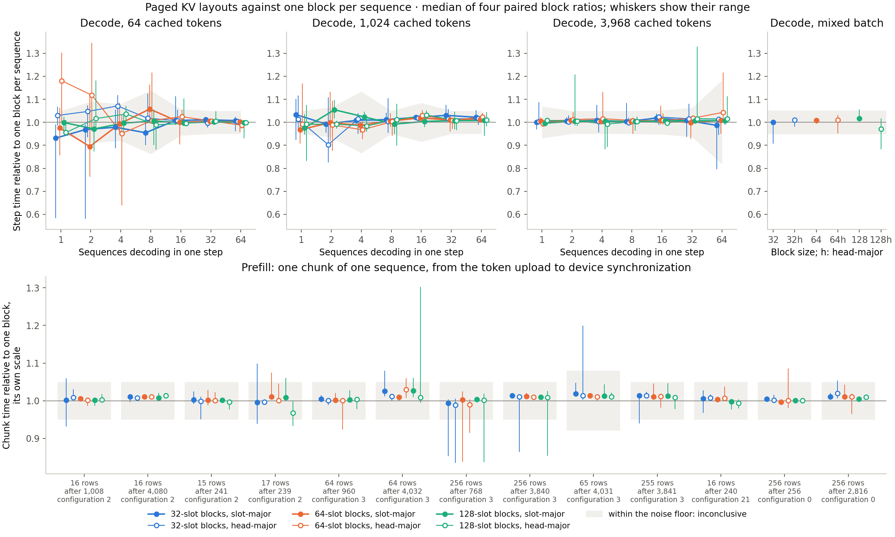
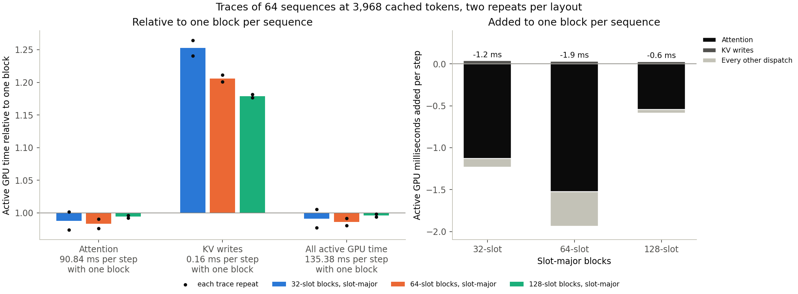

# Small KV blocks after the one-loop decode kernel

With decode attention walking each SIMD group's keys in one loop, holding K and
V in blocks of 32, 64 or 128 slots no longer costs anything resolvable. In the
rerun of 2d's matrix every layout is a regression in none of the 35 workloads,
so all six qualify, and the frozen rule selects the smallest: **32-slot
slot-major blocks**. A fresh four-block confirmation over all 35 workloads
found no regression either: decode steps at 0.999–1.023 times one block per
sequence, prefill chunks at 1.000–1.015. At 64 sequences and 3,968 cached
tokens a step takes 133.4 ms against 131.8 ms, where 2a's kernel took 2.81
times as long. A single sequence generates at the same speed as phase 1's
executable, block ratios 0.997–1.014, with identical text.

The traces confirm the mechanism. At 64 sequences and 3,968 cached tokens,
attention's active time per step is 88.3–93.3 ms in every layout, where 32-slot
blocks took 321 ms before. The KV writes still take 0.03–0.04 ms more in blocks
than in one block, 18–25% of a 0.16 ms stage.

The [first screen](paged-kv.md) explains why the earlier kernel paid for every
block; this is its rerun after the
[2d follow-up](../../docs/paged-kv-plan.md#2d-follow-up-decode-attention-in-one-loop),
collected on 2026-10-04 from `26b0a08`. All 12,320 decode and 7,280 prefill
screen samples and the 3,520 decode and 2,080 prefill confirmation samples are
retained, and no trace was rejected. Adopting 32-slot blocks, step 2e, waits for
a decision.

## What changed

`_paged_g32_kernel` keeps route 4's arithmetic: SIMD group g takes the keys
t ≡ g (mod 32) in increasing order, and the 32 groups merge in group order. It
used to walk them block by block, reading each block's table entry before its
keys, so with 32-slot blocks each key waited for its own table read. Now the
threadgroup first copies the K offset of every block the row sees into
threadgroup memory, one table read per block for all 1,024 threads, and each
group walks its keys in one loop with a block counter, as it does in one block.
The keys, their order and every operation on them are unchanged: model drivers
built before and after produced byte-identical outputs and captures in four
layouts.

## Setup

Everything else is 2d's [setup](paged-kv.md#setup): the same model, route,
seven layouts, 3 GiB working pool rebuilt before every arm, seeded block
manager, byte-equality and token checks, 22 decode workloads, 13 prefill chunks,
four-block paired procedure and decision rule. The contract declares the rerun
with 2d's declaration plus the changed attention and the hypothesis that the
plan recorded before the rerun. All 616 decode and 364 prefill token checks of
the screen, and all 176 and 104 of the confirmation, agreed.

## Screen

Median paired ratios against one block per sequence; no workload is a
regression for any layout.

| Workloads | 32 | 32h | 64 | 64h | 128 | 128h |
| --- | --- | --- | --- | --- | --- | --- |
| Decode, B ≥ 8 at 1,024 and 3,968 cached | 0.987–1.030 | 0.998–1.023 | 0.999–1.019 | 1.004–1.043 | 0.992–1.008 | 0.997–1.032 |
| Decode, mixed batch of 32 | 1.000 | 1.010 | 1.008 | 1.011 | 1.017 | 0.972 |
| All 35 workloads | 0.931–1.034 | 0.903–1.071 | 0.895–1.058 | 0.951–1.180 | 0.971–1.054 | 0.956–1.036 |



The widest ratios sit in short steps at 64 cached tokens and one to eight
sequences, where the calibrations were noisy: thirteen of the 35 noise floors
exceed 5%, up to 13.8% at 64 cached tokens and B = 8 and 18.2% at 3,968 and
B = 64. The rule's one gain, 32-slot blocks at 64 cached tokens and B = 1,
rests on a block ratio of 0.58 and is noise. Configuration 21's 16-row chunk,
which shares decode's kernel and paid 12.9% with 32-slot blocks in 2d, now
costs 0.6%. The other prefill chunks range from 0.968 to 1.029, all within
their floors; in the confirmation, 32-slot blocks cost them at most 1.5%.

## Confirmation

32-slot slot-major blocks against one block per sequence, four fresh blocks with
their own calibration, 09:36–09:47. Every workload is inconclusive, so the
layout is confirmed:

| | Ratios | Largest |
| --- | --- | --- |
| Decode, 22 workloads | 0.999–1.023 | 1.023 at 64 cached tokens and B = 2 |
| Prefill, 13 chunks | 1.000–1.015 | 1.015 for 65 rows after 4,031 cached tokens |
| 64 sequences at 3,968 cached | 1.010 | 133.37 ms against 131.78 ms, 480 against 486 tokens/s |

Eight calibrations exceeded 5%: five in steps of one to four sequences, the
largest 28.7% at 1,024 cached tokens and B = 1, two at 6.5–6.6% with 16 and
64 sequences at 1,024 cached tokens, and one prefill chunk at 5.3%.

## Traces

| Per step, 64 sequences at 3,968 cached tokens | One block | 32 slots | 64 slots | 128 slots |
| --- | --- | --- | --- | --- |
| Attention (`FP32 GQA`), two repeats | 93.34, 88.34 ms | 90.97, 88.46 ms | 89.96, 88.67 ms | 90.14, 90.46 ms |
| KV writes (`fused QKV/RoPE/cache`) | 0.158 ms | 0.198 ms | 0.190 ms | 0.186 ms |
| All active GPU time | 135.38 ms | 134.19 ms | 133.48 ms | 134.83 ms |

The first repeat of the control ran 5–6% slower than its second in attention
and in total, which puts every paged layout 0.6–1.9 ms below it on average; the
traces resolve no difference in attention. The KV writes are the one stage that
still pays, 0.03–0.04 ms per step.



## Single-sequence check

Before adoption the plan compares the Fast generator in the selected layout
with `6422f84`'s, phase 1's executable, under a rule fixed before measuring.
Sixteen runs each generated 128 tokens after the 1,176-token prompt in four
alternating blocks from 09:58 to 09:59. Median decode steps were 7.436 ms in
32-slot blocks (runs 7.120–7.529 ms) and 7.312 ms for `6422f84` (7.104–7.579
ms). The block ratios were 1.006, 1.014, 0.997 and 1.002: one block favours the
32-slot generator, so under the rule there is no regression, and both generated
the same text. One-minute load averages were 3.0–3.9. The
[record](paged-kv-single-sequence.json) keeps every decode step.

## The hypothesis, recorded before the rerun

- **Decode: no resolvable cost at any block size.** Confirmed.
- **Prefill: as in 2d, with configuration 21 among the others.** Confirmed.
- **Head-major: no resolvable difference.** Confirmed.
- **Selection: every layout qualifies, and 32-slot slot-major blocks are selected
  and confirmed.** Confirmed.

An informal development run, which the plan recorded as not evidence, had shown
32-slot steps of 64 sequences at 3,968 cached tokens within 1% of one block.

## Decision

The rerun selected and confirmed 32-slot slot-major blocks, and the
single-sequence check passed. Adoption is 2e: the plan's default block size and
order, chat, generation and the batch validation in that layout, 2c's gates
again at it, and the documents that describe KV storage. It needs its own
decision.

## Conditions and limits

Each block, capture and single-sequence block recorded AC power, normal power
mode and no thermal or performance warning before and after. The screen ran
from 08:56 to 09:36, the confirmation to 09:47 and the traces to 09:56 on
2026-10-04, with the machine left quiet for the run. The screen's calibrations
were still noisier than 2d's, which widens the floor in short steps; in the
confirmation, no workload of eight or more sequences has a floor above 6.6%.

The limits of [2d](paged-kv.md#conditions-and-limits) apply: one machine,
model and BF16, contexts up to 4,096 tokens, blocks of 32 slots or more, and
traces of one workload.

## Evidence and reproduction

The lossless [archive](paged-kv-loop.json.gz) is 935,810 bytes; its
[manifest](paged-kv-loop.json) holds the compressed and uncompressed hashes, and
[the summary](paged-kv-loop-summary.json) is what the replay regenerates:

```sh
uv run --locked python -m llm_mojo.benchmarks.model_profile batch-size-replay --study paged-loop --output studies/model_generation
uv run --locked --with matplotlib==3.10.8 python -m llm_mojo.benchmarks.model_profile batch-size-plot --study paged-loop --output studies/model_generation
```

The [measurement tools](../../src/llm_mojo/benchmarks/README.md#paged-kv-study)
list the collection commands; the rerun passes `--study paged-loop` to the same
ones.
