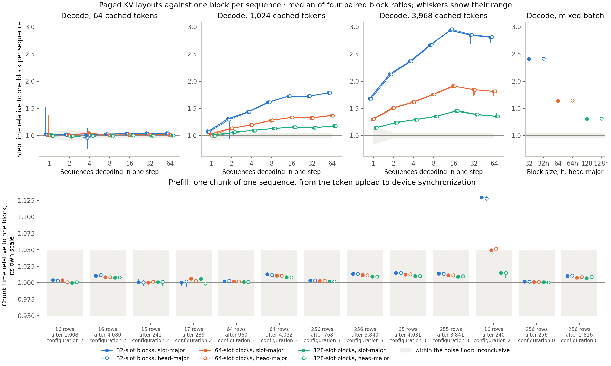
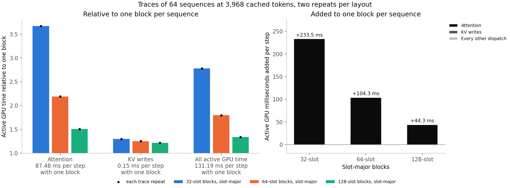

# Why small KV blocks slow decode attention

> **Status update, 2026-10-04.** Decode attention now walks each SIMD group's
> keys in one loop, with every block's offset staged in threadgroup memory
> ([2d follow-up](../../docs/paged-kv-plan.md#2d-follow-up-decode-attention-in-one-loop)).
> The [rerun](paged-kv-loop.md) of this matrix found no resolvable cost at any
> block size, and it selected and confirmed 32-slot slot-major blocks. The kernel
> described below is the one this study measured.

Holding a sequence's K and V in blocks of 32, 64 or 128 slots costs prefill
almost nothing and decode a great deal. At 3,968 cached tokens, a step of 64
sequences takes **2.81 times** as long in 32-slot blocks as in one block of the
whole context, **1.81 times** in 64-slot blocks and **1.35 times** in 128-slot
blocks. Aggregate throughput falls from 491 tokens/s to 175, 271 and 363. At 64
cached tokens no layout differs from one block beyond the noise floor. Prefill
chunks pay at most 1.5%, apart from one 16-row chunk that uses the decode-style
kernel. Head-major order changes nothing. Every layout is a regression in 13 to
15 of the 35 workloads, so none qualifies, and one block per sequence stays the
default.

The traces put the whole difference in decode attention. At 64 sequences and
3,968 cached tokens, attention's active time grows from 87.5 ms per step with
one block to 321.1 ms with 32-slot blocks, 191.6 ms with 64 and 131.7 ms with
128, while the KV writes gain at most 0.05 ms and the other dispatches together
at most 0.2 ms. Each block a sequence spans adds 20–44 µs to a step whatever
the batch size, so the cost is paid per block and larger batches do not hide
it. The paged decode kernel walks each SIMD group's keys block by block,
reading the table entry before it can load the block's K and V. With 32-slot
blocks a group handles one key per block, so every key waits for a table read;
with one block, a group's keys form one loop whose addresses are all known in
advance.

This is step 2d of the [paged KV plan](../../docs/paged-kv-plan.md#2d-translation-cost-study),
collected on 2026-10-03 from `dd7ed24`. All 12,320 decode and 7,280 prefill
samples are retained, and no trace was rejected. The hypothesis recorded before
measurement expected a decode cost only at 32 slots and well below 25% of
attention; the [comparison](#the-recorded-hypothesis) is below.

## Setup

- **Model and route.** Qwen2.5-0.5B-Instruct, BF16, on Apple M4 Pro / Metal
  (macOS 26.6.2, Mojo 1.0.0, MAX 26.5.0). Decode steps are one configuration-26
  call with 245 launches and decode projection arrangement 8; prefill chunks run
  the configuration Fast's plan picks.
- **Layouts.** Layout 0, the control, holds each sequence in one block of 4,096
  slots, slot-major: today's default through the paged kernels. Layouts 1–6 use
  blocks of 32, 64 and 128 slots, each slot-major and then head-major. The
  control measures translation, not phase 2 against phase 1; 2c's timing check
  in the plan's [validation record](../../docs/paged-kv-plan.md#validation-record)
  compared those.
- **Pool.** One working pool of 262,144 slots, the 3 GiB of phase 1's pool,
  serves every decode layout. Before every arm, the control's included and
  outside the timed interval, it is held in that arm's layout, a block manager
  whose free list is a permutation seeded with 2026 allocates each sequence's
  blocks, and the cached blocks are copied from the layout's history. The
  history is prefilled once per layout in 256-row Fast chunks into a
  one-sequence pool of 48 MiB, and its K/V rows must equal layout 0's byte for
  byte before measurement starts.
- **Correctness.** Every decode sample must select layout 0's tokens with 245
  launches, and every prefill chunk layout 0's next token in the configuration
  Fast declared. All 616 decode and 364 prefill token checks agreed.
- **Decode workloads.** The batch-size matrix's 22: 1 to 64 sequences at 64,
  1,024 and 3,968 cached tokens, and a mixed batch of 32 sequences whose
  contexts spread from 64 to 3,968. A step is timed from building the step
  batch, its tables taken from the block manager, through `greedy_tokens`
  readback.
- **Prefill workloads.** Thirteen one-sequence chunks: the runtime study's
  eleven cells, which run configurations 2, 3 and 21, and 256-row chunks after
  256 and 2,816 cached tokens, which run configuration 0. A chunk is timed from
  the token upload to device synchronization. They run in their own process in
  each block, on one-sequence pools rebuilt the same way.
- **Procedure.** The four-block paired procedure: the control against itself
  for calibration and each layout against the control, ten warmups and ten
  samples per arm, blocks 2 and 3 reversed. A layout is a gain or a regression
  in a workload only if all four block ratios agree and their median differs
  from 1 by more than the noise floor, max(5%, the largest calibration
  deviation); otherwise the workload is inconclusive.
- **Traces.** Metal System Traces of 64 sequences at 3,968 cached tokens, where
  attention's share is largest, for the control and the three slot-major sizes,
  two repeats each, ten warmups and eight traced steps.

## Decode

Median paired ratios against one block per sequence, slot-major; ▲ marks a
regression. Head-major order is not shown: wherever slot-major regresses,
head-major's ratio is within 1.1% of it. The two orders disagree on an outcome
twice. At 1,024 cached tokens and B = 2, head-major 32-slot blocks are
inconclusive at a median of 1.290 because one block's ratio was 0.927; the
other is a prefill chunk at the floor, below.

| Cached | B | One block | 32 slots | 64 slots | 128 slots |
| --- | --- | --- | --- | --- | --- |
| 64 | 1 | 7.32 ms | 1.020 | 1.001 | 1.019 |
| 64 | 2 | 7.43 ms | 1.019 | 1.009 | 0.979 |
| 64 | 4 | 7.33 ms | 1.007 | 1.043 | 1.006 |
| 64 | 8 | 9.27 ms | 1.026 | 1.009 | 0.999 |
| 64 | 16 | 14.78 ms | 1.034 | 1.013 | 1.000 |
| 64 | 32 | 25.75 ms | 1.040 | 1.015 | 0.999 |
| 64 | 64 | 47.87 ms | 1.039 | 1.013 | 0.999 |
| 1,024 | 1 | 7.41 ms | 1.067 | 1.027 | 1.013 |
| 1,024 | 2 | 7.36 ms | 1.304 ▲ | 1.127 ▲ | 1.054 ▲ |
| 1,024 | 4 | 7.91 ms | 1.435 ▲ | 1.195 ▲ | 1.094 ▲ |
| 1,024 | 8 | 11.42 ms | 1.612 ▲ | 1.277 ▲ | 1.128 ▲ |
| 1,024 | 16 | 19.21 ms | 1.722 ▲ | 1.331 ▲ | 1.155 ▲ |
| 1,024 | 32 | 35.53 ms | 1.724 ▲ | 1.323 ▲ | 1.143 ▲ |
| 1,024 | 64 | 66.03 ms | 1.784 ▲ | 1.370 ▲ | 1.177 ▲ |
| 3,968 | 1 | 7.91 ms | 1.678 ▲ | 1.297 ▲ | 1.139 |
| 3,968 | 2 | 9.61 ms | 2.130 ▲ | 1.507 ▲ | 1.236 ▲ |
| 3,968 | 4 | 11.75 ms | 2.366 ▲ | 1.614 ▲ | 1.291 ▲ |
| 3,968 | 8 | 19.11 ms | 2.666 ▲ | 1.755 ▲ | 1.352 ▲ |
| 3,968 | 16 | 33.60 ms | 2.939 ▲ | 1.911 ▲ | 1.450 ▲ |
| 3,968 | 32 | 65.80 ms | 2.848 ▲ | 1.844 ▲ | 1.386 ▲ |
| 3,968 | 64 | 130.25 ms | 2.807 ▲ | 1.810 ▲ | 1.352 ▲ |
| mixed | 32 | 46.36 ms | 2.410 ▲ | 1.641 ▲ | 1.306 ▲ |



At 64 cached tokens a sequence spans three 32-slot blocks. From B = 8 its steps
are 2.6–4.0% longer in all four blocks, below the 5% floor, so the rule calls
those workloads inconclusive. Three calibrations exceeded 5%: 10.2% at 64
cached tokens and B = 2, 9.7% at 1,024 and B = 1, and 16.1% at 3,968 and B = 1,
which leaves 128-slot blocks inconclusive there at 1.139.

## Prefill

| Rows | After | Configuration | One block | 32 slots | 64 slots | 128 slots |
| --- | --- | --- | --- | --- | --- | --- |
| 16 | 1,008 | 2 | 20.58 ms | 1.004 | 1.003 | 1.000 |
| 16 | 4,080 | 2 | 28.35 ms | 1.010 | 1.009 | 1.008 |
| 15 | 241 | 2 | 23.37 ms | 1.001 | 1.000 | 1.001 |
| 17 | 239 | 2 | 20.97 ms | 1.000 | 1.006 | 1.006 |
| 64 | 960 | 3 | 35.47 ms | 1.002 | 1.002 | 1.001 |
| 64 | 4,032 | 3 | 48.88 ms | 1.013 | 1.011 | 1.008 |
| 256 | 768 | 3 | 115.63 ms | 1.004 | 1.003 | 1.002 |
| 256 | 3,840 | 3 | 163.11 ms | 1.014 | 1.012 | 1.009 |
| 65 | 4,031 | 3 | 60.15 ms | 1.015 | 1.012 | 1.010 |
| 255 | 3,841 | 3 | 163.47 ms | 1.014 | 1.011 | 1.009 |
| 16 | 240 | 21 | 19.36 ms | 1.129 ▲ | 1.050 | 1.015 |
| 256 | 256 | 0 | 112.72 ms | 1.002 | 1.001 | 1.001 |
| 256 | 2,816 | 0 | 163.61 ms | 1.010 | 1.008 | 1.007 |

Configurations 0, 2 and 3 attend with the rolled-MMA kernel, which translates
once per 32-row tile and then loads the tile's 32 rows. Their costs stay between
−0.1% and 1.5%, largest after about 4,000 cached tokens, as the hypothesis
expected. Configuration 21 attends with the G32 kernel that decode uses, and
pays like decode: 12.9% with 32-slot blocks. Head-major 64-slot blocks cross the
floor there at 1.052, where slot-major's 1.050 does not.

## Where the time goes

| Per step, 64 sequences at 3,968 cached tokens | One block | 32 slots | 64 slots | 128 slots |
| --- | --- | --- | --- | --- |
| Attention (`FP32 GQA`) | 87.48 ms | 321.07 ms | 191.58 ms | 131.72 ms |
| KV writes (`fused QKV/RoPE/cache`) | 0.15 ms | 0.20 ms | 0.19 ms | 0.18 ms |
| All active GPU time | 131.19 ms | 364.73 ms | 235.52 ms | 175.48 ms |
| Timed step | 130.25 ms | 365.85 ms | 235.79 ms | 176.11 ms |

The two repeats of each trace agree within 1.1%. Attention's growth equals the
growth of all active GPU time to within 0.3 ms, and the traced active time
matches the timed steps within 1.2 ms, so neither the KV writes, nor the other
197 dispatches, which change by −0.1 to +0.2 ms, nor the host's tables account
for the cost.



## Why: one key per block

The extra step time divided by the blocks the batch spans is nearly constant:

| Extra µs per block per sequence | B = 1 | B = 2 | B = 8 | B = 64 |
| --- | --- | --- | --- | --- |
| 1,024 cached, 32 slots | 11 | 34 | 26 | 25 |
| 1,024 cached, 128 slots | −13 | 22 | 20 | 20 |
| 3,968 cached, 32 slots | 43 | 44 | 32 | 29 |
| 3,968 cached, 64 slots | 38 | 39 | 29 | 26 |
| 3,968 cached, 128 slots | 36 | 36 | 27 | 22 |

The B = 1 cells at 1,024 cached tokens sit inside a 9.7% noise floor. Elsewhere
a block costs 20–44 µs per step, 1–2 µs in each of the 24 layers' attention
launches, at every batch size and block size. A cost that grows linearly with
B is not latency that more parallel work hides; it is work or serialization in
each threadgroup.

The kernel's loop structure is the likely reason. `_paged_g32_kernel` in
`kernels/attention_decode.mojo` gives each threadgroup one query head of one row
and splits its keys among 32 SIMD groups: group g takes the keys t ≡ g (mod 32).
It walks them block by block. For each block it reads the table entry, computes
the block's K and V bases, and then loops over the group's slots in the block.
With one block of 4,096 slots, that inner loop runs about 124 times at 3,968
cached tokens, and every iteration's addresses are known before it starts, so
nothing in the code makes the next key's loads wait for the current key's
arithmetic. With 32-slot blocks the inner loop runs once, and each key's four
loads wait for its own table read, a global load that is the same for the whole
threadgroup. With 64 and 128 slots it runs twice and four times. The price of a
block barely depends on its size: at 64 sequences and 3,968 cached tokens it is
29, 26 and 22 µs. It is a fixed cost per block, the table read and the loop
around it, not a cost per key. Dispatch durations cannot divide it between the
two; a kernel variant would.

## The recorded hypothesis

Recorded in the plan before measurement:

- **Prefill: no resolvable cost.** Confirmed for the rolled-MMA configurations,
  whose largest cost is 1.5%. Not for configuration 21, which shares decode's
  kernel and pays 12.9% with 32-slot blocks.
- **Decode: a cost only at 32 slots, and only where attention dominates, at most
  25%, 12.5% and 6.25% of attention time, and "well below the bound."** Wrong.
  Every size regresses from two sequences at 1,024 cached tokens, and attention
  grows 267%, 119% and 51% at 3,968 tokens. The bound assumed the table read was
  the only added cost and that it overlapped with the key loads; in this kernel
  each block's loads wait for its read, and a block costs 20–44 µs per step.
- **Head-major: no resolvable difference.** Confirmed.
- **Host: negligible.** Consistent: the traced GPU time matches the timed steps.
- **Prediction: 64 and 128 qualify everywhere, and 64 is selected.** Wrong: no
  layout qualifies.

## Decision

No layout qualified, so under the frozen rule nothing is confirmed, the
single-sequence check does not run, and 2e's adoption does not happen. One
block per sequence stays the default: chat, generation and the batch validation
keep holding each sequence in one block of the whole context, and the paged
kernels run there as they have since 2c.

Phase 3 starts with the question open. Preemption and prefix sharing need
blocks smaller than a sequence, and this kernel makes them expensive in decode.
A decode attention kernel that keeps the flat loop over a group's keys and
translates each key from a copy of the sequence's table in threadgroup memory
should remove the dependent table read and the per-block loop; this matrix would
then measure it against the same control. That is a new step that needs its own
decision.

## Conditions and limits

Each of the four blocks and each trace recorded AC power, normal power mode and
no thermal or performance warning before and after. The screen ran from 16:47
to 17:25 and the traces from 17:27 to 17:36 on 2026-10-03, with other
applications open but idle.

These results hold for one machine and model, BF16, and the paged kernels of 2a
as written. The control's tables come from the same manager, so it pays the
host side of translation too; the comparison isolates block size. Contexts
above 4,096 tokens and blocks smaller than 32 slots are outside the matrix. The
traces cover one workload; the cost in the other decode workloads is inferred
from the timings.

## Evidence and reproduction

The lossless [archive](paged-kv.json.gz) is 872,016 bytes; its
[manifest](paged-kv.json) holds the compressed and uncompressed hashes, and
[the summary](paged-kv-summary.json) is what the replay regenerates. The
archive keeps the frozen build and declaration, every screen sample with its
token checks and block conditions, and each trace's dispatch intervals. The
replay rebuilds the summary, the decision and the figures without a GPU:

```sh
uv run --locked python -m llm_mojo.benchmarks.model_profile batch-size-replay --study paged --output studies/model_generation
uv run --locked --with matplotlib==3.10.8 python -m llm_mojo.benchmarks.model_profile batch-size-plot --study paged --output studies/model_generation
```

The [measurement tools](../../src/llm_mojo/benchmarks/README.md#paged-kv-study)
list the commands that collected it.
