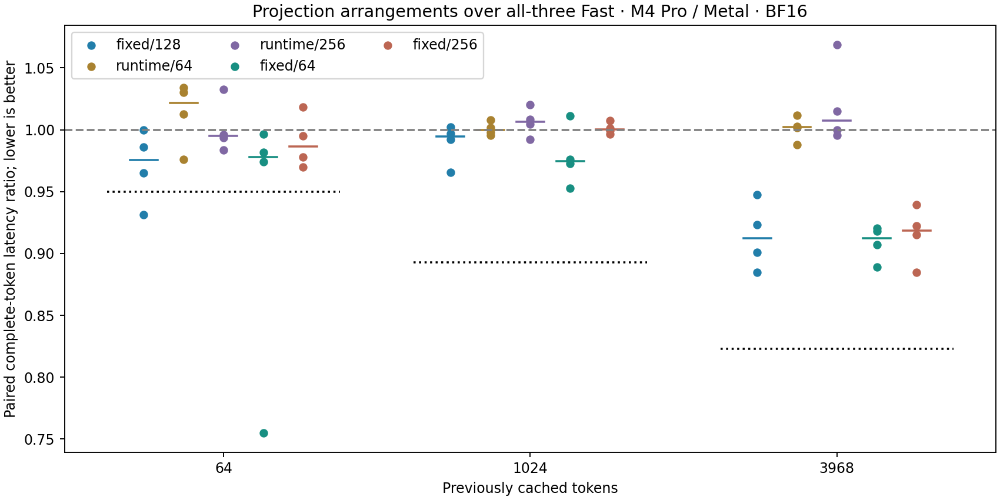

# Exact-width projection and thread-block arrangements

## Decision

**Do not promote.** None of the five candidates qualifies in the frozen full-token
screen. Fast/auto retain variant 0 and the previously promoted residual/RMSNorm,
owner-swapping and GPU-argmax combination. No independent confirmation was run,
because the screen selected no candidate. The six explicit `projection-0` through
`projection-5` study policies remain available.

There is an encouraging fixed-width kernel signal, but the complete-token benefit
depends on workload and did not clear this experiment's gate. Block size alone
showed essentially no improvement. All correctness and streaming checks passed.

## Complete-token measurements

Positive percentages below mean lower candidate latency. Each value is one minus
the median of four paired block ratios, with ten samples per arm in each block.
They are not ratios of pooled samples.

| Arrangement | History 64 | History 1024 | History 3968 | Qualifies |
|---|---:|---:|---:|---|
| Fixed / 128 | +2.43% | +0.56% | +8.77% | No |
| Runtime / 64 | -2.16% | +0.01% | -0.22% | No |
| Runtime / 256 | +0.50% | -0.66% | -0.75% | No |
| Fixed / 64 | +2.20% | +2.55% | +8.75% | No |
| Fixed / 256 | +1.35% | -0.03% | +8.13% | No |

Required median reductions were **5.00%, 10.71% and 17.71%** at histories
64, 1024 and 3968. The latter thresholds reflect the largest control/self-pair
deviation, retained as declared. In the first block, the identical control arms
differed by 10.71% and 17.71% at those contexts. Another short-context pair had a
slow 11.08 ms control median. These observations remain in the archive; there
was no trimming, repeat screen or relaxed threshold.

Fixed-width long-context arms were faster in all four blocks: about 8.1–8.8%
median latency reduction. At short and medium contexts they improved only about
0–2.6%, with some blocks slower. Thus they would still miss the across-context
5% minimum even without the noisy long-context calibration. This experiment
does not establish that fixed-width specialization has no benefit.

Dots show individual block ratios, short colored bars show their medians, and
dotted black lines show the required median threshold. The dashed line is parity.



## Streaming and GPU trace evidence

Streaming rates are medians across four runs of each of the three fixed
128-token replies, including terminal output. They are descriptive supporting
measurements, not the screen's promotion statistic. All 72 replies have exact
matching text, generated token IDs and histories across arms.

| Arrangement | Reply 1 tok/s | Reply 2 tok/s | Reply 3 tok/s |
|---|---:|---:|---:|
| Runtime / 128 (current Fast) | 115.25 | 115.34 | 106.68 |
| Fixed / 128 | 119.10 | 119.13 | 119.70 |
| Runtime / 64 | 116.04 | 115.56 | 108.02 |
| Runtime / 256 | 115.92 | 115.27 | 107.25 |
| Fixed / 64 | 119.20 | 119.35 | 118.82 |
| Fixed / 256 | 119.70 | 119.70 | 119.93 |

Separate history-1024 traces retain eight steps per arm after ten warmups.
Each step contains **245 compute commands and four blits**, of which 121 are
matrix projections. All six captures have matching runtime variant, binary,
source and workload identity. The archive retains all **11,952 commands**,
including their active fragments.

| Arrangement | 121 projections, active ms/token | All compute, active ms/token |
|---|---:|---:|
| Runtime / 128 (current Fast) | 6.322 | 7.437 |
| Fixed / 128 | 4.957 | 6.077 |
| Runtime / 64 | 6.319 | 7.440 |
| Runtime / 256 | 6.296 | 7.418 |
| Fixed / 64 | 4.872 | 5.988 |
| Fixed / 256 | 4.941 | 6.061 |

These are medians of per-step sums of active command duration, measured under
the profiler. Fixed-width arms reduced projection active time by about 22–23%.
The reduction appears across the projection stages; for example, summed down
projections decreased from 1.618 ms to 1.076–1.129 ms and the vocabulary head
from 1.304 ms to 1.129–1.132 ms. Runtime-width block-size changes were nearly flat.

This supports the load-scheduling/specialization hypothesis at the kernel level.
It does not identify register pressure, occupancy, actual DRAM throughput or
exclusive CPU overhead. Profiler active sums and untraced complete-token latency
are different measurements; subtracting them would not establish CPU time.

The retained evidence justifies keeping this as a possible follow-up, with a
newly declared experiment if pursued. It does not justify changing the default
or combining its apparent speedup arithmetically with earlier studies.

## What changed

The control is the already-promoted all-three Fast path: configuration 26's
QKV and activation fusion, residual/RMSNorm fusion, inter-layer owner swapping,
and separate GPU argmax. Every arm performs 245 compute commands and four
mapping blits per token. The only variable is the implementation of 121 matrix
projections: QKV, attention output, gate/up/down in each of 24 layers, and the
vocabulary projection. Multi-row prefill keeps its original implementation.

| Variant | Reduction width | Threads per block | SIMD groups per block |
|---:|---|---:|---:|
| 0 | Runtime loop, original kernel | 128 | 4 |
| 1 | Fixed 896/4864, four-iteration unroll | 128 | 4 |
| 2 | Runtime loop | 64 | 2 |
| 3 | Runtime loop | 256 | 8 |
| 4 | Fixed 896/4864, four-iteration unroll | 64 | 2 |
| 5 | Fixed 896/4864, four-iteration unroll | 256 | 8 |

One 32-thread SIMD group still computes one output. At width 896, each lane
accumulates 28 products; at width 4864, 152. The specialized kernel loads four
lane-strided input/weight pairs into local values before four sequential FP32
updates. Its loop runs seven or 38 iterations. The source keeps the original
sum order, warp reduction, promoted BF16 bias and final BF16 cast. This is
source-level load scheduling; it does not establish asynchronous hardware
prefetch or a measured physical register count.

Changing block size changes how many independent output groups are packaged
into one block. For the 151,936-output vocabulary head, 64/128/256 threads use
75,968/37,984/18,992 blocks while retaining 151,936 output groups. Down projection
uses 448/224/112 blocks for 896 outputs. Neither change reduces dot products,
logical weight bytes, output materialization or command count. There is no
weight repacking, shared-memory staging or extra workspace.

## Correctness and scope

Sixty primitive cases per arm cover widths 896/4864 and output counts
1/7/8/9/33, bias and no bias, nonuniform values and BF16 edge patterns including
signed zeros, subnormals and values adjacent to rounding boundaries. Every
candidate matches the original GPU kernel byte-for-byte. Output endpoints are
guarded, inputs/weights/bias remain unchanged, and invalid variants, unsupported
widths and multi-row candidate calls reject before dispatch. These tests extend
the independently validated reference path; they do not replace its oracle.

All five candidates undergo complete-model checks at histories 64, 1024 and
3968: all logits and 48 complete KV buffers, finite storage, unchanged cached
prefix and inactive capacity. History-64 captures add 195 tensors per candidate,
including layer outputs and normalization, residual, cache and append buffers.
Outputs are poisoned before verification. Repeated ordinary generation across
72 streamed replies compares exact text, token IDs and histories, including resets.

## Frozen method

The [plan](projection-arrangements-plan.md) fixes the six arms before timing.
Each of four blocks measures three contexts and six paired comparisons: control
self-pair plus each candidate against control. Ten warmups and ten retained
samples per arm give 1,440 samples. Blocks 2 and 3 reverse workload and arm
order. All samples are retained, including calibration and slow observations.
One executable and resident model own both arms of each pair. Loading, model
preparation, logical rewind, poisoning and recording are outside timing; the
measured interval spans token upload through greedy completion.

A candidate qualifies only when all four ratios are below one and median
reduction exceeds max(5%, largest absolute self-pair deviation) at every context.
If multiple qualify, select the lowest worst-context median ratio, then mean
ratio, then ID. Only that fixed candidate can enter an independent four-block,
three-context confirmation against control (480 samples), with the same gate.
Failure does not trigger another candidate, repeat or relaxed threshold.

Six separate Metal traces at history1024 use ten warmups/eight steps. Runtime
selector, clean source, binary, prepared-asset and capture identities bind each
arm. AC, normal power and nominal thermal state are checked around collection.
Traces retain active fragments and all expected commands. Active GPU durations
are distinct from untraced complete-token latency; there are no exclusive
CPU/GPU, occupancy, register-pressure or measured DRAM claims without counters.

## Reproduction

With a clean measured checkout, verified prepared model and an external RUN directory:

```sh
uv run --locked python -m llm_mojo.benchmarks.model_profile build --projections --prepared "$PREPARED" --output "$RUN/build"
uv run --locked python -m llm_mojo.benchmarks.model_profile collect --build "$RUN/build" --output "$RUN/timings"
uv run --locked python -m llm_mojo.benchmarks.model_profile selection-capture --build "$RUN/build" --output "$RUN/traces"
uv run --locked python -m llm_mojo.benchmarks.model_profile selection-terminal --build "$RUN/build" --output "$RUN/terminal"
uv run --locked python -m llm_mojo.benchmarks.model_profile selection-archive --projections --timings "$RUN/timings" --traces "$RUN/traces" --terminal "$RUN/terminal" --output studies/model_generation
uv run --locked python -m llm_mojo.benchmarks.model_profile selection-replay --projections --output studies/model_generation
uv run --locked --with matplotlib==3.10.8 python -m llm_mojo.benchmarks.model_profile selection-plot --projections --output studies/model_generation
```

Only when the frozen screen qualifies a candidate, run `projection-confirm`
with `--build`, `--timings` and an unused external `--output` before source
changes, then pass that directory as `--confirmation` to `selection-archive`. Raw traces, expanded numerical arrays, weights and executables stay
outside Git. The lossless archive, manifest and replay regenerate the tables
and figure without requiring the GPU.


## Provenance and validation

Measured clean commit: `117fae4f491dcbd8fc6c5153432d20c84b019a23` on
`codex/qwen-qkv-fusion`, Apple M4 Pro / Metal (`metal:4-metal4`), 24 GiB
unified memory, macOS 26.6.2 build 25G83, Mojo 1.0.0, MAX 26.5.0,
Xcode 26.6. Model: Qwen2.5-0.5B-Instruct, BF16 storage with FP32
accumulation, row-major matrices, one decode row, widths 896/4864, vocabulary
151,936. Collection required AC, normal power mode and nominal thermal state.
The archive binds prepared/tokenizer assets, source files, binaries and software
versions by identity/hash.

The [validation receipt](projection-arrangements-validation.json) records the
complete `uv run --locked llm-mojo-validate` success: 174 Python tests, 21 native
suite summaries, all 19 MLP mappings and the benchmark smoke matrix. The final
retained-evidence test brings the Python suite to 175 tests; it rejects rehashed
archives with missing or changed timings, numerical storage, layer captures,
trace commands/identity/fragments, streaming records, conditions or confirmation.

The measured campaign adds 15 full-model exact comparisons (five candidates at
three histories), 195 intermediate/storage tensors per candidate at history 64,
1,440 timing samples, six traces and 72 streamed replies.

Evidence: [lossless archive](projection-arrangements.json.gz),
[hash manifest](projection-arrangements.json),
[recomputed summary](projection-arrangements-summary.json),
[frozen plan](projection-arrangements-plan.md). Raw traces, binaries and expanded
arrays remain outside Git.
