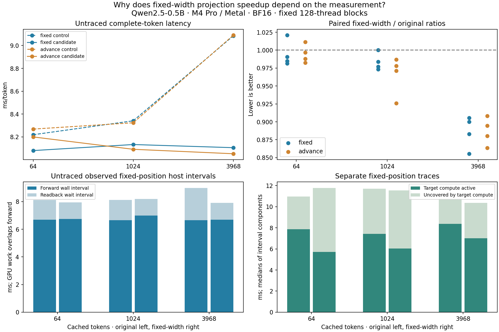

# Why fixed-width projections help longer-context decoding more

## Finding

The larger long-context gain reproduced in longer, cleaner runs and in advancing
generation. The evidence strongly supports host submission limiting short-context
completion, with an additional GPU backlog becoming visible at long context.
This is an execution-scheduling explanation, not an increase in MLP dimensions.

The host forward interval stays near **6.7 ms**. At long context, the original
kernel leaves about **2.3–2.4 ms** of greedy readback wait, versus **1.2 ms** for
fixed-width projections. At short context, that wait is already about
**1.4 ms**, so reducing it provides much less wall-time benefit. The forward
interval includes preflight, token upload and runtime submission while the GPU
executes concurrently; it is not an exclusive on-CPU time measurement.

Neither kernel changed in this study. Both use one 32-thread group per output,
128-thread blocks and the same 896/4864 projection dimensions. The candidate
only uses the already tested fixed-width/four-iteration load schedule. Current
Fast/auto remain unchanged; this diagnosis declares no promotion decision.

## Untraced controlled results

Four blocks, 16 warmups per arm, 64 retained tokens per arm, all three contexts,
control/self plus candidate/control pairs. The observed counterparts double the
matrix to **12,288 samples**. All samples are retained. Blocks 2/3 reverse
workload and arm order. Token upload through greedy completion is timed.

The latency columns below are medians of four block medians. Reduction is
computed separately as one minus the median of four paired ratios; therefore
it need not equal the ratio of the two displayed latency columns.

| Mode | Initial cached tokens | Original ms/token | Fixed-width ms/token | Paired reduction | Four ratios |
|---|---:|---:|---:|---:|---|
| fixed | 64 | 8.219 | 8.080 | 1.23% | 1.021, 0.981, 0.991, 0.985 |
| fixed | 1024 | 8.341 | 8.133 | 1.97% | 1.000, 0.977, 0.984, 0.973 |
| fixed | 3968 | 9.085 | 8.105 | 10.86% | 0.855, 0.906, 0.883, 0.900 |
| advance | 64 | 8.268 | 8.200 | 0.76% | 1.011, 0.997, 0.982, 0.988 |
| advance | 1024 | 8.324 | 8.091 | 2.53% | 0.978, 0.971, 0.926, 0.987 |
| advance | 3968 | 9.090 | 8.052 | 11.26% | 0.864, 0.880, 0.895, 0.908 |

Every self-control deviation was below 5%, so the declared descriptive threshold
was 5% at every context/mode. Both long-context unobserved comparisons were faster
in all four blocks and exceeded that threshold. Short/medium comparisons did not.
Observed modes show the same long-context pattern, about 10.7–10.8% reduction.

This weakens the explanations that the original result was solely a noisy
self-control run or an artifact of repeating a fixed token position. It does not
eliminate transient system effects: two observed medium-context blocks had slow
arms, all retained. Observed clocks, deferring formatting, longer samples and
advancing history are different interventions; this campaign does not assign a
standalone benefit to each benchmark change.

Fixed mode repeats one position. Advance mode feeds each selected token into the
next forward and grows the cache by 64 entries, ending at 128/1088/4032. Both
warm up at the starting position and begin measurement from the same prefix.
There is no EOS early stop and no terminal rendering in this advancing benchmark.
Thus these are native decode timings, not a new terminal-streaming rate claim.

## Host intervals identify where the extra wait appears

The following rows come from untraced observed modes. Forward is the wall
interval through the final GPU submissions; readback wait is entry to greedy
readback through successful winner-buffer mapping. GPU work overlaps forward.
Tiny bookkeeping and final unmapping intervals are omitted from this table.

| Mode | Initial cached tokens | Original forward ms | Fixed forward ms | Original readback wait ms | Fixed readback wait ms |
|---|---:|---:|---:|---:|---:|
| observed-fixed | 64 | 6.689 | 6.750 | 1.436 | 1.198 |
| observed-fixed | 1024 | 6.663 | 6.995 | 1.467 | 1.198 |
| observed-fixed | 3968 | 6.652 | 6.696 | 2.330 | 1.219 |
| observed-advance | 64 | 6.699 | 6.712 | 1.418 | 1.202 |
| observed-advance | 1024 | 6.711 | 6.772 | 1.478 | 1.210 |
| observed-advance | 3968 | 6.561 | 6.704 | 2.421 | 1.218 |

A useful interpretation is that shorter-context GPU work can largely keep pace
with host submission. Faster projections then leave more time before subsequent
work arrives, plus a modest saving in the final readback tail. Longer attention
creates more outstanding GPU work by the time the host reaches greedy readback.
The same projection savings reduce that backlog, making more of the kernel
improvement visible in complete-token latency.

This is strongly supported by the measured intervals, but it is not a proof of
exclusive CPU saturation or a specific runtime/driver bottleneck. Host scheduling,
driver behavior and GPU submission may interact. No cache-control experiment or
hardware-counter measurement was performed, so a secondary cache effect is not
excluded.



The top panels use untraced plain modes. Bottom-left shows component medians from
untraced observed fixed mode; bottom-right shows separate traced component medians.
A sum of component medians need not equal the median of the total interval.

## Traces: fixed projection work, growing attention, substantial perturbation

Two passes capture both variants at each context, reversing capture order in
the second. Each capture has ten warmups and eight measured fixed-position tokens.
Every token contains **245 compute commands and four blits**. All **23,904 commands**
and **96 host observation records** are retained and bound to capture receipts,
target output, source, binary and provenance hashes.

Values below are medians of eight per-token values, separately for each pass.
Projection time sums the same 121 projection commands. Compute active time uses
the union of all target compute fragments. Uncovered time is the containing
compute span minus that union; it is not necessarily globally idle GPU time.

| Context | Variant | Pass | Projection active ms | Attention active ms | All compute active ms | Compute span ms | Uncovered ms |
|---:|---|---:|---:|---:|---:|---:|---:|
| 64 | original | 1 | 7.984 | 0.225 | 8.957 | 10.575 | 1.617 |
| 64 | original | 2 | 6.217 | 0.181 | 7.020 | 10.394 | 3.330 |
| 64 | fixed | 1 | 4.931 | 0.178 | 5.740 | 12.041 | 6.369 |
| 64 | fixed | 2 | 4.904 | 0.178 | 5.709 | 11.743 | 6.017 |
| 1024 | original | 1 | 6.322 | 0.495 | 7.444 | 10.590 | 3.025 |
| 1024 | original | 2 | 6.247 | 0.490 | 7.355 | 12.344 | 4.836 |
| 1024 | fixed | 1 | 4.944 | 0.490 | 6.067 | 11.611 | 5.505 |
| 1024 | fixed | 2 | 4.904 | 0.489 | 6.020 | 11.546 | 5.498 |
| 3968 | original | 1 | 6.308 | 1.460 | 8.401 | 10.658 | 2.254 |
| 3968 | original | 2 | 6.234 | 1.456 | 8.318 | 10.686 | 2.387 |
| 3968 | fixed | 1 | 4.901 | 1.455 | 6.991 | 10.029 | 3.028 |
| 3968 | fixed | 2 | 4.921 | 1.453 | 7.010 | 11.545 | 4.558 |

Fixed-width projection active time is **4.90–4.94 ms** in all six captures.
Original projection time is **6.22–6.32 ms** in five captures, with the first
short-context capture slower at **7.98 ms**, retained without exclusion. Attention
grows from approximately 0.18 ms at short context to 1.45–1.46 ms at long context.
The operations show the expected distinction: projection shape stays fixed,
while attention processes the growing KV history.

Fixed-width captures show more time uncovered by target compute. However, the
profiler itself increases host intervals substantially: traced token medians are
about **10.8–13.1 ms**, versus roughly **8–9 ms** without tracing. Its long-context
wall-time comparison changes direction between passes. The traces therefore
support the operation-level explanation but cannot establish the untraced critical
path by subtraction. No target compute command had multiple active fragments;
this does not rule out other GPU work between target commands or clock variation.

## Correctness, provenance and scope

All twelve context/mode numerical cases match complete BF16 logits and all 48 KV
buffers exactly after measurement, with finite values and unchanged prefix/inactive
storage. All generated trajectories agree across variants, self controls, blocks
and observed/plain modes. The native projection test again passed 60 exact cases
for all six previously implemented arrangements, with guards and inputs preserved.

Clean measured commit: `524e447` on `codex/qwen-qkv-fusion`. Apple M4 Pro / Metal,
`metal:4-metal4`, 24 GiB memory, macOS 26.6.2 build 25G83, Mojo 1.0.0, MAX 26.5.0,
Xcode 26.6. Qwen2.5-0.5B-Instruct, 24 layers, BF16 storage/FP32 reductions,
one decode row, row-major projection matrices and per-layer `[4096,128]` K/V
buffers. Prepared model/tokenizer assets, source files, binaries and software
identity are recorded in the archive. AC, normal power and nominal thermal state
were required before/after every timing block and capture. These conditions do
not lock clocks or exclude all background activity.

Only benchmark tooling changed, following the documented tooling-only validation
route: all 177 Python tests plus relevant native route smoke before freezing.
The retained-archive integrity test brings the final passing Python suite to **178 tests**.
Engine, policy, numerical contracts, model assets and kernels are unchanged.

## Reproduction and retained evidence

With the measured checkout clean and the verified local prepared model:

```sh
uv run --locked python -m llm_mojo.benchmarks.model_profile scheduling-build --prepared "$PREPARED" --output "$RUN/build"
uv run --locked python -m llm_mojo.benchmarks.model_profile scheduling-collect --build "$RUN/build" --output "$RUN/timings"
uv run --locked python -m llm_mojo.benchmarks.model_profile scheduling-capture --build "$RUN/build" --output "$RUN/traces"
uv run --locked python -m llm_mojo.benchmarks.model_profile scheduling-archive --timings "$RUN/timings" --traces "$RUN/traces" --output studies/model_generation
uv run --locked --with matplotlib==3.10.8 python -m llm_mojo.benchmarks.model_profile scheduling-plot --output studies/model_generation
```

Replay and plotting use only the retained archive. The original plan and earlier
screen remain unchanged; this is a separately declared diagnosis.

- [Frozen plan](projection-scheduling-plan.md)
- [Lossless evidence](projection-scheduling.json.gz) and [hash manifest](projection-scheduling.json)
- [Recomputed summary](projection-scheduling-summary.json)
- [Validation receipt](projection-scheduling-validation.json.gz) and [manifest/final validation](projection-scheduling-validation.json)
- [Original six-arrangement screen](projection-arrangements.md)

Full traces, executables, expanded numerical arrays and development logs remain
outside Git. The compact validation receipt preserves its original content
losslessly. No default promotion or kernel tuning was performed.
