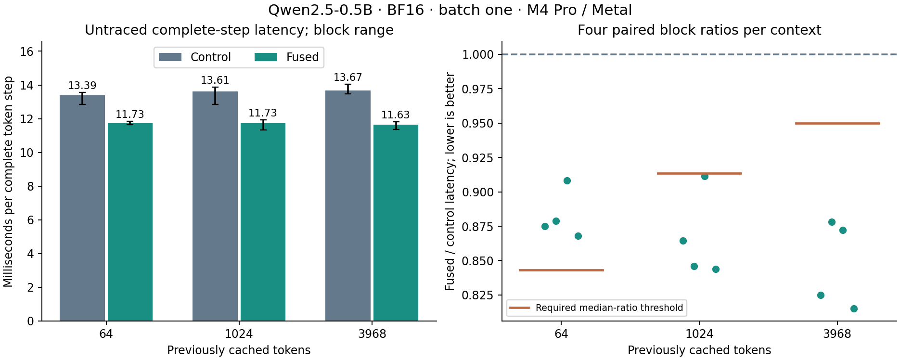

# QKV fusion: faster measurements, promotion gate not cleared

The candidate reduced complete-token latency in all twelve paired blocks.
Median reductions were **12.3–15.1%**, and actual streaming replies reached
**80–84 tokens/s** by prompt-group median. Numerical and cache comparisons
were exact. However, short-context control calibration varied more than its
measured reduction, so **Fast and auto retain configuration 0 for decode**.
Configuration 25 remains an explicit experimental candidate.

This is the completed experiment from the [frozen plan](qkv-fusion-plan.md),
following the [complete-token profile](token-profile.md). No measurement was
discarded or repeated to obtain a preferred outcome.

## Controlled whole-token result

| Cached tokens | Control, ms/token | Fused, ms/token | Paired median reduction | Required reduction | Gate |
| ---: | ---: | ---: | ---: | ---: | --- |
| 64 | 13.389 | 11.725 | 12.30% | >15.67% | Not cleared |
| 1024 | 13.612 | 11.732 | 14.47% | >8.64% | Cleared |
| 3968 | 13.671 | 11.635 | 15.14% | >5.00% | Cleared |

Latency columns are medians of four block medians. The reduction is the median
of the four paired candidate/control ratios, so it need not equal the ratio
of the two independently aggregated latency columns.

The promotion rule requires all four ratios below one and median reduction
above both 5% and the largest absolute control self-pair deviation, at **every
context**. All twelve candidate/control ratios were below one. At 64 cached
tokens, one control/control block had a ratio of 1.15668, establishing a
15.67% floor. Its candidate reduction was only 12.30%. The global promotion
result is therefore false. This does not establish that fusion is ineffective;
it means this run did not satisfy the agreed rule for making it the default.



The right panel shows all four paired ratios. The dashed line is no change;
the orange segment is the context's required median-ratio threshold. Whiskers
in the left panel show the range of block medians, not confidence intervals.

The control itself ran faster here than the roughly 17 ms measured in the
previous profiling study. The executable and session differ. **The fusion
claim is based only on the same-build, same-session paired comparisons above**;
the earlier 17 ms cannot be used as this candidate's control.

## Why the candidate can help

The original path performs QKV unpack, Q RoPE, K RoPE and cache append as four
separate GPU operations per layer. The candidate reads the existing BF16 packed
projection output and writes rotated Q plus the final K/V cache row directly.
It preserves the explicit BF16 product roundings and final add/subtract from
the original RoPE implementation.

Four groups of 128 threads own 512 rotary pairs: 448 Q pairs and 64 K pairs.
The first 128 threads also copy one V element each. There is no communication
between threads, shared-memory staging, new allocation or added synchronization.
The original temporary allocations remain, and the original path remains
available as the control. Fused execution does not consume or populate the
skipped unpack/rotated-key scratch. Diagnostic append snapshots therefore read
the final cache row directly.

This replaces 96 launches with 24 over the model's 24 layers, removing 72 of
410 compute commands per token. It also removes roughly 5 KiB of logical
intermediate reads/writes per layer, or 120 KiB per token. That is a
source-level traffic count, not measured DRAM traffic. The larger opportunity
is reducing repeated command preparation, submission and execution boundaries.

Two separate traces at 1024 prior tokens confirmed the complete sequences:

| Trace measurement per token | Control | Fused |
| --- | ---: | ---: |
| Compute commands | 410 | 338 |
| Buffer-transfer blits | 4 | 4 |
| Active time of replaced operations, ms | 0.513 | 0.105 |
| Total active command time, ms | 8.090 | 7.632 |
| Sum of host Metal submission intervals, ms | 16.418 | 12.792 |
| Enclosing GPU span, ms | 21.040 | 16.979 |

Each trace contains ten warmups and eight measured steps; every trailing
submission passed coverage and compute/blit ordering checks. Across the two
accepted captures, the archive retains **5984 compute commands and 64 blits**,
including their actual active fragments. No replacement captures were needed.
Stage values are medians over eight steps; the 0.513 ms control value sums the
four stage medians across all layers.

These traces support the proposed mechanism: fewer commands, less active work
in the replaced stages, and shorter host submission intervals. Their clocks
are instrumented and overlap; none of these differences may be added to, or
subtracted from, the ordinary latency measurement. They do not prove how much
of the gain comes from each mechanism. Hardware limiter and DRAM counters were
unavailable; no bandwidth or occupancy claim is made.

## Actual native streaming replies

| Prompt tokens | Tokens per reply | Control median tokens/s | Fused median tokens/s |
| ---: | ---: | ---: | ---: |
| 44 | 128 | 67.99 | 80.45 |
| 1027 | 128 | 71.87 | 83.94 |
| 3839 | 128 | 73.81 | 82.68 |

Four paired blocks exercised all three prompts in each arm, reversing arm
order in the middle blocks. All 24 replies stopped at the 128-token limit.
Every pair had exact generated token IDs, history and emitted output bytes;
each candidate reply had a higher measured streaming rate than its paired
control. These comparisons corroborate the fixed-step result but do not
replace its control self-pair promotion rule.

These are real native CLI conversations driven through pipes. Token events
are recorded after detokenization and output flush. Rates run from the first
to last output-token event and exclude prefill and model loading; they are not
GUI rendering rates. Resets clear conversation state between prompts while
weights remain resident within each process. Multi-row prefill uses the same
Fast configurations in both arms. The study-only native CLI accepts an eighth
argument choosing the arm; the public CLI interface and its default remain
unchanged.

## Validation and reproducibility

Measured executables were built from clean commit **5366428**, based on the
profiling result at **66053c8**. Both timed arms share one binary. Receipts bind
source, executable hashes, pinned prepared-model and tokenizer-table hashes,
actual hardware/backend and software versions.

- Qwen2.5-0.5B-Instruct, batch one, 24 distinct learned layers, hidden 896,
  intermediate 4864, vocabulary 151936. BF16 weights, materialized boundaries
  and KV, with the existing FP32 reductions. Per-layer row-major K/V cache
  `[4096,128]`; maximum prefill chunk 256.
- Apple M4 Pro / Metal, Mac16,7, 24 GiB memory; macOS 26.6.2 (25G83),
  Xcode 26.6 (17F113), Mojo 1.0.0 and MAX 26.5.0, resolved through `uv.lock`.
  AC, normal power mode and absence of reported thermal warnings were checked
  before/after timing blocks and captures. These checks do not fix clock rates
  or eliminate background activity.
- **480 retained timing samples:** three fixed histories, four blocks, ten
  warmups and ten retained samples per arm, both candidate/control and
  control/control. History, loading, allocation, poisoning, logical rewind
  and logging are outside timing. Timing covers token upload through model
  forward and greedy readback/unmap. Neither arm contains host observation
  clocks inside forward/greedy. No profiler or debug synchronization runs in
  this measurement phase.
- The isolated kernel test compares exact BF16 bits with the existing four
  kernels at positions 0, 1, 63, 64, 1023, 1024, 3968 and 4095, using varied
  finite BF16 patterns, signs/subnormals and poisoned skipped scratch. It
  checks the complete query and both full caches, including untouched regions.
  Invalid multi-row fusion requests are rejected before mutation.
- **147 full-model tensor comparisons** passed at the three measured contexts:
  logits and all 48 full cache buffers were exact and finite, with protected
  prefixes and inactive suffixes preserved. Logits and active cache rows were
  poisoned before each arm. Native token winners and submitted-row accounting
  also matched. This establishes equivalence to our existing path on these
  workloads, not new Hugging Face model-wide numerical qualification.
- The complete unfiltered `uv run --locked llm-mojo-validate` passed, including
  all 19 MLP mappings, numerical suites, tokenizer parity and benchmark smokes.
  After retaining the archive, **all 165 Python tests passed with no skips**,
  including deliberate rehashed damage to timing, cache, dispatch and terminal
  evidence. A development terminal smoke also compared both arms exactly.

The [lossless archive](qkv-fusion.json.gz), [hash manifest](qkv-fusion.json) and
[derived summary](qkv-fusion-summary.json) retain all timing samples, exact
histories, numerical check records, terminal events, GPU command fragments,
capture receipts and provenance. Raw traces, binaries, weights and expanded
numerical snapshots remain outside Git. Collection commands are in the
[frozen plan](qkv-fusion-plan.md). Replay and regenerate the figure without a
GPU:

```sh
uv run --locked python -m llm_mojo.benchmarks.model_profile fusion-replay --output studies/model_generation
uv run --locked --with matplotlib==3.10.8 python -m llm_mojo.benchmarks.model_profile fusion-plot --output studies/model_generation
```

The next decision, if pursuing promotion, would be a separately declared
confirmation experiment focused on resolving the short-context uncertainty.
This completed experiment does not silently relax its gate or retry its timing
matrix after seeing the result.
