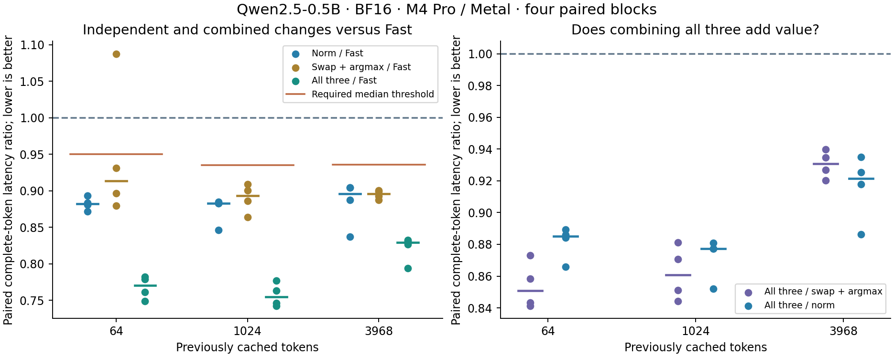

# Residual addition plus RMSNorm, alone and composed

Residual/RMSNorm fusion independently passes the frozen promotion rule. Combining
it with buffer ownership swapping and separate GPU argmax is the fastest tested
candidate and also passes: **17.1–24.5% lower complete-token latency**, with
**107–115 tokens/s streaming medians** versus 86–89 for the previous Fast route.
The combined candidate is selected for single-row Apple M4 Pro / Metal Fast and
its `auto` alias. Multi-row dispatch and historical explicit study arms retain
their existing behavior. This extends configuration 26's QKV and activation
fusions; it does not use the fused vocabulary projection.

## Results

All 1,440 fixed-token samples, nine numerical comparisons, four traces and
48 streaming replies are retained. Table latencies are medians of four block
medians; reductions are medians of the four paired ratios, so they need not equal
the ratio of the displayed aggregate latencies.

| Cached tokens | Candidate | Control ms | Candidate ms | Paired latency reduction |
|---:|---|---:|---:|---:|
| 64 | Residual + RMSNorm | 11.075 | 9.721 | 11.76% |
| 64 | Swap + GPU argmax | 10.881 | 9.793 | 8.62% |
| 64 | All three | 10.998 | 8.474 | 22.98% |
| 1024 | Residual + RMSNorm | 11.026 | 9.695 | 11.69% |
| 1024 | Swap + GPU argmax | 11.003 | 9.707 | 10.64% |
| 1024 | All three | 11.013 | 8.373 | 24.51% |
| 3968 | Residual + RMSNorm | 11.012 | 9.822 | 10.41% |
| 3968 | Swap + GPU argmax | 10.840 | 9.720 | 10.42% |
| 3968 | All three | 10.917 | 9.019 | 17.08% |

The required median reductions were 5.00%, 6.46% and 6.45% at histories
64, 1024 and 3968. Norm alone and all-three pass at every history. Swap plus
argmax misses the history-64 gate because one retained ratio is 1.08749.
All-three beats both simpler candidates in every direct paired block: its
additional median reductions versus swap+argmax are 14.92%, 13.92%, 6.92%;
versus norm alone, 11.49%, 12.26%, 7.85%. Gains are measured together rather
than added from separate experiments.



Streaming medians use four runs per arm and prompt, with 128 generated tokens.
All text, generated token IDs and history agree exactly across all four arms.
Output throughput excludes first-token latency and uses the terminal event
boundary; it is separate from fixed-token benchmark throughput.

| Prompt tokens | Previous Fast tokens/s | Norm alone tokens/s | Swap + argmax tokens/s | All three tokens/s |
|---:|---:|---:|---:|---:|
| 44 | 86.26 | 98.80 | 97.24 | 115.19 |
| 1027 | 88.57 | 100.89 | 99.45 | 115.28 |
| 3839 | 88.37 | 96.73 | 100.07 | 107.30 |

Combined first-token medians are 52.6, 480.8 and 2134.8 ms; control medians
are 53.0, 490.2 and 2135.1 ms. Prefill remains the dominant first-token cost
for long prompts. This experiment optimizes single-token decode.

The four history-1024 traces retain 9,072 commands, including mapping blits.
Mean summed active compute time per step is 7.572 ms (control), 7.496 ms
(norm), 7.623 ms (swap+argmax), and 7.445 ms (all-three). These separately
recorded active intervals are not the untraced complete-token boundary. Most
of the wall-time improvement is consistent with reducing launch/submission
and readback overhead, rather than materially shortening the projection work.
There are no measured DRAM counters or exclusive CPU/GPU attribution here.

## Provenance and validation

Measured source: `4ebc2752cc818bcb4942f5395e1f44152eb9a1b5`, clean
`codex/qwen-qkv-fusion`. Qwen2.5-0.5B-Instruct uses BF16 weights, stored
boundaries and KV, with existing FP32 reductions. Batch one; hidden 896;
intermediate 4864; vocabulary 151,936; 24 layers. Per-layer K/V layout is
row-major `[4096,128]`; maximum prefill chunk is 256 rows.

Hardware: Apple M4 Pro, Mac16,7, 24 GiB, Metal `metal:4-metal4`. Software:
macOS 26.6.2 (25G83), Xcode 26.6, Mojo 1.0.0, MAX 26.5.0, locked dependencies.
Before/after AC, normal power mode and nominal thermal checks are retained.
Binary, source and prepared-asset hashes are in the archive; raw model arrays,
executables and full traces remain outside Git.

The [validation receipt](residual-norm-validation.json) records the full
repository suite before measurement: 172 Python tests, 20 native test summaries,
all 19 MLP mappings and benchmark smoke routes. All nine model comparisons
have exact logits and full cache storage, including unchanged prefix/inactive
capacity. Extra poisoned layer captures and ownership/reset/rejection sequences
pass for every candidate. The 48-sweep primitive test is exact against the
separate GPU operations, including BF16 rounding and subnormal cases.

The retained evidence replay checks the original provenance file bytes as well
as parsed contents. This preserves capture hash identity when the surrounding
archive sorts JSON keys. Rehashed missing or altered evidence must still fail.

## Mechanism

The control is configuration 26: existing QKV/RoPE/cache and SiLU/multiply
fusion, CPU greedy selection, and 23 inter-layer copies. The new experiment
adds residual/RMSNorm fusion alone, then combines it with buffer swapping
and separate GPU argmax. The tested fused vocabulary projection remains out.

Each token has 48 residual-to-normalization boundaries. After attention, its
output projection is added to the current hidden state; the stored sum is the
MLP residual input, and its normalized version feeds gate/up projections.
After the MLP down projection, another residual sum feeds the next layer's
attention normalization, or the final normalization for layer 23.

One 128-thread group handles 896 values. Each thread owns seven columns spaced
128 apart. It uses the existing exact BF16 addition helper, writes the residual
bits, and retains the seven BF16 values locally. It accumulates their squares
in the same FP32 order as the existing RMSNorm, uses the same SIMD-group and
shared-partial reduction, then preserves the BF16 normalization and scale
rounding. The fused primitive has two distinct outputs, because subsequent
residual connections still require the unnormalized sum.

No BF16 boundary is removed. The kernel does not keep the residual in FP32
through normalization. Both outputs must remain disjoint from one another and
all live inputs. Row dimensions, contiguous layout and overlap are checked
before launch. No new model allocation, host map or synchronization is added.

The first layer still normalizes its embedding input normally. Each fused MLP
residual produces the next attention norm before the next layer begins; that
layer consumes the precomputed buffer. The last MLP residual produces the final
normalization directly. Layer views are rebuilt after optional owner swaps.
Multi-row prefill retains the previous route, even after a fused single-row
call; model reset and rejection preserve ownership and cache accounting.

The four arms have 314, 266, 293 and 245 compute commands per token: control,
norm only, swap plus GPU argmax, and all three. Four mapping blits remain in
each arm, mapping logits for CPU selection or the compact GPU winner result.
Removing 48 normalization launches accounts for the norm-only reduction.
Buffer swapping removes 23 copies and GPU argmax adds two reduction launches.
These are command counts; complete-token savings must be measured separately.

## Correctness and scope

The primitive test compares 48 exact sweeps against separate residual and
RMSNorm GPU calls. Inputs include nonuniform ordinary values, cancellation,
large values, signed zeros, subnormals, a pure-subnormal row, a binade edge and
BF16 midpoint ties. Both outputs are poisoned and guarded; all inputs and
weights must remain unchanged. Shape errors and complete/partial output
aliasing are rejected before submission.

Each candidate is compared against control at histories 64, 1024 and 3968:
all logits and all 48 full KV buffers, finite values, unchanged prefix and
inactive suffix. The capture at history 64 additionally compares 195 tensors:
all layer hidden states, attention normalization, attention residual output,
MLP normalization, final norm, logits, cache and append storage. These
synchronized diagnostic captures supplement ordinary unsynchronized forwards.

The lifecycle sequence is 3, 1, 1, 2, 1, reset, 1, 2, 1 rows. Eight calls check
exact logits/tokens, final cache storage and 57 paired files. Pointer identities
and submitted-row accounting are checked, including odd/even ownership after
swapping. Invalid IDs and unsupported multi-row fusion/swap requests must fail
before valid state or owners change. Real streamed replies exercise repeated
unsynchronized generation, resets and the native policy selectors.

## Frozen comparison

The [plan](residual-norm-plan.md) declares six paired comparisons: control
self-pairs, each candidate against control, all-three against swap+argmax,
and all-three against norm-only. Four blocks at histories 64/1024/3968 use ten
warmups and ten retained samples per arm: all 1,440 samples are retained.
Blocks 2 and 3 reverse arm and workload/comparison order. No replacement
acceptance run or post-measurement tuning is allowed.

Timing spans token upload through greedy completion. Preparation, rewind,
allocation and recording are excluded. Four separate Metal traces at history
1024 have ten warmups and eight measured steps each. Four streaming blocks
cover four arms and three fixed 128-token replies, totaling 48 replies.
All outputs, generated IDs and histories must match.

A candidate qualifies only when every paired ratio is below one and its median
reduction exceeds max(5%, largest absolute control self-pair deviation) at all
three contexts. Prefer qualifying all-three only when its direct paired ratios
against each other qualifier are all below one. Otherwise take the sole
qualifier or preserve Fast if multiple qualifiers remain unresolved. These
are bounded acceptance rules, not statistical confidence intervals.

## Reproduction

Rebuild the measured commit in a clean checkout with the pinned prepared assets.
Set `PREPARED` to the verified model directory and keep `RUN` outside Git:

```sh
uv run --locked python -m llm_mojo.benchmarks.model_profile build --residual-norm --prepared "$PREPARED" --output "$RUN/build"
uv run --locked python -m llm_mojo.benchmarks.model_profile collect --build "$RUN/build" --output "$RUN/timings"
uv run --locked python -m llm_mojo.benchmarks.model_profile selection-capture --build "$RUN/build" --output "$RUN/traces"
uv run --locked python -m llm_mojo.benchmarks.model_profile selection-terminal --build "$RUN/build" --output "$RUN/terminal"
```

At the report revision, archive/replay/plot use the retained original provenance:

```sh
uv run --locked python -m llm_mojo.benchmarks.model_profile selection-archive --residual-norm --timings "$RUN/timings" --traces "$RUN/traces" --terminal "$RUN/terminal" --output studies/model_generation
uv run --locked python -m llm_mojo.benchmarks.model_profile selection-replay --residual-norm --output studies/model_generation
uv run --locked --with matplotlib==3.10.8 python -m llm_mojo.benchmarks.model_profile selection-plot --residual-norm --output studies/model_generation
```

The archive and manifest regenerate the summary and figure without hardware.
Reproduction is separate from this frozen acceptance campaign; no samples in
this report were replaced or selected after seeing their results.
