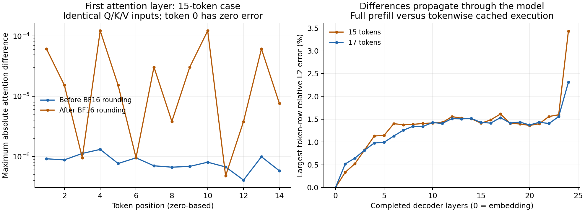

# Why Qwen's execution schedules differ

**The observed failure is explained by schedule-dependent roundoff crossing
BF16 rounding boundaries and propagating through the model. No prediction
difference was observed in this bounded investigation.** This is evidence
about the selected CPU precision policy, not every Qwen backend or every prompt.
The earlier qualification still fails its frozen intermediate-value criteria.
No threshold, accepted component arithmetic or Mojo implementation was changed.

## What was held fixed

The actual pinned Transformers `Qwen2ForCausalLM` and checkpoint execute on
Apple M4 Pro CPU, one thread, with Torch 2.4.0, Transformers 4.43.1 and NumPy
1.26.4. Stored boundaries and weights are BF16. The existing wrapper selects
FP32 math SDPA and rounds its output to BF16. It is not the unmodified default
of every upstream attention backend.

The [declared investigation](../../tests/fixtures/model_diagnosis_contract.json)
uses the previously observed 17-token input (`PCG64(9120)`) and 15-token input
(`PCG64(9148)`), plus three declared text prompts with at most eight greedy
output tokens each. Final reserved cases remain unopened. The
[existing diagnosis runner](../../tests/fixtures/model_reference_diagnosis.py)
now has a `--detail` mode; it adds observation, not a replacement model.

Pass-through SDPA tracing records FP32 inputs/output, shape/stride information,
and the values after BF16 rounding. Traced and untraced executions match
bitwise at all 75 captured model boundaries in both schedules for both random
inputs. The persistent-cache prediction harness also matches the existing
upstream capture path bitwise for both prompt schedules on each text input.

## The first difference

Every tested first-layer query receives identical Q/K/V values across the two
schedules, including its active cached prefix. Before BF16 rounding, attention
outputs differ by at most `1.889e-6` for the 17-token case and `1.311e-6` for the
15-token case. Explicit FP64 attention on the same captured operands differs
from the three tested FP32 execution shapes by at most `1.389e-6`. That FP64
expression is a numerical diagnostic, not a newly adopted oracle.

These small differences sometimes land on opposite sides of a BF16 midpoint.
For example, at token position 1, head 0, coordinate 31 in the 15-token case:

| Value | Full prefill | Cached execution |
| --- | ---: | ---: |
| FP32 attention output | -0.0000444513207185 | -0.0000445146470156 |
| BF16 stored output | -0.0000443458557129 | -0.0000445842742920 |

The BF16 midpoint is `-0.0000444650650024`. The FP32 difference is only about
`6.33e-8`, but it changes which BF16 value is stored. Across the first layer,
53 elements round differently in the 17-token case and 67 in the 15-token case;
maximum BF16 differences reach `0.000244141` and `0.000122070`, respectively.

Replaying one query over its causal-prefix keys, using identical captured
first-layer operands, reproduces the cached FP32 output bitwise at every
position in both cases. Keeping all masked keys while changing only the query
extent also changes the result. Execution shape/layout within SDPA matters;
the evidence does not identify a particular low-level CPU instruction as the
sole cause. It does rule out different first-layer Q/K/V values as the cause
of these first differences.



The left panel uses the 15-token case and compares errors in the same attention
tensor before/after rounding. Token 0 is exact and omitted from the log axis.
The right panel shows the largest token-row relative L2 error after each
decoder layer. Error does not grow monotonically; it spreads and changes
through the composed operations, reaching 3.432% and 2.310% at layer 24.

## Why an intermediate check failed

The largest absolute normalization error is 5, at coordinate 221 of the second
token in the 15-token case. Inputs `-25.75` and `-25.25`, inverse-RMS factors
`0.4677304` and `0.4657606`, and learned scale `16.75` produce BF16 outputs
`-202` and `-197`. The diagnostic reproduces the upstream norm expression
bitwise, including the BF16 rounding before multiplication by the learned scale.

**That largest absolute error is not the coordinate that fails the mixed
absolute/relative gate.** Its large reference magnitude provides enough relative
allowance. The worst gate violation is instead coordinate 315:

| Quantity | Full prefill | Cached execution |
| --- | ---: | ---: |
| Input to final norm | 1.75 | 1.125 |
| Learned scale | 13.875 | 13.875 |
| Final norm output | 11.375 | 7.25 |

Here the error is `4.125`. The frozen allowance is
`2.40625 + 0.03125 * abs(11.375) = 2.76171875`, so the check fails. Equivalently,
it needs `atol=3.76953125`, exceeding the frozen `2.40625`. The entire row's
relative L2 error is 3.408%, within its separate 4.297% allowance.

Thus the early differences are tiny, but some later coordinates differ
substantially. Calling every intermediate discrepancy tiny would be misleading.
Whether those discrepancies matter for prediction is a separate measurement.

## Prediction impact in the declared cases

For random inputs, all 32 prefix comparisons select the same next token. For
the text prompts, we compare full recomputation with two cached routes: one
prefills the prompt in one call; the other prefills it token by token. Both
then consume the full-reference selected history for a controlled logit
comparison. Separate free-running cached trajectories check for branching.

| Text prompt | Common greedy output | End condition |
| --- | --- | --- |
| Write a short sentence about rain. | The raindrops fell down from the sky | 8-token budget |
| What is 7 + 5? Answer briefly. | 12 | Stop token |
| Continue: red, orange, yellow, | red, orange, yellow | Stop token |

All 34 same-history text comparisons select the same token. All six independent
cached trajectories match their corresponding full-recomputation sequence,
including stop IDs. These are compatibility checks, not a text-quality score.
The exact rendered prompts, token IDs, histories and outputs are retained.

Across the 66 synthetic/text comparisons, the largest logit discrepancy is
0.5. If the full-reference top-two margin is greater than twice the measured
maximum logit perturbation, even moving the winner down and the runner-up up
by that amount cannot change argmax. This sufficient bound holds in 48 of 66
comparisons. The other 18 still match empirically, without that certificate.
Longer or different prompts could branch, especially near a tie; this study
does not claim general greedy equality.

## Implication for validation

The evidence supports ordinary schedule-dependent numerical variation in the
selected upstream path. It does not demonstrate a Qwen semantic defect or a
Mojo defect. It also shows why passing a row-level error measure need not imply
passing every pointwise intermediate check.

The next validation proposal should separate corresponding-mode Mojo/Qwen
comparisons from cross-schedule variation, keep exact cache-storage invariants,
and assess final logits and token margins explicitly. Intermediate traces
remain valuable for locating unexpected errors. This investigation provides
the explanation needed to review that proposal; it does not silently relax
the failed gate or establish full-model Mojo acceptance.

## Reproduction and evidence

The initial instrumentation and inputs were committed at `004cf54`. A refinement
at `cd34ca3` added the actual pointwise-failing normalization coordinate; the
same declared inputs were rerun. Every observation shared with the first run
matches exactly. `rounding-study.json` records both source identities, the
earlier report hash, and hashes of the retained extended report. The complete
report is compressed losslessly in `rounding-detail.json.gz`; arrays, weights
and temporary logs remain outside Git.

```sh
uv run --locked --script tests/fixtures/model_reference_diagnosis.py --self-test
uv run --locked --script tests/fixtures/model_reference_diagnosis.py --detail --output build/oracle_data/model-qualification/rounding-detail-v2.json
uv run --locked python studies/model_generation/summarize.py
uv run --locked --with matplotlib==3.10.8 python studies/model_generation/summarize.py --plot
```

Use a fresh output filename for execution; the runner refuses to replace
evidence. The final two commands verify retained hashes and regenerate five
rounding tables, the earlier qualification tables, and optionally the figure
without executing a model. Three diagnostic self-tests cover BF16 midpoint
crossing, prediction margins/ties, and invalid numerical inputs.
