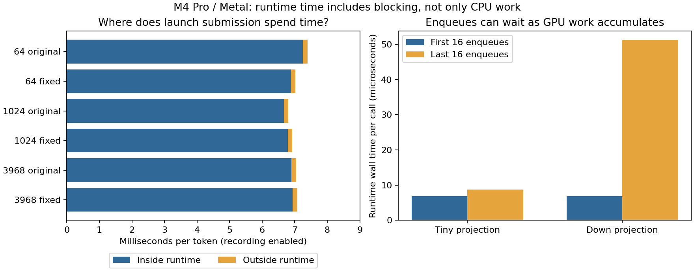

# Where Qwen launch submission spends time

Most of the recorded launch-submission interval is inside MAX's enqueue runtime.
Explicitly reusing a compiled kernel handle did not produce a qualifying speedup.
The larger-projection microbenchmark also demonstrates that an enqueue can spend
substantial time waiting as GPU work accumulates. This narrows the optimization
target to runtime submission and its interaction with execution; it does not
identify 7 ms of removable CPU work. Fast remains unchanged.

The [declared experiment](runtime-enqueue-plan.md) measured 4,608 complete token
samples, 640 uninstrumented launch batches, 80 instrumented queue batches and
396,800 individual runtime calls. All samples are retained in the
[archive](runtime-enqueue.json.gz), checked by its [manifest](runtime-enqueue.json)
and replayed into the [summary](runtime-enqueue-summary.json).

## Attribution and calibration

One resident Qwen2.5-0.5B-Instruct model, one-row BF16 decode with the original
FP32 reductions, 24 layers, width 896, intermediate width 4864, vocabulary 151936,
KV capacity 4096. Both variants include promoted QKV/SiLU-multiply fusion,
residual normalization fusion, buffer swapping and separate GPU argmax.
Variant 0 uses original runtime-width/128-thread projections; variant 1 uses
fixed-width/128-thread projections. The projection arithmetic is unchanged.

Each token contains exactly 245 observed runtime calls between token-upload
completion and final head/argmax enqueue. The wrapper uses the same uptime clock
as the existing Mojo marks. No arguments, outputs or GPU operations are modified.
All recorded calls are complete, nonoverlapping, on one thread, with no runtime
errors or dropped records. Logging occurs after execution, from preallocated
storage. The wrapper's own recording work falls outside the bracketed runtime
call, while any blocking inside the runtime remains inside it.

These are medians of four block medians, **with recording enabled**:

| Prefix | Projection | Inside runtime (ms/token) | Outside runtime within launch window (ms/token) | Runtime fraction |
| ---: | --- | ---: | ---: | ---: |
| 64 | Original | 7.255 | 0.138 | 98.16% |
| 64 | Fixed | 6.889 | 0.135 | 98.06% |
| 1024 | Original | 6.669 | 0.134 | 97.98% |
| 1024 | Fixed | 6.784 | 0.138 | 97.97% |
| 3968 | Original | 6.902 | 0.144 | 97.97% |
| 3968 | Fixed | 6.938 | 0.137 | 98.01% |

The ratio remains 97.78–98.34% across the 24 individual context/variant/block
medians. Outside-runtime time includes our wrappers, validation, argument/view
preparation, observation clocks, reference bookkeeping and diagnostic recording.
It excludes the earlier token upload/preflight and later greedy readback.
Independently summarized medians need not add exactly.

Calibration used the same executable with the wrapper absent, loaded but
inactive, and recording. Complete-token block ratios relative to absent varied
from **0.838 to 1.280** when inactive and **0.803 to 1.389** when recording.
This calibration is noisy: it does not establish a precise wrapper overhead or
an exact uninstrumented runtime percentage. Even absent-wrapper aggregate token
medians were 8.67–9.96 ms, above parts of the preceding scheduling campaign.
AC, normal power and nominal thermal checks passed, but these do not rule out
all scheduling, clock or background effects. No samples were discarded or
repeated to obtain a preferred result. Use the consistent *within-recording*
attribution to localize the work, not these timings to revise headline throughput.

## Explicit compiled handles

Both arms use the same original projection kernel, buffers and views. One
compiles its device-function handle once before the warmups and reuses it;
the other uses the ordinary generic enqueue overload. The latter already caches
compilation. The [DeviceContext documentation](https://max.modular.com/stable/api/mojo/max/gpu/host/device_context/DeviceContext/)
describes this as removing repeated enqueue overhead, not recompiling a GPU
program for each token.

Rows below report batch time divided by launch count. Batch-one completion
includes a synchronization for every launch; batch-256 amortizes that wait.
Neither is complete-model token latency.

| Shape | Batch | Submission: ordinary → explicit (µs/launch) | Completion: ordinary → explicit (µs/launch) | Qualifies |
| --- | ---: | ---: | ---: | --- |
| Tiny, K=32 / N=1 | 1 | 7.791 → 7.792 | 104.980 → 102.708 | No |
| Tiny, K=32 / N=1 | 256 | 8.466 → 7.358 | 9.159 → 8.811 | No |
| Down, K=4864 / N=896 | 1 | 7.542 → 8.667 | 144.698 → 145.771 | No |
| Down, K=4864 / N=896 | 256 | 37.783 → 37.764 | 50.264 → 50.234 | No |

Tiny batched submission improved in all four pairs, but its median paired gain
was 9.38%, below the 23.97% largest self-pair deviation. Its complete-batch time
also failed the all-block/noise gate. The representative down projection was
stable when batched: completion changed by about 0.06% in the aggregate medians.
No shape/boundary passed the declared max(5%, self-noise) and all-four-block rule.
This is no reliable gain under the measured workloads, not proof that explicit
handles can never help another workload.

## Enqueue time includes waiting

Two additional passes issued 256 original projection launches between waits.
Tiny and down kernels have the same interface, thread-block size and host loop;
the down projection has much more GPU work.

| Kernel | First 16 calls: median runtime (µs) | Last 16 calls: median runtime (µs) |
| --- | ---: | ---: |
| Tiny projection | 6.875 | 8.698 |
| Down projection | 6.885 | 51.208 |

The down projection's later calls are about 7.4 times slower despite the same
host arguments and enqueue path. This supports queue/execution backpressure as
one contributor to runtime wall time. It does not establish an exact queue
capacity, identify the internal wait, or prove that the model's entire runtime
interval is the same phenomenon. Model calls can also incur resource and command
management costs that a four-buffer microbenchmark does not reproduce.

GPU execution overlaps host submission. Subtracting the runtime interval from
token latency would therefore be invalid. Faster kernel execution can shorten
runtime waits, and faster submission can expose GPU execution as the limiting
part. Both have to be measured through completed tokens.

## What this changes about the next optimization

Moving compilation-handle lookup out of our loop is not the next demonstrated
win. The more direct target is reducing the number or cost of submissions inside
the Metal runtime: batching multiple ordered dispatches into a command buffer,
or reusing a prepared dispatch sequence where supported. That could amortize
command creation, resource binding and completion bookkeeping while retaining
separate kernels. Its benefit must be measured, not inferred by multiplying a
single-launch cost by 245.

A [MAX Metal issue for this same runtime version](https://github.com/modular/modular/issues/6899)
reports one command buffer per enqueue and gaps in batching/graph support. This
is an external implementation lead, not verification of our local backend's
capabilities; the closed umbrella issue does not establish that batching shipped.
Before implementing that route, inspect the pinned backend's actual interface
and sample inside enqueue to distinguish command/resource work from queue waits.
A small isolated kernel with a model-sized set of resident allocations would
also test whether resource management explains the higher model launch cost.

Further kernel fusion can reduce submission count from application code, but
[combined gate/up was already inconclusive](../mlp_sublayer/README.md#single-token-decode-follow-up).
This result does not retroactively qualify it. A new fusion needs a distinct
hypothesis and a composed full-token comparison preserving BF16 boundaries.
No new engine change or default promotion follows from this diagnosis.

## Provenance and verification

Measured clean commit: `2ce04b8a43f6837b986a396dd000a54e79f8c0a8`.
Apple M4 Pro, Mac16,7, 24 GiB, Metal `metal:4-metal4`; macOS 26.6.2 / 25G83;
Xcode 26.6; Mojo 1.0.0, MAX 26.5.0, locked uv environment. The archive records
binary and asset hashes, C source separately, runtime dylib hash, clang version,
compile commands, ordering and before/after conditions. The pinned arm64 enqueue
ABI was checked against the installed exported function and its disassembly.
The process-local library leaves installed dependencies unchanged.

All nine full-model context/wrapper-state cases passed full logits and 48 KV
array byte comparisons, finite/prefix/inactive checks and cache accounting.
Complete output bytes and histories also match across wrapper states; every
retained token ID agrees across both projection variants and all blocks.
All microbenchmark outputs match the exact integer oracle (all-one inputs and
weights, BF16 outputs 32 or 4864), with both output guards unchanged.
These validate measurement transparency; they do not add new HF accuracy claims.

Before the implementation commit, all 179 Python tests passed, along with native
micro routes for both shapes/batch sizes and a complete model route confirming
128 windows of exactly 245 calls. Final replay/corruption tests cover the retained
census, missing/straddling/overlapping/error calls, wrapper state, numeric receipts
and hashes. The final full Python suite passed all 180 tests; archive replay and
`git diff --check` also passed. No engine, numerical contract or reference oracle changed.

Reproduce with `enqueue-build`, `enqueue-collect`, `enqueue-archive`,
`enqueue-replay` and `enqueue-plot` in the existing
[benchmark tool](../../src/llm_mojo/benchmarks/README.md#runtime-enqueue-boundary).
Full probe logs, snapshots and binaries remain outside Git under
`/private/tmp/enqueue-build` and `/private/tmp/enqueue-timings`.
