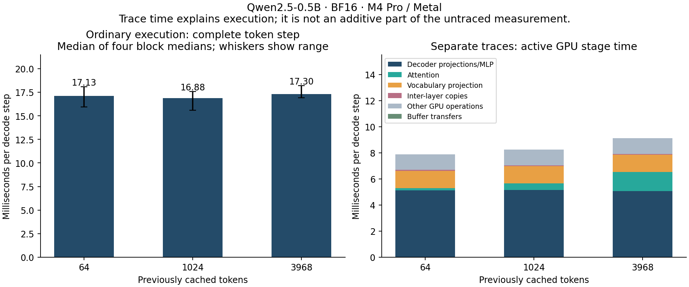
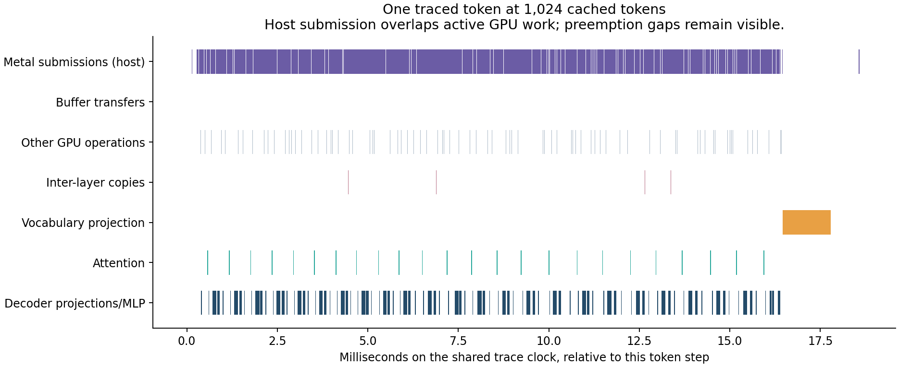

# Where a complete Qwen token spends its time

The current Fast BF16 runtime takes about **17 ms per controlled decode step**
on this M4 Pro. Twelve longer terminal replies measured **54.9–59.5 output
tokens/s**. The strongest next experiment is to reduce repeated kernel
submission through a small, numerically controlled fusion. This study measures
the existing runtime; it does not implement or demonstrate an inference speedup.

## Complete step and actual conversation

| Previously cached tokens | Complete step, ms | Equivalent fixed steps/s | Control self-pair decision floor |
| ---: | ---: | ---: | ---: |
| 64 | 17.13 | 58.39 | 6.36% |
| 1024 | 16.88 | 59.24 | 10.25% |
| 3968 | 17.30 | 57.79 | 5.00% |

These are medians of four block medians, with ten retained samples per arm.
The fixed next token and prefix are restored for each sample; all 24 learned
layers execute. This isolates decode at a known cache length. It is not a
measurement of natural generation. The modest differences between contexts
are below this run's calibration floor. All 480 samples, including slow ones,
remain in the archive. Observation/control did not establish a repeatable
instrumentation cost under the four-block decision rule; this is not proof
of zero overhead.

| Native chat prompt tokens | Generated tokens/reply | Median output tokens/s | Range over four replies | Median first visible text, ms |
| ---: | ---: | ---: | ---: | ---: |
| 44 | 128 | 56.38 | 54.87–56.92 | 57.08 |
| 1027 | 128 | 57.81 | 55.24–59.47 | 497.51 |
| 3839 | 128 | 56.62 | 55.42–57.75 | 2170.14 |

All twelve replies stopped at the 128-token reply limit. Their rate excludes
the first token and prefill, but includes native detokenization and output
flush between subsequent token events. First-visible latency includes prompt
processing with resident weights; model loading is separate. This uses the
actual CLI driven through pipes, not GUI drawing speed. Each conversation
resets between the three prompts. Reporting enabled/disabled produced exactly
the same output in all four paired runs. Separate controlling-PTY checks cover
interruption, continuation, reset and exit.

The earlier [chat study](chat.md) measured different, shorter replies. These
new figures neither establish a regression against those historical rates nor
support comparing our speed with Hugging Face. Roughly 60 tokens/s remains a
reasonable description of this workload and machine, rather than a universal
rate.



## What is inside the 17 ms?

The host observations at 1024 cached tokens are:

| Sequential host interval | Median of block medians, ms | What it includes |
| --- | ---: | --- |
| Model preflight | 0.017 | Full-model contract checks |
| Token staging | 0.246 | Mapping and filling the token buffer |
| Embedding submission | 0.039 | Enqueueing embedding work |
| Decoder stack submission | 13.588 | Calling 24 layers, encoding and submitting their work; GPU execution can overlap |
| Final norm/head submission | 0.071 | Enqueueing final RMSNorm and vocabulary projection |
| Forward return | <0.001 | Transition into greedy selection |
| Logit map/wait | 1.744 | Waiting for dependent GPU work and making logits host accessible |
| CPU argmax scan | 0.726 | Selecting a winner across 151936 BF16 logits |
| Logit unmap | 0.161 | Finishing the mapping scope |

Independent phase medians need not sum exactly to the complete-step median.
In particular, **13.6 ms in the decoder submission interval is not 13.6 ms of
independent CPU arithmetic**. It includes the runtime's encoding, driver work
and any backpressure while the GPU runs. The 1.7 ms map/wait interval is also
not a free-standing transfer cost: it waits on the preceding computation.

GPU traces show **410 compute commands plus four buffer-transfer blits per
step**: two around token mapping, then the model computation, then two around
logit mapping. Each uses one command buffer/encoder in the observed sequence.
The final unmap can enqueue work that finishes after greedy returns; the next
step's token mapping carries that dependency. Logit readback has completed
model computation before the benchmark rewinds the logical KV suffix.

The four blits have only about 0.01 ms of active GPU time combined in these
captures. That does not mean mapping is cheap on the host. No usable transfer
byte counter was collected; a zero byte field in the export is unavailable
information, not proof of zero traffic.



| Cached tokens | Active GPU commands, ms | Enclosing GPU span, ms | Host Metal submission intervals, ms | Attention alone, ms |
| ---: | ---: | ---: | ---: | ---: |
| 64 | 7.88–7.90 | 20.37–22.67 | 15.58–16.81 | 0.181 |
| 1024 | 8.14–8.56 | 19.37–24.22 | 15.35–17.12 | 0.494–0.507 |
| 3968 | 9.08–9.16 | 20.17–20.52 | 15.44–16.11 | 1.454–1.458 |

Ranges show the two capture medians, each over eight steps. Submission
intervals sum the host Metal API intervals on the trace clock, not CPU cycles.
The enclosing span includes the four blits and the CPU-selection gap between
the final two transfers. Active GPU duration sums the actual execution
fragments, excluding their preemption gaps. It is a sum of command durations,
not device utilization: three cross-command overlaps totaling 0.018 ms are
retained in the second 1024-context capture.

The representative timeline retains all active fragments and the intervening
gaps. Host Metal submission overlaps GPU execution. Tracing itself perturbs
latency, so the trace's enclosing span must not be subtracted from or added
to the untraced 17 ms measurement. Empty GPU intervals include submission
starvation, dependencies, scheduling and preemption; this study cannot assign
every gap to a single mechanism.

## What remains worth optimizing?

1. **First experiment: fuse QKV unpack, Q RoPE, K RoPE and KV append for
   single-token decode.** These four small operations repeat in each of the
   24 layers. One fused launch could replace four, removing 72 of 410 compute
   submissions, or 17.6% of the compute launch count. The four stages together
   consume roughly 0.51 ms of active GPU time per token in the short/medium
   traces; the intended benefit is also avoiding repeated host submission and
   dependencies. A 17.6% launch reduction is not a predicted 17.6% speedup.
   Preserve each existing BF16 materialization/rounding boundary, rotary
   position, GQA head layout and exact protected cache prefix/suffix. Compare
   logits and token IDs separately from those storage invariants. Keep the
   existing route as the control and prefill unchanged. Reuse this same
   three-context, four-block matrix and require a whole-token gain beyond the
   candidate run's own control self-pair floor before promoting it.
2. **GPU token selection is a smaller, distinct experiment.** The CPU scan
   costs about 0.73–0.79 ms here. Eliminating that scan alone gives an ideal
   bound of roughly 4–5% of the complete step. A GPU reduction might also
   reduce logit readback, but introduces its own kernel and token readback;
   winner/tie semantics and the need to wait for the head remain. We cannot
   count the whole map/wait interval as avoidable.
3. **Projection/MLP kernel work remains material.** The three MLP projections
   dominate active decoder compute, and the vocabulary projection takes about
   1.3 ms in the valid traces. The head alone reads a logical
   `[151936,896]` BF16 weight matrix (272269312 bytes). This is a tensor
   footprint, not measured DRAM traffic. Revisit a mapping only with a new
   ownership/reuse hypothesis: the earlier [decoder selection](../decoder_layer/selection.md)
   already screened mappings without a repeatable decode improvement.
4. **Inter-layer copies are a secondary cleanup.** There are 23, with only
   about 0.074 ms active GPU time combined. Removing them can save launches,
   but ownership and aliasing must stay explicit. Their small active duration
   does not by itself establish a useful whole-token gain.

Attention grows with context in the GPU traces even though the untraced total
is noisy. Exact per-capture stage medians and enclosing spans are retained in
[token-profile-summary.json](token-profile-summary.json). Hardware limiter,
shader and DRAM counters were unavailable in this template, so bandwidth or
occupancy is not established as the limiting cause.

## Evidence and reproducibility

The measured executables were built once from clean commit **834c0f7**, based
on **06e15e0**. The later analysis changes add explicit blit sequencing and
resubmission-aware interval joining; they do not change the measured binaries.
The build receipt retains all source and executable hashes, pinned checkpoint
manifest and tokenizer-table hashes, and software identity.

- Qwen2.5-0.5B-Instruct, Fast, batch one, 24 distinct layers; hidden 896,
  intermediate 4864, vocabulary 151936. BF16 weights, materialized boundaries
  and KV; existing FP32 reductions. K/V storage is per-layer row-major
  `[4096,128]`; prefill chunks are at most 256 rows.
- Actual device/backend: Apple M4 Pro / Metal, Mac16,7, 24 GiB unified memory.
  macOS 26.6.2 (25G83), Xcode 26.6 (17F113), Mojo 1.0.0, MAX 26.5.0,
  pinned by `uv.lock`. AC and normal power mode were verified before/after
  blocks and captures, with no reported thermal warnings. Background GPU
  activity and changing clock rates are not excluded.
- Timing starts before token upload and ends after greedy readback/unmap.
  Loading, allocation, history preparation, snapshot validation, logical
  rewind and logging are outside the timed region. Observation uses ten
  host clocks with compile-time specialization and no per-layer synchronization.
- Three numerical checks compare observation disabled/enabled: logits plus
  all 48 full KV buffers, **147 exact, finite tensor comparisons**, with
  exact protected prefixes and inactive suffixes. Logits and active output
  rows are poisoned before each path to catch stale results. Exact token
  winners and submission accounting are also checked by the native driver.
  This establishes instrumentation equivalence on these histories, not new
  model-wide Hugging Face numerical qualification.
- Six accepted captures contain eight measured steps each: **19680 compute
  commands and 192 blits**, plus their non-overlapping active fragments.
  Every trailing warmup and measured submission must match the complete
  414-command sequence. Both original long-context traces and one replacement failed coverage.
  All three rejected attempts were preserved. Three additional captures
  produced the two valid replacements using the identical hash-verified
  executable, for nine attempts total. They were rejected for missing events,
  not for slow timings. Their receipts and reasons remain in the archive.
- The complete unfiltered `uv run --locked llm-mojo-validate` passed, including
  all native numerical suites, all 19 MLP mappings, tokenizer parity and
  benchmark smokes. All **163 Python tooling tests passed** after the archive was retained,
  with no skipped tests. The analysis tests cover missing/reordered
  transfers, preemption/resubmission fragments, overlapping intervals and
  rehashed evidence corruption. Native CLI lifecycle and public launcher
  checks passed as well.

The lossless [archive](token-profile.json.gz) retains samples, histories,
terminal events, command fragments, capture receipts and provenance; its
[manifest](token-profile.json) verifies compressed and original hashes. Raw
traces, binaries, model weights and expanded numerical snapshots stay outside
Git. The maintained [run plan](token-profile-plan.md) gives collection commands.
Regenerate summaries and both figures without GPU execution:

```sh
uv run --locked python -m llm_mojo.benchmarks.model_profile replay --output studies/model_generation
uv run --locked --with matplotlib==3.10.8 python -m llm_mojo.benchmarks.model_profile plot --output studies/model_generation
```
