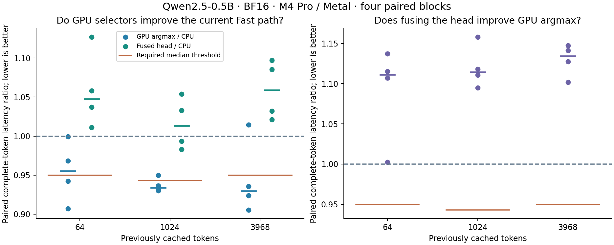

# GPU token selection

The fused vocabulary head is numerically correct but slower. Separate GPU
argmax is promising, with 4.47–7.03% median paired latency reductions and
93–95 tokens/s streaming medians, but it misses the frozen promotion gate at
two contexts. **Keep Fast on configuration 26 with CPU selection.** Both GPU
routes remain explicit experiments; no default policy changed.

The experiment compares two GPU selectors with the promoted configuration 26
(QKV and activation fusion) on Qwen2.5-0.5B-Instruct, batch one, Apple M4 Pro / Metal.
The [frozen plan](token-selection-plan.md) fixes both mappings, all comparisons,
and the rule for choosing between them before performance sampling.

## Complete-token result

The control is the already-promoted combined QKV and activation fusion. Values
below are medians of four block medians in milliseconds. Each comparison has
its own paired control; reductions are medians of the four paired ratios, so
they need not equal the ratio of the two displayed aggregate times.

| Cached tokens | CPU → GPU argmax (ms) | Paired reduction | CPU → fused head (ms) | Paired reduction |
| ---: | ---: | ---: | ---: | ---: |
| 64 | 10.871 → 10.531 | 4.47% | 10.913 → 11.562 | -4.77% |
| 1024 | 11.040 → 10.376 | 6.62% | 11.109 → 11.334 | -1.33% |
| 3968 | 11.019 → 10.375 | 7.03% | 10.995 → 11.548 | -5.89% |

GPU argmax was faster in 11 of 12 paired blocks. At history 64 its 4.47%
median reduction missed the 5% floor. At 1024 it passed: 6.62% improvement
exceeded the 5.69% self-comparison floor, with all four pairs faster. At 3968
its median improvement was 7.03%, but one pair was 1.43% slower. That prevents
promotion under the predeclared all-context rule.

Fusion was slower than separate GPU argmax in all 12 paired blocks, with
median penalties of 11.11%, 11.44% and 13.44%. Its median latency was also
worse than CPU selection at every context. This rejects the tested mapping;
it does not establish that every possible fused projection is slower.

## What the traces explain

Separate captures at history 1024, ten warmups and eight measured steps per
arm, retained every compute command and all four buffer blits per token.
The command counts were 314 (CPU), 316 (GPU argmax) and 315 (fused head).

| Active GPU stage time, median ms | CPU | GPU argmax | Fused head |
| --- | ---: | ---: | ---: |
| Vocabulary projection / fused local selection | 1.309875 | 1.310813 | 2.595104 |
| Argmax partials | — | 0.006917 | included above |
| Argmax finish | — | 0.003480 | 0.009229 |
| All compute commands per token | 7.629850 | 7.668624 | 8.816493 |

The separate reduction adds about 0.0104 ms of active GPU work. The fused
head roughly doubles projection time, adding about 1.28 ms before its final
reduction. That explains why removing the CPU scan did not rescue this mapping.
The likely cause is the changed work distribution: each SIMD group computes
16 scores serially instead of one. We did not measure occupancy or DRAM
counters, so those more specific hardware explanations remain hypotheses.
These are instrumented active intervals, not complete-token wall times; they
must not be substituted for the untraced paired measurements above.

## Streaming confirmation

Four blocks, three fixed prompts, three modes, 128-token replies. All 36
replies had identical emitted bytes, generated token IDs and histories.
Median output rates across the four blocks:

| Prompt tokens | CPU tok/s | GPU argmax tok/s | Fused head tok/s |
| ---: | ---: | ---: | ---: |
| 44 | 85.97 | 93.13 | 83.72 |
| 1027 | 88.56 | 94.87 | 83.93 |
| 3839 | 88.89 | 93.28 | 84.71 |

Streaming supports the standalone selector as the more promising direction,
but does not override the primary frozen acceptance rule. This experiment
stops at its declared budget; no samples were dropped or rerun to seek a pass.

## What changes

The control projects the normalized 896-element hidden vector against the tied
BF16 embedding matrix `[151936,896]`, writes 151936 BF16 logits, then maps and
scans them on the CPU. The matrix itself is 272,269,312 bytes. Both candidates
still compute every vocabulary score and read those same logical weights.

The separate GPU argmax keeps the projection and reduces 1024 logits per
128-thread group. Its 149 partial winners feed a second, single-group reduction.
The fused head computes 64 vocabulary scores per 128-thread group, retains one
local winner, and passes 2374 partials to that same final reduction. This changes
the head from 37,984 small groups to 2374 groups with more work per group.

Each partial record contains three UInt32 values: an ordered BF16 score, its
token ID, and a flag indicating whether any nonfinite value was seen. The CPU
maps only the 12-byte final record instead of 303,872 bytes of logits. On Apple
Silicon this is a unified-memory mapping/synchronization boundary; it is not a
claim about eliminating a discrete-GPU PCIe transfer.

The separate argmax still writes and reads the full logits. The fused head
avoids that materialization in its timed path. The two GPU stages run on the
existing stream without a host synchronization between them. A final readback
is still necessary before the host can use the next token.

## Correctness boundary

Fused dot products retain the original lane-strided FP32 accumulation, warp
sum, addition of zero and BF16 cast. Selection compares the rounded BF16 score,
including signed-zero equality and subnormals, and selects the smallest ID on
ties. NaN or infinity anywhere rejects the result. No global atomics are used.

Native tests cover finite BF16 encodings, subnormal and signed-zero ties,
nonfinite values in a nonwinning position, ragged groups, guard storage, a
crafted FP32 difference that becomes a BF16 tie, and every output of a full
vocabulary projection. The fused diagnostic specialization writes logits for
byte comparison; its actual nonmaterializing specialization must leave a
poisoned logits buffer untouched and return the same winner.

Full-model checks compare all logits and all 48 KV buffers at histories 64,
1024 and 3968 for both candidates. They separately verify the actual timed
path's caches, token and untouched-logit contract. Injecting a nonfinite result
flag must invalidate the model, matching the CPU greedy lifecycle.

## Measurement boundary

Four paired blocks per context; ten warmups and ten retained samples per arm.
All 960 samples are retained, including CPU self-pairs and a direct fused-head
versus GPU-argmax comparison. Complete-token timing includes upload, preflight,
24 layers, final normalization, vocabulary projection and winner readback.
Logical rewind and recording are outside timing. Traces are separate diagnostic
captures with ten warmups and eight measured steps, at history 1024.

A candidate must clear the same conservative gate at every context: all four
ratios below one and median reduction above max(5%, largest absolute self-pair
deviation). The simpler GPU argmax wins if both qualify unless fusion also
clears the gate in their direct comparison. These are bounded acceptance rules,
not confidence intervals or a guarantee for other machines and workloads.

## Provenance and replay

Measured source: `85973e59d33a27c27862a79820956bb3567ce057`, clean branch
`codex/qwen-qkv-fusion`. Apple M4 Pro / Metal (`metal:4-metal4`), Mac16,7,
24 GiB memory; macOS 26.6.2 (25G83), Darwin 25.6.0, Xcode 26.6 (17F113),
Mojo 1.0.0, MAX 26.5.0 and locked uv 0.12.5. AC power, normal power mode,
and no recorded thermal/performance warnings were checked around each block.
The archive retains individual binary hashes, model/tokenizer hashes, source
hashes, machine/software identity and mutable conditions.

The full `uv run --locked llm-mojo-validate` passed before the source commit:
168 Python tests, all native suites, all 19 MLP mappings, tokenizer parity,
and benchmark smoke checks. The compact [validation receipt](token-selection-validation.json)
records the command, exit status, source hashes, suite summaries and full-log
hash. All 169 Python tests passed after adding archive coverage. Those tests verify
that removing or changing timing,
cache, actual-path, nonfinite, trace, terminal or condition evidence is rejected.

The [archive](token-selection.json.gz) retains all 960 latency samples, six
full-model verification records, three complete command traces and all 36
streaming replies' event evidence. Its compressed size is 933,544 bytes;
[hashes](token-selection.json) cover compressed and uncompressed bytes.
[Replay output](token-selection-summary.json) reconstructs the acceptance
calculation; the [plan](token-selection-plan.md#reproduction) documents all
build, collection, capture, streaming and plotting commands. Expanded arrays,
model weights, binaries and full Instruments traces stay outside Git.
