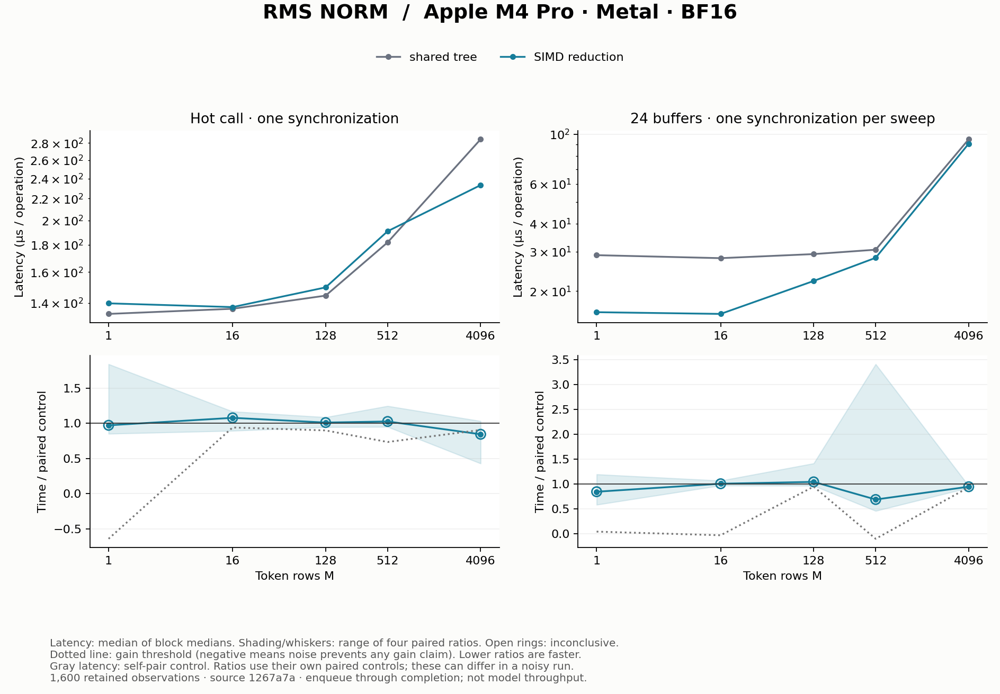

# RMSNorm: reduce a row

## Fresh result

The fresh run does **not establish a speed difference** under the frozen
noise/direction rule: all ten SIMD comparisons are inconclusive. Some medians
are lower, but short-workload self-pairs vary substantially and some larger
workloads disagree across blocks. This retains a useful implementation lesson
without presenting the existing SIMD default as newly reconfirmed by these
measurements. No dispatch change follows from this run.

Measured on Apple M4 Pro / Metal from clean source `1267a7a`,
with 1,600 retained timing observations, four blocks, ten samples per
arm and ten warmups. AC power, power mode 0 and no reported thermal/performance
warnings were recorded. Software and block conditions are in [run.json](run.json).
All observations, including calibration, are in [samples.csv.gz](samples.csv.gz);
[summary.csv](summary.csv) contains the derived decisions.

Gray absolute latency is the control's self-pair measurement; each colored
ratio uses its own paired control. In a noisy run these need not agree with a
ratio formed from the absolute curves. Shading/whiskers show the range of four
block ratios, not confidence intervals. See the [method](../../docs/experiments.md).

## Operation and ownership

For each token row of width 896, compute the FP32 mean square, its inverse
square root with epsilon, then normalize and multiply by learned BF16 weights.
The precise cast order is in the [model contract](../../docs/model.md);
[the implementation](../../src/llm_mojo/rms_norm.mojo) makes it explicit.

A row has 896 BF16 input values (1,792 bytes), the same amount of output,
and a 1,792-byte weight vector shared across rows. Arithmetic is modest; the
reduction and synchronization arrangement can matter as much as arithmetic.

| Mapping | Ownership | Combining partial sums |
| --- | --- | --- |
| Shared tree | 128 threads own strided elements of one row; seven values per thread | Publish 128 FP32 partial sums and reduce in shared memory with barriers |
| SIMD reduction | Same row and element ownership | Reduce within each 32-lane group, publish four group sums, then combine them |

Both paths compute the same contract. The proposed benefit is less shared
reduction traffic and fewer barriers. That mechanism alone does not establish
latency: a one-row workload also has very little parallel work and pays launch
and completion overhead. More rows provide more independent threadgroups.

The maintained comparison uses M=1,16,128,512,4096 with one input buffer and
with a 24-input-buffer sweep. A self-pair of the shared-tree control provides
the noise floor. Inputs are analytically checkable positive constants varying
by layer; independent oracle tests cover nonuniform values and weight scaling.
The SIMD path remains the existing public default.

The historical studies established the reduction comparison and explored
named Metal counters; see EXP-0001 through EXP-0003 at the
[historical revision](../README.md). New latency results belong to the fresh
run's explicit synchronization boundary. A speedup here does not establish
full decoder-block speedup.
