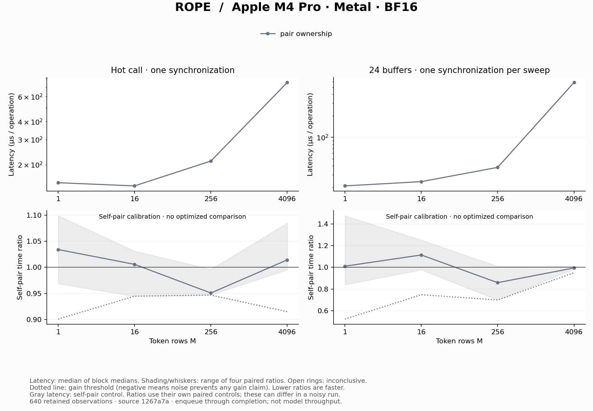

# RoPE: own a dimension pair

## Fresh result

This run characterizes one implementation; it makes **no optimization claim**.
At M=1, measured latency is 149.75 µs hot and 20.94 µs per operation in ring24.
At M=4096 it is 752.25 µs hot and 584.94 µs in ring24. The modes amortize host
launch/completion differently, so their gap is not a measurement of cache cost.
The self-pair ratios describe substantial variability at some sizes.

Measured on Apple M4 Pro / Metal from clean source `1267a7a`,
with 640 retained timing observations, four blocks, ten samples per
arm and ten warmups. AC power, power mode 0 and no reported thermal/performance
warnings were recorded. Software and block conditions are in [run.json](run.json).
All observations, including calibration, are in [samples.csv.gz](samples.csv.gz);
[summary.csv](summary.csv) contains the derived decisions.



Gray absolute latency is the control's self-pair measurement; each colored
ratio uses its own paired control. In a noisy run these need not agree with a
ratio formed from the absolute curves. Shading/whiskers show the range of four
block ratios, not confidence intervals. See the [method](../../docs/experiments.md).

## Operation and ownership

Rotary position embedding transforms paired dimensions inside each attention
head using the cosine and sine for an absolute token position. The Qwen
half-split convention pairs d with d+32 for head width 64:

```text
y[d]    = x[d] * cosine[d]    - x[d+32] * sine[d]
y[d+32] = x[d+32] * cosine[d+32] + x[d] * sine[d+32]
```

One GPU thread owns a pair: it reads both input values before writing either
output. Across heads and rows, pairs are independent. This makes ownership
simple and avoids a reduction or threadgroup barrier. The
[implementation](../../src/llm_mojo/rope.mojo) performs the contract's BF16 casts
explicitly; FP32 algebra without matching cast points is a different oracle.

For query heads, X and O each contain M×14×64 BF16 values, or 1,792 bytes per
row each. Cosine/sine tables each supply M×64 BF16 values, reused across heads.
These are unique footprints, not measured cache or DRAM traffic. The operation
has relatively little arithmetic; at small M, dispatch and completion overhead
can dominate the synchronized measurement.

This is baseline characterization. There is one implementation, measured at
M=1,16,256,4096 with hot and 24-input-buffer sweeps. The self-pair describes
noise, not a speedup. Timing inputs use constant cosine/sine for an exact
output gate; oracle tests cover actual pinned rotary tables, query decode,
incremental key positions and the half-split convention.

The caller owns position selection and table storage. A future decoder block
must prove the correct absolute cache positions and composition with Q/K
projection. A fast or correct isolated RoPE kernel cannot establish that.
