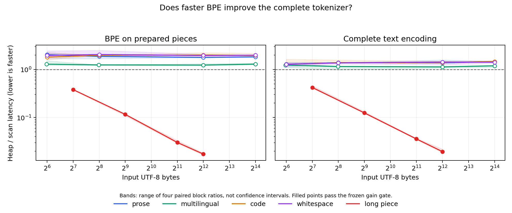

# CPU Qwen tokenizer: where does heap merging help?

The Mojo tokenizer matches the pinned Rust reference on all three acceptance
suites. Heap merging improves long single pieces, while the scan implementation
is faster for the short pieces in the ordinary text workloads measured here.
The complete encoding result follows the same pattern. The requested heap path
remains the default, and the scan path remains an explicit reference variant;
this study does not introduce a workload dispatcher.

The implementation and setup contract are in [docs/tokenizer.md](../../docs/tokenizer.md).
Only `tokenizer.json` is needed from the model. It supplies 151,643 base vocabulary
entries, 151,387 ranked merges, 22 added tokens, and the processing configuration.
All text computation runs in native Mojo on CPU. Python handles preparation and
the independent Rust oracle.

## Exact acceptance

| Suite | Text cases | Decode sequences | Result |
| --- | ---: | ---: | --- |
| Development | 3,361 | 151,923 | Exact Rust parity |
| Supplemental canonical decompositions | 2,061 | 258 | Exact Rust parity |
| Reserved holdout | 355 | 258 | Exact Rust parity |

The development decode corpus includes every vocabulary ID independently.
Each suite checks both scan and heap IDs, normalization, split boundaries,
whole-sequence decoding, special-token skipping, and streaming output. Every
streamed prefix is valid UTF-8, with at most three pending bytes. Invalid input,
out-of-range IDs, malformed tables, rank priority, and overlapping merge ties
have additional checks.

Preparation queries the pinned Rust backend for Unicode behavior. Its normalizer
differs from Python Unicode 15 for one decomposition and 108 combining classes;
the tables preserve the Rust behavior. Matching Python normalization alone would
have produced an incorrect tokenizer.

[acceptance.json](acceptance.json) identifies the executable actually launched,
its clean build source `06a962f`, the source/table/fixture hashes, and all three
successful suite outputs. The complete repository workflow also passed: 111
standard Mojo tests, the tokenizer development suite, existing oracle checks,
and all Metal benchmark smoke routes. That workflow ran 108 Python tests;
the final expanded tooling suite passed 112 separately. Supplemental Unicode
acceptance was also run separately after adding its validation invocation.
The held-out fixture hash is now frozen in tests for subsequent reproduction.

## Measured result



Measurements use the Apple M4 Pro CPU, macOS 26.6.2 arm64, Mojo 1.0.0
`ed45d567`, and clean source `ae5652e`. The native binary SHA-256 is
`a178f818e7bf6ec0ade37bb2a340e281ef4d1b91f17cc9c81ca873646deee475`.
The run retains **9,680 observations**: 3,200 each for BPE and encode,
1,600 each for decode and stream, and 80 for loading.

Each comparison uses four paired blocks, ten warmups and ten observations per
arm, reversed order in blocks 2/3, and a scan self-pair calibration. A gain must
exceed both 5% and the largest self-pair deviation, with every block agreeing on
direction. Bands show the range of paired block ratios, not confidence intervals.
All power/thermal checks passed; these checks cannot exclude background activity.

| Complete encoding workload | Input bytes | Longest piece | Scan µs | Heap µs | Decision |
| --- | ---: | ---: | ---: | ---: | --- |
| Prose | 16,384 | 10 | 709.2 | 1,040.1 | Heap slower |
| Multilingual | 16,383 | 11 | 575.6 | 669.7 | Heap slower |
| Code | 16,384 | 9 | 670.6 | 957.1 | Heap slower |
| Whitespace | 16,384 | 10 | 675.6 | 979.4 | Heap slower |
| Repeated `a`, one piece | 128 | 128 | 43.4 | 19.4 | Heap faster |
| Repeated `a`, one piece | 512 | 512 | 573.2 | 71.5 | Heap faster |
| Repeated `a`, one piece | 2,048 | 2,048 | 8,369.1 | 299.2 | Heap faster |
| Repeated `a`, one piece | 4,096 | 4,096 | 33,931.5 | 663.2 | Heap faster |

Latency columns are medians across block medians. Decisions and the plot use
paired block ratios, so their ratio need not equal the ratio of those columns.
Across the 16 ordinary workloads, heap BPE is slower in all 16 comparisons;
complete encoding is slower in 14 and inconclusive in two. Both modes improve
in all four long-piece cases. At 4,096 repeated bytes, the paired result is
about 58× faster BPE and 51× faster complete encoding.

The reason is piece size. Ordinary benchmark pieces contain at most 9–11 bytes,
even in the 16 KiB prompts. Scanning such a small array is cheap; building links
and ordering candidates adds work. In one long piece, repeated rescanning and
shifting dominate. The heap updates only neighboring eligible pairs, avoiding
the quadratic merge cost. These workloads demonstrate the mechanism, not a
universal crossover or typical production speedup. No performance comparison
against the Rust implementation was measured.

Whole-sequence decode for the 16 KiB prose case is about 76.2 µs; pushing its
2,947 IDs through the streaming API takes about 69.7 µs. These are separate
self-paired characterizations over the same byte decoder, not a promoted
comparison between decode APIs. Warm-filesystem table load, construction,
validation, and destruction take about 17.0 ms.

## Timing and memory boundaries

The harness calls Darwin `clock_gettime_nsec_np(CLOCK_UPTIME_RAW)` around one
complete CPU call. The initial `perf_counter_ns` attempt rounded short decode
calls to zero and was rejected before completing a block. After fixing the
timer, a new clean build produced the single complete retained run. No failed
sample was replaced, and no gate was widened.

Encoding includes input validation, added-token matching, NFC, splitting,
BPE, and result allocation. BPE-only receives precomputed pieces. Symbol,
neighbor, and heap buffers are reused; BPE and streaming output buffers are
also reused. Full output is consumed after timing. Setup, oracle work,
compilation, output consumption, and printing are outside the timed call.
CLI process startup and startup checksum verification are also excluded.

The original JSON is 7,031,645 bytes; prepared tables occupy 8,050,212 bytes.
These are serialized sizes, not resident memory. Tables include contiguous
token bytes, offsets, IDs, merge lookups, and Unicode data. Runtime IDs are
native 64-bit `Int` on this host, bytes are `UInt8`, merge keys/values are
`UInt64`, and serialized integer fields are little-endian `UInt32`.
Each run records reusable workspace capacities. Hash allocator overhead and
temporary Unicode/result allocations are outside that capacity accounting.

The heap bound is O(n log n) per piece under expected constant-time dictionary
lookup, with O(n) scratch. The separate canonical-ordering baseline can still
take quadratic time on pathological combining-mark runs. End-to-end model
generation, chat templates, GPU tokenization, batching, token offsets, and
incremental encoding are outside this milestone.

## Reproduce

Initialize and use the pipeline from the repository:

```sh
uv run --locked llm-mojo-tokenizer encode 'Hello world'
uv run --locked llm-mojo-tokenizer decode '9707,1879'
```

The first call downloads and verifies the pinned JSON, prepares tables, and
builds the executable. Everything generated lives under ignored `build/`.
Preparation diagnostics go to stderr, leaving stdout for the token result.
Use `setup` to prepare ahead of time, `--offline` to prohibit artifact downloads,
or `--asset-dir` to select another source cache directory.

Regenerate these summaries and the figure without tokenizer files or execution:

```sh
uv run --locked --with matplotlib==3.10.8 llm-mojo-bench report-tokenizer --build-dir /private/tmp/unused-tokenizer-report --output studies/tokenizer
```

The common CLI requires `--build-dir`; the report route does not read it.
It verifies retained sample hashes and the complete paired/calibration grid.
Fresh measurements require a clean build and an output directory outside the
repository; use the [benchmark commands](../../src/llm_mojo/benchmarks/README.md#cpu-tokenizer).
Later setup-output and report changes do not rewrite the measured source identity.
